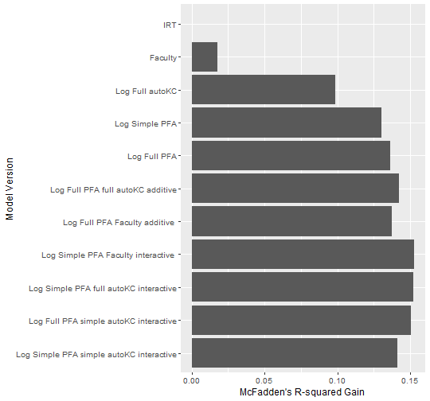
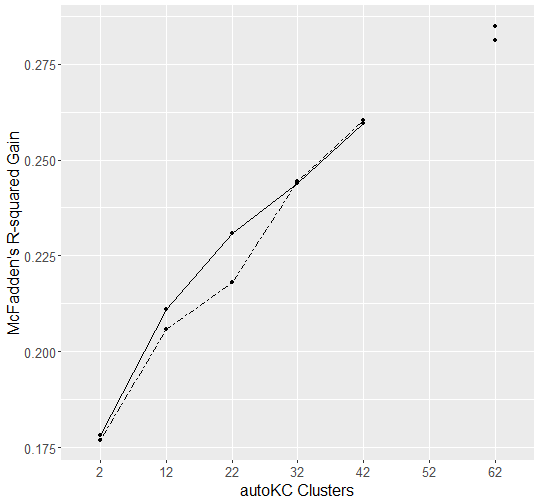
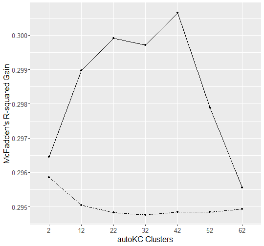

# Load data

Get the data free:

<a href="https://datashop.memphis.edu/DatasetInfo?datasetId=1465" class="uri">https://datashop.memphis.edu/DatasetInfo?datasetId=1465</a>


```r
    val<-largerawsample

    #clean it up
    val$KC..Default.<-val$Problem.Name
    # make it a datatable
    val= setDT(val)

    #make unstratified folds for crossvaldiations
    val$fold<-sample(1:5,length(val$Anon.Student.Id),replace=T)

    # get the times of each trial in seconds from 1970
    val$CF..Time.<-as.numeric(as.POSIXct(as.character(val$Time),format="%Y-%m-%d %H:%M:%S"))

    #make sure it is ordered in the way the code expects
    val<-val[order(val$Anon.Student.Id, val$CF..Time.),]

    #create a binary response column to predict and extract only data with a valid value
    val$CF..ansbin.<-ifelse(tolower(val$Outcome)=="correct",1,ifelse(tolower(val$Outcome)=="incorrect",0,-1))
    val<-val[val$CF..ansbin==0 | val$CF..ansbin.==1,]

    # create durations
    val$Duration..sec.<-(val$CF..End.Latency.+val$CF..Review.Latency.+500)/1000

    # this function needs times and durations but you don't need it if you don't want to model time effects
    val <- computeSpacingPredictors(val, "KC..Default.") #allows recency, spacing, forgetting features to run
```

# Additive Factors Model (AFM) fixed effect version


```r
    modelob <- LKT(
      data = val, interc=TRUE,
      components = c("Anon.Student.Id","KC..Default.","KC..Default."),
      features = c("intercept", "intercept", "lineafm$"))
#> intercept Anon.Student.Id      
#> intercept KC..Default.      
#> lineafm$ KC..Default.      
#> lineafmKC..Default.:e$data$KC..Default.+interceptKC..Default.+interceptAnon.Student.Id+1 
#> McFadden's R2 logistic: 0.289361 
#> LogLike logistic: -26992.53756813
```

# Performance Factors Analysis (PFA) fixed effect version


```r
    modelob <- LKT(
      data = val, interc=TRUE,
      components = c("Anon.Student.Id", "KC..Default.", "KC..Default.", "KC..Default."),
      features = c("intercept", "intercept", "linesuc$","linefail$"))
#> intercept Anon.Student.Id      
#> intercept KC..Default.      
#> linesuc$ KC..Default.      
#> linefail$ KC..Default.      
#> linefailKC..Default.:e$data$KC..Default.+linesucKC..Default.:e$data$KC..Default.+interceptKC..Default.+interceptAnon.Student.Id+1 
#> McFadden's R2 logistic: 0.295228 
#> LogLike logistic: -26769.69416527
    # have to have prior predictions in data to do the next model in and adaptive system
    #   this needs to be added to the data with a first model like this
    val$pred<-modelob$prediction
```

# PFA using difficulty sensitive predictors (composite model requiring pred from prior model)


```r
    modelob <- LKT(
      data = val, interc=TRUE,
      components = c("Anon.Student.Id", "KC..Default.", "KC..Default.", "KC..Default."),
      features = c("intercept", "intercept", "linesuc$","linefail$"))
#> intercept Anon.Student.Id      
#> intercept KC..Default.      
#> linesuc$ KC..Default.      
#> linefail$ KC..Default.      
#> linefailKC..Default.:e$data$KC..Default.+linesucKC..Default.:e$data$KC..Default.+interceptKC..Default.+interceptAnon.Student.Id+1 
#> McFadden's R2 logistic: 0.295228 
#> LogLike logistic: -26769.69416527
    # have to have prior predictions in data to do the next model in and adaptive system
    #   this needs to be added to the data wth a first moodel like this
    val$pred<-modelob$prediction

    modelob <- LKT(
      data = val, interc=TRUE,
      components = c("Anon.Student.Id", "KC..Default.", "KC..Default.", "KC..Default."),
      features = c("intercept", "intercept", "diffcorComp","linefail"))
#> intercept Anon.Student.Id      
#> intercept KC..Default.      
#> diffcorComp KC..Default.      
#> linefail KC..Default.      
#> linefailKC..Default.+diffcorCompKC..Default.+interceptKC..Default.+interceptAnon.Student.Id+1 
#> McFadden's R2 logistic: 0.283896 
#> LogLike logistic: -27200.1075776
```

# Recent Performance Factors Analysis (RPFA)


```r
    modelob <- LKT(
      data = val, interc=TRUE,
      components = c("Anon.Student.Id", "KC..Default.", "KC..Default.", "KC..Default."),
      features = c("intercept", "intercept", "propdec2","linefail"),
      fixedpars=c(.9))
#> intercept Anon.Student.Id      
#> intercept KC..Default.      
#> propdec2 KC..Default. 0.9     
#> linefail KC..Default.      
#> linefailKC..Default.+propdec2KC..Default.+interceptKC..Default.+interceptAnon.Student.Id+1 
#> McFadden's R2 logistic: 0.303338 
#> LogLike logistic: -26461.64298933
```

# Recency tracing with logitdec


```r
    modelob <- LKT(
      data = val, interc=TRUE,
      components = c("Anon.Student.Id", "KC..Default.", "KC..Default.", "KC..Default."),
      features = c("intercept", "intercept", "logitdec","recency"),
      fixedpars=c(.9,.5))
#> intercept Anon.Student.Id      
#> intercept KC..Default.      
#> logitdec KC..Default. 0.9     
#> recency KC..Default. 0.5     
#> recencyKC..Default.+logitdecKC..Default.+interceptKC..Default.+interceptAnon.Student.Id+1 
#> McFadden's R2 logistic: 0.329326 
#> LogLike logistic: -25474.531261
```

# Recency tracing with logitdec and transfer from cluster


```r

modelob <- LKT(
      data = val, interc=TRUE,
      components = c("Anon.Student.Id", "KC..Default.", "KC..Default.", "KC..Default.","KC..Cluster."),
      features = c("intercept", "intercept", "logitdec","recency","logitdec"),
      fixedpars=c(.9,.5,.5))
#> intercept Anon.Student.Id      
#> intercept KC..Default.      
#> logitdec KC..Default. 0.9     
#> recency KC..Default. 0.5     
#> logitdec KC..Cluster. 0.5     
#> logitdecKC..Cluster.+recencyKC..Default.+logitdecKC..Default.+interceptKC..Default.+interceptAnon.Student.Id+1 
#> McFadden's R2 logistic: 0.329987 
#> LogLike logistic: -25449.41954064
```

# Performance Prediction Equation (PPE)


```r
    modelob <- LKT(
      data = val, interc=TRUE,
      components = c("Anon.Student.Id", "KC..Default.", "KC..Default.", "KC..Default."),
      features = c("intercept", "intercept", "ppe","logitdec"),
      fixedpars=c(0.3491901,0.2045801,1e-05,0.9734477,0.4443027))
#> intercept Anon.Student.Id      
#> intercept KC..Default.      
#> ppe KC..Default. 0.3491901 0.2045801 1e-05 0.9734477  
#> logitdec KC..Default. 0.4443027     
#> logitdecKC..Default.+ppeKC..Default.+interceptKC..Default.+interceptAnon.Student.Id+1 
#> McFadden's R2 logistic: 0.349833 
#> LogLike logistic: -24695.58586047
```

# base4


```r
    modelob <- LKT(
      data = val, interc=TRUE,
      components = c("Anon.Student.Id", "KC..Default.", "KC..Default.", "KC..Default."),
      features = c("intercept", "intercept", "base4","logitdec"),
      fixedpars=c(0.1890747,0.6309054,0.05471752,.5,0.2160748))
#> intercept Anon.Student.Id      
#> intercept KC..Default.      
#> base4 KC..Default. 0.1890747 0.6309054 0.05471752 0.5  
#> logitdec KC..Default. 0.2160748     
#> logitdecKC..Default.+base4KC..Default.+interceptKC..Default.+interceptAnon.Student.Id+1 
#> McFadden's R2 logistic: 0.316408 
#> LogLike logistic: -25965.19745203
```

Using other features #See LKT paper #See computefeatures function in
the main R code for package
<a href="https://github.com/Optimal-Learning-Lab/LKT/blob/master/R/LKTfunctions.R" class="uri">https://github.com/Optimal-Learning-Lab/LKT/blob/master/R/LKTfunctions.R</a>


# Covariates


```r
    modelob <- LKT(
      data = val, interc=TRUE,
      components = c("Anon.Student.Id","KC..Default.","KC..Default."),
      features = c("logitdec", "logitdec", "lineafm"),fixedpars=c(.9,.8),
      covariates = c(NA,NA,"Level..Unitname."))
#> logitdec Anon.Student.Id 0.9     
#> logitdec KC..Default. 0.8     
#> lineafm KC..Default.      
#> lineafmKC..Default.:Level..Unitname.+logitdecKC..Default.+logitdecAnon.Student.Id+1 
#> McFadden's R2 logistic: 0.187931 
#> LogLike logistic: -30845.19646772
```

# Individualized Additive Factors Model (iAFM) fixed effect version


```r
    modelob <- LKT(
      data = val, interc=TRUE,
      components = c("Anon.Student.Id","KC..Default.","KC..Default.","KC..Default."),
      features = c("intercept", "intercept", "lineafm$","lineafm"),
      covariates = c(NA,NA,NA,"Anon.Student.Id"))
#> intercept Anon.Student.Id      
#> intercept KC..Default.      
#> lineafm$ KC..Default.      
#> lineafm KC..Default.      
#> lineafmKC..Default.:Anon.Student.Id+lineafmKC..Default.:e$data$KC..Default.+interceptKC..Default.+interceptAnon.Student.Id+1 
#> McFadden's R2 logistic: 0.309291 
#> LogLike logistic: -26235.52232195
```

# Crossvalidation


```r
# make student stratified folds (for crossvalidation for unseen population)
    # unq = sample(unique(val$Anon.Student.Id))
    # sfold = rep(1:5,length.out=length(unq))
    # val$fold = rep(0,length(val[,1]))
    # for(i in 1:5){val$fold[which(val$Anon.Student.Id %in% unq[which(sfold==i)])]=i}

    #simple AFM minus student intercept
    modelob <- LKT(
      data = val, interc=TRUE,
      components = c("KC..Default.","KC..Default."),
      features = c("intercept", "lineafm"),
      cv = TRUE)
#> intercept KC..Default.      
#> lineafm KC..Default.      
#> lineafmKC..Default.+interceptKC..Default.+1 
#> McFadden's R2 logistic: 0.18081 
#> LogLike logistic: -31115.68435931
    mean(modelob$cv_res$mcfad)
#> [1] 0.1787892

    #complex AFM minus student intercept
    modelob <- LKT(
      data = val, interc=TRUE,
      components = c("KC..Default.","KC..Default."),
      features = c("intercept$", "lineafm$"),
      cv = TRUE)
#> intercept$ KC..Default.      
#> lineafm$ KC..Default.      
#> lineafmKC..Default.:e$data$KC..Default.+interceptKC..Default.:e$data$KC..Default.+1 
#> McFadden's R2 logistic: 0.189298 
#> LogLike logistic: -30793.28958174
    mean(modelob$cv_res$mcfad)
#> [1] 0.1833772
```

# Connectors


```r
    modelob <- LKT(
      data = val, interc=TRUE,
      connectors = c("+","*"),
      components = c("Anon.Student.Id", "KC..Default.", "KC..Default."),
      features = c("logitdec", "logitdec$", "lineafm$"),
      fixedpars = c(.9, .85) )
#> logitdec Anon.Student.Id 0.9     
#> logitdec$ KC..Default. 0.85     
#> lineafm$ KC..Default.      
#> lineafmKC..Default.:e$data$KC..Default.*logitdecKC..Default.:e$data$KC..Default.+logitdecAnon.Student.Id+1 
#> McFadden's R2 logistic: 0.214132 
#> LogLike logistic: -29849.99089373
```

# AutoKC


```r

mnames<-c("IRT",
          "Faculty",
          "Log Full autoKC",
          "Log Simple PFA",
          "Log Full PFA",
          "Log Full PFA full autoKC additive",
          "Log Full PFA Faculty additive ",
          "Log Simple PFA Faculty interactive ",
          "Log Simple PFA full autoKC interactive",
          "Log Full PFA simple autoKC interactive",
          "Log Simple PFA simple autoKC interactive")
r2s<-data.frame(name=mnames,r2s=NA,cvr2s=NA)
compl<-list(c("Anon.Student.Id","KC..Default."),
            c("Anon.Student.Id","KC..Default.", "Anon.Student.Id", "Anon.Student.Id"),
            c("Anon.Student.Id","KC..Default.", "KC..Default.", "KC..Default."),
            c("Anon.Student.Id","KC..Default.", "KC..Default.", "KC..Default."),
            c("Anon.Student.Id","KC..Default.", "KC..Default.", "KC..Default."),
            c("Anon.Student.Id","KC..Default.", "KC..Default.", "KC..Default." ,"KC..Default." ,"KC..Default."),
            c("Anon.Student.Id","KC..Default.", "KC..Default.","Anon.Student.Id", "KC..Default."  ,"Anon.Student.Id"),
            c("Anon.Student.Id","KC..Default.", "KC..Default.","Anon.Student.Id", "KC..Default."  ,"Anon.Student.Id"),
            c("Anon.Student.Id","KC..Default.", "KC..Default.", "KC..Default." ,"KC..Default." ,"KC..Default."),
            c("Anon.Student.Id","KC..Default.", "KC..Default.", "KC..Default." ,"KC..Default." ,"KC..Default."),
            c("Anon.Student.Id","KC..Default.", "KC..Default.", "KC..Default." ,"KC..Default." ,"KC..Default."))
featl<-list(c("intercept","intercept"),
            c("intercept","intercept",  "logfail",  "logsuc"),
            c("intercept","intercept",  "logfail$",  "logsuc$"),
            c("intercept","intercept",  "logfail", "logsuc"),
            c("intercept","intercept",  "logfail$", "logsuc$"),
            c("intercept","intercept",  "logfail$", "logfail$", "logsuc$", "logsuc$"),
            c("intercept","intercept",  "logfail$", "logfail", "logsuc$", "logsuc"),
            c("intercept","intercept",  "logfail", "logfail", "logsuc", "logsuc"),
            c("intercept","intercept",  "logfail", "logfail$", "logsuc", "logsuc$"),
            c("intercept","intercept",  "logfail$", "logfail", "logsuc$", "logsuc"),
            c("intercept","intercept",  "logfail", "logfail", "logsuc", "logsuc"))
connl<-list(c("+"),
            c("+","+","+"),
            c("+","+","+"),
            c("+","+","+"),
            c("+","+","+"),
            c("+","+","+","+","+"),
            c("+","+","+","+","+"),
            c("+","+","*","+","*"),
            c("+","+","*","+","*"),
            c("+","+","*","+","*"),
            c("+","+","*","+","*"))
autol <- list(c(0,0),
              c(0,0,0,0),
              c(0,0,40,40),
              c(0,0,0,0),
              c(0,0,0,0),
              c(0,0,0,40,0,40),
              c(0,0,0,0,0,0),
              c(0,0,0,0,0,0),
              c(0,0,0,40,0,40),
              c(0,0,0,40,0,40),
              c(0,0,0,40,0,40))
for(i in 1:length(compl)){
  modelob <<- LKT(data = val,components = compl[[i]],features = featl[[i]],connectors = connl[[i]],autoKC = autol[[i]],
                  cv=TRUE,verbose = FALSE)
  cat(mnames[i]," R2cv =  ",mean(modelob$cv_res$mcfad))
  cat(" R2 =  ",modelob$r2,"\n")
  r2s$r2s[i]<-modelob$r2
  r2s$cvr2s[i]<-mean(modelob$cv_res$mcfad)
}
#> IRT  R2cv =   0.1584518 R2 =   0.17526 
#> Faculty  R2cv =   0.1762418 R2 =   0.193067 
#> Log Full autoKC  R2cv =   0.2571382 R2 =   0.276453 
#> Log Simple PFA  R2cv =   0.2887018 R2 =   0.305306 
#> Log Full PFA  R2cv =   0.2949036 R2 =   0.317028 
#> Log Full PFA full autoKC additive  R2cv =   0.3004352 R2 =   0.323463 
#> Log Full PFA Faculty additive   R2cv =   0.2958544 R2 =   0.318007 
#> Log Simple PFA Faculty interactive   R2cv =   0.3110772 R2 =   0.327941 
#> Log Simple PFA full autoKC interactive  R2cv =   0.3105464 R2 =   0.333046 
#> Log Full PFA simple autoKC interactive  R2cv =   0.308918 R2 =   0.336243 
#> Log Simple PFA simple autoKC interactive  R2cv =   0.2994428 R2 =   0.316213

r2s$cvr2s<-r2s$cvr2s-min(r2s$cvr2s)
r2s$name <- factor(r2s$name,levels = rev(mnames))
plot<-ggplot(r2s,
             aes(name,cvr2s)) +
  geom_bar(stat = "identity") +xlab("Model Version") + ylab("McFadden's R-squared Gain")+
  coord_flip()+ theme(text = element_text(size = 12))
plot
```



```r


mnames<-seq(2,71,10)
for (i in c(3,6)){
  r2s<-data.frame(name=mnames,r2s=NA,cvr2s=NA,r2sr=NA,cvr2sr=NA)
  j<-1
  for(k in mnames){
    j<-j+1
    modelob <- LKT(data = val,components = compl[[i]],features = featl[[i]],connectors = connl[[i]],autoKC = k*(autol[[i]]>0),
                   cv=TRUE,verbose = FALSE)
    cat(k," R2cv =  ",mean(modelob$cv_res$mcfad))
    cat(" R2 =  ",modelob$r2,"\n")

    r2s$r2s[j-1]<-modelob$r2
    r2s$cvr2s[j-1]<-mean(modelob$cv_res$mcfad)

        modelob <- LKT(data = val,components = compl[[i]],features = featl[[i]],connectors = connl[[i]],autoKC = k*(autol[[i]]>0),
                   cv=TRUE,verbose = FALSE, autoKCcont = rep("rand",length(featl[[i]])))
    cat(k," R2cv =  ",mean(modelob$cv_res$mcfad))
    cat(" R2 =  ",modelob$r2,"\n")

    r2s$r2sr[j-1]<-modelob$r2
    r2s$cvr2sr[j-1]<-mean(modelob$cv_res$mcfad)

  }

  r2s$name <- factor(r2s$name,levels = (mnames))
  plot<-ggplot(r2s, aes(name, group=1))+
    geom_line(aes(y = cvr2s)) +
  geom_line(aes(y = cvr2sr), linetype="twodash")+
    scale_x_discrete(breaks=seq(from = 2, to = 71, by = 5)) +xlab("autoKC Clusters") + ylab("McFadden's R-squared Gain")+ theme(text = element_text(size = 16)) +
      geom_point(aes(y = cvr2s))+
      geom_point(aes(y = cvr2sr))
  print(plot)
}
#> 2  R2cv =   0.1781364 R2 =   0.195026 
#> 2  R2cv =   0.1769188 R2 =   0.193761 
#> 12  R2cv =   0.2110764 R2 =   0.228315 
#> 12  R2cv =   0.2057826 R2 =   0.223173 
#> 22  R2cv =   0.2309332 R2 =   0.249023 
#> 22  R2cv =   0.2180044 R2 =   0.236092 
#> 32  R2cv =   0.2437538 R2 =   0.262488 
#> 32  R2cv =   0.2443614 R2 =   0.263191 
#> 42  R2cv =   0.2594538 R2 =   0.278989 
#> 42  R2cv =   0.2602742 R2 =   0.279923 
#> 52  R2cv =   NaN R2 =   0.287932 
#> 52  R2cv =   NaN R2 =   0.291984 
#> 62  R2cv =   0.2812584 R2 =   0.302358 
#> 62  R2cv =   0.2849158 R2 =   0.305875
#> Warning: Removed 1 rows containing missing values (geom_point).
#> Removed 1 rows containing missing values (geom_point).
```



```
#> 2  R2cv =   0.29646 R2 =   0.318756 
#> 2  R2cv =   0.2958614 R2 =   0.317968 
#> 12  R2cv =   0.2989662 R2 =   0.32162 
#> 12  R2cv =   0.2950472 R2 =   0.318053 
#> 22  R2cv =   0.2999096 R2 =   0.322841 
#> 22  R2cv =   0.2948372 R2 =   0.317942 
#> 32  R2cv =   0.2997084 R2 =   0.322601 
#> 32  R2cv =   0.2947672 R2 =   0.317882 
#> 42  R2cv =   0.3006552 R2 =   0.323598 
#> 42  R2cv =   0.2948436 R2 =   0.31799 
#> 52  R2cv =   0.297889 R2 =   0.320678 
#> 52  R2cv =   0.2948528 R2 =   0.317463 
#> 62  R2cv =   0.2955576 R2 =   0.318027 
#> 62  R2cv =   0.2949282 R2 =   0.317408
```



# Synthetic discrimination parameter testing


```r

mnames<-c("IRT",
          "IRT ad inter",
          "AFM",
          "IRT ad inter with AFM",
          "IRT ad")
r2s<-data.frame(name=mnames,r2s=NA,cvr2s=NA)
compl<-list(c("Anon.Student.Id","KC..Default."),
            c("Anon.Student.Id","KC..Default."),
            c("Anon.Student.Id","KC..Default.","KC..Default."),
            c("Anon.Student.Id","KC..Default.","KC..Default."),
            c("Anon.Student.Id","KC..Default."))
featl<-list(c("intercept","intercept"),
            c("logitdec","intercept"),
            c("logitdec","intercept","lineafm"),
            c("logitdec","intercept","lineafm$"),
            c("logitdec","intercept"))
connl<-list(c("+"),
            c("*"),
            c("+","+"),
            c("*","+"),
            c("+"))
for(i in 1:5){
  modelob <<- LKT(data = val,components = compl[[i]],features = featl[[i]],connectors = connl[[i]],fixedpars=c(.925),interc=TRUE,
                  cv=FALSE,verbose = FALSE)
  #cat(mnames[i]," R2cv =  ",mean(modelob$cv_res$mcfad))
  cat(" R2 =  ",modelob$r2,"\n")
  r2s$r2s[i]<-modelob$r2
  #r2s$cvr2s[i]<-mean(modelob$cv_res$mcfad)
}
#>  R2 =   0.17526 
#>  R2 =   0.170469 
#>  R2 =   0.247155 
#>  R2 =   0.257971 
#>  R2 =   0.168067
```


#Credibility intervals


```r

components = c("Anon.Student.Id", "KC..Default.", "KC..Default.", "KC..Default.")
features = c("intercept", "intercept", "linesuc$","linefail$")

# or

components = c("Anon.Student.Id", "KC..Default.", "KC..Default.", "KC..Default.")
features = c("logit", "logit", "linesuc","linefail")
fixedpars = c(.03,.03)

mod1 = LKT(setDT(val),inter=TRUE,
           components,
           features,
           fixedpars = fixedpars,
           seedpars = c(NA),cv = TRUE)
#> logit Anon.Student.Id 0.03     
#> logit KC..Default. 0.03     
#> linesuc KC..Default.      
#> linefail KC..Default.      
#> linefailKC..Default.+linesucKC..Default.+logitKC..Default.+logitAnon.Student.Id+1 
#> McFadden's R2 logistic: 0.165447 
#> LogLike logistic: -31699.23101113

n_students=400
n_boot = 100
system.time({
  boot_res = LKT_HDI(val,n_boot,n_students,components=components,features=features,fixedpars=fixedpars)
})
#> 0%...2%...3%...4%...5%...6%...7%...8%...9%...10%...11%...12%...13%...14%...15%...16%...17%...18%...19%...20%...21%...22%...23%...24%...25%...26%...27%...28%...29%...30%...31%...32%...33%...34%...35%...36%...37%...38%...39%...40%...41%...42%...43%...44%...45%...46%...47%...48%...49%...50%...51%...52%...53%...54%...55%...56%...57%...58%...59%...60%...61%...62%...63%...64%...65%...66%...67%...68%...69%...70%...71%...72%...73%...74%...75%...76%...77%...78%...79%...80%...81%...82%...83%...84%...85%...86%...87%...88%...89%...90%...91%...92%...93%...94%...95%...96%...97%...98%...99%...100%
#>    user  system elapsed 
#>   83.85    4.25   87.62


#Names of coefficients that are non-significant (interval includes zero)
zero_idx = which(boot_res$coef_hdi$includes_zero==TRUE)
boot_res$coef_hdi$coef_name[zero_idx]
#> character(0)

if(!is.na(unique(boot_res$par_reps[,zero_idx[1]]))){
  hist(boot_res$par_reps[,zero_idx[1]],breaks=50,main=boot_res$coef_hdi$coef_name[zero_idx][1])

abline(v=boot_res$coef_hdi$lower[zero_idx[1]],col="darkblue",lwd=3)
abline(v=boot_res$coef_hdi$upper[zero_idx[1]],col="darkblue",lwd=3)
abline(v=mean(boot_res$par_reps[,zero_idx[1]]),lty=2,col="darkblue",lwd=3)
#Estimate from full fit to data
  abline(v=boot_res$mod_full$coefs[which(rownames(boot_res$mod_full$coefs)==colnames(boot_res$par_reps)[zero_idx[1]])],col="firebrick3",lwd=3)} else {print(boot_res$coef_hdi)}
#>              coef_name      lower      upper includes_zero credMass
#> 1          (Intercept) -0.2691630 -0.2426612         FALSE     0.95
#> 2 linefailKC..Default.  0.1939725  0.2681673         FALSE     0.95
#> 3  linesucKC..Default.  0.5378042  0.6276235         FALSE     0.95
#> 4    logitKC..Default.  0.3688660  0.5196084         FALSE     0.95
#> 5 logitAnon.Student.Id  0.6153739  0.6518626         FALSE     0.95
```

# Recency tracing with RPFA propdec2 feature


```r
    modelob <- LKT(
      data = val, interc=TRUE,
      components = c("Anon.Student.Id", "KC..Default.", "KC..Default.", "KC..Default."),
      features = c("intercept", "intercept", "propdec2","recency"),
      fixedpars=c(NA,NA),maxitv=5)
#> intercept Anon.Student.Id      
#> intercept KC..Default.      
#> propdec2 KC..Default. 0.5     
#> recency KC..Default. 0.5     
#> recencyKC..Default.+propdec2KC..Default.+interceptKC..Default.+interceptAnon.Student.Id+1 
#> McFadden's R2 logistic: 0.348705 
#> LogLike logistic: -24738.45370723 
#> step par values =0.5,0.5
#> 
#> intercept Anon.Student.Id      
#> intercept KC..Default.      
#> propdec2 KC..Default. 0.501     
#> recency KC..Default. 0.5     
#> recencyKC..Default.+propdec2KC..Default.+interceptKC..Default.+interceptAnon.Student.Id+1 
#> McFadden's R2 logistic: 0.348706 
#> LogLike logistic: -24738.40208171 
#> step par values =0.501,0.5
#> 
#> intercept Anon.Student.Id      
#> intercept KC..Default.      
#> propdec2 KC..Default. 0.499     
#> recency KC..Default. 0.5     
#> recencyKC..Default.+propdec2KC..Default.+interceptKC..Default.+interceptAnon.Student.Id+1 
#> McFadden's R2 logistic: 0.348703 
#> LogLike logistic: -24738.5155014 
#> step par values =0.499,0.5
#> 
#> intercept Anon.Student.Id      
#> intercept KC..Default.      
#> propdec2 KC..Default. 0.5     
#> recency KC..Default. 0.501     
#> recencyKC..Default.+propdec2KC..Default.+interceptKC..Default.+interceptAnon.Student.Id+1 
#> McFadden's R2 logistic: 0.348676 
#> LogLike logistic: -24739.53714413 
#> step par values =0.5,0.501
#> 
#> intercept Anon.Student.Id      
#> intercept KC..Default.      
#> propdec2 KC..Default. 0.5     
#> recency KC..Default. 0.499     
#> recencyKC..Default.+propdec2KC..Default.+interceptKC..Default.+interceptAnon.Student.Id+1 
#> McFadden's R2 logistic: 0.348733 
#> LogLike logistic: -24737.3747709 
#> step par values =0.5,0.499
#> 
#> intercept Anon.Student.Id      
#> intercept KC..Default.      
#> propdec2 KC..Default. 0.99999     
#> recency KC..Default. 1e-05     
#> recencyKC..Default.+propdec2KC..Default.+interceptKC..Default.+interceptAnon.Student.Id+1 
#> McFadden's R2 logistic: 0.322684 
#> LogLike logistic: -25726.81724268 
#> step par values =0.99999,1e-05
#> 
#> intercept Anon.Student.Id      
#> intercept KC..Default.      
#> propdec2 KC..Default. 0.99999     
#> recency KC..Default. 1e-05     
#> recencyKC..Default.+propdec2KC..Default.+interceptKC..Default.+interceptAnon.Student.Id+1 
#> McFadden's R2 logistic: 0.322684 
#> LogLike logistic: -25726.81724268 
#> step par values =0.99999,1e-05
#> 
#> intercept Anon.Student.Id      
#> intercept KC..Default.      
#> propdec2 KC..Default. 0.99899     
#> recency KC..Default. 1e-05     
#> recencyKC..Default.+propdec2KC..Default.+interceptKC..Default.+interceptAnon.Student.Id+1 
#> McFadden's R2 logistic: 0.322692 
#> LogLike logistic: -25726.50509275 
#> step par values =0.99899,1e-05
#> 
#> intercept Anon.Student.Id      
#> intercept KC..Default.      
#> propdec2 KC..Default. 0.99999     
#> recency KC..Default. 0.00101     
#> recencyKC..Default.+propdec2KC..Default.+interceptKC..Default.+interceptAnon.Student.Id+1 
#> McFadden's R2 logistic: 0.322937 
#> LogLike logistic: -25717.20836167 
#> step par values =0.99999,0.00101
#> 
#> intercept Anon.Student.Id      
#> intercept KC..Default.      
#> propdec2 KC..Default. 0.99999     
#> recency KC..Default. 1e-05     
#> recencyKC..Default.+propdec2KC..Default.+interceptKC..Default.+interceptAnon.Student.Id+1 
#> McFadden's R2 logistic: 0.322684 
#> LogLike logistic: -25726.81724268 
#> step par values =0.99999,1e-05
#> 
#> intercept Anon.Student.Id      
#> intercept KC..Default.      
#> propdec2 KC..Default. 0.651308097725166     
#> recency KC..Default. 0.348691902274834     
#> recencyKC..Default.+propdec2KC..Default.+interceptKC..Default.+interceptAnon.Student.Id+1 
#> McFadden's R2 logistic: 0.351149 
#> LogLike logistic: -24645.61245544 
#> step par values =0.6513081,0.3486919
#> 
#> intercept Anon.Student.Id      
#> intercept KC..Default.      
#> propdec2 KC..Default. 0.652308097725166     
#> recency KC..Default. 0.348691902274834     
#> recencyKC..Default.+propdec2KC..Default.+interceptKC..Default.+interceptAnon.Student.Id+1 
#> McFadden's R2 logistic: 0.351145 
#> LogLike logistic: -24645.75801983 
#> step par values =0.6523081,0.3486919
#> 
#> intercept Anon.Student.Id      
#> intercept KC..Default.      
#> propdec2 KC..Default. 0.650308097725166     
#> recency KC..Default. 0.348691902274834     
#> recencyKC..Default.+propdec2KC..Default.+interceptKC..Default.+interceptAnon.Student.Id+1 
#> McFadden's R2 logistic: 0.351153 
#> LogLike logistic: -24645.46792712 
#> step par values =0.6503081,0.3486919
#> 
#> intercept Anon.Student.Id      
#> intercept KC..Default.      
#> propdec2 KC..Default. 0.651308097725166     
#> recency KC..Default. 0.349691902274834     
#> recencyKC..Default.+propdec2KC..Default.+interceptKC..Default.+interceptAnon.Student.Id+1 
#> McFadden's R2 logistic: 0.351144 
#> LogLike logistic: -24645.79597804 
#> step par values =0.6513081,0.3496919
#> 
#> intercept Anon.Student.Id      
#> intercept KC..Default.      
#> propdec2 KC..Default. 0.651308097725166     
#> recency KC..Default. 0.347691902274834     
#> recencyKC..Default.+propdec2KC..Default.+interceptKC..Default.+interceptAnon.Student.Id+1 
#> McFadden's R2 logistic: 0.351154 
#> LogLike logistic: -24645.43684743 
#> step par values =0.6513081,0.3476919
#> 
#> intercept Anon.Student.Id      
#> intercept KC..Default.      
#> propdec2 KC..Default. 0.607663004030062     
#> recency KC..Default. 0.333132526328625     
#> recencyKC..Default.+propdec2KC..Default.+interceptKC..Default.+interceptAnon.Student.Id+1 
#> McFadden's R2 logistic: 0.351337 
#> LogLike logistic: -24638.49342818 
#> step par values =0.607663,0.3331325
#> 
#> intercept Anon.Student.Id      
#> intercept KC..Default.      
#> propdec2 KC..Default. 0.608663004030062     
#> recency KC..Default. 0.333132526328625     
#> recencyKC..Default.+propdec2KC..Default.+interceptKC..Default.+interceptAnon.Student.Id+1 
#> McFadden's R2 logistic: 0.351334 
#> LogLike logistic: -24638.58973997 
#> step par values =0.608663,0.3331325
#> 
#> intercept Anon.Student.Id      
#> intercept KC..Default.      
#> propdec2 KC..Default. 0.606663004030062     
#> recency KC..Default. 0.333132526328625     
#> recencyKC..Default.+propdec2KC..Default.+interceptKC..Default.+interceptAnon.Student.Id+1 
#> McFadden's R2 logistic: 0.351339 
#> LogLike logistic: -24638.39830286 
#> step par values =0.606663,0.3331325
#> 
#> intercept Anon.Student.Id      
#> intercept KC..Default.      
#> propdec2 KC..Default. 0.607663004030062     
#> recency KC..Default. 0.334132526328625     
#> recencyKC..Default.+propdec2KC..Default.+interceptKC..Default.+interceptAnon.Student.Id+1 
#> McFadden's R2 logistic: 0.351335 
#> LogLike logistic: -24638.55382175 
#> step par values =0.607663,0.3341325
#> 
#> intercept Anon.Student.Id      
#> intercept KC..Default.      
#> propdec2 KC..Default. 0.607663004030062     
#> recency KC..Default. 0.332132526328625     
#> recencyKC..Default.+propdec2KC..Default.+interceptKC..Default.+interceptAnon.Student.Id+1 
#> McFadden's R2 logistic: 0.351335 
#> LogLike logistic: -24638.56033433 
#> step par values =0.607663,0.3321325
#> 
#> intercept Anon.Student.Id      
#> intercept KC..Default.      
#> propdec2 KC..Default. 0.508674761487539     
#> recency KC..Default. 0.337267116649495     
#> recencyKC..Default.+propdec2KC..Default.+interceptKC..Default.+interceptAnon.Student.Id+1 
#> McFadden's R2 logistic: 0.351415 
#> LogLike logistic: -24635.52052419 
#> step par values =0.5086748,0.3372671
#> 
#> intercept Anon.Student.Id      
#> intercept KC..Default.      
#> propdec2 KC..Default. 0.509674761487539     
#> recency KC..Default. 0.337267116649495     
#> recencyKC..Default.+propdec2KC..Default.+interceptKC..Default.+interceptAnon.Student.Id+1 
#> McFadden's R2 logistic: 0.351416 
#> LogLike logistic: -24635.48873845 
#> step par values =0.5096748,0.3372671
#> 
#> intercept Anon.Student.Id      
#> intercept KC..Default.      
#> propdec2 KC..Default. 0.507674761487539     
#> recency KC..Default. 0.337267116649495     
#> recencyKC..Default.+propdec2KC..Default.+interceptKC..Default.+interceptAnon.Student.Id+1 
#> McFadden's R2 logistic: 0.351414 
#> LogLike logistic: -24635.55366964 
#> step par values =0.5076748,0.3372671
#> 
#> intercept Anon.Student.Id      
#> intercept KC..Default.      
#> propdec2 KC..Default. 0.508674761487539     
#> recency KC..Default. 0.338267116649495     
#> recencyKC..Default.+propdec2KC..Default.+interceptKC..Default.+interceptAnon.Student.Id+1 
#> McFadden's R2 logistic: 0.351412 
#> LogLike logistic: -24635.61367904 
#> step par values =0.5086748,0.3382671
#> 
#> intercept Anon.Student.Id      
#> intercept KC..Default.      
#> propdec2 KC..Default. 0.508674761487539     
#> recency KC..Default. 0.336267116649495     
#> recencyKC..Default.+propdec2KC..Default.+interceptKC..Default.+interceptAnon.Student.Id+1 
#> McFadden's R2 logistic: 0.351417 
#> LogLike logistic: -24635.43523377 
#> step par values =0.5086748,0.3362671
#> 
#> intercept Anon.Student.Id      
#> intercept KC..Default.      
#> propdec2 KC..Default. 0.531531933387799     
#> recency KC..Default. 0.330209464641985     
#> recencyKC..Default.+propdec2KC..Default.+interceptKC..Default.+interceptAnon.Student.Id+1 
#> McFadden's R2 logistic: 0.351436 
#> LogLike logistic: -24634.70492064 
#> step par values =0.5315319,0.3302095
#> 
#> intercept Anon.Student.Id      
#> intercept KC..Default.      
#> propdec2 KC..Default. 0.532531933387799     
#> recency KC..Default. 0.330209464641985     
#> recencyKC..Default.+propdec2KC..Default.+interceptKC..Default.+interceptAnon.Student.Id+1 
#> McFadden's R2 logistic: 0.351436 
#> LogLike logistic: -24634.704131 
#> step par values =0.5325319,0.3302095
#> 
#> intercept Anon.Student.Id      
#> intercept KC..Default.      
#> propdec2 KC..Default. 0.530531933387799     
#> recency KC..Default. 0.330209464641985     
#> recencyKC..Default.+propdec2KC..Default.+interceptKC..Default.+interceptAnon.Student.Id+1 
#> McFadden's R2 logistic: 0.351433 
#> LogLike logistic: -24634.8271051 
#> step par values =0.5305319,0.3302095
#> 
#> intercept Anon.Student.Id      
#> intercept KC..Default.      
#> propdec2 KC..Default. 0.531531933387799     
#> recency KC..Default. 0.331209464641985     
#> recencyKC..Default.+propdec2KC..Default.+interceptKC..Default.+interceptAnon.Student.Id+1 
#> McFadden's R2 logistic: 0.351435 
#> LogLike logistic: -24634.74118605 
#> step par values =0.5315319,0.3312095
#> 
#> intercept Anon.Student.Id      
#> intercept KC..Default.      
#> propdec2 KC..Default. 0.531531933387799     
#> recency KC..Default. 0.329209464641985     
#> recencyKC..Default.+propdec2KC..Default.+interceptKC..Default.+interceptAnon.Student.Id+1 
#> McFadden's R2 logistic: 0.351437 
#> LogLike logistic: -24634.67678161 
#> step par values =0.5315319,0.3292095
#> 
#> intercept Anon.Student.Id      
#> intercept KC..Default.      
#> propdec2 KC..Default. 0.622960620988842     
#> recency KC..Default. 0.301978856611945     
#> recencyKC..Default.+propdec2KC..Default.+interceptKC..Default.+interceptAnon.Student.Id+1 
#> McFadden's R2 logistic: 0.351235 
#> LogLike logistic: -24642.36485179 
#> step par values =0.6229606,0.3019789
#> 
#> intercept Anon.Student.Id      
#> intercept KC..Default.      
#> propdec2 KC..Default. 0.623960620988842     
#> recency KC..Default. 0.301978856611945     
#> recencyKC..Default.+propdec2KC..Default.+interceptKC..Default.+interceptAnon.Student.Id+1 
#> McFadden's R2 logistic: 0.351232 
#> LogLike logistic: -24642.47789095 
#> step par values =0.6239606,0.3019789
#> 
#> intercept Anon.Student.Id      
#> intercept KC..Default.      
#> propdec2 KC..Default. 0.621960620988842     
#> recency KC..Default. 0.301978856611945     
#> recencyKC..Default.+propdec2KC..Default.+interceptKC..Default.+interceptAnon.Student.Id+1 
#> McFadden's R2 logistic: 0.351238 
#> LogLike logistic: -24642.25293231 
#> step par values =0.6219606,0.3019789
#> 
#> intercept Anon.Student.Id      
#> intercept KC..Default.      
#> propdec2 KC..Default. 0.622960620988842     
#> recency KC..Default. 0.302978856611945     
#> recencyKC..Default.+propdec2KC..Default.+interceptKC..Default.+interceptAnon.Student.Id+1 
#> McFadden's R2 logistic: 0.35124 
#> LogLike logistic: -24642.16060364 
#> step par values =0.6229606,0.3029789
#> 
#> intercept Anon.Student.Id      
#> intercept KC..Default.      
#> propdec2 KC..Default. 0.622960620988842     
#> recency KC..Default. 0.300978856611945     
#> recencyKC..Default.+propdec2KC..Default.+interceptKC..Default.+interceptAnon.Student.Id+1 
#> McFadden's R2 logistic: 0.351229 
#> LogLike logistic: -24642.57711289 
#> step par values =0.6229606,0.3009789
#> 
#> intercept Anon.Student.Id      
#> intercept KC..Default.      
#> propdec2 KC..Default. 0.547791858061456     
#> recency KC..Default. 0.325188857083196     
#> recencyKC..Default.+propdec2KC..Default.+interceptKC..Default.+interceptAnon.Student.Id+1 
#> McFadden's R2 logistic: 0.351431 
#> LogLike logistic: -24634.91793649 
#> step par values =0.5477919,0.3251889
#> 
#> intercept Anon.Student.Id      
#> intercept KC..Default.      
#> propdec2 KC..Default. 0.548791858061456     
#> recency KC..Default. 0.325188857083196     
#> recencyKC..Default.+propdec2KC..Default.+interceptKC..Default.+interceptAnon.Student.Id+1 
#> McFadden's R2 logistic: 0.35143 
#> LogLike logistic: -24634.93874791 
#> step par values =0.5487919,0.3251889
#> 
#> intercept Anon.Student.Id      
#> intercept KC..Default.      
#> propdec2 KC..Default. 0.546791858061456     
#> recency KC..Default. 0.325188857083196     
#> recencyKC..Default.+propdec2KC..Default.+interceptKC..Default.+interceptAnon.Student.Id+1 
#> McFadden's R2 logistic: 0.351434 
#> LogLike logistic: -24634.7796102 
#> step par values =0.5467919,0.3251889
#> 
#> intercept Anon.Student.Id      
#> intercept KC..Default.      
#> propdec2 KC..Default. 0.547791858061456     
#> recency KC..Default. 0.326188857083196     
#> recencyKC..Default.+propdec2KC..Default.+interceptKC..Default.+interceptAnon.Student.Id+1 
#> McFadden's R2 logistic: 0.351434 
#> LogLike logistic: -24634.79424485 
#> step par values =0.5477919,0.3261889
#> 
#> intercept Anon.Student.Id      
#> intercept KC..Default.      
#> propdec2 KC..Default. 0.547791858061456     
#> recency KC..Default. 0.324188857083196     
#> recencyKC..Default.+propdec2KC..Default.+interceptKC..Default.+interceptAnon.Student.Id+1 
#> McFadden's R2 logistic: 0.351433 
#> LogLike logistic: -24634.81224703 
#> step par values =0.5477919,0.3241889
#> 
#> intercept Anon.Student.Id      
#> intercept KC..Default.      
#> propdec2 KC..Default. 0.537927820148169     
#> recency KC..Default. 0.328234594643584     
#> recencyKC..Default.+propdec2KC..Default.+interceptKC..Default.+interceptAnon.Student.Id+1 
#> McFadden's R2 logistic: 0.351437 
#> LogLike logistic: -24634.67532541 
#> step par values =0.5379278,0.3282346
#> 
#> intercept Anon.Student.Id      
#> intercept KC..Default.      
#> propdec2 KC..Default. 0.538927820148169     
#> recency KC..Default. 0.328234594643584     
#> recencyKC..Default.+propdec2KC..Default.+interceptKC..Default.+interceptAnon.Student.Id+1 
#> McFadden's R2 logistic: 0.351437 
#> LogLike logistic: -24634.68308755 
#> step par values =0.5389278,0.3282346
#> 
#> intercept Anon.Student.Id      
#> intercept KC..Default.      
#> propdec2 KC..Default. 0.536927820148169     
#> recency KC..Default. 0.328234594643584     
#> recencyKC..Default.+propdec2KC..Default.+interceptKC..Default.+interceptAnon.Student.Id+1 
#> McFadden's R2 logistic: 0.351437 
#> LogLike logistic: -24634.66889198 
#> step par values =0.5369278,0.3282346
#> 
#> intercept Anon.Student.Id      
#> intercept KC..Default.      
#> propdec2 KC..Default. 0.537927820148169     
#> recency KC..Default. 0.329234594643584     
#> recencyKC..Default.+propdec2KC..Default.+interceptKC..Default.+interceptAnon.Student.Id+1 
#> McFadden's R2 logistic: 0.351437 
#> LogLike logistic: -24634.69546271 
#> step par values =0.5379278,0.3292346
#> 
#> intercept Anon.Student.Id      
#> intercept KC..Default.      
#> propdec2 KC..Default. 0.537927820148169     
#> recency KC..Default. 0.327234594643584     
#> recencyKC..Default.+propdec2KC..Default.+interceptKC..Default.+interceptAnon.Student.Id+1 
#> McFadden's R2 logistic: 0.351437 
#> LogLike logistic: -24634.66335272 
#> step par values =0.5379278,0.3272346
#> 
#> intercept Anon.Student.Id      
#> intercept KC..Default.      
#> propdec2 KC..Default. 0.532833388569912     
#> recency KC..Default. 0.326335693662059     
#> recencyKC..Default.+propdec2KC..Default.+interceptKC..Default.+interceptAnon.Student.Id+1 
#> McFadden's R2 logistic: 0.351438 
#> LogLike logistic: -24634.64061009 
#> step par values =0.5328334,0.3263357
#> 
#> intercept Anon.Student.Id      
#> intercept KC..Default.      
#> propdec2 KC..Default. 0.533833388569912     
#> recency KC..Default. 0.326335693662059     
#> recencyKC..Default.+propdec2KC..Default.+interceptKC..Default.+interceptAnon.Student.Id+1 
#> McFadden's R2 logistic: 0.351435 
#> LogLike logistic: -24634.76082399 
#> step par values =0.5338334,0.3263357
#> 
#> intercept Anon.Student.Id      
#> intercept KC..Default.      
#> propdec2 KC..Default. 0.531833388569912     
#> recency KC..Default. 0.326335693662059     
#> recencyKC..Default.+propdec2KC..Default.+interceptKC..Default.+interceptAnon.Student.Id+1 
#> McFadden's R2 logistic: 0.351435 
#> LogLike logistic: -24634.76019496 
#> step par values =0.5318334,0.3263357
#> 
#> intercept Anon.Student.Id      
#> intercept KC..Default.      
#> propdec2 KC..Default. 0.532833388569912     
#> recency KC..Default. 0.327335693662059     
#> recencyKC..Default.+propdec2KC..Default.+interceptKC..Default.+interceptAnon.Student.Id+1 
#> McFadden's R2 logistic: 0.351438 
#> LogLike logistic: -24634.64526976 
#> step par values =0.5328334,0.3273357
#> 
#> intercept Anon.Student.Id      
#> intercept KC..Default.      
#> propdec2 KC..Default. 0.532833388569912     
#> recency KC..Default. 0.325335693662059     
#> recencyKC..Default.+propdec2KC..Default.+interceptKC..Default.+interceptAnon.Student.Id+1 
#> McFadden's R2 logistic: 0.351438 
#> LogLike logistic: -24634.64416963 
#> step par values =0.5328334,0.3253357
#> 
#> intercept Anon.Student.Id      
#> intercept KC..Default.      
#> propdec2 KC..Default. 0.53259727926988     
#> recency KC..Default. 0.326268282080875     
#> recencyKC..Default.+propdec2KC..Default.+interceptKC..Default.+interceptAnon.Student.Id+1 
#> McFadden's R2 logistic: 0.351438 
#> LogLike logistic: -24634.64055043 
#> step par values =0.5325973,0.3262683
#> 
#> intercept Anon.Student.Id      
#> intercept KC..Default.      
#> propdec2 KC..Default. 0.53359727926988     
#> recency KC..Default. 0.326268282080875     
#> recencyKC..Default.+propdec2KC..Default.+interceptKC..Default.+interceptAnon.Student.Id+1 
#> McFadden's R2 logistic: 0.351438 
#> LogLike logistic: -24634.64123269 
#> step par values =0.5335973,0.3262683
#> 
#> intercept Anon.Student.Id      
#> intercept KC..Default.      
#> propdec2 KC..Default. 0.53159727926988     
#> recency KC..Default. 0.326268282080875     
#> recencyKC..Default.+propdec2KC..Default.+interceptKC..Default.+interceptAnon.Student.Id+1 
#> McFadden's R2 logistic: 0.351438 
#> LogLike logistic: -24634.64120347 
#> step par values =0.5315973,0.3262683
#> 
#> intercept Anon.Student.Id      
#> intercept KC..Default.      
#> propdec2 KC..Default. 0.53259727926988     
#> recency KC..Default. 0.327268282080875     
#> recencyKC..Default.+propdec2KC..Default.+interceptKC..Default.+interceptAnon.Student.Id+1 
#> McFadden's R2 logistic: 0.351438 
#> LogLike logistic: -24634.6446604 
#> step par values =0.5325973,0.3272683
#> 
#> intercept Anon.Student.Id      
#> intercept KC..Default.      
#> propdec2 KC..Default. 0.53259727926988     
#> recency KC..Default. 0.325268282080875     
#> recencyKC..Default.+propdec2KC..Default.+interceptKC..Default.+interceptAnon.Student.Id+1 
#> McFadden's R2 logistic: 0.351438 
#> LogLike logistic: -24634.64466451 
#> step par values =0.5325973,0.3252683
```
