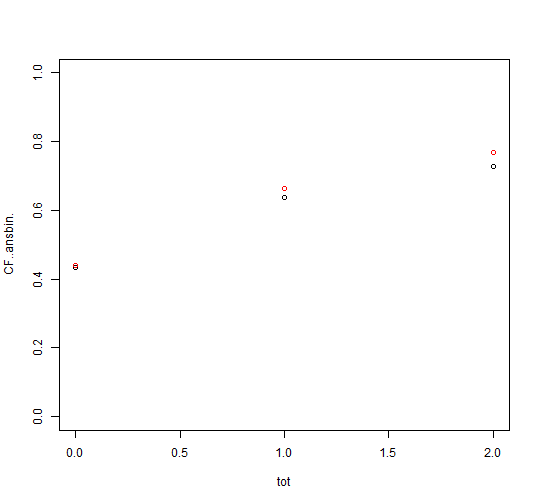
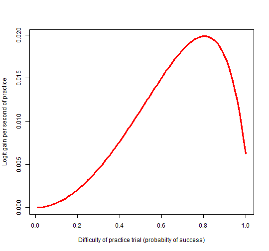

```r
knitr::opts_chunk$set(
  collapse = TRUE,
  comment = "#>",
  fig.width=7.5,
  fig.path = "vigfig-"
)
    library(LKT)
    library(data.table)
    library(ggplot2)
```


# Load data

Get the data free:

<a href="https://datashop.memphis.edu/DatasetInfo?datasetId=1465" class="uri">https://datashop.memphis.edu/DatasetInfo?datasetId=1465</a>


```r
    val<-largerawsample

    #clean it up
    val$KC..Default.<-val$Problem.Name
    # make it a datatable
    val= setDT(val)

    #make unstratified folds for crossvaldiations
    val$fold<-sample(1:5,length(val$Anon.Student.Id),replace=T)

    # get the times of each trial in seconds from 1970
    val$CF..Time.<-as.numeric(as.POSIXct(as.character(val$Time),format="%Y-%m-%d %H:%M:%S"))

    #make sure it is ordered in the way the code expects
    val<-val[order(val$Anon.Student.Id, val$CF..Time.),]

    #create a binary response column to predict and extract only data with a valid value
    val$CF..ansbin.<-ifelse(tolower(val$Outcome)=="correct",1,ifelse(tolower(val$Outcome)=="incorrect",0,-1))
    val<-val[val$CF..ansbin==0 | val$CF..ansbin.==1,]

    # create durations
    val$Duration..sec.<-(val$CF..End.Latency.+val$CF..Review.Latency.+500)/1000

    # this function needs times and durations but you don't need it if you don't want to model time effects
    val <- computeSpacingPredictors(val, "KC..Default.") #allows recency, spacing, forgetting features to run
```

# Additive Factors Model (AFM) fixed effect version


```r
    modelob <- LKT(
      data = val, interc=FALSE,
      components = c("Anon.Student.Id","KC..Default.","KC..Default."),
      features = c("intercept", "intercept", "lineafm"))
#> intercept Anon.Student.Id      
#> intercept KC..Default.      
#> lineafm KC..Default.      
#> lineafmKC..Default.+interceptKC..Default.+interceptAnon.Student.Id+0 
#> McFadden's R2 logistic: 0.280024 
#> LogLike logistic: -27347.20717315
```

# Performance Factors Analysis (PFA) fixed effect version


```r
    modelob <- LKT(
      data = val, interc=TRUE,
      components = c("Anon.Student.Id", "KC..Default.", "KC..Default.", "KC..Default."),
      features = c("intercept", "intercept", "linesuc$","linefail$"))
#> intercept Anon.Student.Id      
#> intercept KC..Default.      
#> linesuc$ KC..Default.      
#> linefail$ KC..Default.      
#> linefailKC..Default.:e$data$KC..Default.+linesucKC..Default.:e$data$KC..Default.+interceptKC..Default.+interceptAnon.Student.Id+1 
#> McFadden's R2 logistic: 0.295228 
#> LogLike logistic: -26769.69416527
    # have to have prior predictions in data to do the next model in and adaptive system
    #   this needs to be added to the data with a first model like this
    val$pred<-modelob$prediction
```

# PFA using difficulty sensitive predictors (composite model requiring pred from prior model)


```r
    modelob <- LKT(
      data = val, interc=TRUE,
      components = c("Anon.Student.Id", "KC..Default.", "KC..Default.", "KC..Default."),
      features = c("intercept", "intercept", "linesuc$","linefail$"))
#> intercept Anon.Student.Id      
#> intercept KC..Default.      
#> linesuc$ KC..Default.      
#> linefail$ KC..Default.      
#> linefailKC..Default.:e$data$KC..Default.+linesucKC..Default.:e$data$KC..Default.+interceptKC..Default.+interceptAnon.Student.Id+1 
#> McFadden's R2 logistic: 0.295228 
#> LogLike logistic: -26769.69416527
    # have to have prior predictions in data to do the next model in and adaptive system
    #   this needs to be added to the data wth a first moodel like this
    val$pred<-modelob$prediction

    modelob <- LKT(
      data = val, interc=TRUE,
      components = c("Anon.Student.Id", "KC..Default.", "KC..Default.", "KC..Default."),
      features = c("intercept", "intercept", "diffcorComp","linefail"))
#> intercept Anon.Student.Id      
#> intercept KC..Default.      
#> diffcorComp KC..Default.      
#> linefail KC..Default.      
#> linefailKC..Default.+diffcorCompKC..Default.+interceptKC..Default.+interceptAnon.Student.Id+1 
#> McFadden's R2 logistic: 0.283896 
#> LogLike logistic: -27200.1075776
```

# Recent Performance Factors Analysis (RPFA)


```r
    modelob <- LKT(
      data = val, interc=TRUE,
      components = c("Anon.Student.Id", "KC..Default.", "KC..Default.", "KC..Default."),
      features = c("intercept", "intercept", "propdec2","linefail"),
      fixedpars=c(.9))
#> intercept Anon.Student.Id      
#> intercept KC..Default.      
#> propdec2 KC..Default. 0.9     
#> linefail KC..Default.      
#> linefailKC..Default.+propdec2KC..Default.+interceptKC..Default.+interceptAnon.Student.Id+1 
#> McFadden's R2 logistic: 0.303338 
#> LogLike logistic: -26461.64298933
```

# Recency tracing with logitdec


```r
    modelob <- LKT(
      data = val, interc=TRUE,
      components = c("Anon.Student.Id", "KC..Default.", "KC..Default.", "KC..Default."),
      features = c("intercept", "intercept", "logitdec","recency"),
      fixedpars=c(.9,.5))
#> intercept Anon.Student.Id      
#> intercept KC..Default.      
#> logitdec KC..Default. 0.9     
#> recency KC..Default. 0.5     
#> recencyKC..Default.+logitdecKC..Default.+interceptKC..Default.+interceptAnon.Student.Id+1 
#> McFadden's R2 logistic: 0.329326 
#> LogLike logistic: -25474.531261
```

# Recency tracing with logitdec and transfer from cluster


```r

modelob <- LKT(
      data = val, interc=TRUE,
      components = c("Anon.Student.Id", "KC..Default.", "KC..Default.", "KC..Default.","KC..Cluster."),
      features = c("intercept", "intercept", "logitdec","recency","logitdec"),
      fixedpars=c(.9,.5,.5))
#> intercept Anon.Student.Id      
#> intercept KC..Default.      
#> logitdec KC..Default. 0.9     
#> recency KC..Default. 0.5     
#> logitdec KC..Cluster. 0.5     
#> logitdecKC..Cluster.+recencyKC..Default.+logitdecKC..Default.+interceptKC..Default.+interceptAnon.Student.Id+1 
#> McFadden's R2 logistic: 0.329987 
#> LogLike logistic: -25449.41954064
```

# Performance Prediction Equation (PPE)


```r
    modelob <- LKT(
      data = val, interc=TRUE,
      components = c("Anon.Student.Id", "KC..Default.", "KC..Default.", "KC..Default."),
      features = c("intercept", "intercept", "ppe","logitdec"),
      fixedpars=c(0.3491901,0.2045801,1e-05,0.9734477,0.4443027))
#> intercept Anon.Student.Id      
#> intercept KC..Default.      
#> ppe KC..Default. 0.3491901 0.2045801 1e-05 0.9734477  
#> logitdec KC..Default. 0.4443027     
#> logitdecKC..Default.+ppeKC..Default.+interceptKC..Default.+interceptAnon.Student.Id+1 
#> McFadden's R2 logistic: 0.349833 
#> LogLike logistic: -24695.58586047
```

# base4


```r
    modelob <- LKT(
      data = val, interc=TRUE,
      components = c("Anon.Student.Id", "KC..Default.", "KC..Default.", "KC..Default."),
      features = c("intercept", "intercept", "base4","logitdec"),
      fixedpars=c(0.1890747,0.6309054,0.05471752,.5,0.2160748))
#> intercept Anon.Student.Id      
#> intercept KC..Default.      
#> base4 KC..Default. 0.1890747 0.6309054 0.05471752 0.5  
#> logitdec KC..Default. 0.2160748     
#> logitdecKC..Default.+base4KC..Default.+interceptKC..Default.+interceptAnon.Student.Id+1 
#> McFadden's R2 logistic: 0.316408 
#> LogLike logistic: -25965.19745203
```

Using other features #See LKT paper #See computefeatures function in
the main R code for package
<a href="https://github.com/Optimal-Learning-Lab/LKT/blob/master/R/LKTfunctions.R" class="uri">https://github.com/Optimal-Learning-Lab/LKT/blob/master/R/LKTfunctions.R</a>


# Covariates


```r
    modelob <- LKT(
      data = val, interc=TRUE,
      components = c("Anon.Student.Id","KC..Default.","KC..Default."),
      features = c("logitdec", "logitdec", "lineafm"),fixedpars=c(.9,.8),
      covariates = c(NA,NA,"Level..Unitname."))
#> logitdec Anon.Student.Id 0.9     
#> logitdec KC..Default. 0.8     
#> lineafm KC..Default.      
#> lineafmKC..Default.:Level..Unitname.+logitdecKC..Default.+logitdecAnon.Student.Id+1 
#> McFadden's R2 logistic: 0.187931 
#> LogLike logistic: -30845.19646772
```

# Individualized Additive Factors Model (iAFM) fixed effect version


```r
    modelob <- LKT(
      data = val, interc=TRUE,
      components = c("Anon.Student.Id","KC..Default.","KC..Default.","KC..Default."),
      features = c("intercept", "intercept", "lineafm$","lineafm"),
      covariates = c(NA,NA,NA,"Anon.Student.Id"))
#> intercept Anon.Student.Id      
#> intercept KC..Default.      
#> lineafm$ KC..Default.      
#> lineafm KC..Default.      
#> lineafmKC..Default.:Anon.Student.Id+lineafmKC..Default.:e$data$KC..Default.+interceptKC..Default.+interceptAnon.Student.Id+1 
#> McFadden's R2 logistic: 0.309291 
#> LogLike logistic: -26235.52232195
```

# Crossvalidation


```r
# make student stratified folds (for crossvalidation for unseen population)
    # unq = sample(unique(val$Anon.Student.Id))
    # sfold = rep(1:5,length.out=length(unq))
    # val$fold = rep(0,length(val[,1]))
    # for(i in 1:5){val$fold[which(val$Anon.Student.Id %in% unq[which(sfold==i)])]=i}

    #simple AFM minus student intercept
    modelob <- LKT(
      data = val, interc=TRUE,
      components = c("KC..Default.","KC..Default."),
      features = c("intercept", "lineafm"),
      cv = TRUE)
#> intercept KC..Default.      
#> lineafm KC..Default.      
#> lineafmKC..Default.+interceptKC..Default.+1 
#> McFadden's R2 logistic: 0.18081 
#> LogLike logistic: -31115.68435931
    mean(modelob$cv_res$mcfad)
#> [1] 0.1785784

    #complex AFM minus student intercept
    modelob <- LKT(
      data = val, interc=TRUE,
      components = c("KC..Default.","KC..Default."),
      features = c("intercept$", "lineafm$"),
      cv = TRUE)
#> intercept$ KC..Default.      
#> lineafm$ KC..Default.      
#> lineafmKC..Default.:e$data$KC..Default.+interceptKC..Default.:e$data$KC..Default.+1 
#> McFadden's R2 logistic: 0.189298 
#> LogLike logistic: -30793.28958174
    mean(modelob$cv_res$mcfad)
#> [1] 0.1829722
```

# Connectors


```r
    modelob <- LKT(
      data = val, interc=TRUE,
      connectors = c("+","*"),
      components = c("Anon.Student.Id", "KC..Default.", "KC..Default."),
      features = c("logitdec", "logitdec$", "lineafm$"),
      fixedpars = c(.9, .85) )
#> logitdec Anon.Student.Id 0.9     
#> logitdec$ KC..Default. 0.85     
#> lineafm$ KC..Default.      
#> lineafmKC..Default.:e$data$KC..Default.*logitdecKC..Default.:e$data$KC..Default.+logitdecAnon.Student.Id+1 
#> McFadden's R2 logistic: 0.214132 
#> LogLike logistic: -29849.99089373
```

# AutoKC


```r

mnames<-c("IRT",
          "Faculty",
          "Log Full autoKC",
          "Log Simple PFA",
          "Log Full PFA",
          "Log Full PFA full autoKC additive",
          "Log Full PFA Faculty additive ",
          "Log Simple PFA Faculty interactive ",
          "Log Simple PFA full autoKC interactive",
          "Log Full PFA simple autoKC interactive",
          "Log Simple PFA simple autoKC interactive")
r2s<-data.frame(name=mnames,r2s=NA,cvr2s=NA)
compl<-list(c("Anon.Student.Id","KC..Default."),
            c("Anon.Student.Id","KC..Default.", "Anon.Student.Id", "Anon.Student.Id"),
            c("Anon.Student.Id","KC..Default.", "KC..Default.", "KC..Default."),
            c("Anon.Student.Id","KC..Default.", "KC..Default.", "KC..Default."),
            c("Anon.Student.Id","KC..Default.", "KC..Default.", "KC..Default."),
            c("Anon.Student.Id","KC..Default.", "KC..Default.", "KC..Default." ,"KC..Default." ,"KC..Default."),
            c("Anon.Student.Id","KC..Default.", "KC..Default.","Anon.Student.Id", "KC..Default."  ,"Anon.Student.Id"),
            c("Anon.Student.Id","KC..Default.", "KC..Default.","Anon.Student.Id", "KC..Default."  ,"Anon.Student.Id"),
            c("Anon.Student.Id","KC..Default.", "KC..Default.", "KC..Default." ,"KC..Default." ,"KC..Default."),
            c("Anon.Student.Id","KC..Default.", "KC..Default.", "KC..Default." ,"KC..Default." ,"KC..Default."),
            c("Anon.Student.Id","KC..Default.", "KC..Default.", "KC..Default." ,"KC..Default." ,"KC..Default."))
featl<-list(c("intercept","intercept"),
            c("intercept","intercept",  "logfail",  "logsuc"),
            c("intercept","intercept",  "logfail$",  "logsuc$"),
            c("intercept","intercept",  "logfail", "logsuc"),
            c("intercept","intercept",  "logfail$", "logsuc$"),
            c("intercept","intercept",  "logfail$", "logfail$", "logsuc$", "logsuc$"),
            c("intercept","intercept",  "logfail$", "logfail", "logsuc$", "logsuc"),
            c("intercept","intercept",  "logfail", "logfail", "logsuc", "logsuc"),
            c("intercept","intercept",  "logfail", "logfail$", "logsuc", "logsuc$"),
            c("intercept","intercept",  "logfail$", "logfail", "logsuc$", "logsuc"),
            c("intercept","intercept",  "logfail", "logfail", "logsuc", "logsuc"))
connl<-list(c("+"),
            c("+","+","+"),
            c("+","+","+"),
            c("+","+","+"),
            c("+","+","+"),
            c("+","+","+","+","+"),
            c("+","+","+","+","+"),
            c("+","+","*","+","*"),
            c("+","+","*","+","*"),
            c("+","+","*","+","*"),
            c("+","+","*","+","*"))
autol <- list(c(0,0),
              c(0,0,0,0),
              c(0,0,40,40),
              c(0,0,0,0),
              c(0,0,0,0),
              c(0,0,0,40,0,40),
              c(0,0,0,0,0,0),
              c(0,0,0,0,0,0),
              c(0,0,0,40,0,40),
              c(0,0,0,40,0,40),
              c(0,0,0,40,0,40))
for(i in 1:length(compl)){
  modelob <<- LKT(data = val,components = compl[[i]],features = featl[[i]],connectors = connl[[i]],autoKC = autol[[i]],
                  cv=TRUE,verbose = FALSE)
  cat(mnames[i]," R2cv =  ",mean(modelob$cv_res$mcfad))
  cat(" R2 =  ",modelob$r2,"\n")
  r2s$r2s[i]<-modelob$r2
  r2s$cvr2s[i]<-mean(modelob$cv_res$mcfad)
}
#> IRT  R2cv =   0.1581324 R2 =   0.17526 
#> Faculty  R2cv =   0.1756938 R2 =   0.193067 
#> Log Full autoKC  R2cv =   0.256073 R2 =   0.276453 
#> Log Simple PFA  R2cv =   0.2877074 R2 =   0.305306 
#> Log Full PFA  R2cv =   0.29417 R2 =   0.317028 
#> Log Full PFA full autoKC additive  R2cv =   0.2996732 R2 =   0.323463 
#> Log Full PFA Faculty additive   R2cv =   0.2950352 R2 =   0.318007 
#> Log Simple PFA Faculty interactive   R2cv =   0.310028 R2 =   0.327941 
#> Log Simple PFA full autoKC interactive  R2cv =   0.3096118 R2 =   0.333046 
#> Log Full PFA simple autoKC interactive  R2cv =   0.3083744 R2 =   0.336243 
#> Log Simple PFA simple autoKC interactive  R2cv =   0.2984356 R2 =   0.316213

r2s$cvr2s<-r2s$cvr2s-min(r2s$cvr2s)
r2s$name <- factor(r2s$name,levels = rev(mnames))
plot<-ggplot(r2s,
             aes(name,cvr2s)) +
  geom_bar(stat = "identity") +xlab("Model Version") + ylab("McFadden's R-squared Gain")+
  coord_flip()+ theme(text = element_text(size = 12))
plot
```


```r


mnames<-seq(2,71,10)
for (i in c(3,6)){
  r2s<-data.frame(name=mnames,r2s=NA,cvr2s=NA,r2sr=NA,cvr2sr=NA)
  j<-1
  for(k in mnames){
    j<-j+1
    modelob <- LKT(data = val,components = compl[[i]],features = featl[[i]],connectors = connl[[i]],autoKC = k*(autol[[i]]>0),
                   cv=TRUE,verbose = FALSE)
    cat(k," R2cv =  ",mean(modelob$cv_res$mcfad))
    cat(" R2 =  ",modelob$r2,"\n")

    r2s$r2s[j-1]<-modelob$r2
    r2s$cvr2s[j-1]<-mean(modelob$cv_res$mcfad)

        modelob <- LKT(data = val,components = compl[[i]],features = featl[[i]],connectors = connl[[i]],autoKC = k*(autol[[i]]>0),
                   cv=TRUE,verbose = FALSE, autoKCcont = rep("rand",length(featl[[i]])))
    cat(k," R2cv =  ",mean(modelob$cv_res$mcfad))
    cat(" R2 =  ",modelob$r2,"\n")

    r2s$r2sr[j-1]<-modelob$r2
    r2s$cvr2sr[j-1]<-mean(modelob$cv_res$mcfad)

  }

  r2s$name <- factor(r2s$name,levels = (mnames))
  plot<-ggplot(r2s, aes(name, group=1))+
    geom_line(aes(y = cvr2s)) +
  geom_line(aes(y = cvr2sr), linetype="twodash")+
    scale_x_discrete(breaks=seq(from = 2, to = 71, by = 5)) +xlab("autoKC Clusters") + ylab("McFadden's R-squared Gain")+ theme(text = element_text(size = 16)) +
      geom_point(aes(y = cvr2s))+
      geom_point(aes(y = cvr2sr))
  print(plot)
}
#> 2  R2cv =   0.177626 R2 =   0.195026 
#> 2  R2cv =   0.1780618 R2 =   0.195465 
#> 12  R2cv =   0.210428 R2 =   0.228315 
#> 12  R2cv =   0.205864 R2 =   0.224006 
#> 22  R2cv =   0.2300158 R2 =   0.249023 
#> 22  R2cv =   0.2239358 R2 =   0.24288 
#> 32  R2cv =   0.2425356 R2 =   0.262488 
#> 32  R2cv =   0.2407036 R2 =   0.260329 
#> 42  R2cv =   0.2586404 R2 =   0.278989 
#> 42  R2cv =   0.2554192 R2 =   0.276056 
#> 52  R2cv =   0.2666092 R2 =   0.287932 
#> 52  R2cv =   0.2682124 R2 =   0.289844 
#> 62  R2cv =   0.2801672 R2 =   0.302358 
#> 62  R2cv =   0.2821584 R2 =   0.304393
```


```
#> 2  R2cv =   0.2957658 R2 =   0.318756 
#> 2  R2cv =   0.2948162 R2 =   0.317857 
#> 12  R2cv =   0.298092 R2 =   0.32162 
#> 12  R2cv =   0.2944148 R2 =   0.317954 
#> 22  R2cv =   0.2988592 R2 =   0.322841 
#> 22  R2cv =   0.2940454 R2 =   0.317838 
#> 32  R2cv =   0.2988464 R2 =   0.322601 
#> 32  R2cv =   0.2943444 R2 =   0.317944 
#> 42  R2cv =   0.2998582 R2 =   0.323598 
#> 42  R2cv =   0.2935954 R2 =   0.317646 
#> 52  R2cv =   0.2971276 R2 =   0.320678 
#> 52  R2cv =   0.293915 R2 =   0.317542 
#> 62  R2cv =   0.2947732 R2 =   0.318027 
#> 62  R2cv =   0.2943274 R2 =   0.317509
```


# Synthetic discrimination parameter testing


```r

mnames<-c("IRT",
          "IRT ad inter",
          "AFM",
          "IRT ad inter with AFM",
          "IRT ad")
r2s<-data.frame(name=mnames,r2s=NA,cvr2s=NA)
compl<-list(c("Anon.Student.Id","KC..Default."),
            c("Anon.Student.Id","KC..Default."),
            c("Anon.Student.Id","KC..Default.","KC..Default."),
            c("Anon.Student.Id","KC..Default.","KC..Default."),
            c("Anon.Student.Id","KC..Default."))
featl<-list(c("intercept","intercept"),
            c("logitdec","intercept"),
            c("logitdec","intercept","lineafm"),
            c("logitdec","intercept","lineafm$"),
            c("logitdec","intercept"))
connl<-list(c("+"),
            c("*"),
            c("+","+"),
            c("*","+"),
            c("+"))
for(i in 1:5){
  modelob <<- LKT(data = val,components = compl[[i]],features = featl[[i]],connectors = connl[[i]],fixedpars=c(.925),interc=TRUE,
                  cv=FALSE,verbose = FALSE)
  #cat(mnames[i]," R2cv =  ",mean(modelob$cv_res$mcfad))
  cat(" R2 =  ",modelob$r2,"\n")
  r2s$r2s[i]<-modelob$r2
  #r2s$cvr2s[i]<-mean(modelob$cv_res$mcfad)
}
#>  R2 =   0.17526 
#>  R2 =   0.170469 
#>  R2 =   0.247155 
#>  R2 =   0.257971 
#>  R2 =   0.168067
```


#Credibility intervals


```r

components = c("Anon.Student.Id", "KC..Default.", "KC..Default.", "KC..Default.")
features = c("intercept", "intercept", "linesuc$","linefail$")

# or

components = c("Anon.Student.Id", "KC..Default.", "KC..Default.", "KC..Default.")
features = c("logit", "logit", "linesuc","linefail")
fixedpars = c(.03,.03)

mod1 = LKT(setDT(val),inter=TRUE,
           components,
           features,
           fixedpars = fixedpars,
           seedpars = c(NA),cv = TRUE)
#> logit Anon.Student.Id 0.03     
#> logit KC..Default. 0.03     
#> linesuc KC..Default.      
#> linefail KC..Default.      
#> linefailKC..Default.+linesucKC..Default.+logitKC..Default.+logitAnon.Student.Id+1 
#> McFadden's R2 logistic: 0.165447 
#> LogLike logistic: -31699.23101113

n_students=400
n_boot = 100
system.time({
  boot_res = LKT_HDI(val,n_boot,n_students,components=components,features=features,fixedpars=fixedpars)
})
#> 0%...2%...3%...4%...5%...6%...7%...8%...9%...10%...11%...12%...13%...14%...15%...16%...17%...18%...19%...20%...21%...22%...23%...24%...25%...26%...27%...28%...29%...30%...31%...32%...33%...34%...35%...36%...37%...38%...39%...40%...41%...42%...43%...44%...45%...46%...47%...48%...49%...50%...51%...52%...53%...54%...55%...56%...57%...58%...59%...60%...61%...62%...63%...64%...65%...66%...67%...68%...69%...70%...71%...72%...73%...74%...75%...76%...77%...78%...79%...80%...81%...82%...83%...84%...85%...86%...87%...88%...89%...90%...91%...92%...93%...94%...95%...96%...97%...98%...99%...100%
#>    user  system elapsed 
#>   70.95    6.09   76.14


#Names of coefficients that are non-significant (interval includes zero)
zero_idx = which(boot_res$coef_hdi$includes_zero==TRUE)
boot_res$coef_hdi$coef_name[zero_idx]
#> character(0)

if(!is.na(unique(boot_res$par_reps[,zero_idx[1]]))){
  hist(boot_res$par_reps[,zero_idx[1]],breaks=50,main=boot_res$coef_hdi$coef_name[zero_idx][1])

abline(v=boot_res$coef_hdi$lower[zero_idx[1]],col="darkblue",lwd=3)
abline(v=boot_res$coef_hdi$upper[zero_idx[1]],col="darkblue",lwd=3)
abline(v=mean(boot_res$par_reps[,zero_idx[1]]),lty=2,col="darkblue",lwd=3)
#Estimate from full fit to data
  abline(v=boot_res$mod_full$coefs[which(rownames(boot_res$mod_full$coefs)==colnames(boot_res$par_reps)[zero_idx[1]])],col="firebrick3",lwd=3)} else {print(boot_res$coef_hdi)}
#>              coef_name      lower      upper includes_zero credMass
#> 1          (Intercept) -0.2720574 -0.2447541         FALSE     0.95
#> 2 linefailKC..Default.  0.1827318  0.2771515         FALSE     0.95
#> 3  linesucKC..Default.  0.5283119  0.6382512         FALSE     0.95
#> 4    logitKC..Default.  0.3541120  0.5423954         FALSE     0.95
#> 5 logitAnon.Student.Id  0.6204564  0.6508642         FALSE     0.95
```

# Recency tracing with RPFA propdec2 feature


```r
    modelob <- LKT(
      data = val, interc=TRUE,
      components = c("Anon.Student.Id", "KC..Default.", "KC..Default.", "KC..Default."),
      features = c("intercept", "intercept", "propdec2","recency"),
      fixedpars=c(NA,NA),maxitv=5)
#> intercept Anon.Student.Id      
#> intercept KC..Default.      
#> propdec2 KC..Default. 0.5     
#> recency KC..Default. 0.5     
#> recencyKC..Default.+propdec2KC..Default.+interceptKC..Default.+interceptAnon.Student.Id+1 
#> McFadden's R2 logistic: 0.348705 
#> LogLike logistic: -24738.45370723 
#> step par values =0.5,0.5
#> 
#> intercept Anon.Student.Id      
#> intercept KC..Default.      
#> propdec2 KC..Default. 0.501     
#> recency KC..Default. 0.5     
#> recencyKC..Default.+propdec2KC..Default.+interceptKC..Default.+interceptAnon.Student.Id+1 
#> McFadden's R2 logistic: 0.348706 
#> LogLike logistic: -24738.40208171 
#> step par values =0.501,0.5
#> 
#> intercept Anon.Student.Id      
#> intercept KC..Default.      
#> propdec2 KC..Default. 0.499     
#> recency KC..Default. 0.5     
#> recencyKC..Default.+propdec2KC..Default.+interceptKC..Default.+interceptAnon.Student.Id+1 
#> McFadden's R2 logistic: 0.348703 
#> LogLike logistic: -24738.5155014 
#> step par values =0.499,0.5
#> 
#> intercept Anon.Student.Id      
#> intercept KC..Default.      
#> propdec2 KC..Default. 0.5     
#> recency KC..Default. 0.501     
#> recencyKC..Default.+propdec2KC..Default.+interceptKC..Default.+interceptAnon.Student.Id+1 
#> McFadden's R2 logistic: 0.348676 
#> LogLike logistic: -24739.53714413 
#> step par values =0.5,0.501
#> 
#> intercept Anon.Student.Id      
#> intercept KC..Default.      
#> propdec2 KC..Default. 0.5     
#> recency KC..Default. 0.499     
#> recencyKC..Default.+propdec2KC..Default.+interceptKC..Default.+interceptAnon.Student.Id+1 
#> McFadden's R2 logistic: 0.348733 
#> LogLike logistic: -24737.3747709 
#> step par values =0.5,0.499
#> 
#> intercept Anon.Student.Id      
#> intercept KC..Default.      
#> propdec2 KC..Default. 0.99999     
#> recency KC..Default. 1e-05     
#> recencyKC..Default.+propdec2KC..Default.+interceptKC..Default.+interceptAnon.Student.Id+1 
#> McFadden's R2 logistic: 0.322684 
#> LogLike logistic: -25726.81724268 
#> step par values =0.99999,1e-05
#> 
#> intercept Anon.Student.Id      
#> intercept KC..Default.      
#> propdec2 KC..Default. 0.99999     
#> recency KC..Default. 1e-05     
#> recencyKC..Default.+propdec2KC..Default.+interceptKC..Default.+interceptAnon.Student.Id+1 
#> McFadden's R2 logistic: 0.322684 
#> LogLike logistic: -25726.81724268 
#> step par values =0.99999,1e-05
#> 
#> intercept Anon.Student.Id      
#> intercept KC..Default.      
#> propdec2 KC..Default. 0.99899     
#> recency KC..Default. 1e-05     
#> recencyKC..Default.+propdec2KC..Default.+interceptKC..Default.+interceptAnon.Student.Id+1 
#> McFadden's R2 logistic: 0.322692 
#> LogLike logistic: -25726.50509275 
#> step par values =0.99899,1e-05
#> 
#> intercept Anon.Student.Id      
#> intercept KC..Default.      
#> propdec2 KC..Default. 0.99999     
#> recency KC..Default. 0.00101     
#> recencyKC..Default.+propdec2KC..Default.+interceptKC..Default.+interceptAnon.Student.Id+1 
#> McFadden's R2 logistic: 0.322937 
#> LogLike logistic: -25717.20836167 
#> step par values =0.99999,0.00101
#> 
#> intercept Anon.Student.Id      
#> intercept KC..Default.      
#> propdec2 KC..Default. 0.99999     
#> recency KC..Default. 1e-05     
#> recencyKC..Default.+propdec2KC..Default.+interceptKC..Default.+interceptAnon.Student.Id+1 
#> McFadden's R2 logistic: 0.322684 
#> LogLike logistic: -25726.81724268 
#> step par values =0.99999,1e-05
#> 
#> intercept Anon.Student.Id      
#> intercept KC..Default.      
#> propdec2 KC..Default. 0.651308097725166     
#> recency KC..Default. 0.348691902274834     
#> recencyKC..Default.+propdec2KC..Default.+interceptKC..Default.+interceptAnon.Student.Id+1 
#> McFadden's R2 logistic: 0.351149 
#> LogLike logistic: -24645.61245544 
#> step par values =0.6513081,0.3486919
#> 
#> intercept Anon.Student.Id      
#> intercept KC..Default.      
#> propdec2 KC..Default. 0.652308097725166     
#> recency KC..Default. 0.348691902274834     
#> recencyKC..Default.+propdec2KC..Default.+interceptKC..Default.+interceptAnon.Student.Id+1 
#> McFadden's R2 logistic: 0.351145 
#> LogLike logistic: -24645.75801983 
#> step par values =0.6523081,0.3486919
#> 
#> intercept Anon.Student.Id      
#> intercept KC..Default.      
#> propdec2 KC..Default. 0.650308097725166     
#> recency KC..Default. 0.348691902274834     
#> recencyKC..Default.+propdec2KC..Default.+interceptKC..Default.+interceptAnon.Student.Id+1 
#> McFadden's R2 logistic: 0.351153 
#> LogLike logistic: -24645.46792712 
#> step par values =0.6503081,0.3486919
#> 
#> intercept Anon.Student.Id      
#> intercept KC..Default.      
#> propdec2 KC..Default. 0.651308097725166     
#> recency KC..Default. 0.349691902274834     
#> recencyKC..Default.+propdec2KC..Default.+interceptKC..Default.+interceptAnon.Student.Id+1 
#> McFadden's R2 logistic: 0.351144 
#> LogLike logistic: -24645.79597804 
#> step par values =0.6513081,0.3496919
#> 
#> intercept Anon.Student.Id      
#> intercept KC..Default.      
#> propdec2 KC..Default. 0.651308097725166     
#> recency KC..Default. 0.347691902274834     
#> recencyKC..Default.+propdec2KC..Default.+interceptKC..Default.+interceptAnon.Student.Id+1 
#> McFadden's R2 logistic: 0.351154 
#> LogLike logistic: -24645.43684743 
#> step par values =0.6513081,0.3476919
#> 
#> intercept Anon.Student.Id      
#> intercept KC..Default.      
#> propdec2 KC..Default. 0.607663004030062     
#> recency KC..Default. 0.333132526328625     
#> recencyKC..Default.+propdec2KC..Default.+interceptKC..Default.+interceptAnon.Student.Id+1 
#> McFadden's R2 logistic: 0.351337 
#> LogLike logistic: -24638.49342818 
#> step par values =0.607663,0.3331325
#> 
#> intercept Anon.Student.Id      
#> intercept KC..Default.      
#> propdec2 KC..Default. 0.608663004030062     
#> recency KC..Default. 0.333132526328625     
#> recencyKC..Default.+propdec2KC..Default.+interceptKC..Default.+interceptAnon.Student.Id+1 
#> McFadden's R2 logistic: 0.351334 
#> LogLike logistic: -24638.58973997 
#> step par values =0.608663,0.3331325
#> 
#> intercept Anon.Student.Id      
#> intercept KC..Default.      
#> propdec2 KC..Default. 0.606663004030062     
#> recency KC..Default. 0.333132526328625     
#> recencyKC..Default.+propdec2KC..Default.+interceptKC..Default.+interceptAnon.Student.Id+1 
#> McFadden's R2 logistic: 0.351339 
#> LogLike logistic: -24638.39830286 
#> step par values =0.606663,0.3331325
#> 
#> intercept Anon.Student.Id      
#> intercept KC..Default.      
#> propdec2 KC..Default. 0.607663004030062     
#> recency KC..Default. 0.334132526328625     
#> recencyKC..Default.+propdec2KC..Default.+interceptKC..Default.+interceptAnon.Student.Id+1 
#> McFadden's R2 logistic: 0.351335 
#> LogLike logistic: -24638.55382175 
#> step par values =0.607663,0.3341325
#> 
#> intercept Anon.Student.Id      
#> intercept KC..Default.      
#> propdec2 KC..Default. 0.607663004030062     
#> recency KC..Default. 0.332132526328625     
#> recencyKC..Default.+propdec2KC..Default.+interceptKC..Default.+interceptAnon.Student.Id+1 
#> McFadden's R2 logistic: 0.351335 
#> LogLike logistic: -24638.56033433 
#> step par values =0.607663,0.3321325
#> 
#> intercept Anon.Student.Id      
#> intercept KC..Default.      
#> propdec2 KC..Default. 0.508674761487539     
#> recency KC..Default. 0.337267116649495     
#> recencyKC..Default.+propdec2KC..Default.+interceptKC..Default.+interceptAnon.Student.Id+1 
#> McFadden's R2 logistic: 0.351415 
#> LogLike logistic: -24635.52052419 
#> step par values =0.5086748,0.3372671
#> 
#> intercept Anon.Student.Id      
#> intercept KC..Default.      
#> propdec2 KC..Default. 0.509674761487539     
#> recency KC..Default. 0.337267116649495     
#> recencyKC..Default.+propdec2KC..Default.+interceptKC..Default.+interceptAnon.Student.Id+1 
#> McFadden's R2 logistic: 0.351416 
#> LogLike logistic: -24635.48873845 
#> step par values =0.5096748,0.3372671
#> 
#> intercept Anon.Student.Id      
#> intercept KC..Default.      
#> propdec2 KC..Default. 0.507674761487539     
#> recency KC..Default. 0.337267116649495     
#> recencyKC..Default.+propdec2KC..Default.+interceptKC..Default.+interceptAnon.Student.Id+1 
#> McFadden's R2 logistic: 0.351414 
#> LogLike logistic: -24635.55366964 
#> step par values =0.5076748,0.3372671
#> 
#> intercept Anon.Student.Id      
#> intercept KC..Default.      
#> propdec2 KC..Default. 0.508674761487539     
#> recency KC..Default. 0.338267116649495     
#> recencyKC..Default.+propdec2KC..Default.+interceptKC..Default.+interceptAnon.Student.Id+1 
#> McFadden's R2 logistic: 0.351412 
#> LogLike logistic: -24635.61367904 
#> step par values =0.5086748,0.3382671
#> 
#> intercept Anon.Student.Id      
#> intercept KC..Default.      
#> propdec2 KC..Default. 0.508674761487539     
#> recency KC..Default. 0.336267116649495     
#> recencyKC..Default.+propdec2KC..Default.+interceptKC..Default.+interceptAnon.Student.Id+1 
#> McFadden's R2 logistic: 0.351417 
#> LogLike logistic: -24635.43523377 
#> step par values =0.5086748,0.3362671
#> 
#> intercept Anon.Student.Id      
#> intercept KC..Default.      
#> propdec2 KC..Default. 0.531531933387799     
#> recency KC..Default. 0.330209464641985     
#> recencyKC..Default.+propdec2KC..Default.+interceptKC..Default.+interceptAnon.Student.Id+1 
#> McFadden's R2 logistic: 0.351436 
#> LogLike logistic: -24634.70492064 
#> step par values =0.5315319,0.3302095
#> 
#> intercept Anon.Student.Id      
#> intercept KC..Default.      
#> propdec2 KC..Default. 0.532531933387799     
#> recency KC..Default. 0.330209464641985     
#> recencyKC..Default.+propdec2KC..Default.+interceptKC..Default.+interceptAnon.Student.Id+1 
#> McFadden's R2 logistic: 0.351436 
#> LogLike logistic: -24634.704131 
#> step par values =0.5325319,0.3302095
#> 
#> intercept Anon.Student.Id      
#> intercept KC..Default.      
#> propdec2 KC..Default. 0.530531933387799     
#> recency KC..Default. 0.330209464641985     
#> recencyKC..Default.+propdec2KC..Default.+interceptKC..Default.+interceptAnon.Student.Id+1 
#> McFadden's R2 logistic: 0.351433 
#> LogLike logistic: -24634.8271051 
#> step par values =0.5305319,0.3302095
#> 
#> intercept Anon.Student.Id      
#> intercept KC..Default.      
#> propdec2 KC..Default. 0.531531933387799     
#> recency KC..Default. 0.331209464641985     
#> recencyKC..Default.+propdec2KC..Default.+interceptKC..Default.+interceptAnon.Student.Id+1 
#> McFadden's R2 logistic: 0.351435 
#> LogLike logistic: -24634.74118605 
#> step par values =0.5315319,0.3312095
#> 
#> intercept Anon.Student.Id      
#> intercept KC..Default.      
#> propdec2 KC..Default. 0.531531933387799     
#> recency KC..Default. 0.329209464641985     
#> recencyKC..Default.+propdec2KC..Default.+interceptKC..Default.+interceptAnon.Student.Id+1 
#> McFadden's R2 logistic: 0.351437 
#> LogLike logistic: -24634.67678161 
#> step par values =0.5315319,0.3292095
#> 
#> intercept Anon.Student.Id      
#> intercept KC..Default.      
#> propdec2 KC..Default. 0.622960620988842     
#> recency KC..Default. 0.301978856611945     
#> recencyKC..Default.+propdec2KC..Default.+interceptKC..Default.+interceptAnon.Student.Id+1 
#> McFadden's R2 logistic: 0.351235 
#> LogLike logistic: -24642.36485179 
#> step par values =0.6229606,0.3019789
#> 
#> intercept Anon.Student.Id      
#> intercept KC..Default.      
#> propdec2 KC..Default. 0.623960620988842     
#> recency KC..Default. 0.301978856611945     
#> recencyKC..Default.+propdec2KC..Default.+interceptKC..Default.+interceptAnon.Student.Id+1 
#> McFadden's R2 logistic: 0.351232 
#> LogLike logistic: -24642.47789095 
#> step par values =0.6239606,0.3019789
#> 
#> intercept Anon.Student.Id      
#> intercept KC..Default.      
#> propdec2 KC..Default. 0.621960620988842     
#> recency KC..Default. 0.301978856611945     
#> recencyKC..Default.+propdec2KC..Default.+interceptKC..Default.+interceptAnon.Student.Id+1 
#> McFadden's R2 logistic: 0.351238 
#> LogLike logistic: -24642.25293231 
#> step par values =0.6219606,0.3019789
#> 
#> intercept Anon.Student.Id      
#> intercept KC..Default.      
#> propdec2 KC..Default. 0.622960620988842     
#> recency KC..Default. 0.302978856611945     
#> recencyKC..Default.+propdec2KC..Default.+interceptKC..Default.+interceptAnon.Student.Id+1 
#> McFadden's R2 logistic: 0.35124 
#> LogLike logistic: -24642.16060364 
#> step par values =0.6229606,0.3029789
#> 
#> intercept Anon.Student.Id      
#> intercept KC..Default.      
#> propdec2 KC..Default. 0.622960620988842     
#> recency KC..Default. 0.300978856611945     
#> recencyKC..Default.+propdec2KC..Default.+interceptKC..Default.+interceptAnon.Student.Id+1 
#> McFadden's R2 logistic: 0.351229 
#> LogLike logistic: -24642.57711289 
#> step par values =0.6229606,0.3009789
#> 
#> intercept Anon.Student.Id      
#> intercept KC..Default.      
#> propdec2 KC..Default. 0.547791858061456     
#> recency KC..Default. 0.325188857083196     
#> recencyKC..Default.+propdec2KC..Default.+interceptKC..Default.+interceptAnon.Student.Id+1 
#> McFadden's R2 logistic: 0.351431 
#> LogLike logistic: -24634.91793649 
#> step par values =0.5477919,0.3251889
#> 
#> intercept Anon.Student.Id      
#> intercept KC..Default.      
#> propdec2 KC..Default. 0.548791858061456     
#> recency KC..Default. 0.325188857083196     
#> recencyKC..Default.+propdec2KC..Default.+interceptKC..Default.+interceptAnon.Student.Id+1 
#> McFadden's R2 logistic: 0.35143 
#> LogLike logistic: -24634.93874791 
#> step par values =0.5487919,0.3251889
#> 
#> intercept Anon.Student.Id      
#> intercept KC..Default.      
#> propdec2 KC..Default. 0.546791858061456     
#> recency KC..Default. 0.325188857083196     
#> recencyKC..Default.+propdec2KC..Default.+interceptKC..Default.+interceptAnon.Student.Id+1 
#> McFadden's R2 logistic: 0.351434 
#> LogLike logistic: -24634.7796102 
#> step par values =0.5467919,0.3251889
#> 
#> intercept Anon.Student.Id      
#> intercept KC..Default.      
#> propdec2 KC..Default. 0.547791858061456     
#> recency KC..Default. 0.326188857083196     
#> recencyKC..Default.+propdec2KC..Default.+interceptKC..Default.+interceptAnon.Student.Id+1 
#> McFadden's R2 logistic: 0.351434 
#> LogLike logistic: -24634.79424485 
#> step par values =0.5477919,0.3261889
#> 
#> intercept Anon.Student.Id      
#> intercept KC..Default.      
#> propdec2 KC..Default. 0.547791858061456     
#> recency KC..Default. 0.324188857083196     
#> recencyKC..Default.+propdec2KC..Default.+interceptKC..Default.+interceptAnon.Student.Id+1 
#> McFadden's R2 logistic: 0.351433 
#> LogLike logistic: -24634.81224703 
#> step par values =0.5477919,0.3241889
#> 
#> intercept Anon.Student.Id      
#> intercept KC..Default.      
#> propdec2 KC..Default. 0.537927820148169     
#> recency KC..Default. 0.328234594643584     
#> recencyKC..Default.+propdec2KC..Default.+interceptKC..Default.+interceptAnon.Student.Id+1 
#> McFadden's R2 logistic: 0.351437 
#> LogLike logistic: -24634.67532541 
#> step par values =0.5379278,0.3282346
#> 
#> intercept Anon.Student.Id      
#> intercept KC..Default.      
#> propdec2 KC..Default. 0.538927820148169     
#> recency KC..Default. 0.328234594643584     
#> recencyKC..Default.+propdec2KC..Default.+interceptKC..Default.+interceptAnon.Student.Id+1 
#> McFadden's R2 logistic: 0.351437 
#> LogLike logistic: -24634.68308755 
#> step par values =0.5389278,0.3282346
#> 
#> intercept Anon.Student.Id      
#> intercept KC..Default.      
#> propdec2 KC..Default. 0.536927820148169     
#> recency KC..Default. 0.328234594643584     
#> recencyKC..Default.+propdec2KC..Default.+interceptKC..Default.+interceptAnon.Student.Id+1 
#> McFadden's R2 logistic: 0.351437 
#> LogLike logistic: -24634.66889198 
#> step par values =0.5369278,0.3282346
#> 
#> intercept Anon.Student.Id      
#> intercept KC..Default.      
#> propdec2 KC..Default. 0.537927820148169     
#> recency KC..Default. 0.329234594643584     
#> recencyKC..Default.+propdec2KC..Default.+interceptKC..Default.+interceptAnon.Student.Id+1 
#> McFadden's R2 logistic: 0.351437 
#> LogLike logistic: -24634.69546271 
#> step par values =0.5379278,0.3292346
#> 
#> intercept Anon.Student.Id      
#> intercept KC..Default.      
#> propdec2 KC..Default. 0.537927820148169     
#> recency KC..Default. 0.327234594643584     
#> recencyKC..Default.+propdec2KC..Default.+interceptKC..Default.+interceptAnon.Student.Id+1 
#> McFadden's R2 logistic: 0.351437 
#> LogLike logistic: -24634.66335272 
#> step par values =0.5379278,0.3272346
#> 
#> intercept Anon.Student.Id      
#> intercept KC..Default.      
#> propdec2 KC..Default. 0.532833388569912     
#> recency KC..Default. 0.326335693662059     
#> recencyKC..Default.+propdec2KC..Default.+interceptKC..Default.+interceptAnon.Student.Id+1 
#> McFadden's R2 logistic: 0.351438 
#> LogLike logistic: -24634.64061009 
#> step par values =0.5328334,0.3263357
#> 
#> intercept Anon.Student.Id      
#> intercept KC..Default.      
#> propdec2 KC..Default. 0.533833388569912     
#> recency KC..Default. 0.326335693662059     
#> recencyKC..Default.+propdec2KC..Default.+interceptKC..Default.+interceptAnon.Student.Id+1 
#> McFadden's R2 logistic: 0.351435 
#> LogLike logistic: -24634.76082399 
#> step par values =0.5338334,0.3263357
#> 
#> intercept Anon.Student.Id      
#> intercept KC..Default.      
#> propdec2 KC..Default. 0.531833388569912     
#> recency KC..Default. 0.326335693662059     
#> recencyKC..Default.+propdec2KC..Default.+interceptKC..Default.+interceptAnon.Student.Id+1 
#> McFadden's R2 logistic: 0.351435 
#> LogLike logistic: -24634.76019496 
#> step par values =0.5318334,0.3263357
#> 
#> intercept Anon.Student.Id      
#> intercept KC..Default.      
#> propdec2 KC..Default. 0.532833388569912     
#> recency KC..Default. 0.327335693662059     
#> recencyKC..Default.+propdec2KC..Default.+interceptKC..Default.+interceptAnon.Student.Id+1 
#> McFadden's R2 logistic: 0.351438 
#> LogLike logistic: -24634.64526976 
#> step par values =0.5328334,0.3273357
#> 
#> intercept Anon.Student.Id      
#> intercept KC..Default.      
#> propdec2 KC..Default. 0.532833388569912     
#> recency KC..Default. 0.325335693662059     
#> recencyKC..Default.+propdec2KC..Default.+interceptKC..Default.+interceptAnon.Student.Id+1 
#> McFadden's R2 logistic: 0.351438 
#> LogLike logistic: -24634.64416963 
#> step par values =0.5328334,0.3253357
#> 
#> intercept Anon.Student.Id      
#> intercept KC..Default.      
#> propdec2 KC..Default. 0.53259727926988     
#> recency KC..Default. 0.326268282080875     
#> recencyKC..Default.+propdec2KC..Default.+interceptKC..Default.+interceptAnon.Student.Id+1 
#> McFadden's R2 logistic: 0.351438 
#> LogLike logistic: -24634.64055043 
#> step par values =0.5325973,0.3262683
#> 
#> intercept Anon.Student.Id      
#> intercept KC..Default.      
#> propdec2 KC..Default. 0.53359727926988     
#> recency KC..Default. 0.326268282080875     
#> recencyKC..Default.+propdec2KC..Default.+interceptKC..Default.+interceptAnon.Student.Id+1 
#> McFadden's R2 logistic: 0.351438 
#> LogLike logistic: -24634.64123269 
#> step par values =0.5335973,0.3262683
#> 
#> intercept Anon.Student.Id      
#> intercept KC..Default.      
#> propdec2 KC..Default. 0.53159727926988     
#> recency KC..Default. 0.326268282080875     
#> recencyKC..Default.+propdec2KC..Default.+interceptKC..Default.+interceptAnon.Student.Id+1 
#> McFadden's R2 logistic: 0.351438 
#> LogLike logistic: -24634.64120347 
#> step par values =0.5315973,0.3262683
#> 
#> intercept Anon.Student.Id      
#> intercept KC..Default.      
#> propdec2 KC..Default. 0.53259727926988     
#> recency KC..Default. 0.327268282080875     
#> recencyKC..Default.+propdec2KC..Default.+interceptKC..Default.+interceptAnon.Student.Id+1 
#> McFadden's R2 logistic: 0.351438 
#> LogLike logistic: -24634.6446604 
#> step par values =0.5325973,0.3272683
#> 
#> intercept Anon.Student.Id      
#> intercept KC..Default.      
#> propdec2 KC..Default. 0.53259727926988     
#> recency KC..Default. 0.325268282080875     
#> recencyKC..Default.+propdec2KC..Default.+interceptKC..Default.+interceptAnon.Student.Id+1 
#> McFadden's R2 logistic: 0.351438 
#> LogLike logistic: -24634.64466451 
#> step par values =0.5325973,0.3252683
```


# Adaptive Knowledge Tracing


```r
 modelob <- LKT(
      data = val, interc=TRUE,
      components = c("Anon.Student.Id","KC..Default.","KC..Default.","KC..Default.","KC..Default."),
      features = c("intercept","intercept", "linesuc", "linefail","recency"),fixedpars =c(0.2843158))
#> intercept Anon.Student.Id      
#> intercept KC..Default.      
#> linesuc KC..Default.      
#> linefail KC..Default.      
#> recency KC..Default. 0.2843158     
#> recencyKC..Default.+linefailKC..Default.+linesucKC..Default.+interceptKC..Default.+interceptAnon.Student.Id+1 
#> McFadden's R2 logistic: 0.345382 
#> LogLike logistic: -24864.66629306
print(modelob$coefs)
#>                                                                                                                                                                                                                                                     coefficient
#> (Intercept)                                                                                                                                                                                                                                       -1.4979502739
#> recencyKC..Default.                                                                                                                                                                                                                                7.8740567274
#> linefailKC..Default.                                                                                                                                                                                                                               0.0025732552
#> linesucKC..Default.                                                                                                                                                                                                                                0.4087588368
#> interceptKC..Default.__________ refers to how different the observations are from each other and sometimes from the mean.                                                                                                                         -1.0335135124
#> interceptKC..Default.__________ refers to how individual observations vary from the mean, while standard error refers to how multiple observations (i.e. samples) vary from the mean.                                                             -0.1198480381
#> interceptKC..Default.A __________ describes a characteristic of a sample.                                                                                                                                                                          0.3428604721
#> interceptKC..Default.A __________ describes the likelihood that observations will occur within any range of values.                                                                                                                               -1.8491792928
#> interceptKC..Default.A __________ distribution, the most common natural distribution, is symmetric, so for example, the probability of observing a value in the range between -1 and 0 is equal to the probability of the range between 0 and 1.   1.0257461982
#> interceptKC..Default.A distribution describes the __________ that observations will occur within any range of values.                                                                                                                              0.3504646759
#> interceptKC..Default.A distribution describes the likelihood that __________ will occur within any range of values.                                                                                                                               -1.1348869337
#> interceptKC..Default.A distribution describes the likelihood that observations will occur within any __________ of values.                                                                                                                         1.4183490454
#> interceptKC..Default.A normal distribution, the most common natural distribution, is __________, so for example, the probability of observing a value in the range between -1 and 0 is equal to the probability of the range between 0 and 1.     -0.9826854159
#> interceptKC..Default.A normal distribution, the most common natural distribution, is symmetric, so for example, the __________ of observing a value in the range between -1 and 0 is equal to the __________ of the range between 0 and 1.        -0.5864490034
#> interceptKC..Default.A normal distribution, the most common natural distribution, is symmetric, so for example, the probability of observing a value in the range between -1 and 0 is __________ to the probability of the range between 0 and 1.  0.6117997610
#> interceptKC..Default.A statistic __________ a characteristic of a sample.                                                                                                                                                                          0.7996003431
#> interceptKC..Default.A statistic describes a __________ of a sample.                                                                                                                                                                              -0.5656002557
#> interceptKC..Default.A statistic describes a characteristic of a __________.                                                                                                                                                                       0.2085901840
#> interceptKC..Default.Although multiple __________ are variable they are intended to represent the population from which they come.                                                                                                                 0.0470419321
#> interceptKC..Default.Although multiple samples are __________ they are intended to represent the population from which they come.                                                                                                                 -0.5749068911
#> interceptKC..Default.Although multiple samples are variable they are intended to __________ the population from which they come.                                                                                                                   1.5457535150
#> interceptKC..Default.Although multiple samples are variable they are intended to represent the __________ from which they come.                                                                                                                   -0.3774432571
#> interceptKC..Default.Standard deviation is the __________ of the variance, also known as root mean squared error.                                                                                                                                 -0.3524369309
#> interceptKC..Default.Standard deviation is the square root of the __________, also known as root mean squared error.                                                                                                                              -0.8791069922
#> interceptKC..Default.Standard deviation is the square root of the variance, also known as __________.                                                                                                                                             -2.1850576216
#> interceptKC..Default.Standard deviation refers to how __________ observations vary from the mean, while standard error refers to how multiple observations (i.e. samples) vary from the mean.                                                     -0.7073467533
#> interceptKC..Default.Standard deviation refers to how individual observations vary from the mean, while __________ refers to how multiple observations (i.e. samples) vary from the mean.                                                         -0.5487660183
#> interceptKC..Default.Standard deviation refers to how individual observations vary from the mean, while standard error refers to how __________ observations (i.e. samples) vary from the mean.                                                   -0.3496908337
#> interceptKC..Default.The __________ distribution has 68 percent of its observations in the range between -1 and 1 standard deviations from the mean.                                                                                               0.8171723457
#> interceptKC..Default.The __________ distribution has 95 percent of its observations in the range between -2 and 2 standard deviations from the mean.                                                                                               0.8148508100
#> interceptKC..Default.The __________ distribution has 99.7 percent of its observations in the range between -3 and 3 standard deviations from the mean.                                                                                             0.9013909906
#> interceptKC..Default.The __________ for a sample is computed by dividing the sum of the observation __________s by 1 less than the total observations.                                                                                            -0.6388682069
#> interceptKC..Default.The __________ for an observation is the squared difference from the mean.                                                                                                                                                   -0.7153137103
#> interceptKC..Default.The __________ for the standard deviation statistic are the same __________ used to measure the observations.                                                                                                                -0.3947708106
#> interceptKC..Default.The __________ is a statistic that describes typical variability for a set of observations.                                                                                                                                  -0.7637439937
#> interceptKC..Default.The __________ is computed by taking the sum of all the numbers in a set, divided by the count of the numbers in the set.                                                                                                     1.8151336986
#> interceptKC..Default.The __________ of a distribution between a range of values represents the probability that a new observation will fall within that range also.                                                                               -1.6596346900
#> interceptKC..Default.The __________, or average, is a statistic that represents what we expect observations in the sample to be centered around.                                                                                                   2.5093176486
#> interceptKC..Default.The density of a distribution between a __________ of values represents the probability that a new observation will fall within that __________ also.                                                                         1.6453351934
#> interceptKC..Default.The density of a distribution between a range of values represents the __________ that a new observation will fall within that range also.                                                                                    0.8003654257
#> interceptKC..Default.The density of a distribution between a range of values represents the probability that a new __________ will fall within that range also.                                                                                   -0.7984907401
#> interceptKC..Default.The mean is computed by taking the __________ of all the numbers in a set, divided by the count of the numbers in the set.                                                                                                    1.1106045135
#> interceptKC..Default.The mean is computed by taking the sum of all the numbers in a set, __________ by the count of the numbers in the set.                                                                                                        1.5947067285
#> interceptKC..Default.The mean is computed by taking the sum of all the numbers in a set, divided by the __________ of the numbers in the set.                                                                                                     -0.5592536413
#> interceptKC..Default.The normal distribution has __________ percent of its observations in the range between -1 and 1 standard deviations from the mean.                                                                                           0.1512993764
#> interceptKC..Default.The normal distribution has __________ percent of its observations in the range between -2 and 2 standard deviations from the mean.                                                                                           0.2300714713
#> interceptKC..Default.The normal distribution has __________ percent of its observations in the range between -3 and 3 standard deviations from the mean.                                                                                           0.3039028379
#> interceptKC..Default.The normal distribution has 68 percent of its observations in the __________ between -1 and 1 standard deviations from the mean.                                                                                              1.3086808237
#> interceptKC..Default.The normal distribution has 68 percent of its observations in the range between -__________ and __________ standard deviations from the mean.                                                                                 1.0593277356
#> interceptKC..Default.The normal distribution has 95 percent of its observations in the __________ between -2 and 2 standard deviations from the mean.                                                                                              1.5496288645
#> interceptKC..Default.The normal distribution has 95 percent of its observations in the range between -__________ and __________ standard deviations from the mean.                                                                                 0.6977939502
#> interceptKC..Default.The normal distribution has 99.7 percent of its observations in the __________ between -3 and 3 standard deviations from the mean.                                                                                            1.6848096916
#> interceptKC..Default.The normal distribution has 99.7 percent of its observations in the range between -__________ and __________ standard deviations from the mean.                                                                               0.9359273823
#> interceptKC..Default.The sample mean, or average, is a __________ that represents what we expect observations in the sample to be centered around.                                                                                                -0.4593095153
#> interceptKC..Default.The sample mean, or average, is a statistic that __________ what we expect observations in the sample to be centered around.                                                                                                 -0.1299364235
#> interceptKC..Default.The sample mean, or average, is a statistic that represents what we __________ observations in the sample to be centered around.                                                                                             -0.1259059242
#> interceptKC..Default.The standard deviation is a __________ that describes typical variability for a set of observations.                                                                                                                         -0.0423352978
#> interceptKC..Default.The standard deviation is a statistic that describes typical __________ for a set of observations.                                                                                                                           -1.9933273658
#> interceptKC..Default.The standard deviation is a statistic that describes typical variability for a set of __________.                                                                                                                            -0.7054667915
#> interceptKC..Default.The units for the __________ statistic are the same units used to measure the observations.                                                                                                                                  -1.1381788383
#> interceptKC..Default.The units for the standard deviation statistic are the __________ units used to measure the observations.                                                                                                                     0.5411105562
#> interceptKC..Default.The units for the standard deviation statistic are the same units used to __________ the observations.                                                                                                                        0.6991427665
#> interceptKC..Default.The variance for a __________ is computed by dividing the sum of the observation variances by 1 less than the total observations.                                                                                            -0.6661745701
#> interceptKC..Default.The variance for a sample is computed by __________ the sum of the observation variances by 1 less than the total observations.                                                                                               0.6254265601
#> interceptKC..Default.The variance for a sample is computed by dividing the sum of the observation variances by __________ less than the total observations.                                                                                        0.4769560295
#> interceptKC..Default.The variance for an observation is the __________ difference from the mean.                                                                                                                                                  -1.1322008851
#> interceptKC..Default.The variance for an observation is the squared __________ from the mean.                                                                                                                                                     -0.9180918609
#> interceptKC..Default.The variance for an observation is the squared difference from the __________.                                                                                                                                                0.9062073503
#> interceptKC..Default.Variability refers to how __________ the observations are from each other and sometimes from the mean.                                                                                                                        1.3370413145
#> interceptKC..Default.Variability refers to how different the __________ are from each other and sometimes from the mean.                                                                                                                          -0.9363156657
#> interceptKC..Default.Variability refers to how different the observations are from each other and sometimes from the __________.                                                                                                                   1.1539564426
#> interceptKC..Default.When a study __________ human subjects, the sample is the group of people who participated in the study.                                                                                                                      1.3521527315
#> interceptKC..Default.When a study involves human __________s, the sample is the group of people who participated in the study.                                                                                                                     1.3468159944
#> interceptKC..Default.When a study involves human subjects, the __________ is the group of people who participated in the study.                                                                                                                    0.8371725411
#> interceptKC..Default.When a study involves human subjects, the sample is the group of people who __________ in the study.                                                                                                                          1.6644979047
#> interceptAnon.Student.IdStu_01476ce43b36f563415487142e1c046c                                                                                                                                                                                      -1.7581228969
#> interceptAnon.Student.IdStu_0253cdb749f39471861340d0346915f1                                                                                                                                                                                       0.2983673356
#> interceptAnon.Student.IdStu_02e531baf3492ba41607c21175598a09                                                                                                                                                                                       0.5787928787
#> interceptAnon.Student.IdStu_038d615d7f4ebc8b27efd2c8d226d034                                                                                                                                                                                       0.0724971562
#> interceptAnon.Student.IdStu_0391448da5eac00f9b6dd455081aa08e                                                                                                                                                                                       1.3315503251
#> interceptAnon.Student.IdStu_04dd6ee86838195f6ceaf45c5bec197e                                                                                                                                                                                       0.2617094592
#> interceptAnon.Student.IdStu_04ea566d35db87559bff32360ac139ac                                                                                                                                                                                       0.2318435449
#> interceptAnon.Student.IdStu_0657f86f4ff3fe084bfff62f488150c4                                                                                                                                                                                      -0.3129365159
#> interceptAnon.Student.IdStu_07162763f5295ac2ac205a59c82f218e                                                                                                                                                                                       0.1900371891
#> interceptAnon.Student.IdStu_0750480f9d470c37e313dc36329047f7                                                                                                                                                                                       1.8605544064
#> interceptAnon.Student.IdStu_08068adc1a7ce33ac09ccb426ab6f293                                                                                                                                                                                       1.1100512637
#> interceptAnon.Student.IdStu_0832d131f43ba6e40d91ab220cc1bb79                                                                                                                                                                                      -0.0924084244
#> interceptAnon.Student.IdStu_09266f06981ef59c54b75202604eebbf                                                                                                                                                                                       1.1189265378
#> interceptAnon.Student.IdStu_09f76d2083c142e10771e26934a20c26                                                                                                                                                                                       1.0084718521
#> interceptAnon.Student.IdStu_0b5df9ca7199154ee2f1d10fb15b3c50                                                                                                                                                                                       0.7936821383
#> interceptAnon.Student.IdStu_0b8e52119f6b5f2b2dd5c1ad16a750f8                                                                                                                                                                                       0.1158702665
#> interceptAnon.Student.IdStu_0c6432fb247a9682a81cd37121ced5af                                                                                                                                                                                       1.4804982679
#> interceptAnon.Student.IdStu_0ddb416ad1e674bbc7151a1bc08a87a0                                                                                                                                                                                       2.7092701217
#> interceptAnon.Student.IdStu_0de1b323c73d39152d92395b4d06aeed                                                                                                                                                                                       0.1221728782
#> interceptAnon.Student.IdStu_0e30d23e2d133596b6a4f537c999df3f                                                                                                                                                                                       0.1854812759
#> interceptAnon.Student.IdStu_0edf0fb65ed0be802c62f72cb4e352be                                                                                                                                                                                       1.1149748599
#> interceptAnon.Student.IdStu_0f0145aa771ee9203286e2ba3a66e64a                                                                                                                                                                                       0.6659586105
#> interceptAnon.Student.IdStu_0f176a76bb028e3d7a28e11dcf19dd15                                                                                                                                                                                       1.0775090719
#> interceptAnon.Student.IdStu_0f9f35111cdbed0a62c7837c953ee50b                                                                                                                                                                                      -0.3696689426
#> interceptAnon.Student.IdStu_0ff58ffe5e72abc9723fc9894a7a64cd                                                                                                                                                                                      -0.9543222772
#> interceptAnon.Student.IdStu_112cf72ebda1cf20d66c878d387b5cc6                                                                                                                                                                                      -0.4110095613
#> interceptAnon.Student.IdStu_115d70cf49a32825067ae38957ed831b                                                                                                                                                                                      -0.7200249463
#> interceptAnon.Student.IdStu_11edba1429a34381c16295528776b17f                                                                                                                                                                                      -0.5225770186
#> interceptAnon.Student.IdStu_120b909a165f6c5dccd0383dbf761456                                                                                                                                                                                      -0.0944261728
#> interceptAnon.Student.IdStu_1402126abbb15b7139c1fe8e421b8581                                                                                                                                                                                       0.9249826425
#> interceptAnon.Student.IdStu_1456d0bdcb356c8ba0bbe6b85f0349bb                                                                                                                                                                                      -1.1767047894
#> interceptAnon.Student.IdStu_146094d054a2dcd40864d1a6cb593106                                                                                                                                                                                       0.4372393880
#> interceptAnon.Student.IdStu_14db78bdb9d4ab5ceeeeee507dc6d6da                                                                                                                                                                                       0.3874016255
#> interceptAnon.Student.IdStu_14e30d8a3b36e47ba82b6bad183a5e98                                                                                                                                                                                       0.9801507894
#> interceptAnon.Student.IdStu_153627be403a81118459f6145d3d15f4                                                                                                                                                                                       0.7374500561
#> interceptAnon.Student.IdStu_15876758ad7915c3b651ef0d3d1e7203                                                                                                                                                                                       0.4842278986
#> interceptAnon.Student.IdStu_15a5c34a6771ea956195211b2dbb7003                                                                                                                                                                                       0.3265136006
#> interceptAnon.Student.IdStu_15b1909ea6170baf333dd2b97ebbb4b7                                                                                                                                                                                       2.5839251224
#> interceptAnon.Student.IdStu_161017a0938122c74812b2b5f6b62089                                                                                                                                                                                       0.2183297462
#> interceptAnon.Student.IdStu_1702cd1dfb4d6e248c7b7aae8383bc98                                                                                                                                                                                      -0.3710653488
#> interceptAnon.Student.IdStu_1704d23baeea9c70884f62ebc5ec4473                                                                                                                                                                                       1.0289480514
#> interceptAnon.Student.IdStu_17a995b093f9081450d05afdcfab20a1                                                                                                                                                                                       0.5714652721
#> interceptAnon.Student.IdStu_1810830a7f37211f7d49a406cb72762c                                                                                                                                                                                      -1.1872118713
#> interceptAnon.Student.IdStu_193de31c88250f38d1713ff65d6cb942                                                                                                                                                                                       1.6637777088
#> interceptAnon.Student.IdStu_1a1f7318aa282f6cd729dda8d11655e0                                                                                                                                                                                      -0.6174939502
#> interceptAnon.Student.IdStu_1bafd36cd03d74faeb4c75f6a4fd6764                                                                                                                                                                                      -0.1682303375
#> interceptAnon.Student.IdStu_1c3aa94bf5c4bdfad4b6c35ea090e20c                                                                                                                                                                                       0.8195565693
#> interceptAnon.Student.IdStu_1c62145cc608a38388fb96df67fdf35e                                                                                                                                                                                       0.1028813261
#> interceptAnon.Student.IdStu_1ca88acba54cfb08a76a1bd23da1de27                                                                                                                                                                                      -2.4991605564
#> interceptAnon.Student.IdStu_1ccee6f317bf499fa1858931fd2e321c                                                                                                                                                                                      -1.5082458508
#> interceptAnon.Student.IdStu_1cd780f49a9359010903c5caccaa7798                                                                                                                                                                                       0.0658928026
#> interceptAnon.Student.IdStu_1d151b35a4db7d1e1176dc594b3b2d7c                                                                                                                                                                                      -0.0816945480
#> interceptAnon.Student.IdStu_1e0f8443ac69797cc74a43b8a52f52d4                                                                                                                                                                                      -0.1087312905
#> interceptAnon.Student.IdStu_1e85a571d5acdcb216ee395f800871af                                                                                                                                                                                       1.7616215072
#> interceptAnon.Student.IdStu_1e8a3d4c95bcefdcf40d394c93054d57                                                                                                                                                                                       1.9736678333
#> interceptAnon.Student.IdStu_1e985f1d8370c90f344f2237beb83523                                                                                                                                                                                       0.6701728914
#> interceptAnon.Student.IdStu_1fcd7c27f7173cf936d491ed68845c3f                                                                                                                                                                                       1.0193050274
#> interceptAnon.Student.IdStu_20636912cab0c71d03d1abc875b468ce                                                                                                                                                                                       0.3841795072
#> interceptAnon.Student.IdStu_208a0683e6dc3a31c4e0dd3429f49f53                                                                                                                                                                                       0.7308707864
#> interceptAnon.Student.IdStu_212b7bc153b9db40a3ddf5ea48e5081c                                                                                                                                                                                       0.1892227824
#> interceptAnon.Student.IdStu_21aa957633439737d350bac568b61fb3                                                                                                                                                                                       1.6211646129
#> interceptAnon.Student.IdStu_22d57a2aba18e094b9d943bb7e6a12bb                                                                                                                                                                                       1.4194621697
#> interceptAnon.Student.IdStu_23541f829a64aaa3dc60ebf90d71ff06                                                                                                                                                                                      -1.4993665231
#> interceptAnon.Student.IdStu_240a913a7e85c76db940b8e514d8416c                                                                                                                                                                                       0.3344647822
#> interceptAnon.Student.IdStu_241e32b497bba480d28969e6c9ea248c                                                                                                                                                                                       1.3996070110
#> interceptAnon.Student.IdStu_24637c4ee8722e64ff393c9abb013288                                                                                                                                                                                      -1.8501688178
#> interceptAnon.Student.IdStu_25fb51b8e1d04b550c021b8bf30cc03c                                                                                                                                                                                       0.5599582083
#> interceptAnon.Student.IdStu_26061e8ec84ad7941f2e04388aaf2fdf                                                                                                                                                                                       0.2607992891
#> interceptAnon.Student.IdStu_262c8bb03164942bbab4fd420f22e753                                                                                                                                                                                      -0.9985600688
#> interceptAnon.Student.IdStu_26a8c46bddcd20afe4326b81d1503207                                                                                                                                                                                       0.7289857956
#> interceptAnon.Student.IdStu_270b3f49cf5b695c188bdc59dfaf8433                                                                                                                                                                                       1.7563352065
#> interceptAnon.Student.IdStu_273b891cfb5e4983b0a67b7634764d56                                                                                                                                                                                       0.0523144552
#> interceptAnon.Student.IdStu_276b1bba902b2e3965f2bc3b26dc6fd4                                                                                                                                                                                       1.8710900716
#> interceptAnon.Student.IdStu_2865be790ceca2454b2a391ef551052b                                                                                                                                                                                       0.5126305244
#> interceptAnon.Student.IdStu_291fc1df0b52b4e615121e4bc1c73262                                                                                                                                                                                       0.3248419458
#> interceptAnon.Student.IdStu_2a1ecb851a2a1cc718259a487d8dbe37                                                                                                                                                                                       0.4829902956
#> interceptAnon.Student.IdStu_2c1c5fab35abd5d7f95eb9303727eb33                                                                                                                                                                                       0.6525857900
#> interceptAnon.Student.IdStu_2d272853d6cab6955b349ccce971bde3                                                                                                                                                                                      -0.2725481344
#> interceptAnon.Student.IdStu_2f222a19c8123243c6ae3510b4a0d0d3                                                                                                                                                                                       0.1036315696
#> interceptAnon.Student.IdStu_2f929e4a26459b4b1fc61f9bbeec2aeb                                                                                                                                                                                       0.9435276013
#> interceptAnon.Student.IdStu_300a1167f0d5a47ff1f81639ec953c5e                                                                                                                                                                                       0.3102311166
#> interceptAnon.Student.IdStu_305a7c2131d5912854cdf8aa5edc0ae9                                                                                                                                                                                       1.6558238288
#> interceptAnon.Student.IdStu_315b5a813e962a6ea160391d3b1b6f01                                                                                                                                                                                       1.1514973130
#> interceptAnon.Student.IdStu_31b872fcbf66abae1adb602ee916d44c                                                                                                                                                                                      -0.3330158130
#> interceptAnon.Student.IdStu_31f5d308b077c86b627540bcdf4a334f                                                                                                                                                                                       0.1109361344
#> interceptAnon.Student.IdStu_32454a45d78edfe0aab98d3079744dc6                                                                                                                                                                                       0.2539900326
#> interceptAnon.Student.IdStu_325f290c288b7fa3edbf76233b52f134                                                                                                                                                                                       0.1453575299
#> interceptAnon.Student.IdStu_32f9edd02fee85f0c4a5d762a7fc2237                                                                                                                                                                                       1.2324771045
#> interceptAnon.Student.IdStu_330cedc33244aa5f6e8eb86649944f7e                                                                                                                                                                                       1.1900383060
#> interceptAnon.Student.IdStu_33932d942e4ecab99b6faf66e575d6b9                                                                                                                                                                                       0.1518942148
#> interceptAnon.Student.IdStu_33d776a807756a8ac4f6104a43d17288                                                                                                                                                                                       0.5949076770
#> interceptAnon.Student.IdStu_349405592435948349c57d2e2366e5af                                                                                                                                                                                       0.9534888533
#> interceptAnon.Student.IdStu_349f0f08a28971d2854aee70340a4ffc                                                                                                                                                                                      -0.2663415331
#> interceptAnon.Student.IdStu_34f931cd81298599e7c9f258069c96d0                                                                                                                                                                                       0.5695419197
#> interceptAnon.Student.IdStu_3541d302aa4a4a0cedfd248c279b03d6                                                                                                                                                                                      -0.1889960081
#> interceptAnon.Student.IdStu_357d4b7a1569977834bd7533d1a49ad1                                                                                                                                                                                       0.6837812231
#> interceptAnon.Student.IdStu_36e0dd72399d7af1f693840f2a42c6d5                                                                                                                                                                                      -0.1171354333
#> interceptAnon.Student.IdStu_377731d209ef7d7e23ec442ea8526d0d                                                                                                                                                                                      -0.3141152066
#> interceptAnon.Student.IdStu_389d6f1583ce4844c4f083ed647bf995                                                                                                                                                                                      -0.4421243675
#> interceptAnon.Student.IdStu_38b29907633626d24f28c1477f9da896                                                                                                                                                                                       0.6186405753
#> interceptAnon.Student.IdStu_39102f210b8eb4a6857ab9952c9c4327                                                                                                                                                                                       0.1507716743
#> interceptAnon.Student.IdStu_3990c1717c26fee0bc9952e35941575f                                                                                                                                                                                       0.4796989796
#> interceptAnon.Student.IdStu_39e62dbeecbe7e79b10621eee40b1f5b                                                                                                                                                                                       0.9390062439
#> interceptAnon.Student.IdStu_3a38bc09b8fce9e9f03884d69a06dbe9                                                                                                                                                                                      -0.2036165208
#> interceptAnon.Student.IdStu_3b0ac52ba5a97689de9636a2fcdf8c25                                                                                                                                                                                      -1.6590564015
#> interceptAnon.Student.IdStu_3b1ca2a2a93ea28a395bb95bc8f89e81                                                                                                                                                                                       0.3244382701
#> interceptAnon.Student.IdStu_3c4e290db9013c134bc15f84a1426283                                                                                                                                                                                      -0.1689995984
#> interceptAnon.Student.IdStu_3c56beecfe9bd85633a3e0325c37d14f                                                                                                                                                                                       0.5218978321
#> interceptAnon.Student.IdStu_3c8a26e63b79c01abaed9eccb6619774                                                                                                                                                                                      -0.1603317734
#> interceptAnon.Student.IdStu_3c8c60420c585a7d8d779bd52b8fe5ad                                                                                                                                                                                      -1.4132902333
#> interceptAnon.Student.IdStu_3c9efe688fe8ce62cc3f9e16b84d2c40                                                                                                                                                                                       1.5969813347
#> interceptAnon.Student.IdStu_3cf3f483f9a11c1553cf998b05e3cf32                                                                                                                                                                                       0.4085711582
#> interceptAnon.Student.IdStu_3d3963fd346b346f2b00fd4c586f4db8                                                                                                                                                                                      -0.3517702911
#> interceptAnon.Student.IdStu_3d65754ba89ec9ecd48ee4fec82a70a2                                                                                                                                                                                      -0.6875152349
#> interceptAnon.Student.IdStu_3d871d4f4c4eafe93a7def150edfa1e0                                                                                                                                                                                       0.6124258203
#> interceptAnon.Student.IdStu_3dac61bdffc4ef4dede1e1b328a477fb                                                                                                                                                                                       1.0026413791
#> interceptAnon.Student.IdStu_3dfb085ebbf38d8a87e1c5813686c6fe                                                                                                                                                                                       1.2045522533
#> interceptAnon.Student.IdStu_3f4a79596ccae5c0bf316c6108d6ba26                                                                                                                                                                                       0.7758729145
#> interceptAnon.Student.IdStu_3f7875d3ba602de0e1fff296cebca159                                                                                                                                                                                       1.1261098207
#> interceptAnon.Student.IdStu_3fda8273c18a4bd8e61d06f877b013e6                                                                                                                                                                                       0.8654373009
#> interceptAnon.Student.IdStu_4025d8b22ea49d8e96fd82634c324fad                                                                                                                                                                                       0.4452495707
#> interceptAnon.Student.IdStu_407e33e99aaff669bfac773d2f953a6b                                                                                                                                                                                       0.8122974148
#> interceptAnon.Student.IdStu_4360af9f7f3069b429c3cbed7eff3587                                                                                                                                                                                       1.3238568296
#> interceptAnon.Student.IdStu_4435d249c8586d36581fc437a0730b8c                                                                                                                                                                                      -0.0932251719
#> interceptAnon.Student.IdStu_44678621051dda964118a1fb1961f0d3                                                                                                                                                                                      -0.1101457435
#> interceptAnon.Student.IdStu_44679e5ed5be4f5e16368da4c9330344                                                                                                                                                                                       2.4892548720
#> interceptAnon.Student.IdStu_45c25e1974f55bc1fbf58732d5002d5e                                                                                                                                                                                      -0.7952187336
#> interceptAnon.Student.IdStu_466efeb6392789ab02badd7d33469711                                                                                                                                                                                       0.9152204231
#> interceptAnon.Student.IdStu_47dc4579e67375e174ee78d994efc982                                                                                                                                                                                       0.9216795741
#> interceptAnon.Student.IdStu_4880f23040d75de9a94b7ce960d54f42                                                                                                                                                                                      -0.9704827197
#> interceptAnon.Student.IdStu_48f07e3edb84b7b898c9d7a093696063                                                                                                                                                                                       0.8180651883
#> interceptAnon.Student.IdStu_498a03822d661f0ba6185b8953ced186                                                                                                                                                                                      -0.3208745124
#> interceptAnon.Student.IdStu_49b80bcf2021b9bf84c664a3d1f25687                                                                                                                                                                                       0.2592571664
#> interceptAnon.Student.IdStu_4a795f00a282328ee511c4713fe45427                                                                                                                                                                                      -0.6215964810
#> interceptAnon.Student.IdStu_4b0aad836920cf6f71da8da79d8b44fd                                                                                                                                                                                       0.3651099805
#> interceptAnon.Student.IdStu_4b57131772e4adea9461d468cccd50b9                                                                                                                                                                                       1.3319588552
#> interceptAnon.Student.IdStu_4da34b494d847a888214555b7013a57e                                                                                                                                                                                       0.6917855638
#> interceptAnon.Student.IdStu_4daf2c2ce21ec3271316028c2f75c408                                                                                                                                                                                       1.2540208595
#> interceptAnon.Student.IdStu_4f067bd51c6efc66b55060218be3d535                                                                                                                                                                                       0.4116030348
#> interceptAnon.Student.IdStu_4f1ada56da782986e609577c1e1c3032                                                                                                                                                                                       0.6524212804
#> interceptAnon.Student.IdStu_4f5998ff58099554834ac8a5b18f2b65                                                                                                                                                                                      -0.2209480714
#> interceptAnon.Student.IdStu_50b644a16342a4c685a0171608c265a9                                                                                                                                                                                       0.3385686608
#> interceptAnon.Student.IdStu_50ddf121162a59e7c34d7f8dc88ef013                                                                                                                                                                                       0.2198441584
#> interceptAnon.Student.IdStu_5128ee0dc7caf4bea886312805b965e2                                                                                                                                                                                      -1.6338336065
#> interceptAnon.Student.IdStu_522d0819115124eef261197f9900b737                                                                                                                                                                                       0.7670421484
#> interceptAnon.Student.IdStu_539c16e5c2ed1be868eaa19c887a9eb4                                                                                                                                                                                      -0.2432095034
#> interceptAnon.Student.IdStu_5400d0b307d8d76e727d9f19011265a1                                                                                                                                                                                       0.1799488935
#> interceptAnon.Student.IdStu_5443c8f65c4cf18960674509600d8d04                                                                                                                                                                                      -0.7660799707
#> interceptAnon.Student.IdStu_54786fbb31401617e6c3b9fd801c1a67                                                                                                                                                                                       1.1629851876
#> interceptAnon.Student.IdStu_55815923497f11b945385f110eff8dbb                                                                                                                                                                                       0.3013323167
#> interceptAnon.Student.IdStu_55b7d617fb77e8580a8ead32875fcb3e                                                                                                                                                                                      -1.0130110979
#> interceptAnon.Student.IdStu_55f0a8b9e9e1873e0d731a8463720aa3                                                                                                                                                                                      -0.4476084788
#> interceptAnon.Student.IdStu_568e3c36fe78844d98fea09e78c39172                                                                                                                                                                                       1.8694787856
#> interceptAnon.Student.IdStu_56c76b9b51c0a241b220696962f0238a                                                                                                                                                                                      -0.5520512992
#> interceptAnon.Student.IdStu_577863ed0dececbb02fe6ea96865365d                                                                                                                                                                                       0.5746661250
#> interceptAnon.Student.IdStu_57819da48b00dbbae87a95670f094801                                                                                                                                                                                       0.7972966853
#> interceptAnon.Student.IdStu_578dfe20e4c96ffe14777de79173eda1                                                                                                                                                                                       1.5647788291
#> interceptAnon.Student.IdStu_58cda9fb01e9b99dc0e4b315a2a33090                                                                                                                                                                                       0.8913736036
#> interceptAnon.Student.IdStu_58fbfc2f954664870fe855de5bc3af11                                                                                                                                                                                      -0.4765917493
#> interceptAnon.Student.IdStu_5938b439c93e995775d754b5989b5cdd                                                                                                                                                                                      -0.1315691255
#> interceptAnon.Student.IdStu_59a5ec4429c485ba7bee39a1ccb4ad03                                                                                                                                                                                       0.4673035853
#> interceptAnon.Student.IdStu_59d5cbdb96452222456df1477c251acb                                                                                                                                                                                      -0.7821283077
#> interceptAnon.Student.IdStu_5a18c80c6510bd16904cb02749767a74                                                                                                                                                                                      -0.0196068551
#> interceptAnon.Student.IdStu_5a2cff2f11b883cc146fcc0b85d92f38                                                                                                                                                                                      -1.1243420687
#> interceptAnon.Student.IdStu_5a5ccf2999fe8b00a30ba6447541c19d                                                                                                                                                                                       0.6013794530
#> interceptAnon.Student.IdStu_5acb5118f9247ce8c4dab5b4061956b5                                                                                                                                                                                      -0.4407281582
#> interceptAnon.Student.IdStu_5b16130708c0479a87900968744a26f8                                                                                                                                                                                       0.6207142967
#> interceptAnon.Student.IdStu_5b2e5f753401314d0ad1a62d3791ea26                                                                                                                                                                                      -0.2012309501
#> interceptAnon.Student.IdStu_5b31850bc338d2ac1bc7ec0ef546f1d9                                                                                                                                                                                       0.5852913519
#> interceptAnon.Student.IdStu_5d4558a843582f9c9a5f1c54be449dab                                                                                                                                                                                       0.4478536907
#> interceptAnon.Student.IdStu_5dba9a3955741f6414be30d7701b3f2d                                                                                                                                                                                       1.0419735076
#> interceptAnon.Student.IdStu_5df5561e894f7501a0cfb602f52952d0                                                                                                                                                                                       1.1872083748
#> interceptAnon.Student.IdStu_5e1c4b33f83ab3cd3f36f921a47c5a3f                                                                                                                                                                                       1.7906059829
#> interceptAnon.Student.IdStu_5f1a6f613546fa1da52e8e310b4f8dde                                                                                                                                                                                       1.3444458817
#> interceptAnon.Student.IdStu_5fe62d18ca2b2767d60e2a4212c053d9                                                                                                                                                                                       1.1349965999
#> interceptAnon.Student.IdStu_5ffed1b5dcf798665c1aaf99eaa9eef0                                                                                                                                                                                       0.0065781402
#> interceptAnon.Student.IdStu_616d6689056b7475bb5be48d854d55d6                                                                                                                                                                                      -0.3774974636
#> interceptAnon.Student.IdStu_61d52458e3518821337032cd682d4b7a                                                                                                                                                                                      -0.6092949744
#> interceptAnon.Student.IdStu_6316b2f70d87c57dfb36d76f9af8dc5e                                                                                                                                                                                       0.9459148923
#> interceptAnon.Student.IdStu_6505b26f2e2b2ba2af04a00cfca55885                                                                                                                                                                                       1.1325023234
#> interceptAnon.Student.IdStu_65ec0be51f24e3e0c66d2df1446db9be                                                                                                                                                                                       0.7446953086
#> interceptAnon.Student.IdStu_66885b1a3c40b1808ca2cde4f1135103                                                                                                                                                                                      -0.4878587059
#> interceptAnon.Student.IdStu_6715bad6c2b820815d60fa44c9ba6269                                                                                                                                                                                      -0.4294630310
#> interceptAnon.Student.IdStu_687ee8ce202fadd52d8a3a5bfabdd21f                                                                                                                                                                                       0.4889172798
#> interceptAnon.Student.IdStu_68c4e4b9bd633c37fa1947383eb7162a                                                                                                                                                                                      -0.9366962742
#> interceptAnon.Student.IdStu_6915de5f7e42ee23eaed581d86b98bdf                                                                                                                                                                                       1.3554815974
#> interceptAnon.Student.IdStu_6981fbc2a378b95386d05432e43939ac                                                                                                                                                                                       0.0298892950
#> interceptAnon.Student.IdStu_6a617ef29647c46afbaacebd97b781d7                                                                                                                                                                                      -0.4782627811
#> interceptAnon.Student.IdStu_6a7497aaccbd5a61ba122efff4bed6ce                                                                                                                                                                                       0.0068435668
#> interceptAnon.Student.IdStu_6c9c478d3c0a0622d7fb90a2d9ed446a                                                                                                                                                                                       1.7186709157
#> interceptAnon.Student.IdStu_6d69e12a64cbe433d4c599e2a72d4cb1                                                                                                                                                                                      -0.3464484416
#> interceptAnon.Student.IdStu_6d713bd34242a3b10e986ec72fe2ef70                                                                                                                                                                                       0.5479938576
#> interceptAnon.Student.IdStu_6dcf787bb561cfb20b9c1dbc4021a6bc                                                                                                                                                                                      -1.5113512593
#> interceptAnon.Student.IdStu_6fce3f468d77951cbc4d20d00374706c                                                                                                                                                                                       0.0606433463
#> interceptAnon.Student.IdStu_70ac4a2f789b72fbe67b581bf723bbda                                                                                                                                                                                      -0.1826683927
#> interceptAnon.Student.IdStu_7125a90ce867b7038f99104658b8f446                                                                                                                                                                                       1.1067607466
#> interceptAnon.Student.IdStu_718b1c0064ebecdd0c24cfa99a97b210                                                                                                                                                                                      -0.1751072498
#> interceptAnon.Student.IdStu_72ac8fbb855145da850d10171a3a02ce                                                                                                                                                                                       2.5079878515
#> interceptAnon.Student.IdStu_72bf20993c15c7dbec41cec0cf693bfe                                                                                                                                                                                      -0.4783504164
#> interceptAnon.Student.IdStu_730878a5119e5d9e7bb4f8e41863b013                                                                                                                                                                                       1.2693284375
#> interceptAnon.Student.IdStu_73c2dd740ff4ab42bde4ed6ce6f8003f                                                                                                                                                                                       1.2257684977
#> interceptAnon.Student.IdStu_74679a6ae6dd18b23e72b921b0e09a0e                                                                                                                                                                                       0.1272859080
#> interceptAnon.Student.IdStu_74fe7c5b1d9d19567cf15808626ee829                                                                                                                                                                                       0.2121299941
#> interceptAnon.Student.IdStu_75e93828d14b4b94ef5bc2ca3224d3f5                                                                                                                                                                                      -2.6324883552
#> interceptAnon.Student.IdStu_769de15480216990ec870d59c665bbef                                                                                                                                                                                      -0.4257508422
#> interceptAnon.Student.IdStu_76e196a3c94e8f14acb4caf33cc8d71f                                                                                                                                                                                       0.0969177710
#> interceptAnon.Student.IdStu_76fc3fae4cfc63c5a45e815cdfb16900                                                                                                                                                                                       0.7319691384
#> interceptAnon.Student.IdStu_778b50e80b7cc9be2471902aecd60df2                                                                                                                                                                                      -0.2699832712
#> interceptAnon.Student.IdStu_7805da417c01c4e0b271f0208cea0e0b                                                                                                                                                                                       1.0368719943
#> interceptAnon.Student.IdStu_786ae6a15f65ec3f80c45891e163558e                                                                                                                                                                                      -0.4504364038
#> interceptAnon.Student.IdStu_78cfa7c0815629592e29122e6160791b                                                                                                                                                                                       0.6823232552
#> interceptAnon.Student.IdStu_7959728c316aba53d5e186aace7bb57e                                                                                                                                                                                       1.3952031540
#> interceptAnon.Student.IdStu_79bcf91bb44836a34bedc84a8cc3c339                                                                                                                                                                                       1.0736888495
#> interceptAnon.Student.IdStu_79e375ef602cd185d38f088da169bc87                                                                                                                                                                                       1.5093566754
#> interceptAnon.Student.IdStu_7aa6c7c42c855c10ea817f67d903e354                                                                                                                                                                                       0.3127355294
#> interceptAnon.Student.IdStu_7acfca80d5684c878c3443ad351e6994                                                                                                                                                                                       0.7886797908
#> interceptAnon.Student.IdStu_7aeb84eefdb6b0d6fe6f3b887c60a138                                                                                                                                                                                      -2.2623920869
#> interceptAnon.Student.IdStu_7baaec7c930aa8878d3508cef2420fd5                                                                                                                                                                                       1.2925813115
#> interceptAnon.Student.IdStu_7bd1aa4fbd15fb1370c269c2395bbd38                                                                                                                                                                                       0.6777833909
#> interceptAnon.Student.IdStu_7c76e76583136649e14b86c1ac187947                                                                                                                                                                                      -0.9063966435
#> interceptAnon.Student.IdStu_7c8d4b203336e9c53d5c23d302c2d9b0                                                                                                                                                                                       0.0169466531
#> interceptAnon.Student.IdStu_7ca4f95cdafe3f98b291dff939436ff2                                                                                                                                                                                      -0.1326900844
#> interceptAnon.Student.IdStu_7cb165c2f722c28c59ba2af1a6af5cac                                                                                                                                                                                       0.6141600612
#> interceptAnon.Student.IdStu_7cca66cd3894b3a500b17232526eef39                                                                                                                                                                                       0.6069595737
#> interceptAnon.Student.IdStu_7cd491711432f4e0b5d64a7fd80731b1                                                                                                                                                                                       0.6173585085
#> interceptAnon.Student.IdStu_7d1e3be38a963ba14258dd6d66c002c4                                                                                                                                                                                       0.9455533830
#> interceptAnon.Student.IdStu_7d5ed2cf6f84b7a7ec5dcce674ada2e9                                                                                                                                                                                       1.2055266829
#> interceptAnon.Student.IdStu_7daa839dfc4323f242e7d937d9e0aa5f                                                                                                                                                                                       0.8745151767
#> interceptAnon.Student.IdStu_7e09c3d209b092c6c8a2cf4671e927e7                                                                                                                                                                                      -0.3031649063
#> interceptAnon.Student.IdStu_7e2261f86f5e9e8d53fb52954480fa81                                                                                                                                                                                       0.3292770455
#> interceptAnon.Student.IdStu_7e78d00e0dd1a0fea5c849b7fe03c8f3                                                                                                                                                                                       0.8408036058
#> interceptAnon.Student.IdStu_7e7e2084e655345d2781d84230847a2d                                                                                                                                                                                      -0.2526167542
#> interceptAnon.Student.IdStu_7e8e4edb7c9d1a3f210b4fff8c2229e5                                                                                                                                                                                       1.1746234614
#> interceptAnon.Student.IdStu_7e9301f62ffd42516eeec486f09c9e12                                                                                                                                                                                       0.6337951963
#> interceptAnon.Student.IdStu_7e9e8b53458c8d69c273b666935eb1b0                                                                                                                                                                                       0.6022269197
#> interceptAnon.Student.IdStu_7eb68d364dae4d5969809c81eaf6617c                                                                                                                                                                                      -0.4578578083
#> interceptAnon.Student.IdStu_7f4b267f36e4a18c58799e69067a7a36                                                                                                                                                                                       1.0911819488
#> interceptAnon.Student.IdStu_801d0dbd944344724add83420f34bed4                                                                                                                                                                                       2.0909637099
#> interceptAnon.Student.IdStu_8053ad24a53d3989191083ed4ee42bdb                                                                                                                                                                                       0.2213927551
#> interceptAnon.Student.IdStu_8102e55b354e58e7ca87bad584383085                                                                                                                                                                                       1.3044486526
#> interceptAnon.Student.IdStu_81aa85a56ff1161c71ed199d937a8426                                                                                                                                                                                      -0.6864081807
#> interceptAnon.Student.IdStu_8218e5aec21432e865fd4c0944ed9bc5                                                                                                                                                                                      -1.4553769788
#> interceptAnon.Student.IdStu_838d3fb75d2aae7b1796add9d21edeee                                                                                                                                                                                       0.1434152607
#> interceptAnon.Student.IdStu_83d8a1bafd7b1ff8724512206b53f57b                                                                                                                                                                                       1.0433103269
#> interceptAnon.Student.IdStu_84a38999bc17ad2fae108e5730b3aa8e                                                                                                                                                                                       1.6147095501
#> interceptAnon.Student.IdStu_84e8182a48cab72939525af8e673a1d8                                                                                                                                                                                       0.2196338344
#> interceptAnon.Student.IdStu_867a2d8c7e9ff8d6595513153330aaff                                                                                                                                                                                      -0.2261804576
#> interceptAnon.Student.IdStu_868bc6d9b311bd34f63cdd607e85e911                                                                                                                                                                                      -6.8121265379
#> interceptAnon.Student.IdStu_87db06a9c827154a7b4df49171c2de32                                                                                                                                                                                      -0.6795508105
#> interceptAnon.Student.IdStu_8815d70649b594cc6ae0b7e362dcce88                                                                                                                                                                                      -0.4025868602
#> interceptAnon.Student.IdStu_882a9713f974e06b45fcffcbdd56e3c2                                                                                                                                                                                       1.3630650558
#> interceptAnon.Student.IdStu_885fbfe38e13fea0e61a6d4474ff2cdf                                                                                                                                                                                       0.5033166141
#> interceptAnon.Student.IdStu_8869d5d1bac779baffe43132500d00fe                                                                                                                                                                                      -1.7563979916
#> interceptAnon.Student.IdStu_8889c63a91ad84c4021266c24ab3076b                                                                                                                                                                                       0.7998769727
#> interceptAnon.Student.IdStu_88d168fbf751baa62d83e3a15b977b49                                                                                                                                                                                      -0.5076264970
#> interceptAnon.Student.IdStu_892b3bd7087cf5d94dcfec40ac2d76d3                                                                                                                                                                                       0.7615529971
#> interceptAnon.Student.IdStu_8a0d6c1525142ec08757d26cbd33dcb7                                                                                                                                                                                       0.2717352669
#> interceptAnon.Student.IdStu_8b40fa29e138e834c26f4adb70d392f1                                                                                                                                                                                       0.6424520280
#> interceptAnon.Student.IdStu_8bac45f36eaf3af1d3001948f5402082                                                                                                                                                                                       0.4841985318
#> interceptAnon.Student.IdStu_8bf63c906324901604bca304e408b468                                                                                                                                                                                       1.0173644924
#> interceptAnon.Student.IdStu_8c2d3b243ee7be03d49e9f324b8238dc                                                                                                                                                                                       1.9931434284
#> interceptAnon.Student.IdStu_8cc2112b9937de6a25cc9109e846e142                                                                                                                                                                                       1.8724244777
#> interceptAnon.Student.IdStu_8dec7ebd2b6004a727cb541d0f5bcdb0                                                                                                                                                                                       1.2374144793
#> interceptAnon.Student.IdStu_8ebf3cad35cf99a2099e7abcacc21c47                                                                                                                                                                                       1.0224759845
#> interceptAnon.Student.IdStu_8ef0a39034911ce6939562e91a22a2e6                                                                                                                                                                                       0.9437033812
#> interceptAnon.Student.IdStu_8f0fe2fcd2abc43937c033d994a815fc                                                                                                                                                                                       0.8954693133
#> interceptAnon.Student.IdStu_8fc54f28a6082df28c294b16f6e68dff                                                                                                                                                                                       2.2724786950
#> interceptAnon.Student.IdStu_903f59641bd594ea4d84be05c2cc1cc9                                                                                                                                                                                      -0.7492177646
#> interceptAnon.Student.IdStu_90ef45ff19b29615587a63e393b4283a                                                                                                                                                                                       1.0669813742
#> interceptAnon.Student.IdStu_91d3e3d636a2203b1a240df46f2b2096                                                                                                                                                                                       1.2203797336
#> interceptAnon.Student.IdStu_91ef8ccb69ae8c589f81f3f94b1d42f9                                                                                                                                                                                       2.2700561156
#> interceptAnon.Student.IdStu_91f427c3a3c9c5f988b8e713bf276a57                                                                                                                                                                                       1.2610371045
#> interceptAnon.Student.IdStu_920af7e56a885e5b130f7d7715affe0d                                                                                                                                                                                      -0.1384551561
#> interceptAnon.Student.IdStu_93bf3c7495d3a63f71eb9d0f76e19552                                                                                                                                                                                       1.2893298808
#> interceptAnon.Student.IdStu_94491dc1749b3c6e46a7728029fa8df6                                                                                                                                                                                       1.2014139086
#> interceptAnon.Student.IdStu_945e6c60d65992b6ec3a42920f0c66e3                                                                                                                                                                                      -0.5835762020
#> interceptAnon.Student.IdStu_949fb45047b0da43cc94709953524d51                                                                                                                                                                                       1.4788010849
#> interceptAnon.Student.IdStu_95ef1869c8b2dbb2666b5960ea114ad4                                                                                                                                                                                      -0.1525142026
#> interceptAnon.Student.IdStu_95f994dabfa4c3c643a654e934325009                                                                                                                                                                                      -0.4362499216
#> interceptAnon.Student.IdStu_967c216a6feb4b4ca619c4f2fc0a996f                                                                                                                                                                                      -0.2461257790
#> interceptAnon.Student.IdStu_970b00d52ebb807dbca824c4653775e0                                                                                                                                                                                       0.1412147265
#> interceptAnon.Student.IdStu_97506a1041e36440b6e88f0e19325fe0                                                                                                                                                                                       1.7266783786
#> interceptAnon.Student.IdStu_977855bf4d93274e5b007e34f8d1c1f8                                                                                                                                                                                      -0.3281049666
#> interceptAnon.Student.IdStu_98865a0f56ccd2f21d9ff1dcd736232f                                                                                                                                                                                       0.5479025069
#> interceptAnon.Student.IdStu_9898dd5e9fd84539891fbc4586e9f6f0                                                                                                                                                                                       0.7201852674
#> interceptAnon.Student.IdStu_993dd30dc72840d68ee036b8f98d0986                                                                                                                                                                                      -0.3201766167
#> interceptAnon.Student.IdStu_99b825d6fe2dbb78829d680961216e43                                                                                                                                                                                       0.4216963812
#> interceptAnon.Student.IdStu_99e259f646ece0cb00b5cd33a16cd9a6                                                                                                                                                                                       0.3550448155
#> interceptAnon.Student.IdStu_9a47f2c6d7fd3d2ce0bef4509db580a5                                                                                                                                                                                       0.1428018740
#> interceptAnon.Student.IdStu_9a5ac53e18a036398b264f6559be10a5                                                                                                                                                                                       0.5753371723
#> interceptAnon.Student.IdStu_9aa9964954914e7a68f5880d0b25c45a                                                                                                                                                                                      -0.1674948077
#> interceptAnon.Student.IdStu_9ab20e49cc1ee9b423763539e35276d6                                                                                                                                                                                      -1.2326170176
#> interceptAnon.Student.IdStu_9bee20107bc95f81caba37dc1b4229f3                                                                                                                                                                                       0.7551864562
#> interceptAnon.Student.IdStu_9d0f246a9c867f517a7c86e059918a42                                                                                                                                                                                       2.1203729593
#> interceptAnon.Student.IdStu_9dd92ef21209e8a25900be930798c28e                                                                                                                                                                                       1.6306557898
#> interceptAnon.Student.IdStu_9de8c3bdb7c11f3872756f33857f1947                                                                                                                                                                                       1.6172847204
#> interceptAnon.Student.IdStu_9e428baed4e926c0c7006bd87a2ed70c                                                                                                                                                                                      -0.3147266122
#> interceptAnon.Student.IdStu_9e6cb688c47055d414a73ca304e953cd                                                                                                                                                                                      -0.5068138246
#> interceptAnon.Student.IdStu_9edfa84f1ba586c0cb19e4f06b562217                                                                                                                                                                                       0.9145973024
#> interceptAnon.Student.IdStu_9f07dbcf7a78ba56fd130f2d37938b54                                                                                                                                                                                       0.7403063766
#> interceptAnon.Student.IdStu_9f0b9fde3c759293e029810ac638bd4c                                                                                                                                                                                       0.6179401101
#> interceptAnon.Student.IdStu_a0825e0d57619e8d377ee8a6ad2c3de1                                                                                                                                                                                       0.8242760065
#> interceptAnon.Student.IdStu_a0a417675834d36285f171b0835a04c4                                                                                                                                                                                       0.1688326925
#> interceptAnon.Student.IdStu_a0aafd0d8a9b6de9b064911e8443117f                                                                                                                                                                                       0.9154737483
#> interceptAnon.Student.IdStu_a0fd17f70a77be3966e75756c844630a                                                                                                                                                                                      -0.2198597979
#> interceptAnon.Student.IdStu_a1ea015aa6d9660726ea5f8ebce52e78                                                                                                                                                                                      -0.1273442055
#> interceptAnon.Student.IdStu_a1f1924694020f56ce4ae6649549c7ba                                                                                                                                                                                       0.5625144513
#> interceptAnon.Student.IdStu_a2763171572722d018fe87cf10fbced9                                                                                                                                                                                      -0.5896533358
#> interceptAnon.Student.IdStu_a27f92ec2ce51b146b5c9711108ffe0f                                                                                                                                                                                       1.1378490878
#> interceptAnon.Student.IdStu_a27fde4bc9bed185fb8cf5806ce625df                                                                                                                                                                                       0.5820159037
#> interceptAnon.Student.IdStu_a34bcb5476b6fca362d886640b272b52                                                                                                                                                                                      -0.1483034757
#> interceptAnon.Student.IdStu_a4ceb86263160017a7f3e3f72554fc98                                                                                                                                                                                      -0.5169362381
#> interceptAnon.Student.IdStu_a4feb318f20ffe0b960e34d72025575d                                                                                                                                                                                       0.3814053501
#> interceptAnon.Student.IdStu_a5441bbef4e85108dca9712125307db6                                                                                                                                                                                       0.0866328099
#> interceptAnon.Student.IdStu_a5d2ef5972220fd558801471e67f663e                                                                                                                                                                                       0.4564074852
#> interceptAnon.Student.IdStu_a72701a3e9a4c7c812a96d5c1ba936e8                                                                                                                                                                                      -0.6635827568
#> interceptAnon.Student.IdStu_a7c74db10b6e2a91f985a41265d98e61                                                                                                                                                                                      -3.0635714175
#> interceptAnon.Student.IdStu_a7e5cc81f3facce626fb9f89805ebc78                                                                                                                                                                                       0.0562736872
#> interceptAnon.Student.IdStu_a85912c882d9defba477b7efdd3ddda3                                                                                                                                                                                       1.4043499795
#> interceptAnon.Student.IdStu_a8f9e4ffb565e527b3ec1b3b18f5c420                                                                                                                                                                                       1.1526627818
#> interceptAnon.Student.IdStu_a95e92a94ab057e29a85a3ec0e24f88e                                                                                                                                                                                      -1.8725065062
#> interceptAnon.Student.IdStu_a982d661cacb98d295f36c6c2cb28cfa                                                                                                                                                                                      -0.5632781473
#> interceptAnon.Student.IdStu_a9dfe4e8b6e0d5c287d02dbea162f30d                                                                                                                                                                                       0.8070888896
#> interceptAnon.Student.IdStu_a9f8bce6082ccbee8b10ec721e6f7b7a                                                                                                                                                                                       1.1081360710
#> interceptAnon.Student.IdStu_aa061ca0a5e03551fc038a6bf98ff13b                                                                                                                                                                                       1.1122192494
#> interceptAnon.Student.IdStu_aab1c15f0e974e6a361d6457d7e1ae88                                                                                                                                                                                      -0.2101360881
#> interceptAnon.Student.IdStu_ab3f1d90a5854c958a7d347c1302587e                                                                                                                                                                                       0.0829367613
#> interceptAnon.Student.IdStu_ab899418c181cecb471cf10a13cbfc26                                                                                                                                                                                      -0.5477562071
#> interceptAnon.Student.IdStu_aba60fedd97fef0462248c845d5b4777                                                                                                                                                                                       1.3846293521
#> interceptAnon.Student.IdStu_abaa58d9baf1484a16454c5d8eb3b4d8                                                                                                                                                                                      -0.4487057231
#> interceptAnon.Student.IdStu_abf3e7778ef7c4706f32914221e248bd                                                                                                                                                                                       1.3403494542
#> interceptAnon.Student.IdStu_add1baf1ddf168cbfc1d4a4d0cec90db                                                                                                                                                                                      -0.8187583725
#> interceptAnon.Student.IdStu_adeb748f583269852fd614e280504c73                                                                                                                                                                                      -0.2872384838
#> interceptAnon.Student.IdStu_ae0078796fc34e68f73b380311e3172f                                                                                                                                                                                      -0.1788892197
#> interceptAnon.Student.IdStu_ae381d943177c584469d42777db7e79c                                                                                                                                                                                       0.0028882941
#> interceptAnon.Student.IdStu_aec8dbfa4b4d30226411bf90cde27281                                                                                                                                                                                       0.4023792001
#> interceptAnon.Student.IdStu_af04ca5f516a5c41ccdca77ff6fd6b0b                                                                                                                                                                                      -1.0374491225
#> interceptAnon.Student.IdStu_af56351709c72e17dc88fbcfa283420c                                                                                                                                                                                       0.5148791568
#> interceptAnon.Student.IdStu_af60f1765ffdfa38b8563ec6916639da                                                                                                                                                                                      -0.0922201931
#> interceptAnon.Student.IdStu_af7d34a98266062353eb486218d7f2be                                                                                                                                                                                       1.1921770261
#> interceptAnon.Student.IdStu_afc863da208bd3175c64d9db810e6d14                                                                                                                                                                                      -0.3326021699
#> interceptAnon.Student.IdStu_afdd3e2eeb6f92b8b4a49b8f534cc174                                                                                                                                                                                       0.9223911006
#> interceptAnon.Student.IdStu_b03dbd29077cee2bbbe616292f2389ff                                                                                                                                                                                       1.4383823892
#> interceptAnon.Student.IdStu_b105aa69902637efb6d94170a1308334                                                                                                                                                                                       2.0306729392
#> interceptAnon.Student.IdStu_b149a9901cf8db01f17aca83102bfce9                                                                                                                                                                                      -0.3995878300
#> interceptAnon.Student.IdStu_b244c06ec25c62a07b032dcc47bc3024                                                                                                                                                                                       0.1182756966
#> interceptAnon.Student.IdStu_b26914be4f2ec4fca391ee78df4a42f5                                                                                                                                                                                       1.0994895062
#> interceptAnon.Student.IdStu_b38006908aaf5c4a4f688b6b5e4199f4                                                                                                                                                                                       0.3621999445
#> interceptAnon.Student.IdStu_b4a2d3a180b400cc023a50c0f26823bf                                                                                                                                                                                       0.7040590579
#> interceptAnon.Student.IdStu_b4efed722999d84641cf903181c0dd5c                                                                                                                                                                                       0.3465553133
#> interceptAnon.Student.IdStu_b5c5e420f69b7905daa5b7423131fec9                                                                                                                                                                                       1.2729745566
#> interceptAnon.Student.IdStu_b64a8fa1d2b53acfd6a2f0a23f78cdca                                                                                                                                                                                      -0.1987929380
#> interceptAnon.Student.IdStu_b70ef0eab3675be77f4fc3abcf05e9b8                                                                                                                                                                                       0.6769121493
#> interceptAnon.Student.IdStu_b762dc2b8001bf82c18ae24f5a18378a                                                                                                                                                                                       0.0179778519
#> interceptAnon.Student.IdStu_b859a223d7755d100b0b304bd88b989c                                                                                                                                                                                       0.9743700678
#> interceptAnon.Student.IdStu_b85cfa0828bf75701f2a895546446035                                                                                                                                                                                       0.1492048091
#> interceptAnon.Student.IdStu_b962480c8a3dc5fe44b13ef2642f5a67                                                                                                                                                                                       0.2755171330
#> interceptAnon.Student.IdStu_ba600317e6af77138713237273b74f42                                                                                                                                                                                       2.0478784383
#> interceptAnon.Student.IdStu_ba742d2f144674f19337b4b4ee09b075                                                                                                                                                                                       0.9104348490
#> interceptAnon.Student.IdStu_ba79c6bf3afafefd4dfd64a53df5743f                                                                                                                                                                                       1.5718007905
#> interceptAnon.Student.IdStu_bc15cdec6ed0377ffa88fece9d2da41d                                                                                                                                                                                       0.6954805342
#> interceptAnon.Student.IdStu_bd7716d36072c75c113604056474bcbc                                                                                                                                                                                      -0.8672035909
#> interceptAnon.Student.IdStu_bdcdf93adcf17659b630acba7f7b3675                                                                                                                                                                                      -0.0424030340
#> interceptAnon.Student.IdStu_be9840b3426c57f7362c39ca1dffdd1a                                                                                                                                                                                       0.1466334855
#> interceptAnon.Student.IdStu_beb289a5a008a9a343924950135f7515                                                                                                                                                                                      -0.8848392515
#> interceptAnon.Student.IdStu_befecdcb7eafb07bd412cc36c9d804f4                                                                                                                                                                                       0.0126432028
#> interceptAnon.Student.IdStu_bf34cc5145d628caf027314fc6c9b1c3                                                                                                                                                                                      -0.0901822127
#> interceptAnon.Student.IdStu_bff9d9b05e76c0f7db5be12e47635b01                                                                                                                                                                                      -0.7965930192
#> interceptAnon.Student.IdStu_c0016bfa91cb328321744e35f8462bbf                                                                                                                                                                                      -1.1228033143
#> interceptAnon.Student.IdStu_c0c692ffdebad478c0d9a9da39155e9e                                                                                                                                                                                      -0.6579407317
#> interceptAnon.Student.IdStu_c0f536e054d1a52a255fd3c5d81aab1b                                                                                                                                                                                       1.1552838003
#> interceptAnon.Student.IdStu_c27972fff519e3350049bc4aa9cd79d2                                                                                                                                                                                       0.3106830959
#> interceptAnon.Student.IdStu_c37facc5f6303ecf261c7a556ca62f2b                                                                                                                                                                                       0.0968546012
#> interceptAnon.Student.IdStu_c43c6e8d7bf4829a8af7867ea01f3a20                                                                                                                                                                                      -0.2632006311
#> interceptAnon.Student.IdStu_c55c500df58870559f3fbb8f9b315091                                                                                                                                                                                       1.8840682080
#> interceptAnon.Student.IdStu_c5b4175ee1b94c6a4a697e02f80eaa2e                                                                                                                                                                                       1.0716951606
#> interceptAnon.Student.IdStu_c5d149469ec90e84fe8cfe122b54dbe9                                                                                                                                                                                       1.7434282009
#> interceptAnon.Student.IdStu_c6e9c22ff5e530b3fe02bfdc0099f01d                                                                                                                                                                                       2.4745793157
#> interceptAnon.Student.IdStu_c76d57b901e84f1f8b619e3d88cfc459                                                                                                                                                                                       0.4301027231
#> interceptAnon.Student.IdStu_c77cf88165a141defaefff9728f4ff2c                                                                                                                                                                                      -1.3992874919
#> interceptAnon.Student.IdStu_ca512886484585d750c288319e47f326                                                                                                                                                                                       1.3022278476
#> interceptAnon.Student.IdStu_cac76d41015fbb86b74fec6069a56050                                                                                                                                                                                      -0.4828344617
#> interceptAnon.Student.IdStu_cb2c0563c35071ed4321fc966800ef10                                                                                                                                                                                       0.4632762554
#> interceptAnon.Student.IdStu_cbfda76e9fa3636c2e6fc4a3d716f525                                                                                                                                                                                      -1.0220381955
#> interceptAnon.Student.IdStu_cc90d7860c749eb34041ea067c800b6b                                                                                                                                                                                       1.2660545816
#> interceptAnon.Student.IdStu_cd6893cab867590cc47de2f7c1c8f086                                                                                                                                                                                       0.7541832293
#> interceptAnon.Student.IdStu_ce6a4d80bab8c0ddcc1b5da695339a47                                                                                                                                                                                       1.5847276499
#> interceptAnon.Student.IdStu_ce76e9c92b0888a623cbaf45fe91d9d8                                                                                                                                                                                       0.3189699594
#> interceptAnon.Student.IdStu_cf580f4b7d092c633ff9070e4cb531a5                                                                                                                                                                                       1.3488423950
#> interceptAnon.Student.IdStu_cfae796ab751d6caf206c858026cae79                                                                                                                                                                                       0.8948458618
#> interceptAnon.Student.IdStu_d0d736a15f26fb72f72b30196457fef8                                                                                                                                                                                       1.5336642654
#> interceptAnon.Student.IdStu_d0dbd3ff23311a77201d35a3f3553e00                                                                                                                                                                                      -1.4057856522
#> interceptAnon.Student.IdStu_d17a0f0553ff41253111efa44c776bb0                                                                                                                                                                                       1.7794066081
#> interceptAnon.Student.IdStu_d1d84467c45aec01a789e96870924d58                                                                                                                                                                                       0.3762826979
#> interceptAnon.Student.IdStu_d20ccb2a28663055307a22b4c0e29623                                                                                                                                                                                       1.1221910395
#> interceptAnon.Student.IdStu_d24b1867b0f1d7435307ad5ab7ca9a03                                                                                                                                                                                      -1.0019682020
#> interceptAnon.Student.IdStu_d25a64419d7c481b40b4f3d248dc7a22                                                                                                                                                                                      -0.6257538226
#> interceptAnon.Student.IdStu_d3798c81f4ccac659f0180e52223d62b                                                                                                                                                                                       2.2611350157
#> interceptAnon.Student.IdStu_d4608948ba81a229df19292cf2f078db                                                                                                                                                                                       0.4418557288
#> interceptAnon.Student.IdStu_d4add2fffcb04f3ec8cc1a5643477499                                                                                                                                                                                       0.7459064979
#> interceptAnon.Student.IdStu_d50c2881a65ad696168f057428689505                                                                                                                                                                                       0.5624363090
#> interceptAnon.Student.IdStu_d53bebbc1e523662a2307596c9929f18                                                                                                                                                                                      -0.1975613683
#> interceptAnon.Student.IdStu_d57332b4f85fa62ff19f11a569a44d46                                                                                                                                                                                      -0.0579135459
#> interceptAnon.Student.IdStu_d602e76a3302b1aeb29ba760c3a1f197                                                                                                                                                                                      -0.5412825704
#> interceptAnon.Student.IdStu_d7667b18fae65f40f75cbbe0f2c275f6                                                                                                                                                                                       0.7627135461
#> interceptAnon.Student.IdStu_d87a00c5e5315b52278932b648dc64fc                                                                                                                                                                                      -1.3446958815
#> interceptAnon.Student.IdStu_d889251700fba2bded3d55c1fe48b0cb                                                                                                                                                                                       0.1334225895
#> interceptAnon.Student.IdStu_d8f566927f796483434b84ccbd641ea2                                                                                                                                                                                       0.4357802564
#> interceptAnon.Student.IdStu_db1bcb3fbf46e13e7ad4d5627cc06e45                                                                                                                                                                                       0.0001651562
#> interceptAnon.Student.IdStu_dc5370eab6e10518de9953017994a2da                                                                                                                                                                                      -0.2934111627
#> interceptAnon.Student.IdStu_dd4b78dfd5973ef166a71191894de2c0                                                                                                                                                                                       1.9640706376
#> interceptAnon.Student.IdStu_ddfdfae6df626dcfc75d428c2d7c330a                                                                                                                                                                                       0.1146991313
#> interceptAnon.Student.IdStu_df258ac4d56790d4b8f0872e43a6e232                                                                                                                                                                                      -0.0808363177
#> interceptAnon.Student.IdStu_e0d9c52703d94ca228f06864af61ec24                                                                                                                                                                                       0.3485703860
#> interceptAnon.Student.IdStu_e12e36006f8dddf378117b5d06e46947                                                                                                                                                                                       0.7144619761
#> interceptAnon.Student.IdStu_e186cf59f0fa037eea5f864dd8e4ad7d                                                                                                                                                                                       0.2825897403
#> interceptAnon.Student.IdStu_e1f333bf76545e1fe4cbcccb00a7e3e2                                                                                                                                                                                       0.1028914417
#> interceptAnon.Student.IdStu_e2aafb3745c5f389346478a2308387bb                                                                                                                                                                                       0.5042821617
#> interceptAnon.Student.IdStu_e2f423c5af256ca084b04f6d2477ce74                                                                                                                                                                                       0.1806558413
#> interceptAnon.Student.IdStu_e318363a729b960a846ae54140b7f3d4                                                                                                                                                                                      -1.3892304611
#> interceptAnon.Student.IdStu_e39b7cb2a6f7ed1ddbafee53bfb7e9e0                                                                                                                                                                                       0.9058152195
#> interceptAnon.Student.IdStu_e4987fc306c9340cc2a324c93672cef6                                                                                                                                                                                      -0.2449171986
#> interceptAnon.Student.IdStu_e4ee271888d4bf9d813ad12c0d0967e7                                                                                                                                                                                       0.7123681097
#> interceptAnon.Student.IdStu_e4ffe98284c98016a8c0307b6ad07abc                                                                                                                                                                                       2.5355986739
#> interceptAnon.Student.IdStu_e55e7974e206e05fdf7396b28a80a15c                                                                                                                                                                                      -1.0320984556
#> interceptAnon.Student.IdStu_e78ce8db4e7537b8ef54ab2cff7d3be2                                                                                                                                                                                      -0.2513186266
#> interceptAnon.Student.IdStu_e876f686074c74259f4ae14eb3bcdc85                                                                                                                                                                                       1.7377956664
#> interceptAnon.Student.IdStu_e8e16e037932fe5ef6ae2c97d1440143                                                                                                                                                                                       2.3649280114
#> interceptAnon.Student.IdStu_ea12c0b86136ba7c928ea35110941958                                                                                                                                                                                      -0.2077175336
#> interceptAnon.Student.IdStu_ea29e2bbacec17b18773cbbe99ad8412                                                                                                                                                                                      -0.5386278878
#> interceptAnon.Student.IdStu_eae6e1d6d3a15331a42590422c3a1641                                                                                                                                                                                       0.6734397344
#> interceptAnon.Student.IdStu_eafba434c95b102f5392d8d32d325718                                                                                                                                                                                      -1.1085672186
#> interceptAnon.Student.IdStu_eb366b1f9671d7ed4f5189355fcc5ace                                                                                                                                                                                      -0.8089461590
#> interceptAnon.Student.IdStu_eb5b89915077bf50abd0cbec01a07ced                                                                                                                                                                                       1.7198262479
#> interceptAnon.Student.IdStu_eb708a0cfa7c18067a209bbb0bc144dd                                                                                                                                                                                      -0.5845410796
#> interceptAnon.Student.IdStu_ebf8eb63bf3b8d1a55b606e189577e7e                                                                                                                                                                                      -0.0904167484
#> interceptAnon.Student.IdStu_ed28490936aa7351632f248c13b30bab                                                                                                                                                                                      -1.2161875242
#> interceptAnon.Student.IdStu_ee8eba871f2717b32d872319e8f4a3e2                                                                                                                                                                                       1.0639371869
#> interceptAnon.Student.IdStu_eecc65a477a7ca97d94a5253845980dd                                                                                                                                                                                      -0.8613450461
#> interceptAnon.Student.IdStu_efbb76e4c63d94cb2ba3b7726c1fbb0d                                                                                                                                                                                       0.8367748067
#> interceptAnon.Student.IdStu_efe55b51e6cf581d6e7f596b30eb16af                                                                                                                                                                                      -0.7742490920
#> interceptAnon.Student.IdStu_f0654b291505688d5c8b1fac46309eeb                                                                                                                                                                                       1.5197338072
#> interceptAnon.Student.IdStu_f21af3b852612323627f7a2b15aa1aba                                                                                                                                                                                      -1.3216117208
#> interceptAnon.Student.IdStu_f258b99ae631099606763ddd4ef707c1                                                                                                                                                                                       0.3465814919
#> interceptAnon.Student.IdStu_f289624c974833b6a74f70feed2a3392                                                                                                                                                                                       0.8641519993
#> interceptAnon.Student.IdStu_f33d32ef653994469d95087c6202fe90                                                                                                                                                                                      -0.5032265058
#> interceptAnon.Student.IdStu_f3597125a2129c28d44af5be05462e5a                                                                                                                                                                                       0.4092406325
#> interceptAnon.Student.IdStu_f39208c1449c33125cd193547645ce88                                                                                                                                                                                       0.7374397200
#> interceptAnon.Student.IdStu_f399e78d404a1ff02abf9ba78163aeb3                                                                                                                                                                                      -0.0306774762
#> interceptAnon.Student.IdStu_f415d0feed929f046c57da153e1f8fda                                                                                                                                                                                       0.0732055620
#> interceptAnon.Student.IdStu_f41823dfd9c0f4a7762ef2c5f99100fd                                                                                                                                                                                       0.5361941643
#> interceptAnon.Student.IdStu_f4fe8d380cb0902d03833a9d58af6474                                                                                                                                                                                      -1.2555470808
#> interceptAnon.Student.IdStu_f50447e40383d03557e791de73868ecd                                                                                                                                                                                       0.1602859718
#> interceptAnon.Student.IdStu_f5d017e1dd5de59ec1f348d0b3eb0010                                                                                                                                                                                       0.7519476870
#> interceptAnon.Student.IdStu_f60b2971b829009aeef15f8169d13dbb                                                                                                                                                                                       0.4142437997
#> interceptAnon.Student.IdStu_f65cfaf408e083489f8893372b1d4b0a                                                                                                                                                                                       1.1940248950
#> interceptAnon.Student.IdStu_f69e449cf78d4309ea5b40cd3320a3c4                                                                                                                                                                                       1.8716258498
#> interceptAnon.Student.IdStu_f6d10a665ac469cd2035679df74c2e1c                                                                                                                                                                                       0.1141360465
#> interceptAnon.Student.IdStu_f6f90c7d822b523e02cf3c800c9e32b3                                                                                                                                                                                       0.8780773181
#> interceptAnon.Student.IdStu_f7932754e50d21eaa8891019fc863a46                                                                                                                                                                                      -0.3407864018
#> interceptAnon.Student.IdStu_f813228a045c5ecc738d8f37d3f6751d                                                                                                                                                                                      -0.3828440445
#> interceptAnon.Student.IdStu_f87dc8a2026462f5f0d2d7dad2172085                                                                                                                                                                                      -0.4015068860
#> interceptAnon.Student.IdStu_f895bb26dee079eb3ea690f999645bc4                                                                                                                                                                                       0.9035265580
#> interceptAnon.Student.IdStu_f908f4a3c2550fe53d0b097ef8cabb1f                                                                                                                                                                                      -0.4706318897
#> interceptAnon.Student.IdStu_f9e1e7458144c42825f025251f12b07b                                                                                                                                                                                      -0.4652648208
#> interceptAnon.Student.IdStu_fa942d9dc00d6e2a1139c59d174d5e3d                                                                                                                                                                                      -0.9219112792
#> interceptAnon.Student.IdStu_fa9613b7e7f6bd08c37c3212bb4c2a01                                                                                                                                                                                      -0.5220704532
#> interceptAnon.Student.IdStu_fab943e971b7fc82dc77db7a2ef308fe                                                                                                                                                                                       0.6304641053
#> interceptAnon.Student.IdStu_fd2c2d9881f7dfaa46fe6c0160359ff0                                                                                                                                                                                       2.6388198563
#> interceptAnon.Student.IdStu_fd4e8913a5651e54695fa2c11302bdd6                                                                                                                                                                                       0.6457727083
#> interceptAnon.Student.IdStu_fd53875fd3b9eb61203fa4c870c4fdd8                                                                                                                                                                                       0.2416105147
#> interceptAnon.Student.IdStu_fdc4129e4f3f85dd2b9e05094d18f08e                                                                                                                                                                                       0.7015431269
#> interceptAnon.Student.IdStu_fe34f0fe11e08029e2073603a0026037                                                                                                                                                                                       1.5981166579
#> interceptAnon.Student.IdStu_fec1008ba8448899f11ec34b9888243b                                                                                                                                                                                       0.0528445498
#> interceptAnon.Student.IdStu_fec7682184e4fe086d7924b971bf88fc                                                                                                                                                                                       1.0325332834
#> interceptAnon.Student.IdStu_ffe3039f6d1a5117698b920294330159                                                                                                                                                                                      -0.7275779913
#> interceptAnon.Student.IdStu_ffeb499fd6ec88582d109fc0a4ac18ee                                                                                                                                                                                      -0.3561350481
cat("\n")

    modelob <- LKT(
      data = val, interc=TRUE,
      components = c("Anon.Student.Id","KC..Default.","KC..Default.","KC..Default."),
      features = c("logitdec", "linesuc", "linefail","recency"),fixedpars =c(0.9673974,0.2843158))
#> logitdec Anon.Student.Id 0.9673974     
#> linesuc KC..Default.      
#> linefail KC..Default.      
#> recency KC..Default. 0.2843158     
#> recencyKC..Default.+linefailKC..Default.+linesucKC..Default.+logitdecAnon.Student.Id+1 
#> McFadden's R2 logistic: 0.231281 
#> LogLike logistic: -29198.60347551
print(modelob$coefs)
#>                         coefficient
#> (Intercept)              -0.7465874
#> recencyKC..Default.       7.1881824
#> linefailKC..Default.     -0.3856093
#> linesucKC..Default.       0.5059107
#> logitdecAnon.Student.Id   0.6125126
cat("\n")

modelob <- LKT(
      data = val, interc=TRUE,
      components = c("Anon.Student.Id","KC..Default.","KC..Default.","KC..Default.","KC..Default."),
      features = c("logitdec","intercept","linesuc", "linefail","recency"),fixedpars =c(0.9673974,0.44))
#> logitdec Anon.Student.Id 0.9673974     
#> intercept KC..Default.      
#> linesuc KC..Default.      
#> linefail KC..Default.      
#> recency KC..Default. 0.44     
#> recencyKC..Default.+linefailKC..Default.+linesucKC..Default.+interceptKC..Default.+logitdecAnon.Student.Id+1 
#> McFadden's R2 logistic: 0.317872 
#> LogLike logistic: -25909.58723536
print(modelob$coefs)
#>                                                                                                                                                                                                                                                   coefficient
#> (Intercept)                                                                                                                                                                                                                                       -0.97307152
#> recencyKC..Default.                                                                                                                                                                                                                               15.26302258
#> linefailKC..Default.                                                                                                                                                                                                                              -0.06223525
#> linesucKC..Default.                                                                                                                                                                                                                                0.39014593
#> interceptKC..Default.__________ refers to how different the observations are from each other and sometimes from the mean.                                                                                                                         -1.00404070
#> interceptKC..Default.__________ refers to how individual observations vary from the mean, while standard error refers to how multiple observations (i.e. samples) vary from the mean.                                                             -0.15658896
#> interceptKC..Default.A __________ describes a characteristic of a sample.                                                                                                                                                                          0.30256622
#> interceptKC..Default.A __________ describes the likelihood that observations will occur within any range of values.                                                                                                                               -1.73936261
#> interceptKC..Default.A __________ distribution, the most common natural distribution, is symmetric, so for example, the probability of observing a value in the range between -1 and 0 is equal to the probability of the range between 0 and 1.   0.93489612
#> interceptKC..Default.A distribution describes the __________ that observations will occur within any range of values.                                                                                                                              0.36114534
#> interceptKC..Default.A distribution describes the likelihood that __________ will occur within any range of values.                                                                                                                               -1.02495137
#> interceptKC..Default.A distribution describes the likelihood that observations will occur within any __________ of values.                                                                                                                         1.22749062
#> interceptKC..Default.A normal distribution, the most common natural distribution, is __________, so for example, the probability of observing a value in the range between -1 and 0 is equal to the probability of the range between 0 and 1.     -0.96138069
#> interceptKC..Default.A normal distribution, the most common natural distribution, is symmetric, so for example, the __________ of observing a value in the range between -1 and 0 is equal to the __________ of the range between 0 and 1.        -0.55278694
#> interceptKC..Default.A normal distribution, the most common natural distribution, is symmetric, so for example, the probability of observing a value in the range between -1 and 0 is __________ to the probability of the range between 0 and 1.  0.55507914
#> interceptKC..Default.A statistic __________ a characteristic of a sample.                                                                                                                                                                          0.75098599
#> interceptKC..Default.A statistic describes a __________ of a sample.                                                                                                                                                                              -0.53624114
#> interceptKC..Default.A statistic describes a characteristic of a __________.                                                                                                                                                                       0.17616378
#> interceptKC..Default.Although multiple __________ are variable they are intended to represent the population from which they come.                                                                                                                -0.01607034
#> interceptKC..Default.Although multiple samples are __________ they are intended to represent the population from which they come.                                                                                                                 -0.52587168
#> interceptKC..Default.Although multiple samples are variable they are intended to __________ the population from which they come.                                                                                                                   1.47374886
#> interceptKC..Default.Although multiple samples are variable they are intended to represent the __________ from which they come.                                                                                                                   -0.38012064
#> interceptKC..Default.Standard deviation is the __________ of the variance, also known as root mean squared error.                                                                                                                                 -0.29655129
#> interceptKC..Default.Standard deviation is the square root of the __________, also known as root mean squared error.                                                                                                                              -0.84185451
#> interceptKC..Default.Standard deviation is the square root of the variance, also known as __________.                                                                                                                                             -1.98920965
#> interceptKC..Default.Standard deviation refers to how __________ observations vary from the mean, while standard error refers to how multiple observations (i.e. samples) vary from the mean.                                                     -0.66890061
#> interceptKC..Default.Standard deviation refers to how individual observations vary from the mean, while __________ refers to how multiple observations (i.e. samples) vary from the mean.                                                         -0.49289039
#> interceptKC..Default.Standard deviation refers to how individual observations vary from the mean, while standard error refers to how __________ observations (i.e. samples) vary from the mean.                                                   -0.36723408
#> interceptKC..Default.The __________ distribution has 68 percent of its observations in the range between -1 and 1 standard deviations from the mean.                                                                                               0.76573867
#> interceptKC..Default.The __________ distribution has 95 percent of its observations in the range between -2 and 2 standard deviations from the mean.                                                                                               0.74290045
#> interceptKC..Default.The __________ distribution has 99.7 percent of its observations in the range between -3 and 3 standard deviations from the mean.                                                                                             0.81014626
#> interceptKC..Default.The __________ for a sample is computed by dividing the sum of the observation __________s by 1 less than the total observations.                                                                                            -0.64773933
#> interceptKC..Default.The __________ for an observation is the squared difference from the mean.                                                                                                                                                   -0.71713443
#> interceptKC..Default.The __________ for the standard deviation statistic are the same __________ used to measure the observations.                                                                                                                -0.41952369
#> interceptKC..Default.The __________ is a statistic that describes typical variability for a set of observations.                                                                                                                                  -0.72638058
#> interceptKC..Default.The __________ is computed by taking the sum of all the numbers in a set, divided by the count of the numbers in the set.                                                                                                     1.60881802
#> interceptKC..Default.The __________ of a distribution between a range of values represents the probability that a new observation will fall within that range also.                                                                               -1.63556890
#> interceptKC..Default.The __________, or average, is a statistic that represents what we expect observations in the sample to be centered around.                                                                                                   2.29957567
#> interceptKC..Default.The density of a distribution between a __________ of values represents the probability that a new observation will fall within that __________ also.                                                                         1.56239322
#> interceptKC..Default.The density of a distribution between a range of values represents the __________ that a new observation will fall within that range also.                                                                                    0.70945394
#> interceptKC..Default.The density of a distribution between a range of values represents the probability that a new __________ will fall within that range also.                                                                                   -0.73700673
#> interceptKC..Default.The mean is computed by taking the __________ of all the numbers in a set, divided by the count of the numbers in the set.                                                                                                    1.02974321
#> interceptKC..Default.The mean is computed by taking the sum of all the numbers in a set, __________ by the count of the numbers in the set.                                                                                                        1.45128997
#> interceptKC..Default.The mean is computed by taking the sum of all the numbers in a set, divided by the __________ of the numbers in the set.                                                                                                     -0.51505099
#> interceptKC..Default.The normal distribution has __________ percent of its observations in the range between -1 and 1 standard deviations from the mean.                                                                                           0.16016589
#> interceptKC..Default.The normal distribution has __________ percent of its observations in the range between -2 and 2 standard deviations from the mean.                                                                                           0.23520819
#> interceptKC..Default.The normal distribution has __________ percent of its observations in the range between -3 and 3 standard deviations from the mean.                                                                                           0.30775585
#> interceptKC..Default.The normal distribution has 68 percent of its observations in the __________ between -1 and 1 standard deviations from the mean.                                                                                              1.26312069
#> interceptKC..Default.The normal distribution has 68 percent of its observations in the range between -__________ and __________ standard deviations from the mean.                                                                                 0.98557420
#> interceptKC..Default.The normal distribution has 95 percent of its observations in the __________ between -2 and 2 standard deviations from the mean.                                                                                              1.46894194
#> interceptKC..Default.The normal distribution has 95 percent of its observations in the range between -__________ and __________ standard deviations from the mean.                                                                                 0.65358734
#> interceptKC..Default.The normal distribution has 99.7 percent of its observations in the __________ between -3 and 3 standard deviations from the mean.                                                                                            1.53258974
#> interceptKC..Default.The normal distribution has 99.7 percent of its observations in the range between -__________ and __________ standard deviations from the mean.                                                                               0.86131458
#> interceptKC..Default.The sample mean, or average, is a __________ that represents what we expect observations in the sample to be centered around.                                                                                                -0.41989137
#> interceptKC..Default.The sample mean, or average, is a statistic that __________ what we expect observations in the sample to be centered around.                                                                                                 -0.12888786
#> interceptKC..Default.The sample mean, or average, is a statistic that represents what we __________ observations in the sample to be centered around.                                                                                             -0.12790578
#> interceptKC..Default.The standard deviation is a __________ that describes typical variability for a set of observations.                                                                                                                         -0.05722141
#> interceptKC..Default.The standard deviation is a statistic that describes typical __________ for a set of observations.                                                                                                                           -1.88614578
#> interceptKC..Default.The standard deviation is a statistic that describes typical variability for a set of __________.                                                                                                                            -0.65795129
#> interceptKC..Default.The units for the __________ statistic are the same units used to measure the observations.                                                                                                                                  -1.10764412
#> interceptKC..Default.The units for the standard deviation statistic are the __________ units used to measure the observations.                                                                                                                     0.44724476
#> interceptKC..Default.The units for the standard deviation statistic are the same units used to __________ the observations.                                                                                                                        0.61294930
#> interceptKC..Default.The variance for a __________ is computed by dividing the sum of the observation variances by 1 less than the total observations.                                                                                            -0.64681931
#> interceptKC..Default.The variance for a sample is computed by __________ the sum of the observation variances by 1 less than the total observations.                                                                                               0.58809447
#> interceptKC..Default.The variance for a sample is computed by dividing the sum of the observation variances by __________ less than the total observations.                                                                                        0.45648629
#> interceptKC..Default.The variance for an observation is the __________ difference from the mean.                                                                                                                                                  -1.01022309
#> interceptKC..Default.The variance for an observation is the squared __________ from the mean.                                                                                                                                                     -0.87642628
#> interceptKC..Default.The variance for an observation is the squared difference from the __________.                                                                                                                                                0.88873398
#> interceptKC..Default.Variability refers to how __________ the observations are from each other and sometimes from the mean.                                                                                                                        1.28338435
#> interceptKC..Default.Variability refers to how different the __________ are from each other and sometimes from the mean.                                                                                                                          -0.82988705
#> interceptKC..Default.Variability refers to how different the observations are from each other and sometimes from the __________.                                                                                                                   1.05966826
#> interceptKC..Default.When a study __________ human subjects, the sample is the group of people who participated in the study.                                                                                                                      1.27787050
#> interceptKC..Default.When a study involves human __________s, the sample is the group of people who participated in the study.                                                                                                                     1.24423122
#> interceptKC..Default.When a study involves human subjects, the __________ is the group of people who participated in the study.                                                                                                                    0.73853856
#> interceptKC..Default.When a study involves human subjects, the sample is the group of people who __________ in the study.                                                                                                                          1.49437874
#> logitdecAnon.Student.Id                                                                                                                                                                                                                            0.81722269
cat("\n")

    modelob <- LKT(
      data = val, interc=TRUE,
      components = c("Anon.Student.Id","KC..Default.","KC..Default."),
      features = c("logitdec","linesuc","recency"),fixedpars =c(0.9673974,0.47))
#> logitdec Anon.Student.Id 0.9673974     
#> linesuc KC..Default.      
#> recency KC..Default. 0.47     
#> recencyKC..Default.+linesucKC..Default.+logitdecAnon.Student.Id+1 
#> McFadden's R2 logistic: 0.220042 
#> LogLike logistic: -29625.51649459
print(modelob$coefs)
#>                         coefficient
#> (Intercept)              -0.7594530
#> recencyKC..Default.      12.5146292
#> linesucKC..Default.       0.5105008
#> logitdecAnon.Student.Id   0.6669970
val$pred<-modelob$prediction
cat("\n")

    modelob <- LKT(
      data = val, interc=TRUE,dualfit=TRUE,
      components = c("Anon.Student.Id","KC..Default.","KC..Default."),
      features = c("logitdec","diffcorComp","recency"),fixedpars =c(0.9642107,0.4797579))
#> logitdec Anon.Student.Id 0.9642107     
#> diffcorComp KC..Default.      
#> recency KC..Default. 0.4797579     
#> recencyKC..Default.+diffcorCompKC..Default.+logitdecAnon.Student.Id+1 
#> R2 (cor squared) latency: 0.0719061160626218
#> McFadden's R2 logistic: 0.225689 
#> LogLike logistic: -29411.03341762 
#> Failure latency:  26.490591139291 
#> Latency Scalar: 0.740317980999031
#> Latency Intercept: 6.44624270628318
print(modelob$coefs)
#>                         coefficient
#> (Intercept)              -0.7824879
#> recencyKC..Default.      12.3129790
#> diffcorCompKC..Default.   3.4591807
#> logitdecAnon.Student.Id   0.6562732
cat("\n")

    modelob <- LKT(
      data = val, interc=TRUE, dualfit=TRUE,
      components = c("Anon.Student.Id","KC..Default.","KC..Default.","KC..Default."),
      features = c("logitdec","diffcorComp","recencysuc","recencyfail"),fixedpars =c(0.9682298,0.1870481,0.5788126))
#> logitdec Anon.Student.Id 0.9682298     
#> diffcorComp KC..Default.      
#> recencysuc KC..Default. 0.1870481     
#> recencyfail KC..Default. 0.5788126     
#> recencyfailKC..Default.+recencysucKC..Default.+diffcorCompKC..Default.+logitdecAnon.Student.Id+1 
#> R2 (cor squared) latency: 0.0770694418439317
#> McFadden's R2 logistic: 0.235239 
#> LogLike logistic: -29048.27403252 
#> Failure latency:  26.490591139291 
#> Latency Scalar: 0.786295790664929
#> Latency Intercept: 6.40975911814346
print(modelob$coefs)
#>                         coefficient
#> (Intercept)              -0.7740821
#> recencyfailKC..Default.  17.3981170
#> recencysucKC..Default.    5.4078441
#> diffcorCompKC..Default.   1.6255458
#> logitdecAnon.Student.Id   0.6293922
cat("\n")

    modelob <- LKT(
      data = val, interc=TRUE, dualfit=TRUE,
      components = c("Anon.Student.Id","KC..Default.","KC..Default.","KC..Default.","KC..Default."),
      features = c("logitdec","diffcor1","diffcor2","recencysuc","recencyfail"),fixedpars =c(0.967,0.184,0.579))
#> logitdec Anon.Student.Id 0.967     
#> diffcor1 KC..Default.      
#> diffcor2 KC..Default.      
#> recencysuc KC..Default. 0.184     
#> recencyfail KC..Default. 0.579     
#> recencyfailKC..Default.+recencysucKC..Default.+diffcor2KC..Default.+diffcor1KC..Default.+logitdecAnon.Student.Id+1 
#> R2 (cor squared) latency: 0.0775386956608853
#> McFadden's R2 logistic: 0.235289 
#> LogLike logistic: -29046.37293731 
#> Failure latency:  26.490591139291 
#> Latency Scalar: 0.791870116900053
#> Latency Intercept: 6.40561884278194
print(modelob$coefs)
#>                         coefficient
#> (Intercept)              -0.7743853
#> recencyfailKC..Default.  17.4010548
#> recencysucKC..Default.    5.3541581
#> diffcor2KC..Default.     -1.4455744
#> diffcor1KC..Default.      1.4840965
#> logitdecAnon.Student.Id   0.6245516
cat("\n")

val$pred2<-modelob$prediction

tdata<-val[Level..Unitname.=="Posttest",]
tdata$index<-paste(tdata$Anon.Student.Id,tdata$KC..Default.)
tdata$tot<-countOutcome(tdata,tdata$index,"CORRECT")
tdata$tot<-tdata$tot+countOutcome(tdata,tdata$index,"INCORRECT")
plot(aggregate(CF..ansbin. ~tot , tdata , FUN= "mean" ),ylim=c(0,1))
points(aggregate(pred2 ~tot, tdata , FUN= "mean" ),ylim=c(0,1),col="red")
```



```r


tdata<-val[Level..Unitname.!="Posttest",]
tdata$index<-paste(tdata$Anon.Student.Id,tdata$KC..Default.)
tdata$tot<-countOutcome(tdata,tdata$index,"CORRECT")
tdata$tot<-tdata$tot+countOutcome(tdata,tdata$index,"INCORRECT")
plot(aggregate(CF..ansbin. ~tot , tdata , FUN= "mean" ),ylim=c(0,1))
points(aggregate(pred2 ~tot, tdata , FUN= "mean" ),ylim=c(0,1),col="red")
```


```r


pv <- 1:100 / 100
fixedcost <- 26.5
scal <- .792
const <- 6.4

F6 <- -1.44
F5 <- 1.48
gains = pv * (F5 * pv + F6 * pv ^ 2) + (1 - pv) * 0


plot(
  pv,
  gains ,
  type = "n",
  xlab = "Difficulty of practice trial",
  ylab = "Logit gain from trial",
  main = "Cloze Difficulty Effect"
)
lines(pv, gains, lwd = 3, col = "red")
```


```r

plot(
  pv,
  gains / (pv * (const + scal * exp(-qlogis(
    pv
  ))) + (1 - pv) * (fixedcost)),
  type = "n",  xlab = "Difficulty of practice trial (probabilty of success)",
  ylab = "Logit gain per second of practice"
)#     main="Cloze Efficiency")
lines(pv, gains / (pv * (const + scal * exp(-qlogis(pv))) +
                     (1 - pv) * (fixedcost)), lwd = 3, col = "red")
```



```r


pv[which((gains / (
  pv * (const + scal * exp(-qlogis(pv))) + (1 - pv) * (fixedcost)
)) ==
  max((gains / (
    pv * (const + scal * exp(-qlogis(pv))) + (1 - pv) * (fixedcost)
  ))))]
#> [1] 0.8
```
