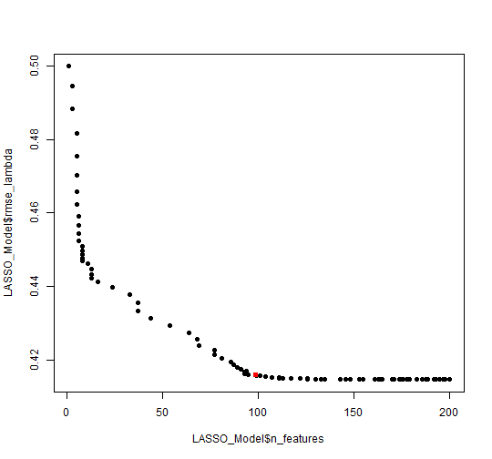

```r
knitr::opts_chunk$set(
  collapse = TRUE,
  comment = "#>",
  fig.width=7.5,
  fig.path = "vigfig-"
)
    library(LKT)
    library(ggplot2)
    library(pROC)
    library(glmnet)
    library(crayon)
    library(dplyr)
    library(boot)
# precomputed as per https://ropensci.org/blog/2019/12/08/precompute-vignettes/
```


# Load data (shows modifications to create needed columns)

```r
set.seed(41)
    val<-largerawsample

    #clean it up
    val$KC..Default.<-val$Problem.Name
    # make it a data table
    val= setDT(val)

    #make unstratified folds for crossvaldiations
    val$fold<-sample(1:5,length(val$Anon.Student.Id),replace=T)

    # make student stratified folds (for crossvalidation for unseen sample)
    unq = sample(unique(val$Anon.Student.Id))
    sfold = rep(1:5,length.out=length(unq))
    val$fold = rep(0,length(val[,1]))
    for(i in 1:5){val$fold[which(val$Anon.Student.Id %in% unq[which(sfold==i)])]=i}

    # get the times of each trial in seconds from 1970
    val$CF..Time.<-as.numeric(as.POSIXct(as.character(val$Time),format="%Y-%m-%d %H:%M:%S"))

    #make sure it is ordered in the way the code expects
    val<-val[order(val$Anon.Student.Id, val$CF..Time.),]

    #create a binary response column to predict and extract only data with a valid value
    val$CF..ansbin.<-ifelse(tolower(val$Outcome)=="correct",1,ifelse(tolower(val$Outcome)=="incorrect",0,-1))
    val<-val[val$CF..ansbin.==0 | val$CF..ansbin.==1,]

    # create durations
    val$Duration..sec.<-(val$CF..End.Latency.+val$CF..Review.Latency.+500)/1000

    # this function needs times and durations but you don't need it if you don't want to model time effects
    val <- computeSpacingPredictors(val, "KC..Default.") #allows recency, spacing, forgetting features to run
    val <- computeSpacingPredictors(val, "KC..Cluster.") #allows recency, spacing, forgetting features to run
    val <- computeSpacingPredictors(val, "Anon.Student.Id") #allows recency, spacing, forgetting features to run
    val <- computeSpacingPredictors(val, "CF..Correct.Answer.") #allows recency, spacing, forgetting features to run


#save(val,file="..\\LKTCloze.RData")
```


#Load MATHia (example how to load a remote dataset)

```r
set.seed(41)
datafile<-"C:/Users/ppavl/Dropbox/Active projects/ds4845_tx_All_Data_6977_2021_0723_141809.txt" # CHANGE THIS VALUE TO THE DataShop export file IN YOUR R WORKING DIRECTORY
val2<-read.delim(colClasses = c("Anon.Student.Id"="character"),datafile,sep="\t", header=TRUE,quote="")
val2=as.data.table(val2)
val2$CF..Time.<-as.numeric(as.POSIXct(as.character(val2$Time),format="%Y-%m-%d %H:%M:%S"))

    #make sure it is ordered in the way the code expects
    val2<-val2[order(val2$Anon.Student.Id, val2$CF..Time.),]

    #create a binary response column to predict and extract only data with a valid value

    val2$Outcome<-ifelse(tolower(val2$Outcome)=="ok","CORRECT","INCORRECT")
    val2$CF..ansbin.<-ifelse(tolower(val2$Outcome)=="correct",1,0)
    val2<-val2[val2$CF..ansbin.==0 | val2$CF..ansbin.==1,]

#subtot<-  aggregate(val2$CF..ansbin.,by=list(val2$Anon.Student.Id),FUN=length)
 # subtot<- subtot[subtot$x<20,]
   # val2<-val2[!(val2$Anon.Student.Id %in% subtot$Group.1),]
    val2<-val2[val2$Attempt.At.Step==1,]
        val2<-val2[val2$KC..MATHia.!="",]
        # make student stratified folds (for crossvalidation for unseen population)
unq = sample(unique(val2$Anon.Student.Id))
sfold = rep(1:5,length.out=length(unq))
val2$fold = rep(0,length(val2[,1]))
for(i in 1:5){val2$fold[which(val2$Anon.Student.Id %in% unq[which(sfold==i)])]=i}

     val2 <- suppressWarnings(computeSpacingPredictors(val2, "KC..MATHia.")) #allows recency, spacing, forgetting features to run
    val2 <- suppressWarnings(computeSpacingPredictors(val2, "Problem.Name")) #allows recency, spacing, forgetting features to run
    val2 <- suppressWarnings(computeSpacingPredictors(val2, "Anon.Student.Id")) #allows recency, spacing, forgetting features to run


#save(val2,file="..\\MATHia.RData")
```


#Load Assistments 2012 skillbuilder (example how to load a remote dataset)

```r
# set.seed(41)
# # From Assistments https://sites.google.com/site/assistmentsdata/datasets/2012-13-school-data-with-affect dataset https://drive.google.com/file/d/1cU6Ft4R3hLqA7G1rIGArVfelSZvc6RxY/view
# datafile<-"C:/Users/ppavl/Dropbox/Active projects/2012-2013-data-with-predictions-4-final.csv" # CHANGE THIS VALUE TO THE DataShop export file IN YOUR R WORKING DIRECTORY
# val3<-fread(colClasses = c("user_id"="character"),datafile, header=TRUE)
# val3$Anon.Student.Id<-val3$user_id
#
# val3<-val3[val3$skill!="",]
#
# #Duplicate screening
# val3 <-  val3 %>%  distinct(user_id,start_time,.keep_all=T)
#
# val3$CF..Time.<-as.numeric(as.POSIXct(as.character(val3$start_time),format="%Y-%m-%d %H:%M:%S"))
# val3<-val3[order(val3$Anon.Student.Id, val3$CF..Time.),]
# val3$CF..ansbin.<-val3$correct
# val3<-val3[val3$CF..ansbin.==0 | val3$CF..ansbin.==1,]
# val3$Duration..sec.<-as.numeric(as.POSIXct(as.character(val3$end_time),format="%Y-%m-%d %H:%M:%S"))-as.numeric(as.POSIXct(as.character(val3$start_time),format="%Y-%m-%d %H:%M:%S")) #allows recency, spacing, forgetting features to run
# val3$Outcome<-ifelse(val3$correct==1,"CORRECT","INCORRECT")
#
# val3 <- val3 %>%
#   group_by(problem_id) %>%
#   filter(n() > 4) %>%
#   ungroup()
#
# val3 <- val3 %>%
#   group_by(user_id) %>%
#   filter(n() >= 20) %>%
#   ungroup()
#
# # make student stratified folds (for crossvalidation for unseen population)
# unq = sample(unique(val3$Anon.Student.Id))
# sfold = rep(1:5,length.out=length(unq))
# val3$fold = rep(0,length(val3[,1]))
# for(i in 1:5){val3$fold[which(val3$Anon.Student.Id %in% unq[which(sfold==i)])]=i}
#
#
# val3 <- computeSpacingPredictors(val3, "skill") #allows recency, spacing, forgetting features to run
# val3 <- computeSpacingPredictors(val3, "Anon.Student.Id") #allows recency, spacing,
#
# val3 <- computeSpacingPredictors(val3, "problem_type") #allows recency, spacing, forgetting features to run
# val3 <- computeSpacingPredictors(val3, "type") #allows recency, spacing,forgetting features to run
# val3<-setDT(val3)


#save(val3,file="..\\Assistments2012fullrev.RData")

set.seed(41)
# From Assistments https://sites.google.com/site/assistmentsdata/datasets/2012-13-school-data-with-affect dataset https://drive.google.com/file/d/1cU6Ft4R3hLqA7G1rIGArVfelSZvc6RxY/view
datafile<-"C:/Users/ppavl/Dropbox/Active projects/2012-2013-data-with-predictions-4-final.csv" # CHANGE THIS VALUE TO THE DataShop export file IN YOUR R WORKING DIRECTORY
val3<-fread(colClasses = c("user_id"="character"),datafile, header=TRUE)
val3$Anon.Student.Id<-val3$user_id

# Identify 10% of the unique users
selected_users <- sample(unique(val3$user_id), size = floor(.05 * length(unique(val3$user_id))))
# Filter out the selected users
val3 <- val3[val3$user_id %in% selected_users,]


val3<-val3[val3$skill!="",]

#Duplicate screening
val3 <-  val3 %>%  distinct(user_id,start_time,.keep_all=T)

val3$CF..Time.<-as.numeric(as.POSIXct(as.character(val3$start_time),format="%Y-%m-%d %H:%M:%S"))
val3<-val3[order(val3$Anon.Student.Id, val3$CF..Time.),]
val3$CF..ansbin.<-val3$correct
val3<-val3[val3$CF..ansbin.==0 | val3$CF..ansbin.==1,]
val3$Duration..sec.<-as.numeric(as.POSIXct(as.character(val3$end_time),format="%Y-%m-%d %H:%M:%S"))-as.numeric(as.POSIXct(as.character(val3$start_time),format="%Y-%m-%d %H:%M:%S")) #allows recency, spacing, forgetting features to run
val3$Outcome<-ifelse(val3$correct==1,"CORRECT","INCORRECT")

val3 <- val3 %>%
  group_by(user_id) %>%
  filter(n() >= 20) %>%
  ungroup()

# make student stratified folds (for crossvalidation for unseen population)
unq = sample(unique(val3$Anon.Student.Id))
sfold = rep(1:5,length.out=length(unq))
val3$fold = rep(0,length(val3[,1]))
for(i in 1:5){val3$fold[which(val3$Anon.Student.Id %in% unq[which(sfold==i)])]=i}


val3 <- computeSpacingPredictors(val3, "skill") #allows recency, spacing, forgetting features to run
val3 <- computeSpacingPredictors(val3, "Anon.Student.Id") #allows recency, spacing,

val3 <- computeSpacingPredictors(val3, "problem_type") #allows recency, spacing, forgetting features to run
val3 <- computeSpacingPredictors(val3, "type") #allows recency, spacing,forgetting features to runforgetting features to run
val3<-setDT(val3)


#save(val3,file="..\\Assistments2012rev.RData")

```


# Additive Factors Model (AFM) fixed effect version

```r
    modelob <- LKT(
      data = val, interc=FALSE,
      components = c("Anon.Student.Id","KC..Default.","KC..Default."),
      features = c("intercept", "intercept", "lineafm"))
#> intercept Anon.Student.Id      
#> intercept KC..Default.      
#> lineafm KC..Default.      
#> lineafmKC..Default.+interceptKC..Default.+interceptAnon.Student.Id+0 
#> McFadden's R2 logistic: 0.280024 
#> LogLike logistic: -27347.20717315
```


# Performance Factors Analysis (PFA) fixed effect version

```r


  modelob <- LKT(data = val, interc=FALSE,
      components = c("Anon.Student.Id", "KC..Default.", "KC..Default.", "KC..Default."),
      features = c("intercept", "intercept", "linesuc$","linefail$"))
#> intercept Anon.Student.Id      
#> intercept KC..Default.      
#> linesuc$ KC..Default.      
#> linefail$ KC..Default.      
#> linefailKC..Default.:e$data$KC..Default.+linesucKC..Default.:e$data$KC..Default.+interceptKC..Default.+interceptAnon.Student.Id+0 
#> McFadden's R2 logistic: 0.295228 
#> LogLike logistic: -26769.69043811
```

# PFA using difficulty sensitive predictors (composite model requiring pred from prior model for estimation)

```r
    modelob <- LKT(
      data = val, interc=TRUE,
      components = c("Anon.Student.Id", "KC..Default.", "KC..Default.", "KC..Default."),
      features = c("intercept", "intercept", "linesuc$","linefail$"))
#> intercept Anon.Student.Id      
#> intercept KC..Default.      
#> linesuc$ KC..Default.      
#> linefail$ KC..Default.      
#> linefailKC..Default.:e$data$KC..Default.+linesucKC..Default.:e$data$KC..Default.+interceptKC..Default.+interceptAnon.Student.Id+1 
#> McFadden's R2 logistic: 0.295228 
#> LogLike logistic: -26769.69416527
    # have to have prior predictions in data to do the next model in and adaptive system
    #   this needs to be added to the data wth a first moodel like this
    val$pred<-modelob$prediction

    modelob <- LKT(
      data = val, interc=TRUE,
      components = c("Anon.Student.Id", "KC..Default.", "KC..Default.", "KC..Default."),
      features = c("intercept", "intercept", "diffcorComp","linefail"))
#> intercept Anon.Student.Id      
#> intercept KC..Default.      
#> diffcorComp KC..Default.      
#> linefail KC..Default.      
#> linefailKC..Default.+diffcorCompKC..Default.+interceptKC..Default.+interceptAnon.Student.Id+1 
#> McFadden's R2 logistic: 0.283896 
#> LogLike logistic: -27200.1075776
```

# Recent Performance Factors Analysis (RPFA)

```r
    modelob <- LKT(
      data = val, interc=TRUE,
      components = c("Anon.Student.Id", "KC..Default.", "KC..Default.", "KC..Default."),
      features = c("intercept", "intercept", "propdec2","linefail"),
      fixedpars=c(.9))
#> intercept Anon.Student.Id      
#> intercept KC..Default.      
#> propdec2 KC..Default. 0.9     
#> linefail KC..Default.      
#> linefailKC..Default.+propdec2KC..Default.+interceptKC..Default.+interceptAnon.Student.Id+1 
#> McFadden's R2 logistic: 0.303338 
#> LogLike logistic: -26461.64298933
```

# Recency tracing with logitdec

```r
    modelob <- LKT(
      data = val, interc=TRUE,
      components = c("Anon.Student.Id", "KC..Default.", "KC..Default.", "KC..Default."),
      features = c("intercept", "intercept", "logitdec","recency"),
      fixedpars=c(.9,.5))
#> intercept Anon.Student.Id      
#> intercept KC..Default.      
#> logitdec KC..Default. 0.9     
#> recency KC..Default. 0.5     
#> recencyKC..Default.+logitdecKC..Default.+interceptKC..Default.+interceptAnon.Student.Id+1 
#> McFadden's R2 logistic: 0.329326 
#> LogLike logistic: -25474.531261
```

# Recency tracing with logitdec and transfer from cluster

```r

system.time( modelob <- LKT(
      data = val, interc=TRUE,
      components = c("Anon.Student.Id", "KC..Default.", "KC..Default.", "KC..Default.","KC..Cluster."),
      features = c("intercept", "intercept", "logitdec","recency","logitdec"),
      seedpars=c(.9,.5,.5)))
#> intercept Anon.Student.Id      
#> intercept KC..Default.      
#> logitdec KC..Default. 0.9     
#> recency KC..Default. 0.5     
#> logitdec KC..Cluster. 0.5     
#> logitdecKC..Cluster.+recencyKC..Default.+logitdecKC..Default.+interceptKC..Default.+interceptAnon.Student.Id+1 
#> McFadden's R2 logistic: 0.329987 
#> LogLike logistic: -25449.41954064 
#> step par values =0.9,0.5,0.5
#> 
#> intercept Anon.Student.Id      
#> intercept KC..Default.      
#> logitdec KC..Default. 0.901     
#> recency KC..Default. 0.5     
#> logitdec KC..Cluster. 0.5     
#> logitdecKC..Cluster.+recencyKC..Default.+logitdecKC..Default.+interceptKC..Default.+interceptAnon.Student.Id+1 
#> McFadden's R2 logistic: 0.329977 
#> LogLike logistic: -25449.81080839 
#> step par values =0.901,0.5,0.5
#> 
#> intercept Anon.Student.Id      
#> intercept KC..Default.      
#> logitdec KC..Default. 0.899     
#> recency KC..Default. 0.5     
#> logitdec KC..Cluster. 0.5     
#> logitdecKC..Cluster.+recencyKC..Default.+logitdecKC..Default.+interceptKC..Default.+interceptAnon.Student.Id+1 
#> McFadden's R2 logistic: 0.329997 
#> LogLike logistic: -25449.02834548 
#> step par values =0.899,0.5,0.5
#> 
#> intercept Anon.Student.Id      
#> intercept KC..Default.      
#> logitdec KC..Default. 0.9     
#> recency KC..Default. 0.501     
#> logitdec KC..Cluster. 0.5     
#> logitdecKC..Cluster.+recencyKC..Default.+logitdecKC..Default.+interceptKC..Default.+interceptAnon.Student.Id+1 
#> McFadden's R2 logistic: 0.329913 
#> LogLike logistic: -25452.23946619 
#> step par values =0.9,0.501,0.5
#> 
#> intercept Anon.Student.Id      
#> intercept KC..Default.      
#> logitdec KC..Default. 0.9     
#> recency KC..Default. 0.499     
#> logitdec KC..Cluster. 0.5     
#> logitdecKC..Cluster.+recencyKC..Default.+logitdecKC..Default.+interceptKC..Default.+interceptAnon.Student.Id+1 
#> McFadden's R2 logistic: 0.330061 
#> LogLike logistic: -25446.60538055 
#> step par values =0.9,0.499,0.5
#> 
#> intercept Anon.Student.Id      
#> intercept KC..Default.      
#> logitdec KC..Default. 0.9     
#> recency KC..Default. 0.5     
#> logitdec KC..Cluster. 0.501     
#> logitdecKC..Cluster.+recencyKC..Default.+logitdecKC..Default.+interceptKC..Default.+interceptAnon.Student.Id+1 
#> McFadden's R2 logistic: 0.329986 
#> LogLike logistic: -25449.46877345 
#> step par values =0.9,0.5,0.501
#> 
#> intercept Anon.Student.Id      
#> intercept KC..Default.      
#> logitdec KC..Default. 0.9     
#> recency KC..Default. 0.5     
#> logitdec KC..Cluster. 0.499     
#> logitdecKC..Cluster.+recencyKC..Default.+logitdecKC..Default.+interceptKC..Default.+interceptAnon.Student.Id+1 
#> McFadden's R2 logistic: 0.329988 
#> LogLike logistic: -25449.37047102 
#> step par values =0.9,0.5,0.499
#> 
#> intercept Anon.Student.Id      
#> intercept KC..Default.      
#> logitdec KC..Default. 1e-05     
#> recency KC..Default. 1e-05     
#> logitdec KC..Cluster. 1e-05     
#> logitdecKC..Cluster.+recencyKC..Default.+logitdecKC..Default.+interceptKC..Default.+interceptAnon.Student.Id+1 
#> McFadden's R2 logistic: 0.318382 
#> LogLike logistic: -25890.22816729 
#> step par values =1e-05,1e-05,1e-05
#> 
#> intercept Anon.Student.Id      
#> intercept KC..Default.      
#> logitdec KC..Default. 0.00101     
#> recency KC..Default. 1e-05     
#> logitdec KC..Cluster. 1e-05     
#> logitdecKC..Cluster.+recencyKC..Default.+logitdecKC..Default.+interceptKC..Default.+interceptAnon.Student.Id+1 
#> McFadden's R2 logistic: 0.318506 
#> LogLike logistic: -25885.50736546 
#> step par values =0.00101,1e-05,1e-05
#> 
#> intercept Anon.Student.Id      
#> intercept KC..Default.      
#> logitdec KC..Default. 1e-05     
#> recency KC..Default. 1e-05     
#> logitdec KC..Cluster. 1e-05     
#> logitdecKC..Cluster.+recencyKC..Default.+logitdecKC..Default.+interceptKC..Default.+interceptAnon.Student.Id+1 
#> McFadden's R2 logistic: 0.318382 
#> LogLike logistic: -25890.22816729 
#> step par values =1e-05,1e-05,1e-05
#> 
#> intercept Anon.Student.Id      
#> intercept KC..Default.      
#> logitdec KC..Default. 1e-05     
#> recency KC..Default. 0.00101     
#> logitdec KC..Cluster. 1e-05     
#> logitdecKC..Cluster.+recencyKC..Default.+logitdecKC..Default.+interceptKC..Default.+interceptAnon.Student.Id+1 
#> McFadden's R2 logistic: 0.318741 
#> LogLike logistic: -25876.56791314 
#> step par values =1e-05,0.00101,1e-05
#> 
#> intercept Anon.Student.Id      
#> intercept KC..Default.      
#> logitdec KC..Default. 1e-05     
#> recency KC..Default. 1e-05     
#> logitdec KC..Cluster. 1e-05     
#> logitdecKC..Cluster.+recencyKC..Default.+logitdecKC..Default.+interceptKC..Default.+interceptAnon.Student.Id+1 
#> McFadden's R2 logistic: 0.318382 
#> LogLike logistic: -25890.22816729 
#> step par values =1e-05,1e-05,1e-05
#> 
#> intercept Anon.Student.Id      
#> intercept KC..Default.      
#> logitdec KC..Default. 1e-05     
#> recency KC..Default. 1e-05     
#> logitdec KC..Cluster. 0.00101     
#> logitdecKC..Cluster.+recencyKC..Default.+logitdecKC..Default.+interceptKC..Default.+interceptAnon.Student.Id+1 
#> McFadden's R2 logistic: 0.318506 
#> LogLike logistic: -25885.52891325 
#> step par values =1e-05,1e-05,0.00101
#> 
#> intercept Anon.Student.Id      
#> intercept KC..Default.      
#> logitdec KC..Default. 1e-05     
#> recency KC..Default. 1e-05     
#> logitdec KC..Cluster. 1e-05     
#> logitdecKC..Cluster.+recencyKC..Default.+logitdecKC..Default.+interceptKC..Default.+interceptAnon.Student.Id+1 
#> McFadden's R2 logistic: 0.318382 
#> LogLike logistic: -25890.22816729 
#> step par values =1e-05,1e-05,1e-05
#> 
#> intercept Anon.Student.Id      
#> intercept KC..Default.      
#> logitdec KC..Default. 0.441366149890742     
#> recency KC..Default. 0.245205681489652     
#> logitdec KC..Cluster. 0.245205681489652     
#> logitdecKC..Cluster.+recencyKC..Default.+logitdecKC..Default.+interceptKC..Default.+interceptAnon.Student.Id+1 
#> McFadden's R2 logistic: 0.344687 
#> LogLike logistic: -24891.06093568 
#> step par values =0.4413661,0.2452057,0.2452057
#> 
#> intercept Anon.Student.Id      
#> intercept KC..Default.      
#> logitdec KC..Default. 0.442366149890742     
#> recency KC..Default. 0.245205681489652     
#> logitdec KC..Cluster. 0.245205681489652     
#> logitdecKC..Cluster.+recencyKC..Default.+logitdecKC..Default.+interceptKC..Default.+interceptAnon.Student.Id+1 
#> McFadden's R2 logistic: 0.344687 
#> LogLike logistic: -24891.06983296 
#> step par values =0.4423661,0.2452057,0.2452057
#> 
#> intercept Anon.Student.Id      
#> intercept KC..Default.      
#> logitdec KC..Default. 0.440366149890742     
#> recency KC..Default. 0.245205681489652     
#> logitdec KC..Cluster. 0.245205681489652     
#> logitdecKC..Cluster.+recencyKC..Default.+logitdecKC..Default.+interceptKC..Default.+interceptAnon.Student.Id+1 
#> McFadden's R2 logistic: 0.344688 
#> LogLike logistic: -24891.03996834 
#> step par values =0.4403661,0.2452057,0.2452057
#> 
#> intercept Anon.Student.Id      
#> intercept KC..Default.      
#> logitdec KC..Default. 0.441366149890742     
#> recency KC..Default. 0.246205681489652     
#> logitdec KC..Cluster. 0.245205681489652     
#> logitdecKC..Cluster.+recencyKC..Default.+logitdecKC..Default.+interceptKC..Default.+interceptAnon.Student.Id+1 
#> McFadden's R2 logistic: 0.344675 
#> LogLike logistic: -24891.53087155 
#> step par values =0.4413661,0.2462057,0.2452057
#> 
#> intercept Anon.Student.Id      
#> intercept KC..Default.      
#> logitdec KC..Default. 0.441366149890742     
#> recency KC..Default. 0.244205681489652     
#> logitdec KC..Cluster. 0.245205681489652     
#> logitdecKC..Cluster.+recencyKC..Default.+logitdecKC..Default.+interceptKC..Default.+interceptAnon.Student.Id+1 
#> McFadden's R2 logistic: 0.344699 
#> LogLike logistic: -24890.60058623 
#> step par values =0.4413661,0.2442057,0.2452057
#> 
#> intercept Anon.Student.Id      
#> intercept KC..Default.      
#> logitdec KC..Default. 0.441366149890742     
#> recency KC..Default. 0.245205681489652     
#> logitdec KC..Cluster. 0.246205681489652     
#> logitdecKC..Cluster.+recencyKC..Default.+logitdecKC..Default.+interceptKC..Default.+interceptAnon.Student.Id+1 
#> McFadden's R2 logistic: 0.344687 
#> LogLike logistic: -24891.06467701 
#> step par values =0.4413661,0.2452057,0.2462057
#> 
#> intercept Anon.Student.Id      
#> intercept KC..Default.      
#> logitdec KC..Default. 0.441366149890742     
#> recency KC..Default. 0.245205681489652     
#> logitdec KC..Cluster. 0.244205681489652     
#> logitdecKC..Cluster.+recencyKC..Default.+logitdecKC..Default.+interceptKC..Default.+interceptAnon.Student.Id+1 
#> McFadden's R2 logistic: 0.344687 
#> LogLike logistic: -24891.06400592 
#> step par values =0.4413661,0.2452057,0.2442057
#> 
#> intercept Anon.Student.Id      
#> intercept KC..Default.      
#> logitdec KC..Default. 0.389756914945108     
#> recency KC..Default. 0.200769131142826     
#> logitdec KC..Cluster. 0.214092229386193     
#> logitdecKC..Cluster.+recencyKC..Default.+logitdecKC..Default.+interceptKC..Default.+interceptAnon.Student.Id+1 
#> McFadden's R2 logistic: 0.344834 
#> LogLike logistic: -24885.49599701 
#> step par values =0.3897569,0.2007691,0.2140922
#> 
#> intercept Anon.Student.Id      
#> intercept KC..Default.      
#> logitdec KC..Default. 0.390756914945108     
#> recency KC..Default. 0.200769131142826     
#> logitdec KC..Cluster. 0.214092229386193     
#> logitdecKC..Cluster.+recencyKC..Default.+logitdecKC..Default.+interceptKC..Default.+interceptAnon.Student.Id+1 
#> McFadden's R2 logistic: 0.344834 
#> LogLike logistic: -24885.487454 
#> step par values =0.3907569,0.2007691,0.2140922
#> 
#> intercept Anon.Student.Id      
#> intercept KC..Default.      
#> logitdec KC..Default. 0.388756914945108     
#> recency KC..Default. 0.200769131142826     
#> logitdec KC..Cluster. 0.214092229386193     
#> logitdecKC..Cluster.+recencyKC..Default.+logitdecKC..Default.+interceptKC..Default.+interceptAnon.Student.Id+1 
#> McFadden's R2 logistic: 0.344833 
#> LogLike logistic: -24885.51321323 
#> step par values =0.3887569,0.2007691,0.2140922
#> 
#> intercept Anon.Student.Id      
#> intercept KC..Default.      
#> logitdec KC..Default. 0.389756914945108     
#> recency KC..Default. 0.201769131142826     
#> logitdec KC..Cluster. 0.214092229386193     
#> logitdecKC..Cluster.+recencyKC..Default.+logitdecKC..Default.+interceptKC..Default.+interceptAnon.Student.Id+1 
#> McFadden's R2 logistic: 0.344841 
#> LogLike logistic: -24885.21274669 
#> step par values =0.3897569,0.2017691,0.2140922
#> 
#> intercept Anon.Student.Id      
#> intercept KC..Default.      
#> logitdec KC..Default. 0.389756914945108     
#> recency KC..Default. 0.199769131142826     
#> logitdec KC..Cluster. 0.214092229386193     
#> logitdecKC..Cluster.+recencyKC..Default.+logitdecKC..Default.+interceptKC..Default.+interceptAnon.Student.Id+1 
#> McFadden's R2 logistic: 0.344826 
#> LogLike logistic: -24885.76919365 
#> step par values =0.3897569,0.1997691,0.2140922
#> 
#> intercept Anon.Student.Id      
#> intercept KC..Default.      
#> logitdec KC..Default. 0.389756914945108     
#> recency KC..Default. 0.200769131142826     
#> logitdec KC..Cluster. 0.215092229386193     
#> logitdecKC..Cluster.+recencyKC..Default.+logitdecKC..Default.+interceptKC..Default.+interceptAnon.Student.Id+1 
#> McFadden's R2 logistic: 0.344834 
#> LogLike logistic: -24885.5007142 
#> step par values =0.3897569,0.2007691,0.2150922
#> 
#> intercept Anon.Student.Id      
#> intercept KC..Default.      
#> logitdec KC..Default. 0.389756914945108     
#> recency KC..Default. 0.200769131142826     
#> logitdec KC..Cluster. 0.213092229386193     
#> logitdecKC..Cluster.+recencyKC..Default.+logitdecKC..Default.+interceptKC..Default.+interceptAnon.Student.Id+1 
#> McFadden's R2 logistic: 0.344834 
#> LogLike logistic: -24885.49426811 
#> step par values =0.3897569,0.2007691,0.2130922
#> 
#> intercept Anon.Student.Id      
#> intercept KC..Default.      
#> logitdec KC..Default. 0.409535338102708     
#> recency KC..Default. 0.217465343197608     
#> logitdec KC..Cluster. 0.225782587786208     
#> logitdecKC..Cluster.+recencyKC..Default.+logitdecKC..Default.+interceptKC..Default.+interceptAnon.Student.Id+1 
#> McFadden's R2 logistic: 0.344884 
#> LogLike logistic: -24883.57554021 
#> step par values =0.4095353,0.2174653,0.2257826
#> 
#> intercept Anon.Student.Id      
#> intercept KC..Default.      
#> logitdec KC..Default. 0.410535338102708     
#> recency KC..Default. 0.217465343197608     
#> logitdec KC..Cluster. 0.225782587786208     
#> logitdecKC..Cluster.+recencyKC..Default.+logitdecKC..Default.+interceptKC..Default.+interceptAnon.Student.Id+1 
#> McFadden's R2 logistic: 0.344884 
#> LogLike logistic: -24883.5679621 
#> step par values =0.4105353,0.2174653,0.2257826
#> 
#> intercept Anon.Student.Id      
#> intercept KC..Default.      
#> logitdec KC..Default. 0.408535338102708     
#> recency KC..Default. 0.217465343197608     
#> logitdec KC..Cluster. 0.225782587786208     
#> logitdecKC..Cluster.+recencyKC..Default.+logitdecKC..Default.+interceptKC..Default.+interceptAnon.Student.Id+1 
#> McFadden's R2 logistic: 0.344885 
#> LogLike logistic: -24883.55264071 
#> step par values =0.4085353,0.2174653,0.2257826
#> 
#> intercept Anon.Student.Id      
#> intercept KC..Default.      
#> logitdec KC..Default. 0.409535338102708     
#> recency KC..Default. 0.218465343197608     
#> logitdec KC..Cluster. 0.225782587786208     
#> logitdecKC..Cluster.+recencyKC..Default.+logitdecKC..Default.+interceptKC..Default.+interceptAnon.Student.Id+1 
#> McFadden's R2 logistic: 0.344883 
#> LogLike logistic: -24883.62700272 
#> step par values =0.4095353,0.2184653,0.2257826
#> 
#> intercept Anon.Student.Id      
#> intercept KC..Default.      
#> logitdec KC..Default. 0.409535338102708     
#> recency KC..Default. 0.216465343197608     
#> logitdec KC..Cluster. 0.225782587786208     
#> logitdecKC..Cluster.+recencyKC..Default.+logitdecKC..Default.+interceptKC..Default.+interceptAnon.Student.Id+1 
#> McFadden's R2 logistic: 0.344885 
#> LogLike logistic: -24883.53643197 
#> step par values =0.4095353,0.2164653,0.2257826
#> 
#> intercept Anon.Student.Id      
#> intercept KC..Default.      
#> logitdec KC..Default. 0.409535338102708     
#> recency KC..Default. 0.217465343197608     
#> logitdec KC..Cluster. 0.226782587786208     
#> logitdecKC..Cluster.+recencyKC..Default.+logitdecKC..Default.+interceptKC..Default.+interceptAnon.Student.Id+1 
#> McFadden's R2 logistic: 0.344884 
#> LogLike logistic: -24883.57543528 
#> step par values =0.4095353,0.2174653,0.2267826
#> 
#> intercept Anon.Student.Id      
#> intercept KC..Default.      
#> logitdec KC..Default. 0.409535338102708     
#> recency KC..Default. 0.217465343197608     
#> logitdec KC..Cluster. 0.224782587786208     
#> logitdecKC..Cluster.+recencyKC..Default.+logitdecKC..Default.+interceptKC..Default.+interceptAnon.Student.Id+1 
#> McFadden's R2 logistic: 0.344884 
#> LogLike logistic: -24883.5736715 
#> step par values =0.4095353,0.2174653,0.2247826
#>    user  system elapsed 
#>   57.87    0.82  122.64
```

# Performance Prediction Equation (PPE)

```r
    modelob <- LKT(
      data = val, interc=TRUE,
      components = c("Anon.Student.Id", "KC..Default.", "KC..Default.", "KC..Default."),
      features = c("intercept", "intercept", "ppe","logitdec"),
      fixedpars=c(0.3491901,0.2045801,1e-05,0.9734477,0.4443027))
#> intercept Anon.Student.Id      
#> intercept KC..Default.      
#> ppe KC..Default. 0.3491901 0.2045801 1e-05 0.9734477  
#> logitdec KC..Default. 0.4443027     
#> logitdecKC..Default.+ppeKC..Default.+interceptKC..Default.+interceptAnon.Student.Id+1 
#> McFadden's R2 logistic: 0.349833 
#> LogLike logistic: -24695.58586047
```

# base4

```r
    modelob <- LKT(
      data = val, interc=TRUE,
      components = c("Anon.Student.Id", "KC..Default.", "KC..Default.", "KC..Default."),
      features = c("intercept", "intercept", "base4","logitdec"),
      fixedpars=c(0.1890747,0.6309054,0.05471752,.5,0.2160748))
#> intercept Anon.Student.Id      
#> intercept KC..Default.      
#> base4 KC..Default. 0.1890747 0.6309054 0.05471752 0.5  
#> logitdec KC..Default. 0.2160748     
#> logitdecKC..Default.+base4KC..Default.+interceptKC..Default.+interceptAnon.Student.Id+1 
#> McFadden's R2 logistic: 0.316284 
#> LogLike logistic: -25969.92498375
```

Using other features #See LKT paper #See computefeatures function in
the main R code for package
<a href="https://github.com/Optimal-Learning-Lab/LKT/blob/master/R/LKTfunctions.R" class="uri">https://github.com/Optimal-Learning-Lab/LKT/blob/master/R/LKTfunctions.R</a>


# Simple interactions

```r
    modelob <- LKT(
      data = val, interc=TRUE,
      components = c("Anon.Student.Id","KC..Default.","KC..Default."),
      features = c("logitdec", "logitdec", "lineafm"),fixedpars=c(.9,.8),
      interacts = c(NA,NA,"Level..Unitname."))
#> logitdec Anon.Student.Id 0.9     
#> logitdec KC..Default. 0.8     
#> lineafm KC..Default.      
#> lineafmKC..Default.:Level..Unitname.+logitdecKC..Default.+logitdecAnon.Student.Id+1 
#> McFadden's R2 logistic: 0.187931 
#> LogLike logistic: -30845.19646772
```

# Individualized Additive Factors Model (iAFM) fixed effect version

```r
    modelob <- LKT(
      data = val, interc=TRUE,
      components = c("Anon.Student.Id","KC..Default.","KC..Default.","KC..Default."),
      features = c("intercept", "intercept", "lineafm$","lineafm"),
      interacts = c(NA,NA,NA,"Anon.Student.Id"))
#> intercept Anon.Student.Id      
#> intercept KC..Default.      
#> lineafm$ KC..Default.      
#> lineafm KC..Default.      
#> lineafmKC..Default.:Anon.Student.Id+lineafmKC..Default.:e$data$KC..Default.+interceptKC..Default.+interceptAnon.Student.Id+1 
#> McFadden's R2 logistic: 0.309291 
#> LogLike logistic: -26235.52232195
```


# Connectors (another way to do interactions)

```r
    modelob <- LKT(
      data = val, interc=TRUE,
      connectors = c("+","*"),
      components = c("Anon.Student.Id", "KC..Default.", "KC..Default."),
      features = c("logitdec", "logitdec$", "lineafm$"),
      fixedpars = c(.9, .85) )
#> logitdec Anon.Student.Id 0.9     
#> logitdec$ KC..Default. 0.85     
#> lineafm$ KC..Default.      
#> lineafmKC..Default.:e$data$KC..Default.*logitdecKC..Default.:e$data$KC..Default.+logitdecAnon.Student.Id+1 
#> McFadden's R2 logistic: 0.214132 
#> LogLike logistic: -29849.99089373
```

# AutoKC

```r

mnames<-c("IRT",
          "Faculty",
          "Log Full autoKC",
          "Log Simple PFA",
          "Log Full PFA",
          "Log Full PFA full autoKC additive",
          "Log Full PFA Faculty additive ",
          "Log Simple PFA Faculty interactive ",
          "Log Simple PFA full autoKC interactive",
          "Log Full PFA simple autoKC interactive",
          "Log Simple PFA simple autoKC interactive")
r2s<-data.frame(name=mnames,r2s=NA)
compl<-list(c("Anon.Student.Id","KC..Default."),
            c("Anon.Student.Id","KC..Default.", "Anon.Student.Id", "Anon.Student.Id"),
            c("Anon.Student.Id","KC..Default.", "KC..Default.", "KC..Default."),
            c("Anon.Student.Id","KC..Default.", "KC..Default.", "KC..Default."),
            c("Anon.Student.Id","KC..Default.", "KC..Default.", "KC..Default."),
            c("Anon.Student.Id","KC..Default.", "KC..Default.", "KC..Default." ,"KC..Default." ,"KC..Default."),
            c("Anon.Student.Id","KC..Default.", "KC..Default.","Anon.Student.Id", "KC..Default."  ,"Anon.Student.Id"),
            c("Anon.Student.Id","KC..Default.", "KC..Default.","Anon.Student.Id", "KC..Default."  ,"Anon.Student.Id"),
            c("Anon.Student.Id","KC..Default.", "KC..Default.", "KC..Default." ,"KC..Default." ,"KC..Default."),
            c("Anon.Student.Id","KC..Default.", "KC..Default.", "KC..Default." ,"KC..Default." ,"KC..Default."),
            c("Anon.Student.Id","KC..Default.", "KC..Default.", "KC..Default." ,"KC..Default." ,"KC..Default."))
featl<-list(c("intercept","intercept"),
            c("intercept","intercept",  "logfail",  "logsuc"),
            c("intercept","intercept",  "logfail$",  "logsuc$"),
            c("intercept","intercept",  "logfail", "logsuc"),
            c("intercept","intercept",  "logfail$", "logsuc$"),
            c("intercept","intercept",  "logfail$", "logfail$", "logsuc$", "logsuc$"),
            c("intercept","intercept",  "logfail$", "logfail", "logsuc$", "logsuc"),
            c("intercept","intercept",  "logfail", "logfail", "logsuc", "logsuc"),
            c("intercept","intercept",  "logfail", "logfail$", "logsuc", "logsuc$"),
            c("intercept","intercept",  "logfail$", "logfail", "logsuc$", "logsuc"),
            c("intercept","intercept",  "logfail", "logfail", "logsuc", "logsuc"))
connl<-list(c("+"),
            c("+","+","+"),
            c("+","+","+"),
            c("+","+","+"),
            c("+","+","+"),
            c("+","+","+","+","+"),
            c("+","+","+","+","+"),
            c("+","+","*","+","*"),
            c("+","+","*","+","*"),
            c("+","+","*","+","*"),
            c("+","+","*","+","*"))
autol <- list(c(0,0),
              c(0,0,0,0),
              c(0,0,40,40),
              c(0,0,0,0),
              c(0,0,0,0),
              c(0,0,0,40,0,40),
              c(0,0,0,0,0,0),
              c(0,0,0,0,0,0),
              c(0,0,0,40,0,40),
              c(0,0,0,40,0,40),
              c(0,0,0,40,0,40))
for(i in 1:length(compl)){
  modelob <<- LKT(data = val,components = compl[[i]],features = featl[[i]],connectors = connl[[i]],autoKC = autol[[i]],
                  verbose = TRUE)
  cat(" R2 =  ",modelob$r2,"\n")
  r2s$r2s[i]<-modelob$r2
}
#> intercept Anon.Student.Id      
#> intercept KC..Default.      
#> interceptKC..Default.+interceptAnon.Student.Id+0 
#> McFadden's R2 logistic: 0.17526 
#> LogLike logistic: -31326.49035196 
#>  R2 =   0.17526 
#> intercept Anon.Student.Id      
#> intercept KC..Default.      
#> logfail Anon.Student.Id      
#> logsuc Anon.Student.Id      
#> logsucAnon.Student.Id+logfailAnon.Student.Id+interceptKC..Default.+interceptAnon.Student.Id+0 
#> McFadden's R2 logistic: 0.193067 
#> LogLike logistic: -30650.1052388 
#>  R2 =   0.193067 
#> intercept Anon.Student.Id      
#> intercept KC..Default.      
#> logfail$ AC3      
#> logsuc$ AC4      
#> logsucAC4:e$data$AC4+logfailAC3:e$data$AC3+interceptKC..Default.+interceptAnon.Student.Id+0 
#> McFadden's R2 logistic: 0.276453 
#> LogLike logistic: -27482.82384024 
#>  R2 =   0.276453 
#> intercept Anon.Student.Id      
#> intercept KC..Default.      
#> logfail KC..Default.      
#> logsuc KC..Default.      
#> logsucKC..Default.+logfailKC..Default.+interceptKC..Default.+interceptAnon.Student.Id+0 
#> McFadden's R2 logistic: 0.305306 
#> LogLike logistic: -26386.87615579 
#>  R2 =   0.305306 
#> intercept Anon.Student.Id      
#> intercept KC..Default.      
#> logfail$ KC..Default.      
#> logsuc$ KC..Default.      
#> logsucKC..Default.:e$data$KC..Default.+logfailKC..Default.:e$data$KC..Default.+interceptKC..Default.+interceptAnon.Student.Id+0 
#> McFadden's R2 logistic: 0.317028 
#> LogLike logistic: -25941.64544463 
#>  R2 =   0.317028 
#> intercept Anon.Student.Id      
#> intercept KC..Default.      
#> logfail$ KC..Default.      
#> logfail$ AC4      
#> logsuc$ KC..Default.      
#> logsuc$ AC6      
#> logsucAC6:e$data$AC6+logsucKC..Default.:e$data$KC..Default.+logfailAC4:e$data$AC4+logfailKC..Default.:e$data$KC..Default.+interceptKC..Default.+interceptAnon.Student.Id+0 
#> McFadden's R2 logistic: 0.323463 
#> LogLike logistic: -25697.2472566 
#>  R2 =   0.323463 
#> intercept Anon.Student.Id      
#> intercept KC..Default.      
#> logfail$ KC..Default.      
#> logfail Anon.Student.Id      
#> logsuc$ KC..Default.      
#> logsuc Anon.Student.Id      
#> logsucAnon.Student.Id+logsucKC..Default.:e$data$KC..Default.+logfailAnon.Student.Id+logfailKC..Default.:e$data$KC..Default.+interceptKC..Default.+interceptAnon.Student.Id+0 
#> McFadden's R2 logistic: 0.318007 
#> LogLike logistic: -25904.46774889 
#>  R2 =   0.318007 
#> intercept Anon.Student.Id      
#> intercept KC..Default.      
#> logfail KC..Default.      
#> logfail Anon.Student.Id      
#> logsuc KC..Default.      
#> logsuc Anon.Student.Id      
#> logsucAnon.Student.Id*logsucKC..Default.+logfailAnon.Student.Id*logfailKC..Default.+interceptKC..Default.+interceptAnon.Student.Id+0 
#> McFadden's R2 logistic: 0.327941 
#> LogLike logistic: -25527.1239864 
#>  R2 =   0.327941 
#> intercept Anon.Student.Id      
#> intercept KC..Default.      
#> logfail KC..Default.      
#> logfail$ AC4      
#> logsuc KC..Default.      
#> logsuc$ AC6      
#> logsucAC6:e$data$AC6*logsucKC..Default.+logfailAC4:e$data$AC4*logfailKC..Default.+interceptKC..Default.+interceptAnon.Student.Id+0 
#> McFadden's R2 logistic: 0.333046 
#> LogLike logistic: -25333.24395736 
#>  R2 =   0.333046 
#> intercept Anon.Student.Id      
#> intercept KC..Default.      
#> logfail$ KC..Default.      
#> logfail AC4      
#> logsuc$ KC..Default.      
#> logsuc AC6      
#> logsucAC6*logsucKC..Default.:e$data$KC..Default.+logfailAC4*logfailKC..Default.:e$data$KC..Default.+interceptKC..Default.+interceptAnon.Student.Id+0 
#> McFadden's R2 logistic: 0.336243 
#> LogLike logistic: -25211.80468804 
#>  R2 =   0.336243 
#> intercept Anon.Student.Id      
#> intercept KC..Default.      
#> logfail KC..Default.      
#> logfail AC4      
#> logsuc KC..Default.      
#> logsuc AC6      
#> logsucAC6*logsucKC..Default.+logfailAC4*logfailKC..Default.+interceptKC..Default.+interceptAnon.Student.Id+0 
#> McFadden's R2 logistic: 0.316213 
#> LogLike logistic: -25972.60034411 
#>  R2 =   0.316213

r2s$name <- factor(r2s$name,levels = rev(mnames))
plot<-ggplot(r2s,
             aes(name,r2s)) +
  geom_bar(stat = "identity") +xlab("Model Version") + ylab("R-squared Gain")+
  coord_flip()+ theme(text = element_text(size = 12))
plot
```


```r


mnames<-seq(2,71,10)
for (i in c(3,6)){
  r2s<-data.frame(name=mnames,r2s=NA,r2sr=NA)
  j<-1
  for(k in mnames){
    j<-j+1
    modelob <- LKT(data = val,components = compl[[i]],features = featl[[i]],connectors = connl[[i]],autoKC = k*(autol[[i]]>0),
                   verbose = FALSE)
    cat(" R2 =  ",modelob$r2,"\n")

    r2s$r2s[j-1]<-modelob$r2

        modelob <- LKT(data = val,components = compl[[i]],features = featl[[i]],connectors = connl[[i]],autoKC = k*(autol[[i]]>0),
                   verbose = FALSE, autoKCcont = rep("rand",length(featl[[i]])))
    cat(" R2 =  ",modelob$r2,"\n")

    r2s$r2sr[j-1]<-modelob$r2

  }

  r2s$name <- factor(r2s$name,levels = (mnames))
  plot<-ggplot(r2s, aes(name, group=1))+
    geom_line(aes(y = r2s)) +
  geom_line(aes(y = r2sr), linetype="twodash")+
    scale_x_discrete(breaks=seq(from = 2, to = 71, by = 5)) +xlab("autoKC Clusters") + ylab("McFadden's R-squared Gain")+ theme(text = element_text(size = 16)) +
      geom_point(aes(y = r2s))+
      geom_point(aes(y = r2sr))
  print(plot)
}
#>  R2 =   0.195026 
#>  R2 =   0.19473 
#>  R2 =   0.228315 
#>  R2 =   0.220567 
#>  R2 =   0.249023 
#>  R2 =   0.245123 
#>  R2 =   0.262488 
#>  R2 =   0.258001 
#>  R2 =   0.278989 
#>  R2 =   0.272087 
#>  R2 =   0.287932 
#>  R2 =   0.291472 
#>  R2 =   0.302358 
#>  R2 =   0.303657
```


```
#>  R2 =   0.318756 
#>  R2 =   0.317719 
#>  R2 =   0.32162 
#>  R2 =   0.318223 
#>  R2 =   0.322841 
#>  R2 =   0.317808 
#>  R2 =   0.322601 
#>  R2 =   0.317806 
#>  R2 =   0.323598 
#>  R2 =   0.318044 
#>  R2 =   0.320678 
#>  R2 =   0.317593 
#>  R2 =   0.318027 
#>  R2 =   0.317242
```


# Synthetic discrimination parameter testing (experimental)

```r
# discrimintion parameters normally control how well strongly ability affects correctness at an item level
# "synthetic" version here proposes something similar, that the student ability interacts with the item difficulty
# here a running estimate of student ability (logitdec) is multiplied by a value for the item to indicate the importance of student ability to answer that item
# consider the results, which suggest the first example is highly correlated with overall learning..., and the second example where it is slightly less than baseline value (.69 is the baseline for the influence of the student on all items)
# A model like this means that some items are discriminated better by higher or lower student ability (more or less senitive to ability)


mnames<-c("IRT",
          "IRT ad inter",
          "AFM",
          "IRT ad inter with AFM",
          "IRT ad")
r2s<-data.frame(name=mnames,r2s=NA)
compl<-list(c("Anon.Student.Id","KC..Default."),
            c("Anon.Student.Id","KC..Default."),
            c("Anon.Student.Id","KC..Default.","KC..Default."),
            c("Anon.Student.Id","KC..Default.","KC..Default."),
            c("Anon.Student.Id","KC..Default."))
featl<-list(c("intercept","intercept"),
            c("logitdec","intercept"),
            c("logitdec","intercept","lineafm"),
            c("logitdec","intercept","lineafm"),
            c("logitdec","intercept"))
connl<-list(c("+"),
            c("*"),
            c("+","+"),
            c("*","+"),
            c("+"))
for(i in 1:4){
  modelob <<- LKT(data = val,components = compl[[i]],features = featl[[i]],connectors = connl[[i]],fixedpars=c(.925),interc=TRUE,verbose = FALSE)
  cat("coefs",length(modelob$coefs))
  cat(" R2 =  ",modelob$r2,"\n")
  r2s$r2s[i]<-modelob$r2
}
#> coefs 549 R2 =   0.17526 
#> coefs 144 R2 =   0.170469 
#> coefs 74 R2 =   0.247155 
#> coefs 145 R2 =   0.249731
```


#Credibility intervals

```r

components = c("Anon.Student.Id", "KC..Default.", "KC..Default.", "KC..Default.")
features = c("intercept", "intercept", "linesuc$","linefail$")

# or

components = c("Anon.Student.Id", "KC..Default.", "KC..Default.", "KC..Default.")
features = c("logit", "logit", "linesuc","linefail")
fixedpars = c(.03,.03)

mod1 = LKT(setDT(val),interc=TRUE,
           components=components,
           features=features,
           fixedpars = fixedpars,
           seedpars = c(NA))
#> logit Anon.Student.Id 0.03     
#> logit KC..Default. 0.03     
#> linesuc KC..Default.      
#> linefail KC..Default.      
#> linefailKC..Default.+linesucKC..Default.+logitKC..Default.+logitAnon.Student.Id+1 
#> McFadden's R2 logistic: 0.165447 
#> LogLike logistic: -31699.23101113

n_students=400
n_boot = 100
system.time({
  boot_res = LKT_HDI(val,n_boot,n_students,components=components,features=features,fixedpars=fixedpars)
})
#> 0%...2%...3%...4%...5%...6%...7%...8%...9%...10%...11%...12%...13%...14%...15%...16%...17%...18%...19%...20%...21%...22%...23%...24%...25%...26%...27%...28%...29%...30%...31%...32%...33%...34%...35%...36%...37%...38%...39%...40%...41%...42%...43%...44%...45%...46%...47%...48%...49%...50%...51%...52%...53%...54%...55%...56%...57%...58%...59%...60%...61%...62%...63%...64%...65%...66%...67%...68%...69%...70%...71%...72%...73%...74%...75%...76%...77%...78%...79%...80%...81%...82%...83%...84%...85%...86%...87%...88%...89%...90%...91%...92%...93%...94%...95%...96%...97%...98%...99%...100%
#>    user  system elapsed 
#>  117.54    3.64  245.40


#Names of coefficients that are non-significant (interval includes zero)
zero_idx = which(boot_res$coef_hdi$includes_zero==TRUE)
boot_res$coef_hdi$coef_name[zero_idx]
#> character(0)

if(!is.na(unique(boot_res$par_reps[,zero_idx[1]]))){
  hist(boot_res$par_reps[,zero_idx[1]],breaks=50,main=boot_res$coef_hdi$coef_name[zero_idx][1])

abline(v=boot_res$coef_hdi$lower[zero_idx[1]],col="darkblue",lwd=3)
abline(v=boot_res$coef_hdi$upper[zero_idx[1]],col="darkblue",lwd=3)
abline(v=mean(boot_res$par_reps[,zero_idx[1]]),lty=2,col="darkblue",lwd=3)
#Estimate from full fit to data
  abline(v=boot_res$mod_full$coefs[which(rownames(boot_res$mod_full$coefs)==colnames(boot_res$par_reps)[zero_idx[1]])],col="firebrick3",lwd=3)} else {print(boot_res$coef_hdi)}
#>              coef_name      lower      upper includes_zero credMass
#> 1          (Intercept) -0.2705171 -0.2420977         FALSE     0.95
#> 2 linefailKC..Default.  0.1912911  0.2695580         FALSE     0.95
#> 3  linesucKC..Default.  0.5405180  0.6356348         FALSE     0.95
#> 4    logitKC..Default.  0.3631250  0.5199010         FALSE     0.95
#> 5 logitAnon.Student.Id  0.6205444  0.6509196         FALSE     0.95
```

# Recency tracing with RPFA propdec2 feature (the one in the original Galyardt and Goldin paper)

```r
    modelob <- LKT(
      data = val, interc=TRUE,
      components = c("Anon.Student.Id", "KC..Default.", "KC..Default.", "KC..Default.", "KC..Default."),
      features = c("intercept","intercept",  "intercept", "propdec2","recency"),
      fixedpars=c(NA,NA))
#> intercept Anon.Student.Id      
#> intercept KC..Default.      
#> intercept KC..Default.      
#> propdec2 KC..Default. 0.5     
#> recency KC..Default. 0.5     
#> recencyKC..Default.+propdec2KC..Default.+interceptKC..Default.+interceptKC..Default.+interceptAnon.Student.Id+1 
#> McFadden's R2 logistic: 0.348705 
#> LogLike logistic: -24738.45370723 
#> step par values =0.5,0.5
#> 
#> intercept Anon.Student.Id      
#> intercept KC..Default.      
#> intercept KC..Default.      
#> propdec2 KC..Default. 0.501     
#> recency KC..Default. 0.5     
#> recencyKC..Default.+propdec2KC..Default.+interceptKC..Default.+interceptKC..Default.+interceptAnon.Student.Id+1 
#> McFadden's R2 logistic: 0.348706 
#> LogLike logistic: -24738.40208171 
#> step par values =0.501,0.5
#> 
#> intercept Anon.Student.Id      
#> intercept KC..Default.      
#> intercept KC..Default.      
#> propdec2 KC..Default. 0.499     
#> recency KC..Default. 0.5     
#> recencyKC..Default.+propdec2KC..Default.+interceptKC..Default.+interceptKC..Default.+interceptAnon.Student.Id+1 
#> McFadden's R2 logistic: 0.348703 
#> LogLike logistic: -24738.5155014 
#> step par values =0.499,0.5
#> 
#> intercept Anon.Student.Id      
#> intercept KC..Default.      
#> intercept KC..Default.      
#> propdec2 KC..Default. 0.5     
#> recency KC..Default. 0.501     
#> recencyKC..Default.+propdec2KC..Default.+interceptKC..Default.+interceptKC..Default.+interceptAnon.Student.Id+1 
#> McFadden's R2 logistic: 0.348676 
#> LogLike logistic: -24739.53714413 
#> step par values =0.5,0.501
#> 
#> intercept Anon.Student.Id      
#> intercept KC..Default.      
#> intercept KC..Default.      
#> propdec2 KC..Default. 0.5     
#> recency KC..Default. 0.499     
#> recencyKC..Default.+propdec2KC..Default.+interceptKC..Default.+interceptKC..Default.+interceptAnon.Student.Id+1 
#> McFadden's R2 logistic: 0.348733 
#> LogLike logistic: -24737.3747709 
#> step par values =0.5,0.499
#> 
#> intercept Anon.Student.Id      
#> intercept KC..Default.      
#> intercept KC..Default.      
#> propdec2 KC..Default. 0.99999     
#> recency KC..Default. 1e-05     
#> recencyKC..Default.+propdec2KC..Default.+interceptKC..Default.+interceptKC..Default.+interceptAnon.Student.Id+1 
#> McFadden's R2 logistic: 0.322684 
#> LogLike logistic: -25726.81724268 
#> step par values =0.99999,1e-05
#> 
#> intercept Anon.Student.Id      
#> intercept KC..Default.      
#> intercept KC..Default.      
#> propdec2 KC..Default. 0.99999     
#> recency KC..Default. 1e-05     
#> recencyKC..Default.+propdec2KC..Default.+interceptKC..Default.+interceptKC..Default.+interceptAnon.Student.Id+1 
#> McFadden's R2 logistic: 0.322684 
#> LogLike logistic: -25726.81724268 
#> step par values =0.99999,1e-05
#> 
#> intercept Anon.Student.Id      
#> intercept KC..Default.      
#> intercept KC..Default.      
#> propdec2 KC..Default. 0.99899     
#> recency KC..Default. 1e-05     
#> recencyKC..Default.+propdec2KC..Default.+interceptKC..Default.+interceptKC..Default.+interceptAnon.Student.Id+1 
#> McFadden's R2 logistic: 0.322692 
#> LogLike logistic: -25726.50509275 
#> step par values =0.99899,1e-05
#> 
#> intercept Anon.Student.Id      
#> intercept KC..Default.      
#> intercept KC..Default.      
#> propdec2 KC..Default. 0.99999     
#> recency KC..Default. 0.00101     
#> recencyKC..Default.+propdec2KC..Default.+interceptKC..Default.+interceptKC..Default.+interceptAnon.Student.Id+1 
#> McFadden's R2 logistic: 0.322937 
#> LogLike logistic: -25717.20836167 
#> step par values =0.99999,0.00101
#> 
#> intercept Anon.Student.Id      
#> intercept KC..Default.      
#> intercept KC..Default.      
#> propdec2 KC..Default. 0.99999     
#> recency KC..Default. 1e-05     
#> recencyKC..Default.+propdec2KC..Default.+interceptKC..Default.+interceptKC..Default.+interceptAnon.Student.Id+1 
#> McFadden's R2 logistic: 0.322684 
#> LogLike logistic: -25726.81724268 
#> step par values =0.99999,1e-05
#> 
#> intercept Anon.Student.Id      
#> intercept KC..Default.      
#> intercept KC..Default.      
#> propdec2 KC..Default. 0.651308097725166     
#> recency KC..Default. 0.348691902274834     
#> recencyKC..Default.+propdec2KC..Default.+interceptKC..Default.+interceptKC..Default.+interceptAnon.Student.Id+1 
#> McFadden's R2 logistic: 0.351149 
#> LogLike logistic: -24645.61245544 
#> step par values =0.6513081,0.3486919
#> 
#> intercept Anon.Student.Id      
#> intercept KC..Default.      
#> intercept KC..Default.      
#> propdec2 KC..Default. 0.652308097725166     
#> recency KC..Default. 0.348691902274834     
#> recencyKC..Default.+propdec2KC..Default.+interceptKC..Default.+interceptKC..Default.+interceptAnon.Student.Id+1 
#> McFadden's R2 logistic: 0.351145 
#> LogLike logistic: -24645.75801983 
#> step par values =0.6523081,0.3486919
#> 
#> intercept Anon.Student.Id      
#> intercept KC..Default.      
#> intercept KC..Default.      
#> propdec2 KC..Default. 0.650308097725166     
#> recency KC..Default. 0.348691902274834     
#> recencyKC..Default.+propdec2KC..Default.+interceptKC..Default.+interceptKC..Default.+interceptAnon.Student.Id+1 
#> McFadden's R2 logistic: 0.351153 
#> LogLike logistic: -24645.46792712 
#> step par values =0.6503081,0.3486919
#> 
#> intercept Anon.Student.Id      
#> intercept KC..Default.      
#> intercept KC..Default.      
#> propdec2 KC..Default. 0.651308097725166     
#> recency KC..Default. 0.349691902274834     
#> recencyKC..Default.+propdec2KC..Default.+interceptKC..Default.+interceptKC..Default.+interceptAnon.Student.Id+1 
#> McFadden's R2 logistic: 0.351144 
#> LogLike logistic: -24645.79597804 
#> step par values =0.6513081,0.3496919
#> 
#> intercept Anon.Student.Id      
#> intercept KC..Default.      
#> intercept KC..Default.      
#> propdec2 KC..Default. 0.651308097725166     
#> recency KC..Default. 0.347691902274834     
#> recencyKC..Default.+propdec2KC..Default.+interceptKC..Default.+interceptKC..Default.+interceptAnon.Student.Id+1 
#> McFadden's R2 logistic: 0.351154 
#> LogLike logistic: -24645.43684743 
#> step par values =0.6513081,0.3476919
#> 
#> intercept Anon.Student.Id      
#> intercept KC..Default.      
#> intercept KC..Default.      
#> propdec2 KC..Default. 0.607663004030062     
#> recency KC..Default. 0.333132526328625     
#> recencyKC..Default.+propdec2KC..Default.+interceptKC..Default.+interceptKC..Default.+interceptAnon.Student.Id+1 
#> McFadden's R2 logistic: 0.351337 
#> LogLike logistic: -24638.49342818 
#> step par values =0.607663,0.3331325
#> 
#> intercept Anon.Student.Id      
#> intercept KC..Default.      
#> intercept KC..Default.      
#> propdec2 KC..Default. 0.608663004030062     
#> recency KC..Default. 0.333132526328625     
#> recencyKC..Default.+propdec2KC..Default.+interceptKC..Default.+interceptKC..Default.+interceptAnon.Student.Id+1 
#> McFadden's R2 logistic: 0.351334 
#> LogLike logistic: -24638.58973997 
#> step par values =0.608663,0.3331325
#> 
#> intercept Anon.Student.Id      
#> intercept KC..Default.      
#> intercept KC..Default.      
#> propdec2 KC..Default. 0.606663004030062     
#> recency KC..Default. 0.333132526328625     
#> recencyKC..Default.+propdec2KC..Default.+interceptKC..Default.+interceptKC..Default.+interceptAnon.Student.Id+1 
#> McFadden's R2 logistic: 0.351339 
#> LogLike logistic: -24638.39830286 
#> step par values =0.606663,0.3331325
#> 
#> intercept Anon.Student.Id      
#> intercept KC..Default.      
#> intercept KC..Default.      
#> propdec2 KC..Default. 0.607663004030062     
#> recency KC..Default. 0.334132526328625     
#> recencyKC..Default.+propdec2KC..Default.+interceptKC..Default.+interceptKC..Default.+interceptAnon.Student.Id+1 
#> McFadden's R2 logistic: 0.351335 
#> LogLike logistic: -24638.55382175 
#> step par values =0.607663,0.3341325
#> 
#> intercept Anon.Student.Id      
#> intercept KC..Default.      
#> intercept KC..Default.      
#> propdec2 KC..Default. 0.607663004030062     
#> recency KC..Default. 0.332132526328625     
#> recencyKC..Default.+propdec2KC..Default.+interceptKC..Default.+interceptKC..Default.+interceptAnon.Student.Id+1 
#> McFadden's R2 logistic: 0.351335 
#> LogLike logistic: -24638.56033433 
#> step par values =0.607663,0.3321325
#> 
#> intercept Anon.Student.Id      
#> intercept KC..Default.      
#> intercept KC..Default.      
#> propdec2 KC..Default. 0.508674761487539     
#> recency KC..Default. 0.337267116649495     
#> recencyKC..Default.+propdec2KC..Default.+interceptKC..Default.+interceptKC..Default.+interceptAnon.Student.Id+1 
#> McFadden's R2 logistic: 0.351415 
#> LogLike logistic: -24635.52052419 
#> step par values =0.5086748,0.3372671
#> 
#> intercept Anon.Student.Id      
#> intercept KC..Default.      
#> intercept KC..Default.      
#> propdec2 KC..Default. 0.509674761487539     
#> recency KC..Default. 0.337267116649495     
#> recencyKC..Default.+propdec2KC..Default.+interceptKC..Default.+interceptKC..Default.+interceptAnon.Student.Id+1 
#> McFadden's R2 logistic: 0.351416 
#> LogLike logistic: -24635.48873845 
#> step par values =0.5096748,0.3372671
#> 
#> intercept Anon.Student.Id      
#> intercept KC..Default.      
#> intercept KC..Default.      
#> propdec2 KC..Default. 0.507674761487539     
#> recency KC..Default. 0.337267116649495     
#> recencyKC..Default.+propdec2KC..Default.+interceptKC..Default.+interceptKC..Default.+interceptAnon.Student.Id+1 
#> McFadden's R2 logistic: 0.351414 
#> LogLike logistic: -24635.55366964 
#> step par values =0.5076748,0.3372671
#> 
#> intercept Anon.Student.Id      
#> intercept KC..Default.      
#> intercept KC..Default.      
#> propdec2 KC..Default. 0.508674761487539     
#> recency KC..Default. 0.338267116649495     
#> recencyKC..Default.+propdec2KC..Default.+interceptKC..Default.+interceptKC..Default.+interceptAnon.Student.Id+1 
#> McFadden's R2 logistic: 0.351412 
#> LogLike logistic: -24635.61367904 
#> step par values =0.5086748,0.3382671
#> 
#> intercept Anon.Student.Id      
#> intercept KC..Default.      
#> intercept KC..Default.      
#> propdec2 KC..Default. 0.508674761487539     
#> recency KC..Default. 0.336267116649495     
#> recencyKC..Default.+propdec2KC..Default.+interceptKC..Default.+interceptKC..Default.+interceptAnon.Student.Id+1 
#> McFadden's R2 logistic: 0.351417 
#> LogLike logistic: -24635.43523377 
#> step par values =0.5086748,0.3362671
```

#brpropdec (experimental feature)

```r
    modelob <- LKT(
      data = val, interc=TRUE,dualfit = TRUE,
      components = c("KC..Default.","Anon.Student.Id","KC..Default.","KC..Default."),
      features = c("baseratepropdec", "logitdec", "logitdec","recency"),fixedpars =c(0.988209,0.9690458,0.9004974,0.2603806))
#> baseratepropdec KC..Default. 0.988209     
#> logitdec Anon.Student.Id 0.9690458     
#> logitdec KC..Default. 0.9004974     
#> recency KC..Default. 0.2603806     
#> recencyKC..Default.+logitdecKC..Default.+logitdecAnon.Student.Id+baseratepropdecKC..Default.+1 
#> R2 (cor squared) latency: 0.0782915425247155
#> McFadden's R2 logistic: 0.240331 
#> LogLike logistic: -28854.86021562 
#> Failure latency:  26.490591139291 
#> Latency Scalar: 0.774555522136031
#> Latency Intercept: 6.42015387155178
print(modelob$coefs)
#>                             coefficient
#> (Intercept)                  -0.7356173
#> recencyKC..Default.           6.1099085
#> logitdecKC..Default.          0.9436032
#> logitdecAnon.Student.Id       0.6307401
#> baseratepropdecKC..Default.   5.4948921
```

# Simple adaptive model for practice optimization

```r


modelob <- LKT(data = val, interc=FALSE,dualfit = FALSE,factrv = 1e11,
               components = c("Anon.Student.Id","KC..Default.","KC..Default.","KC..Default.")
               ,features = c("logitdec", "logsuc","recency","intercept"),fixedpars =c(0.98, 0.24))
#> logitdec Anon.Student.Id 0.98     
#> logsuc KC..Default.      
#> recency KC..Default. 0.24     
#> intercept KC..Default.      
#> interceptKC..Default.+recencyKC..Default.+logsucKC..Default.+logitdecAnon.Student.Id+0 
#> McFadden's R2 logistic: 0.317203 
#> LogLike logistic: -25935.00011818
```

# Test of new feature to trace KC intercepts across time (not within subjects)

```r
    val<-val[order(val$CF..Time.),]
modelob <- LKT(data = val, interc=TRUE,dualfit = FALSE,factrv = 1e11,
               components = c("Anon.Student.Id","KC..Default.","KC..Default.","KC..Default.")
               ,features = c("logitdec", "logsuc","recency","logitdecevol"),fixedpars =c(0.98, 0.24,.99))
#> logitdec Anon.Student.Id 0.98     
#> logsuc KC..Default.      
#> recency KC..Default. 0.24     
#> logitdecevol KC..Default. 0.99     
#> logitdecevolKC..Default.+recencyKC..Default.+logsucKC..Default.+logitdecAnon.Student.Id+1 
#> McFadden's R2 logistic: 0.305249 
#> LogLike logistic: -26389.05800396
```

#Astonishing model (theory analysis)

```r
modelob <- LKT(
      data = val, interc=TRUE,dualfit = TRUE,factrv=1e7,
      components = c("Anon.Student.Id","KC..Default.","KC..Default.","KC..Default."),
      features = c("intercept", "intercept","lineafm$","lineafm"),interacts = c(NA,NA,NA,"Anon.Student.Id") )
#> intercept Anon.Student.Id      
#> intercept KC..Default.      
#> lineafm$ KC..Default.      
#> lineafm KC..Default.      
#> lineafmKC..Default.:Anon.Student.Id+lineafmKC..Default.:e$data$KC..Default.+interceptKC..Default.+interceptAnon.Student.Id+1 
#> R2 (cor squared) latency: 0.0416804054895991
#> McFadden's R2 logistic: 0.309291 
#> LogLike logistic: -26235.52147241 
#> Failure latency:  26.490591139291 
#> Latency Scalar: 0.373122000230565
#> Latency Intercept: 6.78509949532675


modelob <- LKT(
      data = val, interc=TRUE,dualfit = TRUE,factrv=1e7,
      components = c("Anon.Student.Id","KC..Default.","KC..Default.","KC..Default."),
      features = c("intercept", "intercept","lineafm$","lineafm"),interacts = c(NA,NA,NA,"Anon.Student.Id") )
#> intercept Anon.Student.Id      
#> intercept KC..Default.      
#> lineafm$ KC..Default.      
#> lineafm KC..Default.      
#> lineafmKC..Default.:Anon.Student.Id+lineafmKC..Default.:e$data$KC..Default.+interceptKC..Default.+interceptAnon.Student.Id+1 
#> R2 (cor squared) latency: 0.0416804054895991
#> McFadden's R2 logistic: 0.309291 
#> LogLike logistic: -26235.52147241 
#> Failure latency:  26.490591139291 
#> Latency Scalar: 0.373122000230565
#> Latency Intercept: 6.78509949532675
```

#Build LKT with special feature

```r

q<-  buildLKTModel(data = val, interc=TRUE, specialcomponents = "CF..End.Latency.",specialfeatures = "numer",
      allcomponents = c("Anon.Student.Id", "KC..Default."),
      currentcomponents = c(),forv=100,bacv=80,
      allfeatures = c("lineafm","logafm","logsuc","logfail","linesuc","linefail","propdec","recencysuc","recencyfail"),
      currentfeatures = c( ),currentfixedpars = c(),forward=TRUE,backward=TRUE,
      maxitv=1,verbose=FALSE)
#> 
#> Step  1 start
#> 
#> trying to add
#> numer-CF..End.Latency. 2 63996.87 
#> lineafm-Anon.Student.Id 2 75499.33 
#> logafm-Anon.Student.Id 2 74904.98 
#> logsuc-Anon.Student.Id 2 73388.72 
#> logfail-Anon.Student.Id 2 75962.09 
#> linesuc-Anon.Student.Id 2 73580.92 
#> linefail-Anon.Student.Id 2 75732.58 
#> propdec-Anon.Student.Id 3 70650.95 
#> recencysuc-Anon.Student.Id 3 74361.45 
#> recencyfail-Anon.Student.Id 3 74762.79 
#> lineafm-KC..Default. 2 69816.85 
#> logafm-KC..Default. 2 68286.98 
#> logsuc-KC..Default. 2 64218.11 
#> logfail-KC..Default. 2 75599.86 
#> linesuc-KC..Default. 2 65835.7 
#> linefail-KC..Default. 2 75861.2 
#> propdec-KC..Default. 3 69143.73 
#> recencysuc-KC..Default. 3 62964.75 
#> recencyfail-KC..Default. 3 75868.35 
#> added 
#> recencysuc KC..Default. 
#> 
#> Step 1 results - pars  3  current BIC 62964.75 current AIC 62938 current AUC 0.7227457 current RMSE 0.4426974  McFadden's R2 0.171587 
#> recencysuc 
#>  KC..Default. 
#> pars 0.1515394 
#> 
#> Step  2 start
#> 
#> trying to add
#> numer-CF..End.Latency. 4 59777.21 
#> lineafm-Anon.Student.Id 4 62904.38 
#> logafm-Anon.Student.Id 4 62728.45 
#> logsuc-Anon.Student.Id 4 62153.03 
#> logfail-Anon.Student.Id 4 62969.65 
#> linesuc-Anon.Student.Id 4 62094.87 
#> linefail-Anon.Student.Id 4 62674.16 
#> propdec-Anon.Student.Id 5 60778.83 
#> recencysuc-Anon.Student.Id 5 62314.63 
#> recencyfail-Anon.Student.Id 5 62474.8 
#> lineafm-KC..Default. 4 62604.34 
#> logafm-KC..Default. 4 62335.78 
#> logsuc-KC..Default. 4 62332.94 
#> logfail-KC..Default. 4 62793.03 
#> linesuc-KC..Default. 4 62414.09 
#> linefail-KC..Default. 4 62917.09 
#> propdec-KC..Default. 5 62355.03 
#> recencyfail-KC..Default. 5 61139.88 
#> added 
#> numer CF..End.Latency. 
#> 
#> trying to remove
#> recencysuc-KC..Default. 2 63996.87 
#> numer-CF..End.Latency. 3 62965.38 
#> 
#> Step 2 results - pars  4  current BIC 56803.39 current AIC 56767.72 current AUC 0.8218487 current RMSE 0.4138223  McFadden's R2 0.252837 
#> recencysuc numer 
#>  KC..Default. CF..End.Latency. 
#> pars 0.07820132 
#> 
#> Step  3 start
#> 
#> trying to add
#> lineafm-Anon.Student.Id 5 56805 
#> logafm-Anon.Student.Id 5 56836.13 
#> logsuc-Anon.Student.Id 5 56482.75 
#> logfail-Anon.Student.Id 5 56732.74 
#> linesuc-Anon.Student.Id 5 56417.51 
#> linefail-Anon.Student.Id 5 56410.98 
#> propdec-Anon.Student.Id 6 55994.72 
#> recencysuc-Anon.Student.Id 6 56616.74 
#> recencyfail-Anon.Student.Id 6 56697.78 
#> lineafm-KC..Default. 5 56972.16 
#> logafm-KC..Default. 5 56591.09 
#> logsuc-KC..Default. 5 56501.45 
#> logfail-KC..Default. 5 56686.16 
#> linesuc-KC..Default. 5 56907.36 
#> linefail-KC..Default. 5 57029.1 
#> propdec-KC..Default. 6 56647.27 
#> recencyfail-KC..Default. 6 56176.29 
#> added 
#> propdec Anon.Student.Id 
#> 
#> trying to remove
#> recencysuc-KC..Default. 4 62229.54 
#> numer-CF..End.Latency. 5 60938.32 
#> propdec-Anon.Student.Id 4 56832.69 
#> 
#> Step 3 results - pars  6  current BIC 55820.87 current AIC 55767.37 current AUC 0.8297216 current RMSE 0.4091595  McFadden's R2 0.266058 
#> recencysuc numer propdec 
#>  KC..Default. CF..End.Latency. Anon.Student.Id 
#> pars 0.04990104 0.9801018 
#> 
#> Step  4 start
#> 
#> trying to add
#> lineafm-Anon.Student.Id 7 55497.27 
#> logafm-Anon.Student.Id 7 55638.67 
#> logsuc-Anon.Student.Id 7 55618.01 
#> logfail-Anon.Student.Id 7 55637.49 
#> linesuc-Anon.Student.Id 7 55587.59 
#> linefail-Anon.Student.Id 7 55491.3 
#> recencysuc-Anon.Student.Id 8 55649.82 
#> recencyfail-Anon.Student.Id 8 55648.41 
#> lineafm-KC..Default. 7 55917.78 
#> logafm-KC..Default. 7 55314.58 
#> logsuc-KC..Default. 7 55385.73 
#> logfail-KC..Default. 7 55392.66 
#> linesuc-KC..Default. 7 55868.08 
#> linefail-KC..Default. 7 55896.11 
#> propdec-KC..Default. 8 55332.41 
#> recencyfail-KC..Default. 8 54713.85 
#> added 
#> recencyfail KC..Default. 
#> 
#> trying to remove
#> recencysuc-KC..Default. 6 61881.67 
#> numer-CF..End.Latency. 7 58732.76 
#> propdec-Anon.Student.Id 6 56050.26 
#> recencyfail-KC..Default. 6 55824.32 
#> 
#> Step 4 results - pars  8  current BIC 54588.34 current AIC 54517 current AUC 0.8387022 current RMSE 0.4035425  McFadden's R2 0.28257 
#> recencysuc numer propdec recencyfail 
#>  KC..Default. CF..End.Latency. Anon.Student.Id KC..Default. 
#> pars 0.02284664 0.9771534 0.1701536 
#> 
#> Step  5 start
#> 
#> trying to add
#> lineafm-Anon.Student.Id 9 54401.1 
#> logafm-Anon.Student.Id 9 54836.73 
#> logsuc-Anon.Student.Id 9 55139.9 
#> logfail-Anon.Student.Id 9 55229.77 
#> linesuc-Anon.Student.Id 9 54420.95 
#> linefail-Anon.Student.Id 9 54475.59 
#> recencysuc-Anon.Student.Id 10 54903.39 
#> recencyfail-Anon.Student.Id 10 54643.67 
#> lineafm-KC..Default. 9 55861.53 
#> logafm-KC..Default. 9 55270.37 
#> logsuc-KC..Default. 9 54822.65 
#> logfail-KC..Default. 9 54437.75 
#> linesuc-KC..Default. 9 55432.81 
#> linefail-KC..Default. 9 54401.59 
#> propdec-KC..Default. 10 54876.13 
#> added 
#> lineafm Anon.Student.Id 
#> 
#> trying to remove
#> recencysuc-KC..Default. 7 61939.4 
#> numer-CF..End.Latency. 8 59181.35 
#> propdec-Anon.Student.Id 7 56102.26 
#> recencyfail-KC..Default. 7 55639.49 
#> lineafm-Anon.Student.Id 8 54586.15 
#> 
#> Step 5 results - pars  9  current BIC 54589.62 current AIC 54509.36 current AUC 0.8387958 current RMSE 0.4033201  McFadden's R2 0.282697 
#> recencysuc numer propdec recencyfail lineafm 
#>  KC..Default. CF..End.Latency. Anon.Student.Id KC..Default. Anon.Student.Id 
#> pars 1e-05 0.99999 0.3694426 
#> 
#> Step  6 start
#> 
#> trying to add
#> logafm-Anon.Student.Id 10 54753.48 
#> logsuc-Anon.Student.Id 10 55715.79 
#> logfail-Anon.Student.Id 10 55145.67 
#> linesuc-Anon.Student.Id 10 55712.02 
#> linefail-Anon.Student.Id 10 55860.57 
#> recencysuc-Anon.Student.Id 11 54364.36 
#> recencyfail-Anon.Student.Id 11 54613.83 
#> lineafm-KC..Default. 10 55886.46 
#> logafm-KC..Default. 10 55544.46 
#> logsuc-KC..Default. 10 55777.79 
#> logfail-KC..Default. 10 55176.01 
#> linesuc-KC..Default. 10 54691.03 
#> linefail-KC..Default. 10 54979.69 
#> propdec-KC..Default. 11 54822.41 
#> 
#> trying to remove
#> recencysuc-KC..Default. 7 61722.59 
#> numer-CF..End.Latency. 8 59361.57 
#> propdec-Anon.Student.Id 7 57137.56 
#> recencyfail-KC..Default. 7 56278.53 
#> lineafm-Anon.Student.Id 8 55730.14 
#> 
#> Step 6 results - pars  9  current BIC 54589.62 current AIC 54509.36 current AUC 0.8387958 current RMSE 0.4033201  McFadden's R2 0.282697 
#> recencysuc numer propdec recencyfail lineafm 
#>  KC..Default. CF..End.Latency. Anon.Student.Id KC..Default. Anon.Student.Id 
#> pars 1e-05 0.99999 0.3694426
```


#AFMstartMATHia

```r
LLs <- numeric(0)
AUCs <- numeric(0)
RMSEs <- numeric(0)
R2s <- numeric(0)
for (i in 1:2) {
  print((1:2)[-i])

  modelob<-  buildLKTModel(
    usefolds = (1:2)[-i],data = val2, interc=TRUE,verbose=F,
    removecomp = c("Anon.Student.Id","Anon.Student.Id","Anon.Student.Id"),
    removefeat = c("intercept","logsuc$", "logfail$"),
      allcomponents = c("Anon.Student.Id",  "KC..MATHia.","Problem.Name"),
      forv=1200,bacv=1200,allfeatures = c("intercept","lineafm","logafm","logsuc","logfail",
                      "linesuc","linefail","logitdec","propdec","recency","logsuc$", "logfail$"),
      maxitv=8,
      currentfeatures = c("intercept", "intercept", "lineafm$"),
    currentcomponents = c("Anon.Student.Id","KC..MATHia.","KC..MATHia."))

  modelobtable <-modelob[[1]]
  modelob <-modelob[[2]]

  pred <- as.vector(pmin(pmax(inv.logit(
    as.matrix(modelob$predictors[[2]] %*% modelob$coefs)[,]
  ), .00001), .99999)[modelob$newdata$fold %in% i])
  LLs[i] <-(sum(log(ifelse(modelob$newdata$CF..ansbin.[modelob$newdata$fold %in% i] == 1, pred, 1 - pred))))
  AUCs[i] <-suppressMessages(auc(modelob$newdata$CF..ansbin.[modelob$newdata$fold %in% i], pred)[1])
  print(AUCs[i])
  nullmodel <-glm(modelob$newdata$CF..ansbin.[modelob$newdata$fold %in% i] ~ 1,data =
                    as.data.frame(rep(1, length(modelob$newdata$CF..ansbin.[modelob$newdata$fold %in% i]))),
      family = binomial(logit))
  R2s[i] <- round(1 - LLs[i] / logLik(nullmodel)[1], 6)

    RMSEs[i]<- sqrt(mean((modelob$newdata$CF..ansbin.[modelob$newdata$fold %in% i]
                          -pred)^2))
  print(R2s[i])
}
#> [1] 2
#> 
#> Step 0 results - pars  517  current BIC 14347.07 current AIC 9792.225 current AUC 0.8083932 current RMSE 0.3873773  McFadden's R2 0.216632 
#> intercept intercept lineafm$ 
#>  Anon.Student.Id KC..MATHia. KC..MATHia. 
#> 
#> Step  1 start
#> 
#> trying to add
#> lineafm-Anon.Student.Id 518 14353.1 
#> logafm-Anon.Student.Id 518 14233.88 
#> logsuc-Anon.Student.Id 518 14253.92 
#> logfail-Anon.Student.Id 518 14205.38 
#> linesuc-Anon.Student.Id 518 14356.71 
#> linefail-Anon.Student.Id 518 14352.24 
#> logitdec-Anon.Student.Id 519 14327.82 
#> propdec-Anon.Student.Id 519 14312.66 
#> recency-Anon.Student.Id 519 14338.33 
#> lineafm-KC..MATHia. 517 14347.08 
#> logafm-KC..MATHia. 518 14256.42 
#> logsuc-KC..MATHia. 518 14242.87 
#> logfail-KC..MATHia. 518 14353.91 
#> linesuc-KC..MATHia. 518 14291.36 
#> linefail-KC..MATHia. 518 14291.36 
#> logitdec-KC..MATHia. 519 14250.65 
#> propdec-KC..MATHia. 519 14260.43 
#> recency-KC..MATHia. 519 14145.08 
#> logsuc$-KC..MATHia. 526 14309.97 
#> logfail$-KC..MATHia. 526 14427.97 
#> intercept-Problem.Name 615 15139.31 
#> lineafm-Problem.Name 518 14249.51 
#> logafm-Problem.Name 518 14297.28 
#> logsuc-Problem.Name 518 14235.24 
#> logfail-Problem.Name 518 14357.88 
#> linesuc-Problem.Name 518 14195.75 
#> linefail-Problem.Name 518 14356.89 
#> logitdec-Problem.Name 519 14315.84 
#> propdec-Problem.Name 519 14318.55 
#> recency-Problem.Name 519 14362.88 
#> logsuc$-Problem.Name 616 15088.16 
#> logfail$-Problem.Name 616 15229.97 
#> 
#> trying to remove
#> intercept-Anon.Student.Id 18 9949.243 
#> intercept-KC..MATHia. 509 14759.59 
#> lineafm$-KC..MATHia. 508 14639.02 
#> removed 
#> intercept Anon.Student.Id 
#> 
#> Step 1 results - pars  18  current BIC 9949.243 current AIC 9790.66 current AUC 0.7399783 current RMSE 0.4131986  McFadden's R2 0.127508 
#> intercept lineafm$ 
#>  KC..MATHia. KC..MATHia. 
#> 
#> Step  2 start
#> 
#> trying to add
#> lineafm-Anon.Student.Id 19 9959.235 
#> logafm-Anon.Student.Id 19 9826.039 
#> logsuc-Anon.Student.Id 19 9502.001 
#> logfail-Anon.Student.Id 19 9882.405 
#> linesuc-Anon.Student.Id 19 9634.27 
#> linefail-Anon.Student.Id 19 9474.941 
#> logitdec-Anon.Student.Id 20 9197.332 
#> propdec-Anon.Student.Id 20 9186.146 
#> recency-Anon.Student.Id 20 9910.435 
#> lineafm-KC..MATHia. 18 9949.243 
#> logafm-KC..MATHia. 19 9822.276 
#> logsuc-KC..MATHia. 19 9379.824 
#> logfail-KC..MATHia. 19 9692.893 
#> linesuc-KC..MATHia. 19 9440.8 
#> linefail-KC..MATHia. 19 9440.802 
#> logitdec-KC..MATHia. 20 9309.646 
#> propdec-KC..MATHia. 20 9317.761 
#> recency-KC..MATHia. 20 9557.74 
#> logsuc$-KC..MATHia. 27 9436.545 
#> logfail$-KC..MATHia. 27 9760.997 
#> intercept-Problem.Name 116 10691.83 
#> lineafm-Problem.Name 19 9880.351 
#> logafm-Problem.Name 19 9917.152 
#> logsuc-Problem.Name 19 9623.6 
#> logfail-Problem.Name 19 9832.055 
#> linesuc-Problem.Name 19 9562.115 
#> linefail-Problem.Name 19 9797.845 
#> logitdec-Problem.Name 20 9605.986 
#> propdec-Problem.Name 20 9609.37 
#> recency-Problem.Name 20 9931.175 
#> logsuc$-Problem.Name 117 10470.27 
#> logfail$-Problem.Name 117 10696.33 
#> 
#> trying to remove
#> intercept-KC..MATHia. 10 10306.25 
#> lineafm$-KC..MATHia. 9 9981.208 
#> removed 
#> lineafm$ KC..MATHia. 
#> 
#> Step 2 results - pars  9  current BIC 9981.208 current AIC 9901.916 current AUC 0.7145804 current RMSE 0.4167144  McFadden's R2 0.115947 
#> intercept 
#>  KC..MATHia. 
#> 
#> Step  3 start
#> 
#> trying to add
#> lineafm-Anon.Student.Id 10 9909.24 
#> logafm-Anon.Student.Id 10 9773.03 
#> logsuc-Anon.Student.Id 10 9555.038 
#> logfail-Anon.Student.Id 10 9985.973 
#> linesuc-Anon.Student.Id 10 9712.646 
#> linefail-Anon.Student.Id 10 9960.693 
#> logitdec-Anon.Student.Id 11 9128.654 
#> propdec-Anon.Student.Id 11 9116.544 
#> recency-Anon.Student.Id 11 9937.883 
#> lineafm-KC..MATHia. 10 9890.759 
#> logafm-KC..MATHia. 10 9793.949 
#> logsuc-KC..MATHia. 10 9482.071 
#> logfail-KC..MATHia. 10 9977.862 
#> linesuc-KC..MATHia. 10 9550.599 
#> linefail-KC..MATHia. 10 9948.712 
#> logitdec-KC..MATHia. 11 9259.838 
#> propdec-KC..MATHia. 11 9268.035 
#> recency-KC..MATHia. 11 9522.264 
#> logsuc$-KC..MATHia. 18 9549.792 
#> logfail$-KC..MATHia. 18 10024.54 
#> intercept-Problem.Name 107 10676.92 
#> lineafm-Problem.Name 10 9908.015 
#> logafm-Problem.Name 10 9946.513 
#> logsuc-Problem.Name 10 9625.221 
#> logfail-Problem.Name 10 9842.644 
#> linesuc-Problem.Name 10 9558.324 
#> linefail-Problem.Name 10 9804.46 
#> logitdec-Problem.Name 11 9591.671 
#> propdec-Problem.Name 11 9594.732 
#> recency-Problem.Name 11 9966.425 
#> logsuc$-Problem.Name 108 10454.92 
#> logfail$-Problem.Name 108 10682.2 
#> 
#> Step 3 results - pars  9  current BIC 9981.208 current AIC 9901.916 current AUC 0.7145804 current RMSE 0.4167144  McFadden's R2 0.115947 
#> intercept 
#>  KC..MATHia.
```


```
#> [1] 0.7226126
#> [1] 0.120224
#> [1] 1
#> 
#> Step 0 results - pars  517  current BIC 14805.76 current AIC 10250.91 current AUC 0.8084341 current RMSE 0.3900935  McFadden's R2 0.219593 
#> intercept intercept lineafm$ 
#>  Anon.Student.Id KC..MATHia. KC..MATHia. 
#> 
#> Step  1 start
#> 
#> trying to add
#> lineafm-Anon.Student.Id 518 14813.93 
#> logafm-Anon.Student.Id 518 14697.48 
#> logsuc-Anon.Student.Id 518 14706.98 
#> logfail-Anon.Student.Id 518 14660.64 
#> linesuc-Anon.Student.Id 518 14816.43 
#> linefail-Anon.Student.Id 518 14801.48 
#> logitdec-Anon.Student.Id 519 14769.05 
#> propdec-Anon.Student.Id 519 14752.22 
#> recency-Anon.Student.Id 519 14813.87 
#> lineafm-KC..MATHia. 517 14805.77 
#> logafm-KC..MATHia. 518 14706.7 
#> logsuc-KC..MATHia. 518 14666.32 
#> logfail-KC..MATHia. 518 14808.77 
#> linesuc-KC..MATHia. 518 14756.34 
#> linefail-KC..MATHia. 518 14756.34 
#> logitdec-KC..MATHia. 519 14671.92 
#> propdec-KC..MATHia. 519 14700.11 
#> recency-KC..MATHia. 519 14566.79 
#> logsuc$-KC..MATHia. 526 14721.74 
#> logfail$-KC..MATHia. 526 14884.2 
#> intercept-Problem.Name 615 15649.73 
#> lineafm-Problem.Name 518 14692.17 
#> logafm-Problem.Name 518 14753.54 
#> logsuc-Problem.Name 518 14669.73 
#> logfail-Problem.Name 518 14816.16 
#> linesuc-Problem.Name 518 14620.79 
#> linefail-Problem.Name 518 14815.72 
#> logitdec-Problem.Name 519 14760.02 
#> propdec-Problem.Name 519 14761.88 
#> recency-Problem.Name 519 14815.32 
#> logsuc$-Problem.Name 616 15571.8 
#> logfail$-Problem.Name 616 15679.04 
#> 
#> trying to remove
#> intercept-Anon.Student.Id 18 10496.68 
#> intercept-KC..MATHia. 509 15279.69 
#> lineafm$-KC..MATHia. 508 15017.83 
#> removed 
#> intercept Anon.Student.Id 
#> 
#> Step 1 results - pars  18  current BIC 10496.68 current AIC 10338.09 current AUC 0.7366867 current RMSE 0.4175097  McFadden's R2 0.127709 
#> intercept lineafm$ 
#>  KC..MATHia. KC..MATHia. 
#> 
#> Step  2 start
#> 
#> trying to add
#> lineafm-Anon.Student.Id 19 10504.95 
#> logafm-Anon.Student.Id 19 10403.65 
#> logsuc-Anon.Student.Id 19 10037.29 
#> logfail-Anon.Student.Id 19 10376.39 
#> linesuc-Anon.Student.Id 19 10219.51 
#> linefail-Anon.Student.Id 19 10025.46 
#> logitdec-Anon.Student.Id 20 9632.309 
#> propdec-Anon.Student.Id 20 9621.995 
#> recency-Anon.Student.Id 20 10467.88 
#> lineafm-KC..MATHia. 18 10496.68 
#> logafm-KC..MATHia. 19 10386.96 
#> logsuc-KC..MATHia. 19 9825.761 
#> logfail-KC..MATHia. 19 10166.58 
#> linesuc-KC..MATHia. 19 9990.288 
#> linefail-KC..MATHia. 19 9990.289 
#> logitdec-KC..MATHia. 20 9764.858 
#> propdec-KC..MATHia. 20 9796.996 
#> recency-KC..MATHia. 20 10091.01 
#> logsuc$-KC..MATHia. 27 9882.072 
#> logfail$-KC..MATHia. 27 10245.09 
#> intercept-Problem.Name 116 11311.41 
#> lineafm-Problem.Name 19 10412.28 
#> logafm-Problem.Name 19 10459.4 
#> logsuc-Problem.Name 19 10143.2 
#> logfail-Problem.Name 19 10394.11 
#> linesuc-Problem.Name 19 10068.88 
#> linefail-Problem.Name 19 10345.74 
#> logitdec-Problem.Name 20 10111.37 
#> propdec-Problem.Name 20 10117.36 
#> recency-Problem.Name 20 10477.52 
#> logsuc$-Problem.Name 117 11034.67 
#> logfail$-Problem.Name 117 11200.36 
#> 
#> trying to remove
#> intercept-KC..MATHia. 10 10908.84 
#> lineafm$-KC..MATHia. 9 10467.63 
#> removed 
#> lineafm$ KC..MATHia. 
#> 
#> Step 2 results - pars  9  current BIC 10467.63 current AIC 10388.34 current AUC 0.7230999 current RMSE 0.419285  McFadden's R2 0.121931 
#> intercept 
#>  KC..MATHia. 
#> 
#> Step  3 start
#> 
#> trying to add
#> lineafm-Anon.Student.Id 10 10436.61 
#> logafm-Anon.Student.Id 10 10338.55 
#> logsuc-Anon.Student.Id 10 10122.39 
#> logfail-Anon.Student.Id 10 10477.01 
#> linesuc-Anon.Student.Id 10 10283.68 
#> linefail-Anon.Student.Id 10 10427.49 
#> logitdec-Anon.Student.Id 11 9544.34 
#> propdec-Anon.Student.Id 11 9534.359 
#> recency-Anon.Student.Id 11 10435.29 
#> lineafm-KC..MATHia. 10 10429.45 
#> logafm-KC..MATHia. 10 10349.96 
#> logsuc-KC..MATHia. 10 10010.72 
#> logfail-KC..MATHia. 10 10427.02 
#> linesuc-KC..MATHia. 10 10141.08 
#> linefail-KC..MATHia. 10 10400.04 
#> logitdec-KC..MATHia. 11 9721.357 
#> propdec-KC..MATHia. 11 9743.969 
#> recency-KC..MATHia. 11 10020.22 
#> logsuc$-KC..MATHia. 18 10072.14 
#> logfail$-KC..MATHia. 18 10489.41 
#> intercept-Problem.Name 107 11261.98 
#> lineafm-Problem.Name 10 10383.15 
#> logafm-Problem.Name 10 10429.19 
#> logsuc-Problem.Name 10 10099.82 
#> logfail-Problem.Name 10 10353.24 
#> linesuc-Problem.Name 10 10023.82 
#> linefail-Problem.Name 10 10302.4 
#> logitdec-Problem.Name 11 10056.72 
#> propdec-Problem.Name 11 10061.53 
#> recency-Problem.Name 11 10446.54 
#> logsuc$-Problem.Name 108 10981.5 
#> logfail$-Problem.Name 108 11149.86 
#> 
#> Step 3 results - pars  9  current BIC 10467.63 current AIC 10388.34 current AUC 0.7230999 current RMSE 0.419285  McFadden's R2 0.121931 
#> intercept 
#>  KC..MATHia.
```



```
#> [1] 0.7134662
#> [1] 0.114235
print(AUCs)
#> [1] 0.7226126 0.7134662
print(R2s)
#> [1] 0.120224 0.114235
print(RMSEs)
#> [1] 0.4198516 0.4172793
savedata<-list(modelobtable,AUCs,R2s,RMSEs)
save(savedata,file="AFMMATHia.RData")

```

#BestLRstartMATHia

```r
LLs <- numeric(0)
AUCs <- numeric(0)
RMSEs <- numeric(0)
R2s <- numeric(0)
for (i in 1:2) {
  print((1:2)[-i])

  modelob<-  buildLKTModel(
    usefolds = (1:2)[-i],data = val2, interc=TRUE,verbose=F,
    removecomp = c("Anon.Student.Id","Anon.Student.Id","Anon.Student.Id"),
    removefeat = c("intercept","logsuc$", "logfail$"),
      allcomponents = c("Anon.Student.Id",  "KC..MATHia.","Problem.Name"),
      forv=1200,bacv=1200,allfeatures = c("intercept","lineafm","logafm","logsuc","logfail",
                      "linesuc","linefail","logitdec","propdec","recency","logsuc$", "logfail$"),
      maxitv=8,
      currentfeatures = c("intercept", "intercept", "logsuc", "logfail","intercept",
                          "logsuc$", "logfail$"),
    currentcomponents = c("Anon.Student.Id","Problem.Name","Anon.Student.Id","Anon.Student.Id","KC..MATHia.","KC..MATHia.","KC..MATHia."))

  modelobtable <-modelob[[1]]
  modelob <-modelob[[2]]

  pred <- as.vector(pmin(pmax(inv.logit(
    as.matrix(modelob$predictors[[2]] %*% modelob$coefs)[,]
  ), .00001), .99999)[modelob$newdata$fold %in% i])
  LLs[i] <-(sum(log(ifelse(modelob$newdata$CF..ansbin.[modelob$newdata$fold %in% i] == 1, pred, 1 - pred))))
  AUCs[i] <-suppressMessages(auc(modelob$newdata$CF..ansbin.[modelob$newdata$fold %in% i], pred)[1])
  print(AUCs[i])
  nullmodel <-glm(modelob$newdata$CF..ansbin.[modelob$newdata$fold %in% i] ~ 1,data =
                    as.data.frame(rep(1, length(modelob$newdata$CF..ansbin.[modelob$newdata$fold %in% i]))),
      family = binomial(logit))
  R2s[i] <- round(1 - LLs[i] / logLik(nullmodel)[1], 6)

    RMSEs[i]<- sqrt(mean((modelob$newdata$CF..ansbin.[modelob$newdata$fold %in% i]
                          -pred)^2))
  print(R2s[i])
}
#> [1] 2
#> 
#> Step 0 results - pars  626  current BIC 15041.49 current AIC 9526.331 current AUC 0.8335572 current RMSE 0.3752183  McFadden's R2 0.259914 
#> intercept intercept logsuc logfail intercept logsuc$ logfail$ 
#>  Anon.Student.Id Problem.Name Anon.Student.Id Anon.Student.Id KC..MATHia. KC..MATHia. KC..MATHia. 
#> 
#> Step  1 start
#> 
#> trying to add
#> lineafm-Anon.Student.Id 627 15052.98 
#> logafm-Anon.Student.Id 627 15043.64 
#> linesuc-Anon.Student.Id 627 15051.41 
#> linefail-Anon.Student.Id 627 15052.06 
#> logitdec-Anon.Student.Id 628 15059.41 
#> propdec-Anon.Student.Id 628 14994.69 
#> recency-Anon.Student.Id 628 15061.98 
#> lineafm-KC..MATHia. 627 15040.72 
#> logafm-KC..MATHia. 627 15044.27 
#> logsuc-KC..MATHia. 626 15041.49 
#> logfail-KC..MATHia. 626 15041.49 
#> linesuc-KC..MATHia. 627 15030.9 
#> linefail-KC..MATHia. 627 15052.26 
#> logitdec-KC..MATHia. 628 14980.8 
#> propdec-KC..MATHia. 628 15000.76 
#> recency-KC..MATHia. 628 14920.18 
#> lineafm-Problem.Name 627 14880.14 
#> logafm-Problem.Name 627 14955.58 
#> logsuc-Problem.Name 627 14934.75 
#> logfail-Problem.Name 627 15031.52 
#> linesuc-Problem.Name 627 14892.9 
#> linefail-Problem.Name 627 15041.27 
#> logitdec-Problem.Name 628 15042.66 
#> propdec-Problem.Name 628 15047.66 
#> recency-Problem.Name 628 15050.5 
#> logsuc$-Problem.Name 725 15860.94 
#> logfail$-Problem.Name 725 15917.43 
#> 
#> trying to remove
#> intercept-Anon.Student.Id 127 10031.48 
#> intercept-Problem.Name 528 14239.14 
#> logsuc-Anon.Student.Id 625 15039.28 
#> logfail-Anon.Student.Id 625 15113.03 
#> intercept-KC..MATHia. 618 15230.71 
#> logsuc$-KC..MATHia. 617 15008.68 
#> logfail$-KC..MATHia. 617 14977.54 
#> removed 
#> intercept Anon.Student.Id 
#> 
#> Step 1 results - pars  127  current BIC 10031.48 current AIC 8912.594 current AUC 0.8136432 current RMSE 0.3857053  McFadden's R2 0.225544 
#> intercept logsuc logfail intercept logsuc$ logfail$ 
#>  Problem.Name Anon.Student.Id Anon.Student.Id KC..MATHia. KC..MATHia. KC..MATHia. 
#> 
#> Step  2 start
#> 
#> trying to add
#> lineafm-Anon.Student.Id 128 10025.65 
#> logafm-Anon.Student.Id 128 10041.71 
#> linesuc-Anon.Student.Id 128 10038.37 
#> linefail-Anon.Student.Id 128 10013.68 
#> logitdec-Anon.Student.Id 129 10025.84 
#> propdec-Anon.Student.Id 129 10022.61 
#> recency-Anon.Student.Id 129 10051.07 
#> lineafm-KC..MATHia. 128 10042.33 
#> logafm-KC..MATHia. 128 10023.97 
#> logsuc-KC..MATHia. 127 10031.49 
#> logfail-KC..MATHia. 127 10031.51 
#> linesuc-KC..MATHia. 128 10030.33 
#> linefail-KC..MATHia. 128 10028.73 
#> logitdec-KC..MATHia. 129 9996.951 
#> propdec-KC..MATHia. 129 10007.17 
#> recency-KC..MATHia. 129 9877.915 
#> lineafm-Problem.Name 128 9871.34 
#> logafm-Problem.Name 128 9942.518 
#> logsuc-Problem.Name 128 9943.285 
#> logfail-Problem.Name 128 10018.14 
#> linesuc-Problem.Name 128 9904.058 
#> linefail-Problem.Name 128 10026.43 
#> logitdec-Problem.Name 129 10038.75 
#> propdec-Problem.Name 129 10044.79 
#> recency-Problem.Name 129 10051.74 
#> logsuc$-Problem.Name 226 10868.99 
#> logfail$-Problem.Name 226 10927.31 
#> 
#> trying to remove
#> intercept-Problem.Name 29 9210.526 
#> logsuc-Anon.Student.Id 126 10164.59 
#> logfail-Anon.Student.Id 126 10078.27 
#> intercept-KC..MATHia. 119 10229.36 
#> logsuc$-KC..MATHia. 118 9993.858 
#> logfail$-KC..MATHia. 118 10001.25 
#> removed 
#> intercept Problem.Name 
#> 
#> Step 2 results - pars  29  current BIC 9210.526 current AIC 8955.032 current AUC 0.7999354 current RMSE 0.3914819  McFadden's R2 0.204217 
#> logsuc logfail intercept logsuc$ logfail$ 
#>  Anon.Student.Id Anon.Student.Id KC..MATHia. KC..MATHia. KC..MATHia. 
#> 
#> Step  3 start
#> 
#> trying to add
#> lineafm-Anon.Student.Id 30 9201.288 
#> logafm-Anon.Student.Id 30 9220.892 
#> linesuc-Anon.Student.Id 30 9215.007 
#> linefail-Anon.Student.Id 30 9194.556 
#> logitdec-Anon.Student.Id 31 9186.505 
#> propdec-Anon.Student.Id 31 9176.349 
#> recency-Anon.Student.Id 31 9225.731 
#> lineafm-KC..MATHia. 30 9221.204 
#> logafm-KC..MATHia. 30 9200.248 
#> logsuc-KC..MATHia. 29 9210.523 
#> logfail-KC..MATHia. 29 9210.523 
#> linesuc-KC..MATHia. 30 9212.184 
#> linefail-KC..MATHia. 30 9207.937 
#> logitdec-KC..MATHia. 31 9171.895 
#> propdec-KC..MATHia. 31 9181.971 
#> recency-KC..MATHia. 31 9045.45 
#> intercept-Problem.Name 127 10031.48 
#> lineafm-Problem.Name 30 9115.443 
#> logafm-Problem.Name 30 9159.248 
#> logsuc-Problem.Name 30 9111.904 
#> logfail-Problem.Name 30 9221.011 
#> linesuc-Problem.Name 30 9070.9 
#> linefail-Problem.Name 30 9221.245 
#> logitdec-Problem.Name 31 9183.154 
#> propdec-Problem.Name 31 9188.925 
#> recency-Problem.Name 31 9227.811 
#> logsuc$-Problem.Name 128 9977.184 
#> logfail$-Problem.Name 128 10116.36 
#> 
#> trying to remove
#> logsuc-Anon.Student.Id 28 9376.041 
#> logfail-Anon.Student.Id 28 9263.057 
#> intercept-KC..MATHia. 21 9409.852 
#> logsuc$-KC..MATHia. 20 9165.951 
#> logfail$-KC..MATHia. 20 9179.165 
#> removed 
#> logsuc$ KC..MATHia. 
#> 
#> Step 3 results - pars  20  current BIC 9165.951 current AIC 8989.748 current AUC 0.7967784 current RMSE 0.3924397  McFadden's R2 0.199502 
#> logsuc logfail intercept logfail$ 
#>  Anon.Student.Id Anon.Student.Id KC..MATHia. KC..MATHia. 
#> 
#> Step  4 start
#> 
#> trying to add
#> lineafm-Anon.Student.Id 21 9171.612 
#> logafm-Anon.Student.Id 21 9176.023 
#> linesuc-Anon.Student.Id 21 9176.732 
#> linefail-Anon.Student.Id 21 9156.979 
#> logitdec-Anon.Student.Id 22 9140.149 
#> propdec-Anon.Student.Id 22 9135.705 
#> recency-Anon.Student.Id 22 9182.497 
#> lineafm-KC..MATHia. 21 9168.063 
#> logafm-KC..MATHia. 21 9132.973 
#> logsuc-KC..MATHia. 21 9146.906 
#> logfail-KC..MATHia. 20 9165.951 
#> linesuc-KC..MATHia. 21 9139.721 
#> linefail-KC..MATHia. 21 9160.991 
#> logitdec-KC..MATHia. 22 9101.283 
#> propdec-KC..MATHia. 22 9115.185 
#> recency-KC..MATHia. 22 8988.663 
#> logsuc$-KC..MATHia. 29 9210.523 
#> intercept-Problem.Name 118 9993.858 
#> lineafm-Problem.Name 21 9075.213 
#> logafm-Problem.Name 21 9117.27 
#> logsuc-Problem.Name 21 9079.991 
#> logfail-Problem.Name 21 9176.415 
#> linesuc-Problem.Name 21 9033.441 
#> linefail-Problem.Name 21 9176.71 
#> logitdec-Problem.Name 22 9143.247 
#> propdec-Problem.Name 22 9150.489 
#> recency-Problem.Name 22 9184.122 
#> logsuc$-Problem.Name 119 9948.635 
#> logfail$-Problem.Name 119 10076.9 
#> 
#> trying to remove
#> logsuc-Anon.Student.Id 19 9953.583 
#> logfail-Anon.Student.Id 19 9224.004 
#> intercept-KC..MATHia. 12 9628.599 
#> logfail$-KC..MATHia. 11 9153.951 
#> removed 
#> logfail$ KC..MATHia. 
#> 
#> Step 4 results - pars  11  current BIC 9153.951 current AIC 9057.039 current AUC 0.7911837 current RMSE 0.3945781  McFadden's R2 0.191873 
#> logsuc logfail intercept 
#>  Anon.Student.Id Anon.Student.Id KC..MATHia. 
#> 
#> Step  5 start
#> 
#> trying to add
#> lineafm-Anon.Student.Id 12 9146.397 
#> logafm-Anon.Student.Id 12 9162.907 
#> linesuc-Anon.Student.Id 12 9162.961 
#> linefail-Anon.Student.Id 12 9118.522 
#> logitdec-Anon.Student.Id 13 9132.242 
#> propdec-Anon.Student.Id 13 9124.17 
#> recency-Anon.Student.Id 13 9168.283 
#> lineafm-KC..MATHia. 12 9164.715 
#> logafm-KC..MATHia. 12 9163.296 
#> logsuc-KC..MATHia. 12 9113.001 
#> logfail-KC..MATHia. 12 9092.356 
#> linesuc-KC..MATHia. 12 9110.064 
#> linefail-KC..MATHia. 12 9108.71 
#> logitdec-KC..MATHia. 13 9017.935 
#> propdec-KC..MATHia. 13 9032.591 
#> recency-KC..MATHia. 13 8990.167 
#> logsuc$-KC..MATHia. 20 9179.165 
#> logfail$-KC..MATHia. 20 9165.951 
#> intercept-Problem.Name 109 9985.821 
#> lineafm-Problem.Name 12 9052.406 
#> logafm-Problem.Name 12 9099.485 
#> logsuc-Problem.Name 12 9067.993 
#> logfail-Problem.Name 12 9162.124 
#> linesuc-Problem.Name 12 9025.02 
#> linefail-Problem.Name 12 9164.024 
#> logitdec-Problem.Name 13 9138.888 
#> propdec-Problem.Name 13 9145.603 
#> recency-Problem.Name 13 9170.901 
#> logsuc$-Problem.Name 110 9941.735 
#> logfail$-Problem.Name 110 10061.76 
#> 
#> trying to remove
#> logsuc-Anon.Student.Id 10 9985.973 
#> logfail-Anon.Student.Id 10 9555.038 
#> intercept-KC..MATHia. 3 10531.68 
#> removed 
#> logfail Anon.Student.Id 
#> 
#> Step 5 results - pars  10  current BIC 9555.038 current AIC 9466.937 current AUC 0.7599001 current RMSE 0.4057526  McFadden's R2 0.155032 
#> logsuc intercept 
#>  Anon.Student.Id KC..MATHia. 
#> 
#> Step  6 start
#> 
#> trying to add
#> lineafm-Anon.Student.Id 11 9369.034 
#> logafm-Anon.Student.Id 11 9237.139 
#> logfail-Anon.Student.Id 11 9153.951 
#> linesuc-Anon.Student.Id 11 9561.969 
#> linefail-Anon.Student.Id 11 9169.822 
#> logitdec-Anon.Student.Id 12 9126.037 
#> propdec-Anon.Student.Id 12 9118.319 
#> recency-Anon.Student.Id 12 9546.424 
#> lineafm-KC..MATHia. 11 9504.914 
#> logafm-KC..MATHia. 11 9427.686 
#> logsuc-KC..MATHia. 11 9485.741 
#> logfail-KC..MATHia. 11 9153.578 
#> linesuc-KC..MATHia. 11 9492.206 
#> linefail-KC..MATHia. 11 9253.126 
#> logitdec-KC..MATHia. 12 9145.834 
#> propdec-KC..MATHia. 12 9146.158 
#> recency-KC..MATHia. 12 9336.408 
#> logsuc$-KC..MATHia. 19 9552.529 
#> logfail$-KC..MATHia. 19 9224.004 
#> intercept-Problem.Name 108 10359.32 
#> lineafm-Problem.Name 11 9480.012 
#> logafm-Problem.Name 11 9519.188 
#> logsuc-Problem.Name 11 9353.709 
#> logfail-Problem.Name 11 9523.486 
#> linesuc-Problem.Name 11 9294.896 
#> linefail-Problem.Name 11 9506.785 
#> logitdec-Problem.Name 12 9378.334 
#> propdec-Problem.Name 12 9386.086 
#> recency-Problem.Name 12 9553.913 
#> logsuc$-Problem.Name 109 10224.36 
#> logfail$-Problem.Name 109 10419.36 
#> 
#> trying to remove
#> logsuc-Anon.Student.Id 9 9981.208 
#> intercept-KC..MATHia. 2 10844.6 
#> removed 
#> logsuc Anon.Student.Id 
#> 
#> Step 6 results - pars  9  current BIC 9981.208 current AIC 9901.916 current AUC 0.7145804 current RMSE 0.4167144  McFadden's R2 0.115947 
#> intercept 
#>  KC..MATHia. 
#> 
#> Step  7 start
#> 
#> trying to add
#> lineafm-Anon.Student.Id 10 9909.24 
#> logafm-Anon.Student.Id 10 9773.03 
#> logsuc-Anon.Student.Id 10 9555.038 
#> logfail-Anon.Student.Id 10 9985.973 
#> linesuc-Anon.Student.Id 10 9712.646 
#> linefail-Anon.Student.Id 10 9960.693 
#> logitdec-Anon.Student.Id 11 9128.654 
#> propdec-Anon.Student.Id 11 9116.544 
#> recency-Anon.Student.Id 11 9937.883 
#> lineafm-KC..MATHia. 10 9890.759 
#> logafm-KC..MATHia. 10 9793.949 
#> logsuc-KC..MATHia. 10 9482.071 
#> logfail-KC..MATHia. 10 9977.862 
#> linesuc-KC..MATHia. 10 9550.599 
#> linefail-KC..MATHia. 10 9948.712 
#> logitdec-KC..MATHia. 11 9259.838 
#> propdec-KC..MATHia. 11 9268.035 
#> recency-KC..MATHia. 11 9522.264 
#> logsuc$-KC..MATHia. 18 9549.792 
#> logfail$-KC..MATHia. 18 10024.54 
#> intercept-Problem.Name 107 10676.92 
#> lineafm-Problem.Name 10 9908.015 
#> logafm-Problem.Name 10 9946.513 
#> logsuc-Problem.Name 10 9625.221 
#> logfail-Problem.Name 10 9842.644 
#> linesuc-Problem.Name 10 9558.324 
#> linefail-Problem.Name 10 9804.46 
#> logitdec-Problem.Name 11 9591.671 
#> propdec-Problem.Name 11 9594.732 
#> recency-Problem.Name 11 9966.425 
#> logsuc$-Problem.Name 108 10454.92 
#> logfail$-Problem.Name 108 10682.2 
#> 
#> Step 7 results - pars  9  current BIC 9981.208 current AIC 9901.916 current AUC 0.7145804 current RMSE 0.4167144  McFadden's R2 0.115947 
#> intercept 
#>  KC..MATHia.
```


```
#> [1] 0.7226126
#> [1] 0.120224
#> [1] 1
#> 
#> Step 0 results - pars  626  current BIC 15483.9 current AIC 9968.75 current AUC 0.8327992 current RMSE 0.3784905  McFadden's R2 0.261942 
#> intercept intercept logsuc logfail intercept logsuc$ logfail$ 
#>  Anon.Student.Id Problem.Name Anon.Student.Id Anon.Student.Id KC..MATHia. KC..MATHia. KC..MATHia. 
#> 
#> Step  1 start
#> 
#> trying to add
#> lineafm-Anon.Student.Id 627 15488.74 
#> logafm-Anon.Student.Id 627 15469.88 
#> linesuc-Anon.Student.Id 627 15482.7 
#> linefail-Anon.Student.Id 627 15494.73 
#> logitdec-Anon.Student.Id 628 15495.95 
#> propdec-Anon.Student.Id 628 15394.54 
#> recency-Anon.Student.Id 628 15500.23 
#> lineafm-KC..MATHia. 627 15493.98 
#> logafm-KC..MATHia. 627 15490.57 
#> logsuc-KC..MATHia. 626 15483.92 
#> logfail-KC..MATHia. 626 15483.9 
#> linesuc-KC..MATHia. 627 15493.16 
#> linefail-KC..MATHia. 627 15494.71 
#> logitdec-KC..MATHia. 628 15433.11 
#> propdec-KC..MATHia. 628 15463.22 
#> recency-KC..MATHia. 628 15338.5 
#> lineafm-Problem.Name 627 15345.76 
#> logafm-Problem.Name 627 15418.56 
#> logsuc-Problem.Name 627 15373.15 
#> logfail-Problem.Name 627 15477.94 
#> linesuc-Problem.Name 627 15327.77 
#> linefail-Problem.Name 627 15489.11 
#> logitdec-Problem.Name 628 15474.99 
#> propdec-Problem.Name 628 15479 
#> recency-Problem.Name 628 15500.09 
#> logsuc$-Problem.Name 725 16267.72 
#> logfail$-Problem.Name 725 16331.21 
#> 
#> trying to remove
#> intercept-Anon.Student.Id 127 10517.7 
#> intercept-Problem.Name 528 14656.05 
#> logsuc-Anon.Student.Id 625 15485.5 
#> logfail-Anon.Student.Id 625 15568.68 
#> intercept-KC..MATHia. 618 15701.15 
#> logsuc$-KC..MATHia. 617 15462.44 
#> logfail$-KC..MATHia. 617 15440.58 
#> removed 
#> intercept Anon.Student.Id 
#> 
#> Step 1 results - pars  127  current BIC 10517.7 current AIC 9398.81 current AUC 0.8117427 current RMSE 0.3895524  McFadden's R2 0.225698 
#> intercept logsuc logfail intercept logsuc$ logfail$ 
#>  Problem.Name Anon.Student.Id Anon.Student.Id KC..MATHia. KC..MATHia. KC..MATHia. 
#> 
#> Step  2 start
#> 
#> trying to add
#> lineafm-Anon.Student.Id 128 10494.12 
#> logafm-Anon.Student.Id 128 10528.08 
#> linesuc-Anon.Student.Id 128 10506.54 
#> linefail-Anon.Student.Id 128 10502.72 
#> logitdec-Anon.Student.Id 129 10485.8 
#> propdec-Anon.Student.Id 129 10480.61 
#> recency-Anon.Student.Id 129 10533.31 
#> lineafm-KC..MATHia. 128 10524.45 
#> logafm-KC..MATHia. 128 10512.89 
#> logsuc-KC..MATHia. 127 10517.7 
#> logfail-KC..MATHia. 127 10517.7 
#> linesuc-KC..MATHia. 128 10528.47 
#> linefail-KC..MATHia. 128 10519.84 
#> logitdec-KC..MATHia. 129 10487.56 
#> propdec-KC..MATHia. 129 10511.48 
#> recency-KC..MATHia. 129 10350 
#> lineafm-Problem.Name 128 10371.61 
#> logafm-Problem.Name 128 10444.33 
#> logsuc-Problem.Name 128 10417.37 
#> logfail-Problem.Name 128 10509.46 
#> linesuc-Problem.Name 128 10369 
#> linefail-Problem.Name 128 10521.09 
#> logitdec-Problem.Name 129 10512.28 
#> propdec-Problem.Name 129 10524.14 
#> recency-Problem.Name 129 10533.24 
#> logsuc$-Problem.Name 226 11319.83 
#> logfail$-Problem.Name 226 11350.06 
#> 
#> trying to remove
#> intercept-Problem.Name 29 9646.384 
#> logsuc-Anon.Student.Id 126 10663.74 
#> logfail-Anon.Student.Id 126 10585.42 
#> intercept-KC..MATHia. 119 10751.7 
#> logsuc$-KC..MATHia. 118 10494.49 
#> logfail$-KC..MATHia. 118 10494.3 
#> removed 
#> intercept Problem.Name 
#> 
#> Step 2 results - pars  29  current BIC 9646.384 current AIC 9390.889 current AUC 0.8013162 current RMSE 0.3937174  McFadden's R2 0.209773 
#> logsuc logfail intercept logsuc$ logfail$ 
#>  Anon.Student.Id Anon.Student.Id KC..MATHia. KC..MATHia. KC..MATHia. 
#> 
#> Step  3 start
#> 
#> trying to add
#> lineafm-Anon.Student.Id 30 9621.21 
#> logafm-Anon.Student.Id 30 9656.96 
#> linesuc-Anon.Student.Id 30 9628.049 
#> linefail-Anon.Student.Id 30 9638.74 
#> logitdec-Anon.Student.Id 31 9597.544 
#> propdec-Anon.Student.Id 31 9585.568 
#> recency-Anon.Student.Id 31 9658.039 
#> lineafm-KC..MATHia. 30 9652.784 
#> logafm-KC..MATHia. 30 9640.528 
#> logsuc-KC..MATHia. 29 9646.388 
#> logfail-KC..MATHia. 29 9646.384 
#> linesuc-KC..MATHia. 30 9656.525 
#> linefail-KC..MATHia. 30 9651.228 
#> logitdec-KC..MATHia. 31 9615.931 
#> propdec-KC..MATHia. 31 9636.533 
#> recency-KC..MATHia. 31 9467.802 
#> intercept-Problem.Name 127 10517.7 
#> lineafm-Problem.Name 30 9541.516 
#> logafm-Problem.Name 30 9595.193 
#> logsuc-Problem.Name 30 9528.478 
#> logfail-Problem.Name 30 9655.909 
#> linesuc-Problem.Name 30 9479.769 
#> linefail-Problem.Name 30 9656.943 
#> logitdec-Problem.Name 31 9608.929 
#> propdec-Problem.Name 31 9614.274 
#> recency-Problem.Name 31 9658.088 
#> logsuc$-Problem.Name 128 10434.97 
#> logfail$-Problem.Name 128 10525.76 
#> 
#> trying to remove
#> logsuc-Anon.Student.Id 28 9804.755 
#> logfail-Anon.Student.Id 28 9726.2 
#> intercept-KC..MATHia. 21 9874.724 
#> logsuc$-KC..MATHia. 20 9617.367 
#> logfail$-KC..MATHia. 20 9617.279 
#> removed 
#> logfail$ KC..MATHia. 
#> 
#> Step 3 results - pars  20  current BIC 9617.279 current AIC 9441.076 current AUC 0.7981781 current RMSE 0.395068  McFadden's R2 0.204 
#> logsuc logfail intercept logsuc$ 
#>  Anon.Student.Id Anon.Student.Id KC..MATHia. KC..MATHia. 
#> 
#> Step  4 start
#> 
#> trying to add
#> lineafm-Anon.Student.Id 21 9576.285 
#> logafm-Anon.Student.Id 21 9626.508 
#> linesuc-Anon.Student.Id 21 9593.419 
#> linefail-Anon.Student.Id 21 9588.981 
#> logitdec-Anon.Student.Id 22 9572.135 
#> propdec-Anon.Student.Id 22 9559.171 
#> recency-Anon.Student.Id 22 9628.648 
#> lineafm-KC..MATHia. 21 9593.608 
#> logafm-KC..MATHia. 21 9619.476 
#> logsuc-KC..MATHia. 20 9617.28 
#> logfail-KC..MATHia. 21 9571.436 
#> linesuc-KC..MATHia. 21 9628.029 
#> linefail-KC..MATHia. 21 9574.76 
#> logitdec-KC..MATHia. 22 9527.528 
#> propdec-KC..MATHia. 22 9557.282 
#> recency-KC..MATHia. 22 9445.18 
#> logfail$-KC..MATHia. 29 9646.384 
#> intercept-Problem.Name 118 10494.3 
#> lineafm-Problem.Name 21 9500.262 
#> logafm-Problem.Name 21 9559.304 
#> logsuc-Problem.Name 21 9494.581 
#> logfail-Problem.Name 21 9624.801 
#> linesuc-Problem.Name 21 9445.128 
#> linefail-Problem.Name 21 9628.045 
#> logitdec-Problem.Name 22 9582.142 
#> propdec-Problem.Name 22 9588.19 
#> recency-Problem.Name 22 9629.243 
#> logsuc$-Problem.Name 119 10406.48 
#> logfail$-Problem.Name 119 10492.04 
#> 
#> trying to remove
#> logsuc-Anon.Student.Id 19 9770.264 
#> logfail-Anon.Student.Id 19 10082.34 
#> intercept-KC..MATHia. 12 9868.85 
#> logsuc$-KC..MATHia. 11 9597.882 
#> removed 
#> logsuc$ KC..MATHia. 
#> 
#> Step 4 results - pars  11  current BIC 9597.882 current AIC 9500.97 current AUC 0.7936155 current RMSE 0.3969232  McFadden's R2 0.197404 
#> logsuc logfail intercept 
#>  Anon.Student.Id Anon.Student.Id KC..MATHia. 
#> 
#> Step  5 start
#> 
#> trying to add
#> lineafm-Anon.Student.Id 12 9583.59 
#> logafm-Anon.Student.Id 12 9607.484 
#> linesuc-Anon.Student.Id 12 9598.061 
#> linefail-Anon.Student.Id 12 9577.299 
#> logitdec-Anon.Student.Id 13 9554.953 
#> propdec-Anon.Student.Id 13 9545.587 
#> recency-Anon.Student.Id 13 9608.948 
#> lineafm-KC..MATHia. 12 9606.851 
#> logafm-KC..MATHia. 12 9606.683 
#> logsuc-KC..MATHia. 12 9552.289 
#> logfail-KC..MATHia. 12 9536.505 
#> linesuc-KC..MATHia. 12 9580.06 
#> linefail-KC..MATHia. 12 9551.043 
#> logitdec-KC..MATHia. 13 9461.12 
#> propdec-KC..MATHia. 13 9487.039 
#> recency-KC..MATHia. 13 9410.595 
#> logsuc$-KC..MATHia. 20 9617.279 
#> logfail$-KC..MATHia. 20 9617.367 
#> intercept-Problem.Name 109 10481.51 
#> lineafm-Problem.Name 12 9488.011 
#> logafm-Problem.Name 12 9544.994 
#> logsuc-Problem.Name 12 9492.495 
#> logfail-Problem.Name 12 9604.975 
#> linesuc-Problem.Name 12 9441.895 
#> linefail-Problem.Name 12 9608.473 
#> logitdec-Problem.Name 13 9566.708 
#> propdec-Problem.Name 13 9583.877 
#> recency-Problem.Name 13 9609.246 
#> logsuc$-Problem.Name 110 10409.9 
#> logfail$-Problem.Name 110 10475.71 
#> 
#> trying to remove
#> logsuc-Anon.Student.Id 10 10477.01 
#> logfail-Anon.Student.Id 10 10122.39 
#> intercept-KC..MATHia. 3 11145.79 
#> removed 
#> logfail Anon.Student.Id 
#> 
#> Step 5 results - pars  10  current BIC 10122.39 current AIC 10034.29 current AUC 0.7577547 current RMSE 0.4106721  McFadden's R2 0.152078 
#> logsuc intercept 
#>  Anon.Student.Id KC..MATHia. 
#> 
#> Step  6 start
#> 
#> trying to add
#> lineafm-Anon.Student.Id 11 9868.349 
#> logafm-Anon.Student.Id 11 9697.582 
#> logfail-Anon.Student.Id 11 9597.882 
#> linesuc-Anon.Student.Id 11 10115.9 
#> linefail-Anon.Student.Id 11 9670.145 
#> logitdec-Anon.Student.Id 12 9551.51 
#> propdec-Anon.Student.Id 12 9544.191 
#> recency-Anon.Student.Id 12 10113.16 
#> lineafm-KC..MATHia. 11 10027.98 
#> logafm-KC..MATHia. 11 9940.997 
#> logsuc-KC..MATHia. 11 10021.32 
#> logfail-KC..MATHia. 11 9631.826 
#> linesuc-KC..MATHia. 11 10084.08 
#> linefail-KC..MATHia. 11 9762.324 
#> logitdec-KC..MATHia. 12 9642.302 
#> propdec-KC..MATHia. 12 9674.104 
#> recency-KC..MATHia. 12 9867.066 
#> logsuc$-KC..MATHia. 19 10082.34 
#> logfail$-KC..MATHia. 19 9709.48 
#> intercept-Problem.Name 108 10965.24 
#> lineafm-Problem.Name 11 10043.8 
#> logafm-Problem.Name 11 10088.99 
#> logsuc-Problem.Name 11 9883.778 
#> logfail-Problem.Name 11 10084.55 
#> linesuc-Problem.Name 11 9816.542 
#> linefail-Problem.Name 11 10055.69 
#> logitdec-Problem.Name 12 9884.008 
#> propdec-Problem.Name 12 9894.879 
#> recency-Problem.Name 12 10116.09 
#> logsuc$-Problem.Name 109 10788.49 
#> logfail$-Problem.Name 109 10914.72 
#> 
#> trying to remove
#> logsuc-Anon.Student.Id 9 10467.63 
#> intercept-KC..MATHia. 2 11553.71 
#> removed 
#> logsuc Anon.Student.Id 
#> 
#> Step 6 results - pars  9  current BIC 10467.63 current AIC 10388.34 current AUC 0.7230999 current RMSE 0.419285  McFadden's R2 0.121931 
#> intercept 
#>  KC..MATHia. 
#> 
#> Step  7 start
#> 
#> trying to add
#> lineafm-Anon.Student.Id 10 10436.61 
#> logafm-Anon.Student.Id 10 10338.55 
#> logsuc-Anon.Student.Id 10 10122.39 
#> logfail-Anon.Student.Id 10 10477.01 
#> linesuc-Anon.Student.Id 10 10283.68 
#> linefail-Anon.Student.Id 10 10427.49 
#> logitdec-Anon.Student.Id 11 9544.34 
#> propdec-Anon.Student.Id 11 9534.359 
#> recency-Anon.Student.Id 11 10435.29 
#> lineafm-KC..MATHia. 10 10429.45 
#> logafm-KC..MATHia. 10 10349.96 
#> logsuc-KC..MATHia. 10 10010.72 
#> logfail-KC..MATHia. 10 10427.02 
#> linesuc-KC..MATHia. 10 10141.08 
#> linefail-KC..MATHia. 10 10400.04 
#> logitdec-KC..MATHia. 11 9721.357 
#> propdec-KC..MATHia. 11 9743.969 
#> recency-KC..MATHia. 11 10020.22 
#> logsuc$-KC..MATHia. 18 10072.14 
#> logfail$-KC..MATHia. 18 10489.41 
#> intercept-Problem.Name 107 11261.98 
#> lineafm-Problem.Name 10 10383.15 
#> logafm-Problem.Name 10 10429.19 
#> logsuc-Problem.Name 10 10099.82 
#> logfail-Problem.Name 10 10353.24 
#> linesuc-Problem.Name 10 10023.82 
#> linefail-Problem.Name 10 10302.4 
#> logitdec-Problem.Name 11 10056.72 
#> propdec-Problem.Name 11 10061.53 
#> recency-Problem.Name 11 10446.54 
#> logsuc$-Problem.Name 108 10981.5 
#> logfail$-Problem.Name 108 11149.86 
#> 
#> Step 7 results - pars  9  current BIC 10467.63 current AIC 10388.34 current AUC 0.7230999 current RMSE 0.419285  McFadden's R2 0.121931 
#> intercept 
#>  KC..MATHia.
```


```
#> [1] 0.7134662
#> [1] 0.114235
print(AUCs)
#> [1] 0.7226126 0.7134662
print(R2s)
#> [1] 0.120224 0.114235
print(RMSEs)
#> [1] 0.4198516 0.4172793
savedata<-list(modelobtable,AUCs,R2s,RMSEs)
save(savedata,file="bestLRMATHia.RData")
```

#EmptystartMATHia

```r
LLs <- numeric(0)
AUCs <- numeric(0)
RMSEs <- numeric(0)
R2s <- numeric(0)
for (i in 1:2) {
  print((1:2)[-i])

  modelob<-  buildLKTModel(
    usefolds = (1:2)[-i],data = val2, interc=TRUE,verbose=F,
    removecomp = c("Anon.Student.Id","Anon.Student.Id","Anon.Student.Id"),
    removefeat = c("intercept","logsuc$", "logfail$"),
      allcomponents = c("Anon.Student.Id",  "KC..MATHia.","Problem.Name"),
      forv=1200,bacv=1200,allfeatures = c("intercept","lineafm","logafm","logsuc","logfail",
                      "linesuc","linefail","logitdec","propdec","recency","logsuc$", "logfail$"),
      maxitv=8)

  modelobtable <-modelob[[1]]
  modelob <-modelob[[2]]

  pred <- as.vector(pmin(pmax(inv.logit(
    as.matrix(modelob$predictors[[2]] %*% modelob$coefs)[,]
  ), .00001), .99999)[modelob$newdata$fold %in% i])
  LLs[i] <-(sum(log(ifelse(modelob$newdata$CF..ansbin.[modelob$newdata$fold %in% i] == 1, pred, 1 - pred))))
  AUCs[i] <-suppressMessages(auc(modelob$newdata$CF..ansbin.[modelob$newdata$fold %in% i], pred)[1])
  print(AUCs[i])
  nullmodel <-glm(modelob$newdata$CF..ansbin.[modelob$newdata$fold %in% i] ~ 1,data =
                    as.data.frame(rep(1, length(modelob$newdata$CF..ansbin.[modelob$newdata$fold %in% i]))),
      family = binomial(logit))
  R2s[i] <- round(1 - LLs[i] / logLik(nullmodel)[1], 6)

    RMSEs[i]<- sqrt(mean((modelob$newdata$CF..ansbin.[modelob$newdata$fold %in% i]
                          -pred)^2))
  print(R2s[i])
}
#> [1] 2
#> 
#> Step  1 start
#> 
#> trying to add
#> lineafm-Anon.Student.Id 2 11133.52 
#> logafm-Anon.Student.Id 2 11018.67 
#> logsuc-Anon.Student.Id 2 10844.6 
#> logfail-Anon.Student.Id 2 11196.46 
#> linesuc-Anon.Student.Id 2 10967.21 
#> linefail-Anon.Student.Id 2 11174.23 
#> logitdec-Anon.Student.Id 3 10525.26 
#> propdec-Anon.Student.Id 3 10524.45 
#> recency-Anon.Student.Id 3 10953.82 
#> intercept-KC..MATHia. 9 9981.208 
#> lineafm-KC..MATHia. 2 11179.33 
#> logafm-KC..MATHia. 2 11067.77 
#> logsuc-KC..MATHia. 2 10513.05 
#> logfail-KC..MATHia. 2 10877.56 
#> linesuc-KC..MATHia. 2 10646.3 
#> linefail-KC..MATHia. 2 10899.19 
#> logitdec-KC..MATHia. 3 9499.341 
#> propdec-KC..MATHia. 3 9511.302 
#> recency-KC..MATHia. 3 10818.73 
#> logsuc$-KC..MATHia. 10 9761.247 
#> logfail$-KC..MATHia. 10 10597.12 
#> intercept-Problem.Name 99 11911.38 
#> lineafm-Problem.Name 2 11198.29 
#> logafm-Problem.Name 2 11200.39 
#> logsuc-Problem.Name 2 11162.76 
#> logfail-Problem.Name 2 11044.96 
#> linesuc-Problem.Name 2 11159.23 
#> linefail-Problem.Name 2 11004.29 
#> logitdec-Problem.Name 3 11017.56 
#> propdec-Problem.Name 3 11018.05 
#> recency-Problem.Name 3 11014.3 
#> logsuc$-Problem.Name 100 12028.45 
#> logfail$-Problem.Name 100 11923.73 
#> added 
#> logitdec KC..MATHia. 
#> 
#> Step 1 results - pars  3  current BIC 9499.341 current AIC 9472.91 current AUC 0.7661558 current RMSE 0.4062256  McFadden's R2 0.153245 
#> logitdec 
#>  KC..MATHia. 
#> pars 0.9052715 
#> 
#> Step  2 start
#> 
#> trying to add
#> lineafm-Anon.Student.Id 4 9510.091 
#> logafm-Anon.Student.Id 4 9491.307 
#> logsuc-Anon.Student.Id 4 9480.244 
#> logfail-Anon.Student.Id 4 9506.821 
#> linesuc-Anon.Student.Id 4 9508.23 
#> linefail-Anon.Student.Id 4 9508.052 
#> logitdec-Anon.Student.Id 5 9455.96 
#> propdec-Anon.Student.Id 5 9449.379 
#> recency-Anon.Student.Id 5 9473.898 
#> intercept-KC..MATHia. 11 9268.779 
#> lineafm-KC..MATHia. 4 9508.709 
#> logafm-KC..MATHia. 4 9504.937 
#> logsuc-KC..MATHia. 4 9509.77 
#> logfail-KC..MATHia. 4 9509.846 
#> linesuc-KC..MATHia. 4 9508.585 
#> linefail-KC..MATHia. 4 9509.09 
#> propdec-KC..MATHia. 5 9515.875 
#> recency-KC..MATHia. 5 9383.647 
#> logsuc$-KC..MATHia. 12 9398.836 
#> logfail$-KC..MATHia. 12 9480.257 
#> intercept-Problem.Name 101 10291.66 
#> lineafm-Problem.Name 4 9502.482 
#> logafm-Problem.Name 4 9505.914 
#> logsuc-Problem.Name 4 9480.988 
#> logfail-Problem.Name 4 9495.765 
#> linesuc-Problem.Name 4 9466.111 
#> linefail-Problem.Name 4 9482.268 
#> logitdec-Problem.Name 5 9469.132 
#> propdec-Problem.Name 5 9471.58 
#> recency-Problem.Name 5 9492.881 
#> logsuc$-Problem.Name 102 10344.13 
#> logfail$-Problem.Name 102 10372.93 
#> 
#> Step 2 results - pars  3  current BIC 9499.341 current AIC 9472.91 current AUC 0.7661558 current RMSE 0.4062256  McFadden's R2 0.153245 
#> logitdec 
#>  KC..MATHia. 
#> pars 0.9052715
```


```
#> [1] 0.7651378
#> [1] 0.156892
#> [1] 1
#> 
#> Step  1 start
#> 
#> trying to add
#> lineafm-Anon.Student.Id 2 11799.97 
#> logafm-Anon.Student.Id 2 11722.32 
#> logsuc-Anon.Student.Id 2 11553.71 
#> logfail-Anon.Student.Id 2 11830.43 
#> linesuc-Anon.Student.Id 2 11674.62 
#> linefail-Anon.Student.Id 2 11786.66 
#> logitdec-Anon.Student.Id 3 11124.07 
#> propdec-Anon.Student.Id 3 11125.62 
#> recency-Anon.Student.Id 3 11610.99 
#> intercept-KC..MATHia. 9 10467.63 
#> lineafm-KC..MATHia. 2 11825.8 
#> logafm-KC..MATHia. 2 11725.98 
#> logsuc-KC..MATHia. 2 11102.95 
#> logfail-KC..MATHia. 2 11412.06 
#> linesuc-KC..MATHia. 2 11337.37 
#> linefail-KC..MATHia. 2 11446.91 
#> logitdec-KC..MATHia. 3 9982.423 
#> propdec-KC..MATHia. 3 10005.83 
#> recency-KC..MATHia. 3 11452.57 
#> logsuc$-KC..MATHia. 10 10340 
#> logfail$-KC..MATHia. 10 11068.63 
#> intercept-Problem.Name 99 12639.33 
#> lineafm-Problem.Name 2 11826.9 
#> logafm-Problem.Name 2 11827.52 
#> logsuc-Problem.Name 2 11801.79 
#> logfail-Problem.Name 2 11689.36 
#> linesuc-Problem.Name 2 11794.93 
#> linefail-Problem.Name 2 11635.89 
#> logitdec-Problem.Name 3 11672.1 
#> propdec-Problem.Name 3 11673.35 
#> recency-Problem.Name 3 11637.15 
#> logsuc$-Problem.Name 100 12705.73 
#> logfail$-Problem.Name 100 12527.88 
#> added 
#> logitdec KC..MATHia. 
#> 
#> Step 1 results - pars  3  current BIC 9982.423 current AIC 9955.993 current AUC 0.7652242 current RMSE 0.4088065  McFadden's R2 0.157522 
#> logitdec 
#>  KC..MATHia. 
#> pars 0.924255 
#> 
#> Step  2 start
#> 
#> trying to add
#> lineafm-Anon.Student.Id 4 9990.7 
#> logafm-Anon.Student.Id 4 9988.031 
#> logsuc-Anon.Student.Id 4 9980.646 
#> logfail-Anon.Student.Id 4 9993.08 
#> linesuc-Anon.Student.Id 4 9992.58 
#> linefail-Anon.Student.Id 4 9987.351 
#> logitdec-Anon.Student.Id 5 9929.233 
#> propdec-Anon.Student.Id 5 9927.475 
#> recency-Anon.Student.Id 5 9955.036 
#> intercept-KC..MATHia. 11 9729.463 
#> lineafm-KC..MATHia. 4 9986.543 
#> logafm-KC..MATHia. 4 9990.717 
#> logsuc-KC..MATHia. 4 9993.225 
#> logfail-KC..MATHia. 4 9993.216 
#> linesuc-KC..MATHia. 4 9982.681 
#> linefail-KC..MATHia. 4 9990.333 
#> propdec-KC..MATHia. 5 9999.429 
#> recency-KC..MATHia. 5 9848.394 
#> logsuc$-KC..MATHia. 12 9899.419 
#> logfail$-KC..MATHia. 12 9963.977 
#> intercept-Problem.Name 101 10834.99 
#> lineafm-Problem.Name 4 9981.552 
#> logafm-Problem.Name 4 9988.183 
#> logsuc-Problem.Name 4 9959.042 
#> logfail-Problem.Name 4 9982.199 
#> linesuc-Problem.Name 4 9937.565 
#> linefail-Problem.Name 4 9964.93 
#> logitdec-Problem.Name 5 9951.006 
#> propdec-Problem.Name 5 9953.461 
#> recency-Problem.Name 5 9966.36 
#> logsuc$-Problem.Name 102 10848.5 
#> logfail$-Problem.Name 102 10859.71 
#> 
#> Step 2 results - pars  3  current BIC 9982.423 current AIC 9955.993 current AUC 0.7652242 current RMSE 0.4088065  McFadden's R2 0.157522 
#> logitdec 
#>  KC..MATHia. 
#> pars 0.924255
```


```
#> [1] 0.7660516
#> [1] 0.152626
print(AUCs)
#> [1] 0.7651378 0.7660516
print(R2s)
#> [1] 0.156892 0.152626
print(RMSEs)
#> [1] 0.4089813 0.4062784
savedata<-list(modelobtable,AUCs,R2s,RMSEs)
save(savedata,file="emptyMATHia.RData")

```


#AFMstartCloze

```r
LLs <- numeric(0)
AUCs <- numeric(0)
RMSEs <- numeric(0)
R2s <- numeric(0)
for (i in 1:2) {
  print((1:2)[-i])

  modelob<-  buildLKTModel(
    usefolds = (1:2)[-i],data = val, interc=TRUE,
    removecomp = c("Anon.Student.Id","Anon.Student.Id","Anon.Student.Id"),
    removefeat = c("intercept","logsuc$", "logfail$"),
    currentcomponents = c("Anon.Student.Id","KC..Cluster.","KC..Cluster.","CF..Correct.Answer.","CF..Correct.Answer."),
    currentfeatures = c("intercept", "intercept",         "lineafm$", "intercept",         "lineafm$"),
      allcomponents = c("Anon.Student.Id", "KC..Default.","KC..Cluster.","CF..Correct.Answer."),
      forv=1200,bacv=1200,allfeatures = c("intercept","lineafm","logafm","logsuc","logfail",
                      "linesuc","linefail","logitdec","propdec","recency","logsuc$", "logfail$"),
      maxitv=8)


  modelobtable <-modelob[[1]]
  modelob <-modelob[[2]]

  pred <- as.vector(pmin(pmax(inv.logit(
    as.matrix(modelob$predictors[[2]] %*% modelob$coefs)[,]
  ), .00001), .99999)[modelob$newdata$fold %in% i])
  LLs[i] <-(sum(log(ifelse(modelob$newdata$CF..ansbin.[modelob$newdata$fold %in% i] == 1, pred, 1 - pred))))
  AUCs[i] <-suppressMessages(auc(modelob$newdata$CF..ansbin.[modelob$newdata$fold %in% i], pred)[1])
  print(AUCs[i])
  nullmodel <-glm(modelob$newdata$CF..ansbin.[modelob$newdata$fold %in% i] ~ 1,data =
                    as.data.frame(rep(1, length(modelob$newdata$CF..ansbin.[modelob$newdata$fold %in% i]))),
      family = binomial(logit))
  R2s[i] <- round(1 - LLs[i] / logLik(nullmodel)[1], 6)

    RMSEs[i]<- sqrt(mean((modelob$newdata$CF..ansbin.[modelob$newdata$fold %in% i]
                          -pred)^2))
  print(R2s[i])
}
#> [1] 2
#> 
#> Step 0 results - pars  676  current BIC 18104.25 current AIC 12076.15 current AUC 0.8475732 current RMSE 0.3982201  McFadden's R2 0.292233 
#> intercept intercept lineafm$ intercept lineafm$ 
#>  Anon.Student.Id KC..Cluster. KC..Cluster. CF..Correct.Answer. CF..Correct.Answer. 
#> 
#> Step  1 start
#> 
#> trying to add
#> lineafm-Anon.Student.Id 677 18050.34 
#> logafm-Anon.Student.Id 677 18114.86 
#> logsuc-Anon.Student.Id 677 18112.68 
#> logfail-Anon.Student.Id 677 18113.75 
#> linesuc-Anon.Student.Id 677 18067.72 
#> linefail-Anon.Student.Id 677 18033.83 
#> logitdec-Anon.Student.Id 678 18092.2 
#> propdec-Anon.Student.Id 678 18082.25 
#> recency-Anon.Student.Id 678 18060.2 
#> intercept-KC..Default. 747 18874.52 
#> lineafm-KC..Default. 677 17956.28 
#> logafm-KC..Default. 677 17568.32 
#> logsuc-KC..Default. 677 17869.9 
#> logfail-KC..Default. 677 18031.82 
#> linesuc-KC..Default. 677 18015.16 
#> linefail-KC..Default. 677 18100.64 
#> logitdec-KC..Default. 678 18066.2 
#> propdec-KC..Default. 678 18071.51 
#> recency-KC..Default. 678 16976.29 
#> logsuc$-KC..Default. 748 18520.19 
#> logfail$-KC..Default. 748 18597.93 
#> lineafm-KC..Cluster. 676 18104.26 
#> logafm-KC..Cluster. 677 17876.06 
#> logsuc-KC..Cluster. 677 18077.48 
#> logfail-KC..Cluster. 677 18097.42 
#> linesuc-KC..Cluster. 677 18113.41 
#> linefail-KC..Cluster. 677 18113.42 
#> logitdec-KC..Cluster. 678 18115.98 
#> propdec-KC..Cluster. 678 18110.79 
#> recency-KC..Cluster. 678 17354.15 
#> logsuc$-KC..Cluster. 712 18414.03 
#> logfail$-KC..Cluster. 712 18411.44 
#> lineafm-CF..Correct.Answer. 676 18104.51 
#> logafm-CF..Correct.Answer. 677 17569.16 
#> logsuc-CF..Correct.Answer. 677 17973.81 
#> logfail-CF..Correct.Answer. 677 18090.16 
#> linesuc-CF..Correct.Answer. 677 18104.21 
#> linefail-CF..Correct.Answer. 677 18104.26 
#> logitdec-CF..Correct.Answer. 678 18078.62 
#> propdec-CF..Correct.Answer. 678 18074.87 
#> recency-CF..Correct.Answer. 678 17062.29 
#> logsuc$-CF..Correct.Answer. 740 18586.65 
#> logfail$-CF..Correct.Answer. 740 18621.53 
#> 
#> trying to remove
#> intercept-Anon.Student.Id 199 14269.44 
#> intercept-KC..Cluster. 641 17749.68 
#> lineafm$-KC..Cluster. 640 17831.6 
#> intercept-CF..Correct.Answer. 613 18143.79 
#> lineafm$-CF..Correct.Answer. 612 18529.63 
#> removed 
#> intercept Anon.Student.Id 
#> 
#> Step 1 results - pars  199  current BIC 14269.44 current AIC 12494.89 current AUC 0.838546 current RMSE 0.4272666  McFadden's R2 0.201636 
#> intercept lineafm$ intercept lineafm$ 
#>  KC..Cluster. KC..Cluster. CF..Correct.Answer. CF..Correct.Answer. 
#> 
#> Step  2 start
#> 
#> trying to add
#> lineafm-Anon.Student.Id 200 14224.92 
#> logafm-Anon.Student.Id 200 14280.26 
#> logsuc-Anon.Student.Id 200 14191.62 
#> logfail-Anon.Student.Id 200 14050.98 
#> linesuc-Anon.Student.Id 200 14182.75 
#> linefail-Anon.Student.Id 200 13608.38 
#> logitdec-Anon.Student.Id 201 13451.78 
#> propdec-Anon.Student.Id 201 13448.47 
#> recency-Anon.Student.Id 201 14073.06 
#> intercept-KC..Default. 270 15039.59 
#> lineafm-KC..Default. 200 14157.44 
#> logafm-KC..Default. 200 13840.36 
#> logsuc-KC..Default. 200 13713.56 
#> logfail-KC..Default. 200 14277.94 
#> linesuc-KC..Default. 200 13949.06 
#> linefail-KC..Default. 200 14234.75 
#> logitdec-KC..Default. 201 13991.1 
#> propdec-KC..Default. 201 14008.02 
#> recency-KC..Default. 201 13149.77 
#> logsuc$-KC..Default. 271 14367.91 
#> logfail$-KC..Default. 271 14832.33 
#> lineafm-KC..Cluster. 199 14269.49 
#> logafm-KC..Cluster. 200 14074.72 
#> logsuc-KC..Cluster. 200 13847 
#> logfail-KC..Cluster. 200 14175.56 
#> linesuc-KC..Cluster. 200 14005.7 
#> linefail-KC..Cluster. 200 14005.8 
#> logitdec-KC..Cluster. 201 13994.58 
#> propdec-KC..Cluster. 201 14010.63 
#> recency-KC..Cluster. 201 13456.05 
#> logsuc$-KC..Cluster. 235 14172.27 
#> logfail$-KC..Cluster. 235 14477.54 
#> lineafm-CF..Correct.Answer. 199 14269.42 
#> logafm-CF..Correct.Answer. 200 13833.14 
#> logsuc-CF..Correct.Answer. 200 13714.26 
#> logfail-CF..Correct.Answer. 200 14215.93 
#> linesuc-CF..Correct.Answer. 200 14013.59 
#> linefail-CF..Correct.Answer. 200 14013.76 
#> logitdec-CF..Correct.Answer. 201 13952.84 
#> propdec-CF..Correct.Answer. 201 13965.39 
#> recency-CF..Correct.Answer. 201 13229.61 
#> logsuc$-CF..Correct.Answer. 263 14316.52 
#> logfail$-CF..Correct.Answer. 263 14734.33 
#> 
#> trying to remove
#> intercept-KC..Cluster. 164 13915.54 
#> lineafm$-KC..Cluster. 163 13982.5 
#> intercept-CF..Correct.Answer. 136 14253.09 
#> lineafm$-CF..Correct.Answer. 135 14627.46 
#> removed 
#> intercept KC..Cluster. 
#> 
#> Step 2 results - pars  164  current BIC 13915.54 current AIC 12453.1 current AUC 0.838337 current RMSE 0.4279541  McFadden's R2 0.199774 
#> lineafm$ intercept lineafm$ 
#>  KC..Cluster. CF..Correct.Answer. CF..Correct.Answer. 
#> 
#> Step  3 start
#> 
#> trying to add
#> lineafm-Anon.Student.Id 165 13871.15 
#> logafm-Anon.Student.Id 165 13926.27 
#> logsuc-Anon.Student.Id 165 13839.99 
#> logfail-Anon.Student.Id 165 13697.82 
#> linesuc-Anon.Student.Id 165 13829.63 
#> linefail-Anon.Student.Id 165 13258.88 
#> logitdec-Anon.Student.Id 166 13099.15 
#> propdec-Anon.Student.Id 166 13096.55 
#> recency-Anon.Student.Id 166 13720.54 
#> intercept-KC..Default. 235 14668.07 
#> lineafm-KC..Default. 165 13804.95 
#> logafm-KC..Default. 165 13494.48 
#> logsuc-KC..Default. 165 13354.79 
#> logfail-KC..Default. 165 13923.68 
#> linesuc-KC..Default. 165 13590.63 
#> linefail-KC..Default. 165 13879.34 
#> logitdec-KC..Default. 166 13639.06 
#> propdec-KC..Default. 166 13649.42 
#> recency-KC..Default. 166 12802.5 
#> logsuc$-KC..Default. 236 14006.72 
#> logfail$-KC..Default. 236 14483.02 
#> intercept-KC..Cluster. 199 14269.57 
#> lineafm-KC..Cluster. 164 13915.56 
#> logafm-KC..Cluster. 165 13721.76 
#> logsuc-KC..Cluster. 165 13484.85 
#> logfail-KC..Cluster. 165 13818.09 
#> linesuc-KC..Cluster. 165 13646.01 
#> linefail-KC..Cluster. 165 13645.97 
#> logitdec-KC..Cluster. 166 13635.15 
#> propdec-KC..Cluster. 166 13650.88 
#> recency-KC..Cluster. 166 13104.37 
#> logsuc$-KC..Cluster. 200 13810.41 
#> logfail$-KC..Cluster. 200 14124.3 
#> lineafm-CF..Correct.Answer. 164 13915.83 
#> logafm-CF..Correct.Answer. 165 13484.14 
#> logsuc-CF..Correct.Answer. 165 13362.41 
#> logfail-CF..Correct.Answer. 165 13861.61 
#> linesuc-CF..Correct.Answer. 165 13659.14 
#> linefail-CF..Correct.Answer. 165 13659.3 
#> logitdec-CF..Correct.Answer. 166 13600.53 
#> propdec-CF..Correct.Answer. 166 13613.24 
#> recency-CF..Correct.Answer. 166 12881 
#> logsuc$-CF..Correct.Answer. 228 13964.18 
#> logfail$-CF..Correct.Answer. 228 14379.62 
#> 
#> trying to remove
#> lineafm$-KC..Cluster. 128 13663.22 
#> intercept-CF..Correct.Answer. 101 14003.96 
#> lineafm$-CF..Correct.Answer. 100 14286.69 
#> removed 
#> lineafm$ KC..Cluster. 
#> 
#> Step 3 results - pars  128  current BIC 13663.22 current AIC 12521.8 current AUC 0.8374255 current RMSE 0.4308185  McFadden's R2 0.190488 
#> intercept lineafm$ 
#>  CF..Correct.Answer. CF..Correct.Answer. 
#> 
#> Step  4 start
#> 
#> trying to add
#> lineafm-Anon.Student.Id 129 13667.28 
#> logafm-Anon.Student.Id 129 13666.72 
#> logsuc-Anon.Student.Id 129 13547.56 
#> logfail-Anon.Student.Id 129 13565.28 
#> linesuc-Anon.Student.Id 129 13534.95 
#> linefail-Anon.Student.Id 129 13274.22 
#> logitdec-Anon.Student.Id 130 12816.94 
#> propdec-Anon.Student.Id 130 12813.2 
#> recency-Anon.Student.Id 130 13455.44 
#> intercept-KC..Default. 199 14392.77 
#> lineafm-KC..Default. 129 13529.88 
#> logafm-KC..Default. 129 13200.77 
#> logsuc-KC..Default. 129 13048.36 
#> logfail-KC..Default. 129 13672.34 
#> linesuc-KC..Default. 129 13296.83 
#> linefail-KC..Default. 129 13629.7 
#> logitdec-KC..Default. 130 13355.27 
#> propdec-KC..Default. 130 13373.43 
#> recency-KC..Default. 130 12564.22 
#> logsuc$-KC..Default. 200 13690.98 
#> logfail$-KC..Default. 200 14189.2 
#> intercept-KC..Cluster. 163 13982.5 
#> lineafm-KC..Cluster. 129 13628.59 
#> logafm-KC..Cluster. 129 13538.67 
#> logsuc-KC..Cluster. 129 13317.6 
#> logfail-KC..Cluster. 129 13659.38 
#> linesuc-KC..Cluster. 129 13422.11 
#> linefail-KC..Cluster. 129 13605.43 
#> logitdec-KC..Cluster. 130 13328.96 
#> propdec-KC..Cluster. 130 13347.03 
#> recency-KC..Cluster. 130 12805.84 
#> logsuc$-KC..Cluster. 164 13625.12 
#> logfail$-KC..Cluster. 164 13955.86 
#> lineafm-CF..Correct.Answer. 128 13663.04 
#> logafm-CF..Correct.Answer. 129 13197.96 
#> logsuc-CF..Correct.Answer. 129 13087.34 
#> logfail-CF..Correct.Answer. 129 13608.57 
#> linesuc-CF..Correct.Answer. 129 13399.42 
#> linefail-CF..Correct.Answer. 129 13399.59 
#> logitdec-CF..Correct.Answer. 130 13350.24 
#> propdec-CF..Correct.Answer. 130 13353.41 
#> recency-CF..Correct.Answer. 130 12669.58 
#> logsuc$-CF..Correct.Answer. 192 13689.39 
#> logfail$-CF..Correct.Answer. 192 14128.06 
#> 
#> trying to remove
#> intercept-CF..Correct.Answer. 65 13780.55 
#> lineafm$-CF..Correct.Answer. 64 14576.11 
#> removed 
#> intercept CF..Correct.Answer. 
#> 
#> Step 4 results - pars  65  current BIC 13780.55 current AIC 13200.93 current AUC 0.8324548 current RMSE 0.4472795  McFadden's R2 0.137352 
#> lineafm$ 
#>  CF..Correct.Answer. 
#> 
#> Step  5 start
#> 
#> trying to add
#> lineafm-Anon.Student.Id 66 13784.53 
#> logafm-Anon.Student.Id 66 13785.75 
#> logsuc-Anon.Student.Id 66 13680.96 
#> logfail-Anon.Student.Id 66 13691.44 
#> linesuc-Anon.Student.Id 66 13664.9 
#> linefail-Anon.Student.Id 66 13425.69 
#> logitdec-Anon.Student.Id 67 13013.88 
#> propdec-Anon.Student.Id 67 13017.26 
#> recency-Anon.Student.Id 67 13605.1 
#> intercept-KC..Default. 136 13721.76 
#> lineafm-KC..Default. 66 13655.13 
#> logafm-KC..Default. 66 13438.13 
#> logsuc-KC..Default. 66 13059.86 
#> logfail-KC..Default. 66 13767.74 
#> linesuc-KC..Default. 66 13344 
#> linefail-KC..Default. 66 13716.67 
#> logitdec-KC..Default. 67 13391.04 
#> propdec-KC..Default. 67 13373.34 
#> recency-KC..Default. 67 12881.82 
#> logsuc$-KC..Default. 137 13684.87 
#> logfail$-KC..Default. 137 14295.05 
#> intercept-KC..Cluster. 100 13977.18 
#> lineafm-KC..Cluster. 66 13751.21 
#> logafm-KC..Cluster. 66 13683.2 
#> logsuc-KC..Cluster. 66 13423 
#> logfail-KC..Cluster. 66 13763.2 
#> linesuc-KC..Cluster. 66 13532.22 
#> linefail-KC..Cluster. 66 13707.28 
#> logitdec-KC..Cluster. 67 13398.19 
#> propdec-KC..Cluster. 67 13404.44 
#> recency-KC..Cluster. 67 13073.35 
#> logsuc$-KC..Cluster. 101 13726.96 
#> logfail$-KC..Cluster. 101 14022.51 
#> intercept-CF..Correct.Answer. 128 13663.22 
#> lineafm-CF..Correct.Answer. 65 13780.4 
#> logafm-CF..Correct.Answer. 66 13543.68 
#> logsuc-CF..Correct.Answer. 66 13089.24 
#> logfail-CF..Correct.Answer. 66 13654.18 
#> linesuc-CF..Correct.Answer. 66 13458.81 
#> linefail-CF..Correct.Answer. 66 13458.8 
#> logitdec-CF..Correct.Answer. 67 13370.57 
#> propdec-CF..Correct.Answer. 67 13346.69 
#> recency-CF..Correct.Answer. 67 13026.14 
#> logsuc$-CF..Correct.Answer. 129 13668.98 
#> logfail$-CF..Correct.Answer. 129 14197.54 
#> 
#> Step 5 results - pars  65  current BIC 13780.55 current AIC 13200.93 current AUC 0.8324548 current RMSE 0.4472795  McFadden's R2 0.137352 
#> lineafm$ 
#>  CF..Correct.Answer.
```


```
#> [1] 0.7541528
#> [1] 0.119272
#> [1] 1
#> 
#> Step 0 results - pars  676  current BIC 18089.39 current AIC 12061.29 current AUC 0.848303 current RMSE 0.3988729  McFadden's R2 0.299403 
#> intercept intercept lineafm$ intercept lineafm$ 
#>  Anon.Student.Id KC..Cluster. KC..Cluster. CF..Correct.Answer. CF..Correct.Answer. 
#> 
#> Step  1 start
#> 
#> trying to add
#> lineafm-Anon.Student.Id 677 18073.51 
#> logafm-Anon.Student.Id 677 18097.26 
#> logsuc-Anon.Student.Id 677 18099.9 
#> logfail-Anon.Student.Id 677 18098.36 
#> linesuc-Anon.Student.Id 677 18083.9 
#> linefail-Anon.Student.Id 677 18067.29 
#> logitdec-Anon.Student.Id 678 18066.74 
#> propdec-Anon.Student.Id 678 18055.97 
#> recency-Anon.Student.Id 678 18045.68 
#> intercept-KC..Default. 747 18860.22 
#> lineafm-KC..Default. 677 18037.43 
#> logafm-KC..Default. 677 17760.79 
#> logsuc-KC..Default. 677 17947.16 
#> logfail-KC..Default. 677 18071.82 
#> linesuc-KC..Default. 677 18039.91 
#> linefail-KC..Default. 677 18100.2 
#> logitdec-KC..Default. 678 18070.3 
#> propdec-KC..Default. 678 18066.22 
#> recency-KC..Default. 678 17180.4 
#> logsuc$-KC..Default. 748 18643.22 
#> logfail$-KC..Default. 748 18709.05 
#> lineafm-KC..Cluster. 676 18089.39 
#> logafm-KC..Cluster. 677 17846.16 
#> logsuc-KC..Cluster. 677 18066.18 
#> logfail-KC..Cluster. 677 18080.37 
#> linesuc-KC..Cluster. 677 18099.36 
#> linefail-KC..Cluster. 677 18099.35 
#> logitdec-KC..Cluster. 678 18103.44 
#> propdec-KC..Cluster. 678 18098.59 
#> recency-KC..Cluster. 678 17440.79 
#> logsuc$-KC..Cluster. 712 18420.72 
#> logfail$-KC..Cluster. 712 18406.84 
#> lineafm-CF..Correct.Answer. 676 18089.39 
#> logafm-CF..Correct.Answer. 677 17623.63 
#> logsuc-CF..Correct.Answer. 677 17990.37 
#> logfail-CF..Correct.Answer. 677 18077.56 
#> linesuc-CF..Correct.Answer. 677 18094.58 
#> linefail-CF..Correct.Answer. 677 18094.58 
#> logitdec-CF..Correct.Answer. 678 18075.34 
#> propdec-CF..Correct.Answer. 678 18068.96 
#> recency-CF..Correct.Answer. 678 17277.78 
#> logsuc$-CF..Correct.Answer. 740 18617.56 
#> logfail$-CF..Correct.Answer. 740 18668.52 
#> 
#> trying to remove
#> intercept-Anon.Student.Id 199 14288.09 
#> intercept-KC..Cluster. 641 17757.93 
#> lineafm$-KC..Cluster. 640 17752.8 
#> intercept-CF..Correct.Answer. 613 18063.08 
#> lineafm$-CF..Correct.Answer. 612 18612.94 
#> removed 
#> intercept Anon.Student.Id 
#> 
#> Step 1 results - pars  199  current BIC 14288.09 current AIC 12513.55 current AUC 0.8389344 current RMSE 0.429285  McFadden's R2 0.207406 
#> intercept lineafm$ intercept lineafm$ 
#>  KC..Cluster. KC..Cluster. CF..Correct.Answer. CF..Correct.Answer. 
#> 
#> Step  2 start
#> 
#> trying to add
#> lineafm-Anon.Student.Id 200 14273.63 
#> logafm-Anon.Student.Id 200 14297.02 
#> logsuc-Anon.Student.Id 200 14186.04 
#> logfail-Anon.Student.Id 200 14171.15 
#> linesuc-Anon.Student.Id 200 14155.85 
#> linefail-Anon.Student.Id 200 13808.41 
#> logitdec-Anon.Student.Id 201 13485.65 
#> propdec-Anon.Student.Id 201 13468.64 
#> recency-Anon.Student.Id 201 14055.41 
#> intercept-KC..Default. 270 15061.49 
#> lineafm-KC..Default. 200 14233.06 
#> logafm-KC..Default. 200 14003.91 
#> logsuc-KC..Default. 200 13841.3 
#> logfail-KC..Default. 200 14284.74 
#> linesuc-KC..Default. 200 14013.02 
#> linefail-KC..Default. 200 14218.04 
#> logitdec-KC..Default. 201 14053.86 
#> propdec-KC..Default. 201 14051.77 
#> recency-KC..Default. 201 13346.15 
#> logsuc$-KC..Default. 271 14520.03 
#> logfail$-KC..Default. 271 14891.49 
#> lineafm-KC..Cluster. 199 14288.09 
#> logafm-KC..Cluster. 200 14079.32 
#> logsuc-KC..Cluster. 200 13899.96 
#> logfail-KC..Cluster. 200 14223.39 
#> linesuc-KC..Cluster. 200 14062.7 
#> linefail-KC..Cluster. 200 14062.7 
#> logitdec-KC..Cluster. 201 14038.7 
#> propdec-KC..Cluster. 201 14043.5 
#> recency-KC..Cluster. 201 13582.05 
#> logsuc$-KC..Cluster. 235 14250.73 
#> logfail$-KC..Cluster. 235 14539.47 
#> lineafm-CF..Correct.Answer. 199 14288.09 
#> logafm-CF..Correct.Answer. 200 13897.44 
#> logsuc-CF..Correct.Answer. 200 13812.2 
#> logfail-CF..Correct.Answer. 200 14249.74 
#> linesuc-CF..Correct.Answer. 200 14085.89 
#> linefail-CF..Correct.Answer. 200 14085.89 
#> logitdec-CF..Correct.Answer. 201 14034.9 
#> propdec-CF..Correct.Answer. 201 14023.15 
#> recency-CF..Correct.Answer. 201 13460.42 
#> logsuc$-CF..Correct.Answer. 263 14435.23 
#> logfail$-CF..Correct.Answer. 263 14826.71 
#> 
#> trying to remove
#> intercept-KC..Cluster. 164 13942.1 
#> lineafm$-KC..Cluster. 163 13943.14 
#> intercept-CF..Correct.Answer. 136 14163.78 
#> lineafm$-CF..Correct.Answer. 135 14658.21 
#> removed 
#> intercept KC..Cluster. 
#> 
#> Step 2 results - pars  164  current BIC 13942.1 current AIC 12479.66 current AUC 0.8387365 current RMSE 0.429972  McFadden's R2 0.205043 
#> lineafm$ intercept lineafm$ 
#>  KC..Cluster. CF..Correct.Answer. CF..Correct.Answer. 
#> 
#> Step  3 start
#> 
#> trying to add
#> lineafm-Anon.Student.Id 165 13926.3 
#> logafm-Anon.Student.Id 165 13951.57 
#> logsuc-Anon.Student.Id 165 13844.94 
#> logfail-Anon.Student.Id 165 13822.33 
#> linesuc-Anon.Student.Id 165 13814.46 
#> linefail-Anon.Student.Id 165 13461.21 
#> logitdec-Anon.Student.Id 166 13155.22 
#> propdec-Anon.Student.Id 166 13136.28 
#> recency-Anon.Student.Id 166 13709.86 
#> intercept-KC..Default. 235 14694.37 
#> lineafm-KC..Default. 165 13888.1 
#> logafm-KC..Default. 165 13663.43 
#> logsuc-KC..Default. 165 13488.34 
#> logfail-KC..Default. 165 13937.07 
#> linesuc-KC..Default. 165 13661.8 
#> linefail-KC..Default. 165 13868.88 
#> logitdec-KC..Default. 166 13701.45 
#> propdec-KC..Default. 166 13698.45 
#> recency-KC..Default. 166 13010.67 
#> logsuc$-KC..Default. 236 14161.35 
#> logfail$-KC..Default. 236 14539.55 
#> intercept-KC..Cluster. 199 14288.09 
#> lineafm-KC..Cluster. 164 13942.1 
#> logafm-KC..Cluster. 165 13738.06 
#> logsuc-KC..Cluster. 165 13550.52 
#> logfail-KC..Cluster. 165 13874.54 
#> linesuc-KC..Cluster. 165 13717.51 
#> linefail-KC..Cluster. 165 13717.51 
#> logitdec-KC..Cluster. 166 13690.18 
#> propdec-KC..Cluster. 166 13693.3 
#> recency-KC..Cluster. 166 13240.11 
#> logsuc$-KC..Cluster. 200 13900.09 
#> logfail$-KC..Cluster. 200 14198.28 
#> lineafm-CF..Correct.Answer. 164 13942.1 
#> logafm-CF..Correct.Answer. 165 13554.77 
#> logsuc-CF..Correct.Answer. 165 13462.39 
#> logfail-CF..Correct.Answer. 165 13902.2 
#> linesuc-CF..Correct.Answer. 165 13737.57 
#> linefail-CF..Correct.Answer. 165 13737.57 
#> logitdec-CF..Correct.Answer. 166 13690.32 
#> propdec-CF..Correct.Answer. 166 13674.52 
#> recency-CF..Correct.Answer. 166 13119.34 
#> logsuc$-CF..Correct.Answer. 228 14084.49 
#> logfail$-CF..Correct.Answer. 228 14478.32 
#> 
#> trying to remove
#> lineafm$-KC..Cluster. 128 13636.48 
#> intercept-CF..Correct.Answer. 101 13961.88 
#> lineafm$-CF..Correct.Answer. 100 14314.62 
#> removed 
#> lineafm$ KC..Cluster. 
#> 
#> Step 3 results - pars  128  current BIC 13636.48 current AIC 12495.07 current AUC 0.8380842 current RMSE 0.4319821  McFadden's R2 0.199325 
#> intercept lineafm$ 
#>  CF..Correct.Answer. CF..Correct.Answer. 
#> 
#> Step  4 start
#> 
#> trying to add
#> lineafm-Anon.Student.Id 129 13640.83 
#> logafm-Anon.Student.Id 129 13639.58 
#> logsuc-Anon.Student.Id 129 13524.91 
#> logfail-Anon.Student.Id 129 13571.05 
#> linesuc-Anon.Student.Id 129 13497.86 
#> linefail-Anon.Student.Id 129 13308.45 
#> logitdec-Anon.Student.Id 130 12828.31 
#> propdec-Anon.Student.Id 130 12811.16 
#> recency-Anon.Student.Id 130 13398.15 
#> intercept-KC..Default. 199 14372.82 
#> lineafm-KC..Default. 129 13580.88 
#> logafm-KC..Default. 129 13357.19 
#> logsuc-KC..Default. 129 13166.7 
#> logfail-KC..Default. 129 13629.71 
#> linesuc-KC..Default. 129 13343.47 
#> linefail-KC..Default. 129 13559.92 
#> logitdec-KC..Default. 130 13380.72 
#> propdec-KC..Default. 130 13379.08 
#> recency-KC..Default. 130 12721.63 
#> logsuc$-KC..Default. 200 13839.34 
#> logfail$-KC..Default. 200 14241.48 
#> intercept-KC..Cluster. 163 13943.14 
#> lineafm-KC..Cluster. 129 13635.42 
#> logafm-KC..Cluster. 129 13567.88 
#> logsuc-KC..Cluster. 129 13371.32 
#> logfail-KC..Cluster. 129 13624.24 
#> linesuc-KC..Cluster. 129 13477.48 
#> linefail-KC..Cluster. 129 13563.79 
#> logitdec-KC..Cluster. 130 13353.93 
#> propdec-KC..Cluster. 130 13356.32 
#> recency-KC..Cluster. 130 12915.81 
#> logsuc$-KC..Cluster. 164 13678.1 
#> logfail$-KC..Cluster. 164 13934.46 
#> lineafm-CF..Correct.Answer. 128 13636.48 
#> logafm-CF..Correct.Answer. 129 13239.16 
#> logsuc-CF..Correct.Answer. 129 13145.96 
#> logfail-CF..Correct.Answer. 129 13594.64 
#> linesuc-CF..Correct.Answer. 129 13429.08 
#> linefail-CF..Correct.Answer. 129 13429.08 
#> logitdec-CF..Correct.Answer. 130 13380.16 
#> propdec-CF..Correct.Answer. 130 13363.23 
#> recency-CF..Correct.Answer. 130 12830.07 
#> logsuc$-CF..Correct.Answer. 192 13769.83 
#> logfail$-CF..Correct.Answer. 192 14172.64 
#> 
#> trying to remove
#> intercept-CF..Correct.Answer. 65 13736.85 
#> lineafm$-CF..Correct.Answer. 64 14498.35 
#> removed 
#> intercept CF..Correct.Answer. 
#> 
#> Step 4 results - pars  65  current BIC 13736.85 current AIC 13157.22 current AUC 0.8335277 current RMSE 0.4470456  McFadden's R2 0.147765 
#> lineafm$ 
#>  CF..Correct.Answer. 
#> 
#> Step  5 start
#> 
#> trying to add
#> lineafm-Anon.Student.Id 66 13740.51 
#> logafm-Anon.Student.Id 66 13743.06 
#> logsuc-Anon.Student.Id 66 13648.1 
#> logfail-Anon.Student.Id 66 13674.15 
#> linesuc-Anon.Student.Id 66 13618.53 
#> linefail-Anon.Student.Id 66 13433.43 
#> logitdec-Anon.Student.Id 67 13013.96 
#> propdec-Anon.Student.Id 67 13000.38 
#> recency-Anon.Student.Id 67 13536.12 
#> intercept-KC..Default. 136 13685.03 
#> lineafm-KC..Default. 66 13680.58 
#> logafm-KC..Default. 66 13545.46 
#> logsuc-KC..Default. 66 13190.08 
#> logfail-KC..Default. 66 13695.5 
#> linesuc-KC..Default. 66 13396.1 
#> linefail-KC..Default. 66 13634.84 
#> logitdec-KC..Default. 67 13416.97 
#> propdec-KC..Default. 67 13380.82 
#> recency-KC..Default. 67 12999.03 
#> logsuc$-KC..Default. 137 13847.94 
#> logfail$-KC..Default. 137 14263.13 
#> intercept-KC..Cluster. 100 13817.97 
#> lineafm-KC..Cluster. 66 13737.97 
#> logafm-KC..Cluster. 66 13690.24 
#> logsuc-KC..Cluster. 66 13457.69 
#> logfail-KC..Cluster. 66 13703.99 
#> linesuc-KC..Cluster. 66 13563.68 
#> linefail-KC..Cluster. 66 13641.8 
#> logitdec-KC..Cluster. 67 13400.45 
#> propdec-KC..Cluster. 67 13395.54 
#> recency-KC..Cluster. 67 13132.9 
#> logsuc$-KC..Cluster. 101 13756.97 
#> logfail$-KC..Cluster. 101 13917.06 
#> intercept-CF..Correct.Answer. 128 13636.48 
#> lineafm-CF..Correct.Answer. 65 13736.85 
#> logafm-CF..Correct.Answer. 66 13537.47 
#> logsuc-CF..Correct.Answer. 66 13156.95 
#> logfail-CF..Correct.Answer. 66 13636.99 
#> linesuc-CF..Correct.Answer. 66 13494.44 
#> linefail-CF..Correct.Answer. 66 13494.44 
#> logitdec-CF..Correct.Answer. 67 13405.92 
#> propdec-CF..Correct.Answer. 67 13359.36 
#> recency-CF..Correct.Answer. 67 13133.44 
#> logsuc$-CF..Correct.Answer. 129 13768.13 
#> logfail$-CF..Correct.Answer. 129 14152.53 
#> 
#> Step 5 results - pars  65  current BIC 13736.85 current AIC 13157.22 current AUC 0.8335277 current RMSE 0.4470456  McFadden's R2 0.147765 
#> lineafm$ 
#>  CF..Correct.Answer.
```


```
#> [1] 0.7474713
#> [1] 0.109058
print(AUCs)
#> [1] 0.7541528 0.7474713
print(R2s)
#> [1] 0.119272 0.109058
print(RMSEs)
#> [1] 0.4530747 0.4552391


savedata<-list(modelobtable,AUCs,R2s,RMSEs)
save(savedata,file="AFMcloze.RData")
```


#BestLRstartCloze

```r
LLs <- numeric(0)
AUCs <- numeric(0)
RMSEs <- numeric(0)
R2s <- numeric(0)
for (i in 1:2) {
  print((1:2)[-i])

  modelob<-  buildLKTModel(
    usefolds = (1:2)[-i],data = val, interc=TRUE,
    removecomp = c("Anon.Student.Id","Anon.Student.Id","Anon.Student.Id"),
    removefeat = c("intercept","logsuc$", "logfail$"),
    currentcomponents = c("Anon.Student.Id","KC..Default.","Anon.Student.Id","Anon.Student.Id","KC..Cluster.","KC..Cluster.","KC..Cluster.","CF..Correct.Answer.","CF..Correct.Answer.","CF..Correct.Answer."),
    currentfeatures = c("intercept", "intercept", "logsuc", "logfail","intercept", "logsuc$",
                          "logfail$","intercept", "logsuc$", "logfail$"),
      allcomponents = c("Anon.Student.Id", "KC..Default.","KC..Cluster.","CF..Correct.Answer."),
      forv=1200,bacv=1200,allfeatures = c("intercept","lineafm","logafm","logsuc","logfail",
                      "linesuc","linefail","logitdec","propdec","recency","logsuc$", "logfail$"),
      maxitv=8)


  modelobtable <-modelob[[1]]
  modelob <-modelob[[2]]

  pred <- as.vector(pmin(pmax(inv.logit(
    as.matrix(modelob$predictors[[2]] %*% modelob$coefs)[,]
  ), .00001), .99999)[modelob$newdata$fold %in% i])
  LLs[i] <-(sum(log(ifelse(modelob$newdata$CF..ansbin.[modelob$newdata$fold %in% i] == 1, pred, 1 - pred))))
  AUCs[i] <-suppressMessages(auc(modelob$newdata$CF..ansbin.[modelob$newdata$fold %in% i], pred)[1])
  print(AUCs[i])
  nullmodel <-glm(modelob$newdata$CF..ansbin.[modelob$newdata$fold %in% i] ~ 1,data =
                    as.data.frame(rep(1, length(modelob$newdata$CF..ansbin.[modelob$newdata$fold %in% i]))),
      family = binomial(logit))
  R2s[i] <- round(1 - LLs[i] / logLik(nullmodel)[1], 6)

    RMSEs[i]<- sqrt(mean((modelob$newdata$CF..ansbin.[modelob$newdata$fold %in% i]
                          -pred)^2))
  print(R2s[i])
}
#> [1] 2
#> 
#> Step 0 results - pars  849  current BIC 19388.74 current AIC 11817.94 current AUC 0.8511118 current RMSE 0.3858299  McFadden's R2 0.332109 
#> intercept intercept logsuc logfail intercept logsuc$ logfail$ intercept logsuc$ logfail$ 
#>  Anon.Student.Id KC..Default. Anon.Student.Id Anon.Student.Id KC..Cluster. KC..Cluster. KC..Cluster. CF..Correct.Answer. CF..Correct.Answer. CF..Correct.Answer. 
#> 
#> Step  1 start
#> 
#> trying to add
#> lineafm-Anon.Student.Id 850 19233.39 
#> logafm-Anon.Student.Id 850 19356.28 
#> linesuc-Anon.Student.Id 850 19312.23 
#> linefail-Anon.Student.Id 850 19236.69 
#> logitdec-Anon.Student.Id 851 19364.91 
#> propdec-Anon.Student.Id 851 19305.72 
#> recency-Anon.Student.Id 851 19335.56 
#> lineafm-KC..Default. 850 19384.3 
#> logafm-KC..Default. 850 19189.94 
#> logsuc-KC..Default. 850 19277.8 
#> logfail-KC..Default. 850 19334.55 
#> linesuc-KC..Default. 850 19379.5 
#> linefail-KC..Default. 850 19396.95 
#> logitdec-KC..Default. 851 19376.69 
#> propdec-KC..Default. 851 19376.19 
#> recency-KC..Default. 851 18539.11 
#> logsuc$-KC..Default. 921 19995.28 
#> logfail$-KC..Default. 921 20031.42 
#> lineafm-KC..Cluster. 850 19336.3 
#> logafm-KC..Cluster. 850 19323.56 
#> logsuc-KC..Cluster. 849 19388.85 
#> logfail-KC..Cluster. 849 19389.21 
#> linesuc-KC..Cluster. 850 19388.12 
#> linefail-KC..Cluster. 850 19331.84 
#> logitdec-KC..Cluster. 851 19402.42 
#> propdec-KC..Cluster. 851 19398.71 
#> recency-KC..Cluster. 851 18808.84 
#> lineafm-CF..Correct.Answer. 850 19280.65 
#> logafm-CF..Correct.Answer. 850 19263.43 
#> logsuc-CF..Correct.Answer. 849 19388.71 
#> logfail-CF..Correct.Answer. 849 19389.11 
#> linesuc-CF..Correct.Answer. 850 19355.43 
#> linefail-CF..Correct.Answer. 850 19296.13 
#> logitdec-CF..Correct.Answer. 851 19397.65 
#> propdec-CF..Correct.Answer. 851 19393.48 
#> recency-CF..Correct.Answer. 851 18647.58 
#> 
#> trying to remove
#> intercept-Anon.Student.Id 372 14663.14 
#> intercept-KC..Default. 778 18617.65 
#> logsuc-Anon.Student.Id 848 19383.06 
#> logfail-Anon.Student.Id 848 19377.83 
#> intercept-KC..Cluster. 814 19012.87 
#> logsuc$-KC..Cluster. 813 19071.22 
#> logfail$-KC..Cluster. 813 19081.44 
#> intercept-CF..Correct.Answer. 786 18713 
#> logsuc$-CF..Correct.Answer. 785 19257.89 
#> logfail$-CF..Correct.Answer. 785 19077.87 
#> removed 
#> intercept Anon.Student.Id 
#> 
#> Step 1 results - pars  372  current BIC 14663.14 current AIC 11345.9 current AUC 0.8480738 current RMSE 0.3964484  McFadden's R2 0.300301 
#> intercept logsuc logfail intercept logsuc$ logfail$ intercept logsuc$ logfail$ 
#>  KC..Default. Anon.Student.Id Anon.Student.Id KC..Cluster. KC..Cluster. KC..Cluster. CF..Correct.Answer. CF..Correct.Answer. CF..Correct.Answer. 
#> 
#> Step  2 start
#> 
#> trying to add
#> lineafm-Anon.Student.Id 373 14564.18 
#> logafm-Anon.Student.Id 373 14521.64 
#> linesuc-Anon.Student.Id 373 14666.37 
#> linefail-Anon.Student.Id 373 14416.92 
#> logitdec-Anon.Student.Id 374 14586.74 
#> propdec-Anon.Student.Id 374 14583.11 
#> recency-Anon.Student.Id 374 14526.56 
#> lineafm-KC..Default. 373 14664.8 
#> logafm-KC..Default. 373 14471.13 
#> logsuc-KC..Default. 373 14577.45 
#> logfail-KC..Default. 373 14609.01 
#> linesuc-KC..Default. 373 14663.05 
#> linefail-KC..Default. 373 14672.17 
#> logitdec-KC..Default. 374 14666.77 
#> propdec-KC..Default. 374 14667.51 
#> recency-KC..Default. 374 13794.12 
#> logsuc$-KC..Default. 444 15293.96 
#> logfail$-KC..Default. 444 15314.94 
#> lineafm-KC..Cluster. 373 14607.58 
#> logafm-KC..Cluster. 373 14589.28 
#> logsuc-KC..Cluster. 372 14663.29 
#> logfail-KC..Cluster. 372 14663.17 
#> linesuc-KC..Cluster. 373 14666.49 
#> linefail-KC..Cluster. 373 14586.68 
#> logitdec-KC..Cluster. 374 14677.93 
#> propdec-KC..Cluster. 374 14684 
#> recency-KC..Cluster. 374 14057.34 
#> lineafm-CF..Correct.Answer. 373 14549.25 
#> logafm-CF..Correct.Answer. 373 14512.47 
#> logsuc-CF..Correct.Answer. 372 14663.29 
#> logfail-CF..Correct.Answer. 372 14663.15 
#> linesuc-CF..Correct.Answer. 373 14631.21 
#> linefail-CF..Correct.Answer. 373 14557.89 
#> logitdec-CF..Correct.Answer. 374 14673.3 
#> propdec-CF..Correct.Answer. 374 14671.34 
#> recency-CF..Correct.Answer. 374 13861.52 
#> 
#> trying to remove
#> intercept-KC..Default. 301 13894.25 
#> logsuc-Anon.Student.Id 371 15030.29 
#> logfail-Anon.Student.Id 371 15215.69 
#> intercept-KC..Cluster. 337 14287.57 
#> logsuc$-KC..Cluster. 336 14373.42 
#> logfail$-KC..Cluster. 336 14341.02 
#> intercept-CF..Correct.Answer. 309 13989.58 
#> logsuc$-CF..Correct.Answer. 308 14537.67 
#> logfail$-CF..Correct.Answer. 308 14346.47 
#> removed 
#> intercept KC..Default. 
#> 
#> Step 2 results - pars  301  current BIC 13894.25 current AIC 11210.14 current AUC 0.8480341 current RMSE 0.3965809  McFadden's R2 0.299889 
#> logsuc logfail intercept logsuc$ logfail$ intercept logsuc$ logfail$ 
#>  Anon.Student.Id Anon.Student.Id KC..Cluster. KC..Cluster. KC..Cluster. CF..Correct.Answer. CF..Correct.Answer. CF..Correct.Answer. 
#> 
#> Step  3 start
#> 
#> trying to add
#> lineafm-Anon.Student.Id 302 13800.47 
#> logafm-Anon.Student.Id 302 13753.26 
#> linesuc-Anon.Student.Id 302 13897.33 
#> linefail-Anon.Student.Id 302 13646.91 
#> logitdec-Anon.Student.Id 303 13818.07 
#> propdec-Anon.Student.Id 303 13814.58 
#> recency-Anon.Student.Id 303 13757.32 
#> intercept-KC..Default. 372 14663.3 
#> lineafm-KC..Default. 302 13895.88 
#> logafm-KC..Default. 302 13702.63 
#> logsuc-KC..Default. 302 13808.14 
#> logfail-KC..Default. 302 13840.3 
#> linesuc-KC..Default. 302 13893.91 
#> linefail-KC..Default. 302 13903.35 
#> logitdec-KC..Default. 303 13891.99 
#> propdec-KC..Default. 303 13893.98 
#> recency-KC..Default. 303 13023.64 
#> logsuc$-KC..Default. 373 14521.96 
#> logfail$-KC..Default. 373 14540.15 
#> lineafm-KC..Cluster. 302 13837.9 
#> logafm-KC..Cluster. 302 13820.88 
#> logsuc-KC..Cluster. 301 13894.35 
#> logfail-KC..Cluster. 301 13894.26 
#> linesuc-KC..Cluster. 302 13897.42 
#> linefail-KC..Cluster. 302 13817.46 
#> logitdec-KC..Cluster. 303 13906.06 
#> propdec-KC..Cluster. 303 13914.98 
#> recency-KC..Cluster. 303 13288.32 
#> lineafm-CF..Correct.Answer. 302 13780.12 
#> logafm-CF..Correct.Answer. 302 13743.33 
#> logsuc-CF..Correct.Answer. 301 13894.34 
#> logfail-CF..Correct.Answer. 301 13894.4 
#> linesuc-CF..Correct.Answer. 302 13862.14 
#> linefail-CF..Correct.Answer. 302 13788.57 
#> logitdec-CF..Correct.Answer. 303 13903.76 
#> propdec-CF..Correct.Answer. 303 13902.53 
#> recency-CF..Correct.Answer. 303 13092.47 
#> 
#> trying to remove
#> logsuc-Anon.Student.Id 300 14260.51 
#> logfail-Anon.Student.Id 300 14445.74 
#> intercept-KC..Cluster. 266 13542.87 
#> logsuc$-KC..Cluster. 265 13604.09 
#> logfail$-KC..Cluster. 265 13572.87 
#> intercept-CF..Correct.Answer. 238 13909.66 
#> logsuc$-CF..Correct.Answer. 237 13769.25 
#> logfail$-CF..Correct.Answer. 237 13577.87 
#> removed 
#> intercept KC..Cluster. 
#> 
#> Step 3 results - pars  266  current BIC 13542.87 current AIC 11170.87 current AUC 0.8478223 current RMSE 0.3972951  McFadden's R2 0.297862 
#> logsuc logfail logsuc$ logfail$ intercept logsuc$ logfail$ 
#>  Anon.Student.Id Anon.Student.Id KC..Cluster. KC..Cluster. CF..Correct.Answer. CF..Correct.Answer. CF..Correct.Answer. 
#> 
#> Step  4 start
#> 
#> trying to add
#> lineafm-Anon.Student.Id 267 13450.29 
#> logafm-Anon.Student.Id 267 13402.89 
#> linesuc-Anon.Student.Id 267 13546.5 
#> linefail-Anon.Student.Id 267 13298.91 
#> logitdec-Anon.Student.Id 268 13473.71 
#> propdec-Anon.Student.Id 268 13462.7 
#> recency-Anon.Student.Id 268 13409.55 
#> intercept-KC..Default. 337 14287.58 
#> lineafm-KC..Default. 267 13545.07 
#> logafm-KC..Default. 267 13357.67 
#> logsuc-KC..Default. 267 13456.18 
#> logfail-KC..Default. 267 13493.39 
#> linesuc-KC..Default. 267 13541.98 
#> linefail-KC..Default. 267 13552.39 
#> logitdec-KC..Default. 268 13539.9 
#> propdec-KC..Default. 268 13540.76 
#> recency-KC..Default. 268 12680.23 
#> logsuc$-KC..Default. 338 14166.14 
#> logfail$-KC..Default. 338 14192.44 
#> intercept-KC..Cluster. 301 13894.41 
#> lineafm-KC..Cluster. 267 13486.3 
#> logafm-KC..Cluster. 267 13469.46 
#> logsuc-KC..Cluster. 266 13542.9 
#> logfail-KC..Cluster. 266 13542.84 
#> linesuc-KC..Cluster. 267 13545.03 
#> linefail-KC..Cluster. 267 13466.93 
#> logitdec-KC..Cluster. 268 13555.77 
#> propdec-KC..Cluster. 268 13563.56 
#> recency-KC..Cluster. 268 12934.87 
#> lineafm-CF..Correct.Answer. 267 13431.27 
#> logafm-CF..Correct.Answer. 267 13396.16 
#> logsuc-CF..Correct.Answer. 266 13542.79 
#> logfail-CF..Correct.Answer. 266 13542.78 
#> linesuc-CF..Correct.Answer. 267 13511.73 
#> linefail-CF..Correct.Answer. 267 13439 
#> logitdec-CF..Correct.Answer. 268 13555.68 
#> propdec-CF..Correct.Answer. 268 13551.23 
#> recency-CF..Correct.Answer. 268 12748.18 
#> 
#> trying to remove
#> logsuc-Anon.Student.Id 265 13907.06 
#> logfail-Anon.Student.Id 265 14087.01 
#> logsuc$-KC..Cluster. 230 13266.55 
#> logfail$-KC..Cluster. 230 13223.59 
#> intercept-CF..Correct.Answer. 203 13649.76 
#> logsuc$-CF..Correct.Answer. 202 13418.16 
#> logfail$-CF..Correct.Answer. 202 13231.51 
#> removed 
#> logfail$ KC..Cluster. 
#> 
#> Step 4 results - pars  230  current BIC 13223.59 current AIC 11172.61 current AUC 0.8473446 current RMSE 0.3989239  McFadden's R2 0.292995 
#> logsuc logfail logsuc$ intercept logsuc$ logfail$ 
#>  Anon.Student.Id Anon.Student.Id KC..Cluster. CF..Correct.Answer. CF..Correct.Answer. CF..Correct.Answer. 
#> 
#> Step  5 start
#> 
#> trying to add
#> lineafm-Anon.Student.Id 231 13142.08 
#> logafm-Anon.Student.Id 231 13096.12 
#> linesuc-Anon.Student.Id 231 13227.39 
#> linefail-Anon.Student.Id 231 13000.55 
#> logitdec-Anon.Student.Id 232 13147.42 
#> propdec-Anon.Student.Id 232 13143.21 
#> recency-Anon.Student.Id 232 13097.7 
#> intercept-KC..Default. 301 13971.36 
#> lineafm-KC..Default. 231 13223.63 
#> logafm-KC..Default. 231 13020.16 
#> logsuc-KC..Default. 231 13139.22 
#> logfail-KC..Default. 231 13157.88 
#> linesuc-KC..Default. 231 13224.82 
#> linefail-KC..Default. 231 13230.17 
#> logitdec-KC..Default. 232 13225.87 
#> propdec-KC..Default. 232 13228.69 
#> recency-KC..Default. 232 12332.4 
#> logsuc$-KC..Default. 302 13850.99 
#> logfail$-KC..Default. 302 13846.67 
#> intercept-KC..Cluster. 265 13572.75 
#> lineafm-KC..Cluster. 231 13232.86 
#> logafm-KC..Cluster. 231 13169.33 
#> logsuc-KC..Cluster. 230 13223.61 
#> logfail-KC..Cluster. 231 13210.53 
#> linesuc-KC..Cluster. 231 13222.13 
#> linefail-KC..Cluster. 231 13234.37 
#> logitdec-KC..Cluster. 232 13221.55 
#> propdec-KC..Cluster. 232 13214.85 
#> recency-KC..Cluster. 232 12591.34 
#> logfail$-KC..Cluster. 266 13542.92 
#> lineafm-CF..Correct.Answer. 231 13103.08 
#> logafm-CF..Correct.Answer. 231 13078.3 
#> logsuc-CF..Correct.Answer. 230 13223.61 
#> logfail-CF..Correct.Answer. 230 13223.43 
#> linesuc-CF..Correct.Answer. 231 13190.58 
#> linefail-CF..Correct.Answer. 231 13111.81 
#> logitdec-CF..Correct.Answer. 232 13237.56 
#> propdec-CF..Correct.Answer. 232 13233.04 
#> recency-CF..Correct.Answer. 232 12419.92 
#> 
#> trying to remove
#> logsuc-Anon.Student.Id 229 13581.24 
#> logfail-Anon.Student.Id 229 13771.53 
#> logsuc$-KC..Cluster. 194 12989.29 
#> intercept-CF..Correct.Answer. 167 13360.99 
#> logsuc$-CF..Correct.Answer. 166 13082.44 
#> logfail$-CF..Correct.Answer. 166 13061.81 
#> removed 
#> logsuc$ KC..Cluster. 
#> 
#> Step 5 results - pars  194  current BIC 12989.29 current AIC 11259.33 current AUC 0.8464017 current RMSE 0.4020992  McFadden's R2 0.28252 
#> logsuc logfail intercept logsuc$ logfail$ 
#>  Anon.Student.Id Anon.Student.Id CF..Correct.Answer. CF..Correct.Answer. CF..Correct.Answer. 
#> 
#> Step  6 start
#> 
#> trying to add
#> lineafm-Anon.Student.Id 195 12930.49 
#> logafm-Anon.Student.Id 195 12858.39 
#> linesuc-Anon.Student.Id 195 13000 
#> linefail-Anon.Student.Id 195 12788.33 
#> logitdec-Anon.Student.Id 196 12933.74 
#> propdec-Anon.Student.Id 196 12962.96 
#> recency-Anon.Student.Id 196 12963.24 
#> intercept-KC..Default. 265 13714.11 
#> lineafm-KC..Default. 195 12975.45 
#> logafm-KC..Default. 195 12739.45 
#> logsuc-KC..Default. 195 12851.14 
#> logfail-KC..Default. 195 12918.97 
#> linesuc-KC..Default. 195 12969.38 
#> linefail-KC..Default. 195 12995.14 
#> logitdec-KC..Default. 196 12969.15 
#> propdec-KC..Default. 196 12973.54 
#> recency-KC..Default. 196 12066.04 
#> logsuc$-KC..Default. 266 13547.59 
#> logfail$-KC..Default. 266 13591.22 
#> intercept-KC..Cluster. 229 13305.37 
#> lineafm-KC..Cluster. 195 12960.2 
#> logafm-KC..Cluster. 195 12854.19 
#> logsuc-KC..Cluster. 195 12918.57 
#> logfail-KC..Cluster. 195 12957.55 
#> linesuc-KC..Cluster. 195 12950.4 
#> linefail-KC..Cluster. 195 12996.15 
#> logitdec-KC..Cluster. 196 12975.08 
#> propdec-KC..Cluster. 196 12991.11 
#> recency-KC..Cluster. 196 12290.3 
#> logsuc$-KC..Cluster. 230 13223.59 
#> logfail$-KC..Cluster. 230 13266.51 
#> lineafm-CF..Correct.Answer. 195 12861.42 
#> logafm-CF..Correct.Answer. 195 12833.86 
#> logsuc-CF..Correct.Answer. 194 12988.98 
#> logfail-CF..Correct.Answer. 194 12988.92 
#> linesuc-CF..Correct.Answer. 195 12953.54 
#> linefail-CF..Correct.Answer. 195 12865.15 
#> logitdec-CF..Correct.Answer. 196 13001.3 
#> propdec-CF..Correct.Answer. 196 12996.67 
#> recency-CF..Correct.Answer. 196 12189.11 
#> 
#> trying to remove
#> logsuc-Anon.Student.Id 193 13494.25 
#> logfail-Anon.Student.Id 193 13525.63 
#> intercept-CF..Correct.Answer. 131 13133.33 
#> logsuc$-CF..Correct.Answer. 130 13302.76 
#> logfail$-CF..Correct.Answer. 130 12780.04 
#> removed 
#> logfail$ CF..Correct.Answer. 
#> 
#> Step 6 results - pars  130  current BIC 12780.04 current AIC 11620.79 current AUC 0.8430206 current RMSE 0.413236  McFadden's R2 0.250217 
#> logsuc logfail intercept logsuc$ 
#>  Anon.Student.Id Anon.Student.Id CF..Correct.Answer. CF..Correct.Answer. 
#> 
#> Step  7 start
#> 
#> trying to add
#> lineafm-Anon.Student.Id 131 12735.72 
#> logafm-Anon.Student.Id 131 12681.25 
#> linesuc-Anon.Student.Id 131 12792.48 
#> linefail-Anon.Student.Id 131 12624.74 
#> logitdec-Anon.Student.Id 132 12694.74 
#> propdec-Anon.Student.Id 132 12689.88 
#> recency-Anon.Student.Id 132 12673.97 
#> intercept-KC..Default. 201 13510.27 
#> lineafm-KC..Default. 131 12585.11 
#> logafm-KC..Default. 131 12233.39 
#> logsuc-KC..Default. 131 12642.9 
#> logfail-KC..Default. 131 12431.78 
#> linesuc-KC..Default. 131 12765.12 
#> linefail-KC..Default. 131 12578.91 
#> logitdec-KC..Default. 132 12652.37 
#> propdec-KC..Default. 132 12644.99 
#> recency-KC..Default. 132 11537.4 
#> logsuc$-KC..Default. 202 13345.95 
#> logfail$-KC..Default. 202 12929.62 
#> intercept-KC..Cluster. 165 13104.7 
#> lineafm-KC..Cluster. 131 12715.94 
#> logafm-KC..Cluster. 131 12551.2 
#> logsuc-KC..Cluster. 131 12748.14 
#> logfail-KC..Cluster. 131 12612.01 
#> linesuc-KC..Cluster. 131 12772.08 
#> linefail-KC..Cluster. 131 12716.33 
#> logitdec-KC..Cluster. 132 12782.26 
#> propdec-KC..Cluster. 132 12778.27 
#> recency-KC..Cluster. 132 11913.12 
#> logsuc$-KC..Cluster. 166 13061.81 
#> logfail$-KC..Cluster. 166 12922.85 
#> lineafm-CF..Correct.Answer. 131 12767.3 
#> logafm-CF..Correct.Answer. 131 12415.09 
#> logsuc-CF..Correct.Answer. 130 12779.83 
#> logfail-CF..Correct.Answer. 131 12546.42 
#> linesuc-CF..Correct.Answer. 131 12731.01 
#> linefail-CF..Correct.Answer. 131 12710.33 
#> logitdec-CF..Correct.Answer. 132 12557.22 
#> propdec-CF..Correct.Answer. 132 12545.97 
#> recency-CF..Correct.Answer. 132 11666.03 
#> logfail$-CF..Correct.Answer. 194 12989.29 
#> added 
#> recency KC..Default. 
#> 
#> trying to remove
#> logsuc-Anon.Student.Id 131 12124.84 
#> logfail-Anon.Student.Id 131 11998.99 
#> intercept-CF..Correct.Answer. 69 11938.28 
#> logsuc$-CF..Correct.Answer. 68 11328.4 
#> recency-KC..Default. 130 12780.04 
#> removed 
#> logsuc$ CF..Correct.Answer. 
#> 
#> Step 7 results - pars  68  current BIC 11328.4 current AIC 10722.03 current AUC 0.8480257 current RMSE 0.3965758  McFadden's R2 0.301349 
#> logsuc logfail intercept recency 
#>  Anon.Student.Id Anon.Student.Id CF..Correct.Answer. KC..Default. 
#> pars 0.3058461 
#> 
#> Step  8 start
#> 
#> trying to add
#> lineafm-Anon.Student.Id 69 11337.75 
#> logafm-Anon.Student.Id 69 11276.23 
#> linesuc-Anon.Student.Id 69 11327.53 
#> linefail-Anon.Student.Id 69 11272.08 
#> logitdec-Anon.Student.Id 70 11320.63 
#> propdec-Anon.Student.Id 70 11309.03 
#> recency-Anon.Student.Id 70 11312.31 
#> intercept-KC..Default. 139 12059.13 
#> lineafm-KC..Default. 69 11219.13 
#> logafm-KC..Default. 69 11216.99 
#> logsuc-KC..Default. 69 11040.03 
#> logfail-KC..Default. 69 11332.26 
#> linesuc-KC..Default. 69 11100.44 
#> linefail-KC..Default. 69 11334.42 
#> logitdec-KC..Default. 70 11046.95 
#> propdec-KC..Default. 70 11028.17 
#> logsuc$-KC..Default. 140 11664.88 
#> logfail$-KC..Default. 140 11862.55 
#> intercept-KC..Cluster. 103 11643.8 
#> lineafm-KC..Cluster. 69 11241.68 
#> logafm-KC..Cluster. 69 11217.28 
#> logsuc-KC..Cluster. 69 11129.8 
#> logfail-KC..Cluster. 69 11339.31 
#> linesuc-KC..Cluster. 69 11160.45 
#> linefail-KC..Cluster. 69 11336.91 
#> logitdec-KC..Cluster. 70 11152.08 
#> propdec-KC..Cluster. 70 11159.75 
#> recency-KC..Cluster. 70 11293.07 
#> logsuc$-KC..Cluster. 104 11446.74 
#> logfail$-KC..Cluster. 104 11660.6 
#> lineafm-CF..Correct.Answer. 69 11170.29 
#> logafm-CF..Correct.Answer. 69 11119.29 
#> logsuc-CF..Correct.Answer. 69 10975.43 
#> logfail-CF..Correct.Answer. 69 11337.37 
#> linesuc-CF..Correct.Answer. 69 11060.61 
#> linefail-CF..Correct.Answer. 69 11339.29 
#> logitdec-CF..Correct.Answer. 70 11032.36 
#> propdec-CF..Correct.Answer. 70 11017.32 
#> recency-CF..Correct.Answer. 70 11209.82 
#> logsuc$-CF..Correct.Answer. 132 11543.44 
#> logfail$-CF..Correct.Answer. 132 11805.24 
#> 
#> trying to remove
#> logsuc-Anon.Student.Id 67 12291.14 
#> logfail-Anon.Student.Id 67 11911.93 
#> intercept-CF..Correct.Answer. 5 12300.63 
#> recency-KC..Default. 66 13612.39 
#> removed 
#> logfail Anon.Student.Id 
#> 
#> Step 8 results - pars  67  current BIC 11873.26 current AIC 11275.8 current AUC 0.844377 current RMSE 0.4083723  McFadden's R2 0.264669 
#> logsuc intercept recency 
#>  Anon.Student.Id CF..Correct.Answer. KC..Default. 
#> pars 0.4344722 
#> 
#> Step  9 start
#> 
#> trying to add
#> lineafm-Anon.Student.Id 68 11677.31 
#> logafm-Anon.Student.Id 68 11523.19 
#> logfail-Anon.Student.Id 68 11359.22 
#> linesuc-Anon.Student.Id 68 11796.44 
#> linefail-Anon.Student.Id 68 11337.44 
#> logitdec-Anon.Student.Id 69 11344.03 
#> propdec-Anon.Student.Id 69 11336.55 
#> recency-Anon.Student.Id 69 11862.3 
#> intercept-KC..Default. 138 12607.82 
#> lineafm-KC..Default. 68 11809.85 
#> logafm-KC..Default. 68 11816 
#> logsuc-KC..Default. 68 11512.16 
#> logfail-KC..Default. 68 11814.39 
#> linesuc-KC..Default. 68 11591.99 
#> linefail-KC..Default. 68 11818.52 
#> logitdec-KC..Default. 69 11421.14 
#> propdec-KC..Default. 69 11405.57 
#> logsuc$-KC..Default. 139 12130.59 
#> logfail$-KC..Default. 139 12337.26 
#> intercept-KC..Cluster. 102 12191.61 
#> lineafm-KC..Cluster. 68 11865.94 
#> logafm-KC..Cluster. 68 11868.29 
#> logsuc-KC..Cluster. 68 11630.48 
#> logfail-KC..Cluster. 68 11776.31 
#> linesuc-KC..Cluster. 68 11662.89 
#> linefail-KC..Cluster. 68 11754.08 
#> logitdec-KC..Cluster. 69 11481.27 
#> propdec-KC..Cluster. 69 11489.31 
#> recency-KC..Cluster. 69 11856.03 
#> logsuc$-KC..Cluster. 103 11944.26 
#> logfail$-KC..Cluster. 103 12099.09 
#> lineafm-CF..Correct.Answer. 68 11784.6 
#> logafm-CF..Correct.Answer. 68 11762.97 
#> logsuc-CF..Correct.Answer. 68 11442.84 
#> logfail-CF..Correct.Answer. 68 11840.47 
#> linesuc-CF..Correct.Answer. 68 11548.92 
#> linefail-CF..Correct.Answer. 68 11827.81 
#> logitdec-CF..Correct.Answer. 69 11359.2 
#> propdec-CF..Correct.Answer. 69 11352.76 
#> recency-CF..Correct.Answer. 69 11782.15 
#> logsuc$-CF..Correct.Answer. 131 12001.31 
#> logfail$-CF..Correct.Answer. 131 12304.74 
#> 
#> trying to remove
#> logsuc-Anon.Student.Id 66 12316.83 
#> intercept-CF..Correct.Answer. 4 12771.23 
#> recency-KC..Default. 65 14085.8 
#> removed 
#> logsuc Anon.Student.Id 
#> 
#> Step 9 results - pars  66  current BIC 12284.68 current AIC 11696.13 current AUC 0.8416002 current RMSE 0.4172282  McFadden's R2 0.236797 
#> intercept recency 
#>  CF..Correct.Answer. KC..Default. 
#> pars 0.3115684 
#> 
#> Step  10 start
#> 
#> trying to add
#> lineafm-Anon.Student.Id 67 12224.18 
#> logafm-Anon.Student.Id 67 12168.63 
#> logsuc-Anon.Student.Id 67 11908.41 
#> logfail-Anon.Student.Id 67 12291.6 
#> linesuc-Anon.Student.Id 67 11833.13 
#> linefail-Anon.Student.Id 67 12204.65 
#> logitdec-Anon.Student.Id 68 11302.3 
#> propdec-Anon.Student.Id 68 11292.36 
#> recency-Anon.Student.Id 68 12173.41 
#> intercept-KC..Default. 137 13016.44 
#> lineafm-KC..Default. 67 12142.81 
#> logafm-KC..Default. 67 12142.36 
#> logsuc-KC..Default. 67 11737.6 
#> logfail-KC..Default. 67 12223.06 
#> linesuc-KC..Default. 67 11846.93 
#> linefail-KC..Default. 67 12233.84 
#> logitdec-KC..Default. 68 11668.26 
#> propdec-KC..Default. 68 11645.49 
#> logsuc$-KC..Default. 138 12351.11 
#> logfail$-KC..Default. 138 12741.63 
#> intercept-KC..Cluster. 101 12603.21 
#> lineafm-KC..Cluster. 67 12129.99 
#> logafm-KC..Cluster. 67 12103.49 
#> logsuc-KC..Cluster. 67 11736.78 
#> logfail-KC..Cluster. 67 12274.55 
#> linesuc-KC..Cluster. 67 11807.29 
#> linefail-KC..Cluster. 67 12250.73 
#> logitdec-KC..Cluster. 68 11693.49 
#> propdec-KC..Cluster. 68 11696.46 
#> recency-KC..Cluster. 68 12200.64 
#> logsuc$-KC..Cluster. 102 12053.59 
#> logfail$-KC..Cluster. 102 12592.37 
#> lineafm-CF..Correct.Answer. 67 12073.96 
#> logafm-CF..Correct.Answer. 67 12024.16 
#> logsuc-CF..Correct.Answer. 67 11610.54 
#> logfail-CF..Correct.Answer. 67 12271.59 
#> linesuc-CF..Correct.Answer. 67 11758.34 
#> linefail-CF..Correct.Answer. 67 12260.62 
#> logitdec-CF..Correct.Answer. 68 11572.09 
#> propdec-CF..Correct.Answer. 68 11560.84 
#> recency-CF..Correct.Answer. 68 12145.3 
#> logsuc$-CF..Correct.Answer. 130 12167.66 
#> logfail$-CF..Correct.Answer. 130 12731.57 
#> 
#> trying to remove
#> intercept-CF..Correct.Answer. 3 13150 
#> recency-KC..Default. 64 14576.11 
#> removed 
#> intercept CF..Correct.Answer. 
#> 
#> Step 10 results - pars  3  current BIC 13148.41 current AIC 13121.66 current AUC 0.8297528 current RMSE 0.4514285  McFadden's R2 0.1344 
#> recency 
#>  KC..Default. 
#> pars 0.3404041 
#> 
#> Step  11 start
#> 
#> trying to add
#> lineafm-Anon.Student.Id 4 13085.92 
#> logafm-Anon.Student.Id 4 13038.21 
#> logsuc-Anon.Student.Id 4 12799.12 
#> logfail-Anon.Student.Id 4 13157.06 
#> linesuc-Anon.Student.Id 4 12732.83 
#> linefail-Anon.Student.Id 4 13087.1 
#> logitdec-Anon.Student.Id 5 12280.11 
#> propdec-Anon.Student.Id 5 12276.21 
#> recency-Anon.Student.Id 5 13062.99 
#> intercept-KC..Default. 74 12355.02 
#> lineafm-KC..Default. 4 13031.61 
#> logafm-KC..Default. 4 13031.13 
#> logsuc-KC..Default. 4 12295.26 
#> logfail-KC..Default. 4 12843.56 
#> linesuc-KC..Default. 4 12472.35 
#> linefail-KC..Default. 4 12879.13 
#> logitdec-KC..Default. 5 12023.51 
#> propdec-KC..Default. 5 12002.36 
#> logsuc$-KC..Default. 75 12721.29 
#> logfail$-KC..Default. 75 13131.58 
#> intercept-KC..Cluster. 38 13061.18 
#> lineafm-KC..Cluster. 4 13023.27 
#> logafm-KC..Cluster. 4 12996.45 
#> logsuc-KC..Cluster. 4 12447.85 
#> logfail-KC..Cluster. 4 13056.09 
#> linesuc-KC..Cluster. 4 12547.46 
#> linefail-KC..Cluster. 4 13012.12 
#> logitdec-KC..Cluster. 5 12256.71 
#> propdec-KC..Cluster. 5 12250.41 
#> recency-KC..Cluster. 5 13081.16 
#> logsuc$-KC..Cluster. 39 12660.71 
#> logfail$-KC..Cluster. 39 13108.82 
#> intercept-CF..Correct.Answer. 66 12286.78 
#> lineafm-CF..Correct.Answer. 4 12947.1 
#> logafm-CF..Correct.Answer. 4 12929.19 
#> logsuc-CF..Correct.Answer. 4 12191.09 
#> logfail-CF..Correct.Answer. 4 13005.42 
#> linesuc-CF..Correct.Answer. 4 12395.61 
#> linefail-CF..Correct.Answer. 4 13011.39 
#> logitdec-CF..Correct.Answer. 5 11855.27 
#> propdec-CF..Correct.Answer. 5 11841.41 
#> recency-CF..Correct.Answer. 5 13028.17 
#> logsuc$-CF..Correct.Answer. 67 12487.69 
#> logfail$-CF..Correct.Answer. 67 13051.5 
#> added 
#> propdec CF..Correct.Answer. 
#> 
#> trying to remove
#> recency-KC..Default. 3 13729.42 
#> propdec-CF..Correct.Answer. 3 13148.41 
#> 
#> Step 11 results - pars  5  current BIC 11831.18 current AIC 11786.59 current AUC 0.839681 current RMSE 0.4232422  McFadden's R2 0.222775 
#> recency propdec 
#>  KC..Default. CF..Correct.Answer. 
#> pars 0.2593097 0.7544957 
#> 
#> Step  12 start
#> 
#> trying to add
#> lineafm-Anon.Student.Id 6 11820.24 
#> logafm-Anon.Student.Id 6 11791.67 
#> logsuc-Anon.Student.Id 6 11699.57 
#> logfail-Anon.Student.Id 6 11841.39 
#> linesuc-Anon.Student.Id 6 11680.4 
#> linefail-Anon.Student.Id 6 11806.49 
#> logitdec-Anon.Student.Id 7 11462.74 
#> propdec-Anon.Student.Id 7 11459.62 
#> recency-Anon.Student.Id 7 11784.27 
#> intercept-KC..Default. 76 11624.05 
#> lineafm-KC..Default. 6 11841.3 
#> logafm-KC..Default. 6 11841.68 
#> logsuc-KC..Default. 6 11837.47 
#> logfail-KC..Default. 6 11838.78 
#> linesuc-KC..Default. 6 11841.93 
#> linefail-KC..Default. 6 11837.82 
#> logitdec-KC..Default. 7 11834.9 
#> propdec-KC..Default. 7 11828.66 
#> logsuc$-KC..Default. 77 12406.36 
#> logfail$-KC..Default. 77 12265.48 
#> intercept-KC..Cluster. 40 11929.73 
#> lineafm-KC..Cluster. 6 11810.11 
#> logafm-KC..Cluster. 6 11785.75 
#> logsuc-KC..Cluster. 6 11732.63 
#> logfail-KC..Cluster. 6 11841.58 
#> linesuc-KC..Cluster. 6 11757.88 
#> linefail-KC..Cluster. 6 11841.06 
#> logitdec-KC..Cluster. 7 11759.22 
#> propdec-KC..Cluster. 7 11762.58 
#> recency-KC..Cluster. 7 11761.05 
#> logsuc$-KC..Cluster. 41 11983.41 
#> logfail$-KC..Cluster. 41 12014.59 
#> intercept-CF..Correct.Answer. 68 11560.95 
#> lineafm-CF..Correct.Answer. 6 11842.08 
#> logafm-CF..Correct.Answer. 6 11833.96 
#> logsuc-CF..Correct.Answer. 6 11837.55 
#> logfail-CF..Correct.Answer. 6 11840.38 
#> linesuc-CF..Correct.Answer. 6 11842 
#> linefail-CF..Correct.Answer. 6 11842.07 
#> logitdec-CF..Correct.Answer. 7 11852.61 
#> recency-CF..Correct.Answer. 7 11772.02 
#> logsuc$-CF..Correct.Answer. 69 12300.33 
#> logfail$-CF..Correct.Answer. 69 12158.98 
#> 
#> trying to remove
#> recency-KC..Default. 3 13772.89 
#> propdec-CF..Correct.Answer. 3 13161.77 
#> 
#> Step 12 results - pars  5  current BIC 11831.18 current AIC 11786.59 current AUC 0.839681 current RMSE 0.4232422  McFadden's R2 0.222775 
#> recency propdec 
#>  KC..Default. CF..Correct.Answer. 
#> pars 0.2593097 0.7544957
```


```
#> [1] 0.7816425
#> [1] 0.204865
#> [1] 1
#> 
#> Step 0 results - pars  849  current BIC 19509.89 current AIC 11939.1 current AUC 0.851057 current RMSE 0.3892086  McFadden's R2 0.330032 
#> intercept intercept logsuc logfail intercept logsuc$ logfail$ intercept logsuc$ logfail$ 
#>  Anon.Student.Id KC..Default. Anon.Student.Id Anon.Student.Id KC..Cluster. KC..Cluster. KC..Cluster. CF..Correct.Answer. CF..Correct.Answer. CF..Correct.Answer. 
#> 
#> Step  1 start
#> 
#> trying to add
#> lineafm-Anon.Student.Id 850 19382.51 
#> logafm-Anon.Student.Id 850 19477.52 
#> linesuc-Anon.Student.Id 850 19452.64 
#> linefail-Anon.Student.Id 850 19385.09 
#> logitdec-Anon.Student.Id 851 19403.39 
#> propdec-Anon.Student.Id 851 19413.29 
#> recency-Anon.Student.Id 851 19470.98 
#> lineafm-KC..Default. 850 19520.1 
#> logafm-KC..Default. 850 19413.02 
#> logsuc-KC..Default. 850 19462.34 
#> logfail-KC..Default. 850 19509.78 
#> linesuc-KC..Default. 850 19511.12 
#> linefail-KC..Default. 850 19516.86 
#> logitdec-KC..Default. 851 19508.34 
#> propdec-KC..Default. 851 19506.41 
#> recency-KC..Default. 851 18795.98 
#> logsuc$-KC..Default. 921 20206.63 
#> logfail$-KC..Default. 921 20205.96 
#> lineafm-KC..Cluster. 850 19440.31 
#> logafm-KC..Cluster. 850 19448.37 
#> logsuc-KC..Cluster. 849 19509.89 
#> logfail-KC..Cluster. 849 19509.89 
#> linesuc-KC..Cluster. 850 19497.32 
#> linefail-KC..Cluster. 850 19456.85 
#> logitdec-KC..Cluster. 851 19526.14 
#> propdec-KC..Cluster. 851 19528.04 
#> recency-KC..Cluster. 851 18981.03 
#> lineafm-CF..Correct.Answer. 850 19427.85 
#> logafm-CF..Correct.Answer. 850 19365.93 
#> logsuc-CF..Correct.Answer. 849 19509.96 
#> logfail-CF..Correct.Answer. 849 19509.89 
#> linesuc-CF..Correct.Answer. 850 19491.31 
#> linefail-CF..Correct.Answer. 850 19425.86 
#> logitdec-CF..Correct.Answer. 851 19515.36 
#> propdec-CF..Correct.Answer. 851 19515.34 
#> recency-CF..Correct.Answer. 851 18920.89 
#> 
#> trying to remove
#> intercept-Anon.Student.Id 372 14892.77 
#> intercept-KC..Default. 778 18738.82 
#> logsuc-Anon.Student.Id 848 19504.42 
#> logfail-Anon.Student.Id 848 19500.37 
#> intercept-KC..Cluster. 814 19145.67 
#> logsuc$-KC..Cluster. 813 19165.28 
#> logfail$-KC..Cluster. 813 19174.96 
#> intercept-CF..Correct.Answer. 786 18822.1 
#> logsuc$-CF..Correct.Answer. 785 19408.71 
#> logfail$-CF..Correct.Answer. 785 19132.35 
#> removed 
#> intercept Anon.Student.Id 
#> 
#> Step 1 results - pars  372  current BIC 14892.77 current AIC 11575.53 current AUC 0.8472915 current RMSE 0.4021101  McFadden's R2 0.291406 
#> intercept logsuc logfail intercept logsuc$ logfail$ intercept logsuc$ logfail$ 
#>  KC..Default. Anon.Student.Id Anon.Student.Id KC..Cluster. KC..Cluster. KC..Cluster. CF..Correct.Answer. CF..Correct.Answer. CF..Correct.Answer. 
#> 
#> Step  2 start
#> 
#> trying to add
#> lineafm-Anon.Student.Id 373 14777.79 
#> logafm-Anon.Student.Id 373 14708.52 
#> linesuc-Anon.Student.Id 373 14893.09 
#> linefail-Anon.Student.Id 373 14649.26 
#> logitdec-Anon.Student.Id 374 14809.06 
#> propdec-Anon.Student.Id 374 14794.62 
#> recency-Anon.Student.Id 374 14772.78 
#> lineafm-KC..Default. 373 14903.38 
#> logafm-KC..Default. 373 14792.83 
#> logsuc-KC..Default. 373 14853.04 
#> logfail-KC..Default. 373 14890.61 
#> linesuc-KC..Default. 373 14896.99 
#> linefail-KC..Default. 373 14900.13 
#> logitdec-KC..Default. 374 14898.13 
#> propdec-KC..Default. 374 14896.55 
#> recency-KC..Default. 374 14151.87 
#> logsuc$-KC..Default. 444 15595.32 
#> logfail$-KC..Default. 444 15593.17 
#> lineafm-KC..Cluster. 373 14809.51 
#> logafm-KC..Cluster. 373 14822.46 
#> logsuc-KC..Cluster. 372 14892.77 
#> logfail-KC..Cluster. 372 14892.77 
#> linesuc-KC..Cluster. 373 14883.31 
#> linefail-KC..Cluster. 373 14813.58 
#> logitdec-KC..Cluster. 374 14906.54 
#> propdec-KC..Cluster. 374 14912.27 
#> recency-KC..Cluster. 374 14300.52 
#> lineafm-CF..Correct.Answer. 373 14805.67 
#> logafm-CF..Correct.Answer. 373 14722.77 
#> logsuc-CF..Correct.Answer. 372 14892.83 
#> logfail-CF..Correct.Answer. 372 14892.77 
#> linesuc-CF..Correct.Answer. 373 14872.75 
#> linefail-CF..Correct.Answer. 373 14804.1 
#> logitdec-CF..Correct.Answer. 374 14905.55 
#> propdec-CF..Correct.Answer. 374 14902.99 
#> recency-CF..Correct.Answer. 374 14251.04 
#> 
#> trying to remove
#> intercept-KC..Default. 301 14120.22 
#> logsuc-Anon.Student.Id 371 15298.51 
#> logfail-Anon.Student.Id 371 15390.77 
#> intercept-KC..Cluster. 337 14528.74 
#> logsuc$-KC..Cluster. 336 14555.48 
#> logfail$-KC..Cluster. 336 14553.56 
#> intercept-CF..Correct.Answer. 309 14204.98 
#> logsuc$-CF..Correct.Answer. 308 14777.03 
#> logfail$-CF..Correct.Answer. 308 14491.39 
#> removed 
#> intercept KC..Default. 
#> 
#> Step 2 results - pars  301  current BIC 14120.22 current AIC 11436.11 current AUC 0.8472645 current RMSE 0.4022096  McFadden's R2 0.291237 
#> logsuc logfail intercept logsuc$ logfail$ intercept logsuc$ logfail$ 
#>  Anon.Student.Id Anon.Student.Id KC..Cluster. KC..Cluster. KC..Cluster. CF..Correct.Answer. CF..Correct.Answer. CF..Correct.Answer. 
#> 
#> Step  3 start
#> 
#> trying to add
#> lineafm-Anon.Student.Id 302 14005.6 
#> logafm-Anon.Student.Id 302 13936.24 
#> linesuc-Anon.Student.Id 302 14120.45 
#> linefail-Anon.Student.Id 302 13878.3 
#> logitdec-Anon.Student.Id 303 14036.86 
#> propdec-Anon.Student.Id 303 14022.47 
#> recency-Anon.Student.Id 303 14000.01 
#> intercept-KC..Default. 372 14892.77 
#> lineafm-KC..Default. 302 14130.89 
#> logafm-KC..Default. 302 14022.13 
#> logsuc-KC..Default. 302 14080.67 
#> logfail-KC..Default. 302 14119.04 
#> linesuc-KC..Default. 302 14124.5 
#> linefail-KC..Default. 302 14127.26 
#> logitdec-KC..Default. 303 14125.75 
#> propdec-KC..Default. 303 14123.75 
#> recency-KC..Default. 303 13380.44 
#> logsuc$-KC..Default. 373 14826.41 
#> logfail$-KC..Default. 373 14834.94 
#> lineafm-KC..Cluster. 302 14037.29 
#> logafm-KC..Cluster. 302 14049.88 
#> logsuc-KC..Cluster. 301 14120.22 
#> logfail-KC..Cluster. 301 14120.22 
#> linesuc-KC..Cluster. 302 14110.71 
#> linefail-KC..Cluster. 302 14041.73 
#> logitdec-KC..Cluster. 303 14133.88 
#> propdec-KC..Cluster. 303 14139.73 
#> recency-KC..Cluster. 303 13528.41 
#> lineafm-CF..Correct.Answer. 302 14033.16 
#> logafm-CF..Correct.Answer. 302 13950.48 
#> logsuc-CF..Correct.Answer. 301 14120.24 
#> logfail-CF..Correct.Answer. 301 14120.22 
#> linesuc-CF..Correct.Answer. 302 14100.09 
#> linefail-CF..Correct.Answer. 302 14032.12 
#> logitdec-CF..Correct.Answer. 303 14133.51 
#> propdec-CF..Correct.Answer. 303 14130.4 
#> recency-CF..Correct.Answer. 303 13479.63 
#> 
#> trying to remove
#> logsuc-Anon.Student.Id 300 14525.19 
#> logfail-Anon.Student.Id 300 14616.62 
#> intercept-KC..Cluster. 266 13780.65 
#> logsuc$-KC..Cluster. 265 13783.33 
#> logfail$-KC..Cluster. 265 13780.32 
#> intercept-CF..Correct.Answer. 238 14001.86 
#> logsuc$-CF..Correct.Answer. 237 14007.44 
#> logfail$-CF..Correct.Answer. 237 13718.41 
#> removed 
#> logfail$ CF..Correct.Answer. 
#> 
#> Step 3 results - pars  237  current BIC 13718.41 current AIC 11605.01 current AUC 0.8452704 current RMSE 0.4089147  McFadden's R2 0.271814 
#> logsuc logfail intercept logsuc$ logfail$ intercept logsuc$ 
#>  Anon.Student.Id Anon.Student.Id KC..Cluster. KC..Cluster. KC..Cluster. CF..Correct.Answer. CF..Correct.Answer. 
#> 
#> Step  4 start
#> 
#> trying to add
#> lineafm-Anon.Student.Id 238 13616.23 
#> logafm-Anon.Student.Id 238 13557.76 
#> linesuc-Anon.Student.Id 238 13719.97 
#> linefail-Anon.Student.Id 238 13502.31 
#> logitdec-Anon.Student.Id 239 13633.4 
#> propdec-Anon.Student.Id 239 13618.38 
#> recency-Anon.Student.Id 239 13604.4 
#> intercept-KC..Default. 308 14491.39 
#> lineafm-KC..Default. 238 13658.04 
#> logafm-KC..Default. 238 13438.7 
#> logsuc-KC..Default. 238 13669.46 
#> logfail-KC..Default. 238 13560.16 
#> linesuc-KC..Default. 238 13720.64 
#> linefail-KC..Default. 238 13650.84 
#> logitdec-KC..Default. 239 13667.02 
#> propdec-KC..Default. 239 13666.2 
#> recency-KC..Default. 239 12773.52 
#> logsuc$-KC..Default. 309 14412.14 
#> logfail$-KC..Default. 309 14165.87 
#> lineafm-KC..Cluster. 238 13634.84 
#> logafm-KC..Cluster. 238 13644.14 
#> logsuc-KC..Cluster. 237 13718.41 
#> logfail-KC..Cluster. 237 13718.41 
#> linesuc-KC..Cluster. 238 13708.84 
#> linefail-KC..Cluster. 238 13639.31 
#> logitdec-KC..Cluster. 239 13736.18 
#> propdec-KC..Cluster. 239 13739.65 
#> recency-KC..Cluster. 239 13094.86 
#> lineafm-CF..Correct.Answer. 238 13716.87 
#> logafm-CF..Correct.Answer. 238 13447.46 
#> logsuc-CF..Correct.Answer. 237 13718.45 
#> logfail-CF..Correct.Answer. 238 13567.31 
#> linesuc-CF..Correct.Answer. 238 13696.86 
#> linefail-CF..Correct.Answer. 238 13679.16 
#> logitdec-CF..Correct.Answer. 239 13578.23 
#> propdec-CF..Correct.Answer. 239 13574.17 
#> recency-CF..Correct.Answer. 239 12880.14 
#> logfail$-CF..Correct.Answer. 301 14120.22 
#> 
#> trying to remove
#> logsuc-Anon.Student.Id 236 14085.98 
#> logfail-Anon.Student.Id 236 14156.52 
#> intercept-KC..Cluster. 202 13383 
#> logsuc$-KC..Cluster. 201 13371 
#> logfail$-KC..Cluster. 201 13506.19 
#> intercept-CF..Correct.Answer. 174 13586.4 
#> logsuc$-CF..Correct.Answer. 173 14026.41 
#> removed 
#> logsuc$ KC..Cluster. 
#> 
#> Step 4 results - pars  201  current BIC 13371 current AIC 11578.62 current AUC 0.8449848 current RMSE 0.4098799  McFadden's R2 0.26883 
#> logsuc logfail intercept logfail$ intercept logsuc$ 
#>  Anon.Student.Id Anon.Student.Id KC..Cluster. KC..Cluster. CF..Correct.Answer. CF..Correct.Answer. 
#> 
#> Step  5 start
#> 
#> trying to add
#> lineafm-Anon.Student.Id 202 13278.3 
#> logafm-Anon.Student.Id 202 13213.74 
#> linesuc-Anon.Student.Id 202 13374.4 
#> linefail-Anon.Student.Id 202 13164.45 
#> logitdec-Anon.Student.Id 203 13285.28 
#> propdec-Anon.Student.Id 203 13271.32 
#> recency-Anon.Student.Id 203 13260.17 
#> intercept-KC..Default. 272 14143.72 
#> lineafm-KC..Default. 202 13311.57 
#> logafm-KC..Default. 202 13094.41 
#> logsuc-KC..Default. 202 13322.73 
#> logfail-KC..Default. 202 13225.84 
#> linesuc-KC..Default. 202 13371.88 
#> linefail-KC..Default. 202 13311.52 
#> logitdec-KC..Default. 203 13334.36 
#> propdec-KC..Default. 203 13332.56 
#> recency-KC..Default. 203 12436.31 
#> logsuc$-KC..Default. 273 14066.51 
#> logfail$-KC..Default. 273 13833.74 
#> lineafm-KC..Cluster. 202 13365.95 
#> logafm-KC..Cluster. 202 13362.39 
#> logsuc-KC..Cluster. 202 13381.09 
#> logfail-KC..Cluster. 201 13371 
#> linesuc-KC..Cluster. 202 13380.95 
#> linefail-KC..Cluster. 202 13295.17 
#> logitdec-KC..Cluster. 203 13386.74 
#> propdec-KC..Cluster. 203 13391.08 
#> recency-KC..Cluster. 203 12765.28 
#> logsuc$-KC..Cluster. 237 13718.41 
#> lineafm-CF..Correct.Answer. 202 13370.74 
#> logafm-CF..Correct.Answer. 202 13113.68 
#> logsuc-CF..Correct.Answer. 201 13371.02 
#> logfail-CF..Correct.Answer. 202 13229.28 
#> linesuc-CF..Correct.Answer. 202 13350.83 
#> linefail-CF..Correct.Answer. 202 13335.99 
#> logitdec-CF..Correct.Answer. 203 13240.2 
#> propdec-CF..Correct.Answer. 203 13235.55 
#> recency-CF..Correct.Answer. 203 12549.14 
#> logfail$-CF..Correct.Answer. 265 13783.33 
#> 
#> trying to remove
#> logsuc-Anon.Student.Id 200 13794.15 
#> logfail-Anon.Student.Id 200 13814.34 
#> intercept-KC..Cluster. 166 13057.64 
#> logfail$-KC..Cluster. 165 13158.69 
#> intercept-CF..Correct.Answer. 138 13247.84 
#> logsuc$-CF..Correct.Answer. 137 14108.39 
#> removed 
#> intercept KC..Cluster. 
#> 
#> Step 5 results - pars  166  current BIC 13057.64 current AIC 11577.37 current AUC 0.8445575 current RMSE 0.4112616  McFadden's R2 0.264333 
#> logsuc logfail logfail$ intercept logsuc$ 
#>  Anon.Student.Id Anon.Student.Id KC..Cluster. CF..Correct.Answer. CF..Correct.Answer. 
#> 
#> Step  6 start
#> 
#> trying to add
#> lineafm-Anon.Student.Id 167 12965.51 
#> logafm-Anon.Student.Id 167 12907.75 
#> linesuc-Anon.Student.Id 167 13060.73 
#> linefail-Anon.Student.Id 167 12853.84 
#> logitdec-Anon.Student.Id 168 12974.8 
#> propdec-Anon.Student.Id 168 12960.06 
#> recency-Anon.Student.Id 168 12947.24 
#> intercept-KC..Default. 237 13787.66 
#> lineafm-KC..Default. 167 12997.58 
#> logafm-KC..Default. 167 12780.65 
#> logsuc-KC..Default. 167 13004.64 
#> logfail-KC..Default. 167 12918.32 
#> linesuc-KC..Default. 167 13056.05 
#> linefail-KC..Default. 167 13001.82 
#> logitdec-KC..Default. 168 13027.53 
#> propdec-KC..Default. 168 13025.34 
#> recency-KC..Default. 168 12131.46 
#> logsuc$-KC..Default. 238 13732.27 
#> logfail$-KC..Default. 238 13508.77 
#> intercept-KC..Cluster. 201 13371 
#> lineafm-KC..Cluster. 167 13057.39 
#> logafm-KC..Cluster. 167 13042.2 
#> logsuc-KC..Cluster. 167 13066.75 
#> logfail-KC..Cluster. 166 13057.64 
#> linesuc-KC..Cluster. 167 13068.26 
#> linefail-KC..Cluster. 167 12995.67 
#> logitdec-KC..Cluster. 168 13072.55 
#> propdec-KC..Cluster. 168 13077.12 
#> recency-KC..Cluster. 168 12446.06 
#> logsuc$-KC..Cluster. 202 13383 
#> lineafm-CF..Correct.Answer. 167 13057.7 
#> logafm-CF..Correct.Answer. 167 12801.71 
#> logsuc-CF..Correct.Answer. 166 13057.7 
#> logfail-CF..Correct.Answer. 167 12918.69 
#> linesuc-CF..Correct.Answer. 167 13037.84 
#> linefail-CF..Correct.Answer. 167 13023.67 
#> logitdec-CF..Correct.Answer. 168 12929.61 
#> propdec-CF..Correct.Answer. 168 12924.69 
#> recency-CF..Correct.Answer. 168 12240.4 
#> logfail$-CF..Correct.Answer. 230 13466.15 
#> 
#> trying to remove
#> logsuc-Anon.Student.Id 165 13474.9 
#> logfail-Anon.Student.Id 165 13488.46 
#> logfail$-KC..Cluster. 130 12837.15 
#> intercept-CF..Correct.Answer. 103 13042.48 
#> logsuc$-CF..Correct.Answer. 102 13817.12 
#> removed 
#> logfail$ KC..Cluster. 
#> 
#> Step 6 results - pars  130  current BIC 12837.15 current AIC 11677.9 current AUC 0.8433928 current RMSE 0.4150137  McFadden's R2 0.253046 
#> logsuc logfail intercept logsuc$ 
#>  Anon.Student.Id Anon.Student.Id CF..Correct.Answer. CF..Correct.Answer. 
#> 
#> Step  7 start
#> 
#> trying to add
#> lineafm-Anon.Student.Id 131 12775.18 
#> logafm-Anon.Student.Id 131 12717.08 
#> linesuc-Anon.Student.Id 131 12843.8 
#> linefail-Anon.Student.Id 131 12687.79 
#> logitdec-Anon.Student.Id 132 12757.4 
#> propdec-Anon.Student.Id 132 12742.66 
#> recency-Anon.Student.Id 132 12741.77 
#> intercept-KC..Default. 201 13568.54 
#> lineafm-KC..Default. 131 12706.84 
#> logafm-KC..Default. 131 12451.82 
#> logsuc-KC..Default. 131 12785.95 
#> logfail-KC..Default. 131 12592.5 
#> linesuc-KC..Default. 131 12838.75 
#> linefail-KC..Default. 131 12697.5 
#> logitdec-KC..Default. 132 12724.01 
#> propdec-KC..Default. 132 12721.56 
#> recency-KC..Default. 132 11796.89 
#> logsuc$-KC..Default. 202 13514.4 
#> logfail$-KC..Default. 202 13183.38 
#> intercept-KC..Cluster. 165 13158.69 
#> lineafm-KC..Cluster. 131 12825.79 
#> logafm-KC..Cluster. 131 12710.64 
#> logsuc-KC..Cluster. 131 12839.79 
#> logfail-KC..Cluster. 131 12730.4 
#> linesuc-KC..Cluster. 131 12847.87 
#> linefail-KC..Cluster. 131 12805.4 
#> logitdec-KC..Cluster. 132 12824.43 
#> propdec-KC..Cluster. 132 12821.48 
#> recency-KC..Cluster. 132 12093.79 
#> logsuc$-KC..Cluster. 166 13158.41 
#> logfail$-KC..Cluster. 166 13057.64 
#> lineafm-CF..Correct.Answer. 131 12802.68 
#> logafm-CF..Correct.Answer. 131 12471.24 
#> logsuc-CF..Correct.Answer. 130 12837.18 
#> logfail-CF..Correct.Answer. 131 12599.42 
#> linesuc-CF..Correct.Answer. 131 12809.18 
#> linefail-CF..Correct.Answer. 131 12741.27 
#> logitdec-CF..Correct.Answer. 132 12610.34 
#> propdec-CF..Correct.Answer. 132 12604.96 
#> recency-CF..Correct.Answer. 132 11904.52 
#> logfail$-CF..Correct.Answer. 194 13135.11 
#> 
#> trying to remove
#> logsuc-Anon.Student.Id 129 13219.86 
#> logfail-Anon.Student.Id 129 13153.58 
#> intercept-CF..Correct.Answer. 67 12935.37 
#> logsuc$-CF..Correct.Answer. 66 13584.08 
#> removed 
#> intercept CF..Correct.Answer. 
#> 
#> Step 7 results - pars  67  current BIC 12935.37 current AIC 12337.91 current AUC 0.8378256 current RMSE 0.4323265  McFadden's R2 0.201625 
#> logsuc logfail logsuc$ 
#>  Anon.Student.Id Anon.Student.Id CF..Correct.Answer. 
#> 
#> Step  8 start
#> 
#> trying to add
#> lineafm-Anon.Student.Id 68 12877.98 
#> logafm-Anon.Student.Id 68 12827.36 
#> linesuc-Anon.Student.Id 68 12942.39 
#> linefail-Anon.Student.Id 68 12795.49 
#> logitdec-Anon.Student.Id 69 12867.62 
#> propdec-Anon.Student.Id 69 12856.74 
#> recency-Anon.Student.Id 69 12856.48 
#> intercept-KC..Default. 138 12880.75 
#> lineafm-KC..Default. 68 12898.2 
#> logafm-KC..Default. 68 12769.51 
#> logsuc-KC..Default. 68 12884.9 
#> logfail-KC..Default. 68 12853.48 
#> linesuc-KC..Default. 68 12937.8 
#> linefail-KC..Default. 68 12904.56 
#> logitdec-KC..Default. 69 12922.26 
#> propdec-KC..Default. 69 12920.92 
#> recency-KC..Default. 69 12226.59 
#> logsuc$-KC..Default. 139 13613.78 
#> logfail$-KC..Default. 139 13290.64 
#> intercept-KC..Cluster. 102 13013.99 
#> lineafm-KC..Cluster. 68 12936.04 
#> logafm-KC..Cluster. 68 12862.35 
#> logsuc-KC..Cluster. 68 12926.25 
#> logfail-KC..Cluster. 68 12904.1 
#> linesuc-KC..Cluster. 68 12941.43 
#> linefail-KC..Cluster. 68 12940.67 
#> logitdec-KC..Cluster. 69 12955.19 
#> propdec-KC..Cluster. 69 12957.19 
#> recency-KC..Cluster. 69 12352.86 
#> logsuc$-KC..Cluster. 103 13190.46 
#> logfail$-KC..Cluster. 103 13042.48 
#> intercept-CF..Correct.Answer. 130 12837.15 
#> lineafm-CF..Correct.Answer. 68 12944.43 
#> logafm-CF..Correct.Answer. 68 12830.38 
#> logsuc-CF..Correct.Answer. 67 12935.42 
#> logfail-CF..Correct.Answer. 68 12874.57 
#> linesuc-CF..Correct.Answer. 68 12907.16 
#> linefail-CF..Correct.Answer. 68 12927.82 
#> logitdec-CF..Correct.Answer. 69 12885.49 
#> propdec-CF..Correct.Answer. 69 12882.13 
#> recency-CF..Correct.Answer. 69 12375.92 
#> logfail$-CF..Correct.Answer. 131 13219.75 
#> 
#> trying to remove
#> logsuc-Anon.Student.Id 66 13258.04 
#> logfail-Anon.Student.Id 66 13233.88 
#> logsuc$-CF..Correct.Answer. 3 14501.61 
#> removed 
#> logfail Anon.Student.Id 
#> 
#> Step 8 results - pars  66  current BIC 13233.88 current AIC 12645.34 current AUC 0.8354762 current RMSE 0.4386111  McFadden's R2 0.181383 
#> logsuc logsuc$ 
#>  Anon.Student.Id CF..Correct.Answer. 
#> 
#> Step  9 start
#> 
#> trying to add
#> lineafm-Anon.Student.Id 67 12968.41 
#> logafm-Anon.Student.Id 67 13060.07 
#> logfail-Anon.Student.Id 67 12935.37 
#> linesuc-Anon.Student.Id 67 13236.65 
#> linefail-Anon.Student.Id 67 12784.7 
#> logitdec-Anon.Student.Id 68 12864.24 
#> propdec-Anon.Student.Id 68 12853.37 
#> recency-Anon.Student.Id 68 13135.05 
#> intercept-KC..Default. 137 13204.13 
#> lineafm-KC..Default. 67 13241.23 
#> logafm-KC..Default. 67 13185.11 
#> logsuc-KC..Default. 67 13180.98 
#> logfail-KC..Default. 67 13232.33 
#> linesuc-KC..Default. 67 13234.27 
#> linefail-KC..Default. 67 13244.57 
#> logitdec-KC..Default. 68 13248 
#> propdec-KC..Default. 68 13250.92 
#> recency-KC..Default. 68 12580.07 
#> logsuc$-KC..Default. 138 13911.09 
#> logfail$-KC..Default. 138 13695.55 
#> intercept-KC..Cluster. 101 13304.24 
#> lineafm-KC..Cluster. 67 13241.92 
#> logafm-KC..Cluster. 67 13236.37 
#> logsuc-KC..Cluster. 67 13212.11 
#> logfail-KC..Cluster. 67 13240.01 
#> linesuc-KC..Cluster. 67 13232.11 
#> linefail-KC..Cluster. 67 13213.59 
#> logitdec-KC..Cluster. 68 13202.24 
#> propdec-KC..Cluster. 68 13216.04 
#> recency-KC..Cluster. 68 12703.11 
#> logsuc$-KC..Cluster. 102 13485.2 
#> logfail$-KC..Cluster. 102 13407.97 
#> intercept-CF..Correct.Answer. 129 13153.58 
#> lineafm-CF..Correct.Answer. 67 13220.24 
#> logafm-CF..Correct.Answer. 67 13230.1 
#> logsuc-CF..Correct.Answer. 66 13233.93 
#> logfail-CF..Correct.Answer. 67 13243.01 
#> linesuc-CF..Correct.Answer. 67 13204.94 
#> linefail-CF..Correct.Answer. 67 13238.33 
#> logitdec-CF..Correct.Answer. 68 13251.06 
#> propdec-CF..Correct.Answer. 68 13253.51 
#> recency-CF..Correct.Answer. 68 12760.24 
#> logfail$-CF..Correct.Answer. 130 13622.19 
#> 
#> trying to remove
#> logsuc-Anon.Student.Id 65 13276.23 
#> logsuc$-CF..Correct.Answer. 2 14860.9 
#> removed 
#> logsuc Anon.Student.Id 
#> 
#> Step 9 results - pars  65  current BIC 13276.23 current AIC 12696.61 current AUC 0.8344636 current RMSE 0.4397003  McFadden's R2 0.177898 
#> logsuc$ 
#>  CF..Correct.Answer. 
#> 
#> Step  10 start
#> 
#> trying to add
#> lineafm-Anon.Student.Id 66 13282.17 
#> logafm-Anon.Student.Id 66 13283.04 
#> logsuc-Anon.Student.Id 66 13233.88 
#> logfail-Anon.Student.Id 66 13258.04 
#> linesuc-Anon.Student.Id 66 13227.6 
#> linefail-Anon.Student.Id 66 13136.64 
#> logitdec-Anon.Student.Id 67 12872.04 
#> propdec-Anon.Student.Id 67 12861.74 
#> recency-Anon.Student.Id 67 13139.35 
#> intercept-KC..Default. 136 13278.58 
#> lineafm-KC..Default. 66 13280.83 
#> logafm-KC..Default. 66 13213.33 
#> logsuc-KC..Default. 66 13227.71 
#> logfail-KC..Default. 66 13267.27 
#> linesuc-KC..Default. 66 13278.68 
#> linefail-KC..Default. 66 13285.28 
#> logitdec-KC..Default. 67 13295.22 
#> propdec-KC..Default. 67 13296.18 
#> recency-KC..Default. 67 12666.65 
#> logsuc$-KC..Default. 137 13957.9 
#> logfail$-KC..Default. 137 13736.08 
#> intercept-KC..Cluster. 100 13357.74 
#> lineafm-KC..Cluster. 66 13283.82 
#> logafm-KC..Cluster. 66 13247.64 
#> logsuc-KC..Cluster. 66 13219.63 
#> logfail-KC..Cluster. 66 13286.71 
#> linesuc-KC..Cluster. 66 13252.06 
#> linefail-KC..Cluster. 66 13278.66 
#> logitdec-KC..Cluster. 67 13248.17 
#> propdec-KC..Cluster. 67 13257.44 
#> recency-KC..Cluster. 67 12730.52 
#> logsuc$-KC..Cluster. 101 13494.54 
#> logfail$-KC..Cluster. 101 13446.04 
#> intercept-CF..Correct.Answer. 128 13227.65 
#> lineafm-CF..Correct.Answer. 66 13271 
#> logafm-CF..Correct.Answer. 66 13261.33 
#> logsuc-CF..Correct.Answer. 65 13276.26 
#> logfail-CF..Correct.Answer. 66 13281.1 
#> linesuc-CF..Correct.Answer. 66 13245.75 
#> linefail-CF..Correct.Answer. 66 13284.86 
#> logitdec-CF..Correct.Answer. 67 13292.02 
#> propdec-CF..Correct.Answer. 67 13291.02 
#> recency-CF..Correct.Answer. 67 12822.75 
#> logfail$-CF..Correct.Answer. 129 13666.04 
#> 
#> Step 10 results - pars  65  current BIC 13276.23 current AIC 12696.61 current AUC 0.8344636 current RMSE 0.4397003  McFadden's R2 0.177898 
#> logsuc$ 
#>  CF..Correct.Answer.
```


```
#> [1] 0.7440391
#> [1] 0.159671
print(AUCs)
#> [1] 0.7816425 0.7440391
print(R2s)
#> [1] 0.204865 0.159671
print(RMSEs)
#> [1] 0.4309843 0.4419365


savedata<-list(modelobtable,AUCs,R2s,RMSEs)
save(savedata,file="bestLRcloze.RData")

```

#EmptystartCloze

```r
LLs <- numeric(0)
AUCs <- numeric(0)
RMSEs <- numeric(0)
R2s <- numeric(0)
for (i in 1:2) {
  print((1:2)[-i])

  modelob<-  buildLKTModel(
    usefolds = (1:2)[-i],data = val, interc=TRUE,
    removecomp = c("Anon.Student.Id","Anon.Student.Id","Anon.Student.Id"),
    removefeat = c("intercept","logsuc$", "logfail$"),
      allcomponents = c("Anon.Student.Id", "KC..Default.","KC..Cluster.","CF..Correct.Answer."),
      forv=1200,bacv=1200,allfeatures = c("intercept","lineafm","logafm","logsuc","logfail",
                      "linesuc","linefail","logitdec","propdec","recency","logsuc$", "logfail$"),
      maxitv=8)


  modelobtable <-modelob[[1]]
  modelob <-modelob[[2]]

  pred <- as.vector(pmin(pmax(inv.logit(
    as.matrix(modelob$predictors[[2]] %*% modelob$coefs)[,]
  ), .00001), .99999)[modelob$newdata$fold %in% i])
  LLs[i] <-(sum(log(ifelse(modelob$newdata$CF..ansbin.[modelob$newdata$fold %in% i] == 1, pred, 1 - pred))))
  AUCs[i] <-suppressMessages(auc(modelob$newdata$CF..ansbin.[modelob$newdata$fold %in% i], pred)[1])
  print(AUCs[i])
  nullmodel <-glm(modelob$newdata$CF..ansbin.[modelob$newdata$fold %in% i] ~ 1,data =
                    as.data.frame(rep(1, length(modelob$newdata$CF..ansbin.[modelob$newdata$fold %in% i]))),
      family = binomial(logit))
  R2s[i] <- round(1 - LLs[i] / logLik(nullmodel)[1], 6)

    RMSEs[i]<- sqrt(mean((modelob$newdata$CF..ansbin.[modelob$newdata$fold %in% i]
                          -pred)^2))
  print(R2s[i])
}
#> [1] 2
#> 
#> Step  1 start
#> 
#> trying to add
#> lineafm-Anon.Student.Id 2 15087.27 
#> logafm-Anon.Student.Id 2 14977.42 
#> logsuc-Anon.Student.Id 2 14724.23 
#> logfail-Anon.Student.Id 2 15172.22 
#> linesuc-Anon.Student.Id 2 14745.99 
#> linefail-Anon.Student.Id 2 15119.46 
#> logitdec-Anon.Student.Id 3 14175.17 
#> propdec-Anon.Student.Id 3 14180.1 
#> recency-Anon.Student.Id 3 14885.4 
#> intercept-KC..Default. 72 14656.08 
#> lineafm-KC..Default. 2 13897.93 
#> logafm-KC..Default. 2 13545.01 
#> logsuc-KC..Default. 2 12864.2 
#> logfail-KC..Default. 2 15064.45 
#> linesuc-KC..Default. 2 13238 
#> linefail-KC..Default. 2 15128.48 
#> logitdec-KC..Default. 3 13790.35 
#> propdec-KC..Default. 3 13873.9 
#> recency-KC..Default. 3 13148.41 
#> logsuc$-KC..Default. 73 13290.9 
#> logfail$-KC..Default. 73 15210.19 
#> intercept-KC..Cluster. 36 15146.86 
#> lineafm-KC..Cluster. 2 14659.71 
#> logafm-KC..Cluster. 2 14419.76 
#> logsuc-KC..Cluster. 2 13826.28 
#> logfail-KC..Cluster. 2 15173.84 
#> linesuc-KC..Cluster. 2 14064.33 
#> linefail-KC..Cluster. 2 15157.01 
#> logitdec-KC..Cluster. 3 14089.89 
#> propdec-KC..Cluster. 3 14096.78 
#> recency-KC..Cluster. 3 13892.73 
#> logsuc$-KC..Cluster. 37 14058.2 
#> logfail$-KC..Cluster. 37 15242.83 
#> intercept-CF..Correct.Answer. 64 14576.11 
#> lineafm-CF..Correct.Answer. 2 14130.8 
#> logafm-CF..Correct.Answer. 2 13695.64 
#> logsuc-CF..Correct.Answer. 2 12987.91 
#> logfail-CF..Correct.Answer. 2 15087.45 
#> linesuc-CF..Correct.Answer. 2 13445.02 
#> linefail-CF..Correct.Answer. 2 15156.01 
#> logitdec-CF..Correct.Answer. 3 13694.07 
#> propdec-CF..Correct.Answer. 3 13729.42 
#> recency-CF..Correct.Answer. 3 13201.48 
#> logsuc$-CF..Correct.Answer. 65 13215.71 
#> logfail$-CF..Correct.Answer. 65 15094.16 
#> added 
#> logsuc KC..Default. 
#> 
#> Step 1 results - pars  2  current BIC 12864.2 current AIC 12846.37 current AUC 0.8316165 current RMSE 0.4443873  McFadden's R2 0.152436 
#> logsuc 
#>  KC..Default. 
#> 
#> Step  2 start
#> 
#> trying to add
#> lineafm-Anon.Student.Id 3 12874.79 
#> logafm-Anon.Student.Id 3 12861.81 
#> logsuc-Anon.Student.Id 3 12788.44 
#> logfail-Anon.Student.Id 3 12846.07 
#> linesuc-Anon.Student.Id 3 12783.97 
#> linefail-Anon.Student.Id 3 12724.46 
#> logitdec-Anon.Student.Id 4 12398.23 
#> propdec-Anon.Student.Id 4 12404.33 
#> recency-Anon.Student.Id 4 12733.91 
#> intercept-KC..Default. 73 12671.39 
#> lineafm-KC..Default. 3 12840.3 
#> logafm-KC..Default. 3 12852.83 
#> logfail-KC..Default. 3 12874.05 
#> linesuc-KC..Default. 3 12760.8 
#> linefail-KC..Default. 3 12868.31 
#> logitdec-KC..Default. 4 12884.68 
#> propdec-KC..Default. 4 12884.06 
#> recency-KC..Default. 4 12268.59 
#> logsuc$-KC..Default. 73 13290.9 
#> logfail$-KC..Default. 74 13165.65 
#> intercept-KC..Cluster. 37 12943.27 
#> lineafm-KC..Cluster. 3 12873.76 
#> logafm-KC..Cluster. 3 12839.48 
#> logsuc-KC..Cluster. 3 12813.94 
#> logfail-KC..Cluster. 3 12874.81 
#> linesuc-KC..Cluster. 3 12842.14 
#> linefail-KC..Cluster. 3 12858.61 
#> logitdec-KC..Cluster. 4 12839.21 
#> propdec-KC..Cluster. 4 12845.81 
#> recency-KC..Cluster. 4 12321.41 
#> logsuc$-KC..Cluster. 38 13020.09 
#> logfail$-KC..Cluster. 38 13006.76 
#> intercept-CF..Correct.Answer. 65 12602.36 
#> lineafm-CF..Correct.Answer. 3 12870.41 
#> logafm-CF..Correct.Answer. 3 12802.04 
#> logsuc-CF..Correct.Answer. 3 12751.1 
#> logfail-CF..Correct.Answer. 3 12874.75 
#> linesuc-CF..Correct.Answer. 3 12826.11 
#> linefail-CF..Correct.Answer. 3 12862.95 
#> logitdec-CF..Correct.Answer. 4 12793.87 
#> propdec-CF..Correct.Answer. 4 12822.29 
#> recency-CF..Correct.Answer. 4 12216.06 
#> logsuc$-CF..Correct.Answer. 66 13085.48 
#> logfail$-CF..Correct.Answer. 66 13069.64 
#> 
#> Step 2 results - pars  2  current BIC 12864.2 current AIC 12846.37 current AUC 0.8316165 current RMSE 0.4443873  McFadden's R2 0.152436 
#> logsuc 
#>  KC..Default.
```


```
#> [1] 0.7183348
#> [1] 0.144894
#> [1] 1
#> 
#> Step  1 start
#> 
#> trying to add
#> lineafm-Anon.Student.Id 2 15209.39 
#> logafm-Anon.Student.Id 2 15095.6 
#> logsuc-Anon.Student.Id 2 14860.9 
#> logfail-Anon.Student.Id 2 15292.11 
#> linesuc-Anon.Student.Id 2 14876.8 
#> linefail-Anon.Student.Id 2 15285.3 
#> logitdec-Anon.Student.Id 3 14402.1 
#> propdec-Anon.Student.Id 3 14389.27 
#> recency-Anon.Student.Id 3 15005.24 
#> intercept-KC..Default. 72 14546.41 
#> lineafm-KC..Default. 2 14120.25 
#> logafm-KC..Default. 2 13838.41 
#> logsuc-KC..Default. 2 13045.76 
#> logfail-KC..Default. 2 15228.97 
#> linesuc-KC..Default. 2 13347.49 
#> linefail-KC..Default. 2 15280.64 
#> logitdec-KC..Default. 3 13969.71 
#> propdec-KC..Default. 3 14030.11 
#> recency-KC..Default. 3 13475.71 
#> logsuc$-KC..Default. 73 13480.7 
#> logfail$-KC..Default. 73 15267.61 
#> intercept-KC..Cluster. 36 15049.38 
#> lineafm-KC..Cluster. 2 14874.55 
#> logafm-KC..Cluster. 2 14644.63 
#> logsuc-KC..Cluster. 2 13961.91 
#> logfail-KC..Cluster. 2 15306.69 
#> linesuc-KC..Cluster. 2 14224.2 
#> linefail-KC..Cluster. 2 15276.46 
#> logitdec-KC..Cluster. 3 14192.51 
#> propdec-KC..Cluster. 3 14183.55 
#> recency-KC..Cluster. 3 14136.5 
#> logsuc$-KC..Cluster. 37 14167.71 
#> logfail$-KC..Cluster. 37 15213.67 
#> intercept-CF..Correct.Answer. 64 14498.35 
#> lineafm-CF..Correct.Answer. 2 14232.7 
#> logafm-CF..Correct.Answer. 2 13837.1 
#> logsuc-CF..Correct.Answer. 2 13082.79 
#> logfail-CF..Correct.Answer. 2 15200.09 
#> linesuc-CF..Correct.Answer. 2 13534.34 
#> linefail-CF..Correct.Answer. 2 15273.54 
#> logitdec-CF..Correct.Answer. 3 13877.72 
#> propdec-CF..Correct.Answer. 3 13900.65 
#> recency-CF..Correct.Answer. 3 13511.18 
#> logsuc$-CF..Correct.Answer. 65 13276.23 
#> logfail$-CF..Correct.Answer. 65 15015.22 
#> added 
#> logsuc KC..Default. 
#> 
#> Step 1 results - pars  2  current BIC 13045.76 current AIC 13027.92 current AUC 0.8310193 current RMSE 0.4488225  McFadden's R2 0.147981 
#> logsuc 
#>  KC..Default. 
#> 
#> Step  2 start
#> 
#> trying to add
#> lineafm-Anon.Student.Id 3 13056.47 
#> logafm-Anon.Student.Id 3 13043.11 
#> logsuc-Anon.Student.Id 3 12977.93 
#> logfail-Anon.Student.Id 3 13042.18 
#> linesuc-Anon.Student.Id 3 12972.13 
#> linefail-Anon.Student.Id 3 12945.87 
#> logitdec-Anon.Student.Id 4 12641.46 
#> propdec-Anon.Student.Id 4 12632.67 
#> recency-Anon.Student.Id 4 12908.51 
#> intercept-KC..Default. 73 12768.42 
#> lineafm-KC..Default. 3 13022.13 
#> logafm-KC..Default. 3 13045.37 
#> logfail-KC..Default. 3 13056.59 
#> linesuc-KC..Default. 3 12996.38 
#> linefail-KC..Default. 3 13043.23 
#> logitdec-KC..Default. 4 13065.85 
#> propdec-KC..Default. 4 13063.42 
#> recency-KC..Default. 4 12538.31 
#> logsuc$-KC..Default. 73 13480.7 
#> logfail$-KC..Default. 74 13350.59 
#> intercept-KC..Cluster. 37 13003.26 
#> lineafm-KC..Cluster. 3 13056.67 
#> logafm-KC..Cluster. 3 13032.57 
#> logsuc-KC..Cluster. 3 12998.3 
#> logfail-KC..Cluster. 3 13055.16 
#> linesuc-KC..Cluster. 3 13029.7 
#> linefail-KC..Cluster. 3 13033.64 
#> logitdec-KC..Cluster. 4 13008.3 
#> propdec-KC..Cluster. 4 13017.15 
#> recency-KC..Cluster. 4 12565.62 
#> logsuc$-KC..Cluster. 38 13178.1 
#> logfail$-KC..Cluster. 38 13095.42 
#> intercept-CF..Correct.Answer. 65 12722.19 
#> lineafm-CF..Correct.Answer. 3 13050.9 
#> logafm-CF..Correct.Answer. 3 12977.53 
#> logsuc-CF..Correct.Answer. 3 12917.07 
#> logfail-CF..Correct.Answer. 3 13055.06 
#> linesuc-CF..Correct.Answer. 3 13007.46 
#> linefail-CF..Correct.Answer. 3 13049.07 
#> logitdec-CF..Correct.Answer. 4 12984.53 
#> propdec-CF..Correct.Answer. 4 12999.77 
#> recency-CF..Correct.Answer. 4 12491.82 
#> logsuc$-CF..Correct.Answer. 66 13227.71 
#> logfail$-CF..Correct.Answer. 66 13186.47 
#> 
#> Step 2 results - pars  2  current BIC 13045.76 current AIC 13027.92 current AUC 0.8310193 current RMSE 0.4488225  McFadden's R2 0.147981 
#> logsuc 
#>  KC..Default.
```


```
#> [1] 0.725237
#> [1] 0.149349
print(AUCs)
#> [1] 0.7183348 0.7252370
print(R2s)
#> [1] 0.144894 0.149349
print(RMSEs)
#> [1] 0.4496199 0.4456497


savedata<-list(modelobtable,AUCs,R2s,RMSEs)
save(savedata,file="emptycloze.RData")

```
#EmptystartAssist

```r
LLs <- numeric(0)
AUCs <- numeric(0)
RMSEs <- numeric(0)
R2s <- numeric(0)
for (i in 1:2) {
  print((1:2)[-i])


  modelob<-  buildLKTModel(
    usefolds = (1:2)[-i],data = val3, interc=TRUE,
    removecomp = c("Anon.Student.Id","Anon.Student.Id","Anon.Student.Id"),
    removefeat = c("intercept","logsuc$", "logfail$"),
      allcomponents = c("Anon.Student.Id","skill","problem_type","type"),
      forv=1200,bacv=1200,
    allfeatures = c("intercept","lineafm","logafm","logsuc","logfail","linesuc","linefail","logitdec","propdec","recency","logsuc$", "logfail$"),
      maxitv=8)


  modelobtable <-modelob[[1]]
  modelob <-modelob[[2]]

  pred <- as.vector(pmin(pmax(inv.logit(
    as.matrix(modelob$predictors[[2]] %*% modelob$coefs)[,]
  ), .00001), .99999)[modelob$newdata$fold %in% i])
  LLs[i] <-(sum(log(ifelse(modelob$newdata$CF..ansbin.[modelob$newdata$fold %in% i] == 1, pred, 1 - pred))))
  AUCs[i] <-suppressMessages(auc(modelob$newdata$CF..ansbin.[modelob$newdata$fold %in% i], pred)[1])
  print(AUCs[i])
  nullmodel <-glm(modelob$newdata$CF..ansbin.[modelob$newdata$fold %in% i] ~ 1,data =
                    as.data.frame(rep(1, length(modelob$newdata$CF..ansbin.[modelob$newdata$fold %in% i]))),
      family = binomial(logit))
  R2s[i] <- round(1 - LLs[i] / logLik(nullmodel)[1], 6)

    RMSEs[i]<- sqrt(mean((modelob$newdata$CF..ansbin.[modelob$newdata$fold %in% i]
                          -pred)^2))
  print(R2s[i])
}
#> [1] 2
#> 
#> Step  1 start
#> 
#> trying to add
#> lineafm-Anon.Student.Id 2 34481.04 
#> logafm-Anon.Student.Id 2 34479.87 
#> logsuc-Anon.Student.Id 2 34489.77 
#> logfail-Anon.Student.Id 2 34328.88 
#> linesuc-Anon.Student.Id 2 34490.23 
#> linefail-Anon.Student.Id 2 34436.41 
#> logitdec-Anon.Student.Id 3 33053.2 
#> propdec-Anon.Student.Id 3 32961.09 
#> recency-Anon.Student.Id 3 34330.22 
#> intercept-skill 190 35715.83 
#> lineafm-skill 2 34490.56 
#> logafm-skill 2 34471.51 
#> logsuc-skill 2 34253.96 
#> logfail-skill 2 34305.51 
#> linesuc-skill 2 34457.09 
#> linefail-skill 2 34404.12 
#> logitdec-skill 3 32667.51 
#> propdec-skill 3 32644.85 
#> recency-skill 3 34192.11 
#> logsuc$-skill 191 35790.85 
#> logfail$-skill 191 35980.89 
#> intercept-problem_type 6 34464.74 
#> lineafm-problem_type 2 34486.75 
#> logafm-problem_type 2 34487.59 
#> logsuc-problem_type 2 34478.79 
#> logfail-problem_type 2 34356.65 
#> linesuc-problem_type 2 34491.09 
#> linefail-problem_type 2 34459.01 
#> logitdec-problem_type 3 33008.15 
#> propdec-problem_type 3 32953.28 
#> recency-problem_type 3 34292.85 
#> logsuc$-problem_type 7 34507.43 
#> logfail$-problem_type 7 34286.14 
#> intercept-type 6 34491.94 
#> lineafm-type 2 34487.92 
#> logafm-type 2 34488.92 
#> logsuc-type 2 34476.94 
#> logfail-type 2 34354.29 
#> linesuc-type 2 34491.12 
#> linefail-type 2 34455.45 
#> logitdec-type 3 33023.47 
#> propdec-type 3 32959.39 
#> recency-type 3 34328.66 
#> logsuc$-type 7 34519.9 
#> logfail$-type 7 34331.08 
#> added 
#> propdec skill 
#> 
#> Step 1 results - pars  3  current BIC 32644.85 current AIC 32615.66 current AUC 0.6539094 current RMSE 0.4497318  McFadden's R2 0.053908 
#> propdec 
#>  skill 
#> pars 0.8281909 
#> 
#> Step  2 start
#> 
#> trying to add
#> lineafm-Anon.Student.Id 4 32631.49 
#> logafm-Anon.Student.Id 4 32613.88 
#> logsuc-Anon.Student.Id 4 32637.75 
#> logfail-Anon.Student.Id 4 32534.89 
#> linesuc-Anon.Student.Id 4 32640.18 
#> linefail-Anon.Student.Id 4 32611.15 
#> logitdec-Anon.Student.Id 5 32377.22 
#> propdec-Anon.Student.Id 5 32391.88 
#> recency-Anon.Student.Id 5 32620.35 
#> intercept-skill 192 34368.18 
#> lineafm-skill 4 32633.13 
#> logafm-skill 4 32637.82 
#> logsuc-skill 4 32636.42 
#> logfail-skill 4 32622.75 
#> linesuc-skill 4 32641.21 
#> linefail-skill 4 32624.88 
#> logitdec-skill 5 32651.49 
#> recency-skill 5 32482.25 
#> logsuc$-skill 193 34596.59 
#> logfail$-skill 193 34581.59 
#> intercept-problem_type 8 32642.7 
#> lineafm-problem_type 4 32636.33 
#> logafm-problem_type 4 32624.33 
#> logsuc-problem_type 4 32646.98 
#> logfail-problem_type 4 32552.83 
#> linesuc-problem_type 4 32642.63 
#> linefail-problem_type 4 32622.42 
#> logitdec-problem_type 5 32363.53 
#> propdec-problem_type 5 32393.29 
#> recency-problem_type 5 32595.88 
#> logsuc$-problem_type 9 32667.16 
#> logfail$-problem_type 9 32551.44 
#> intercept-type 8 32554.04 
#> lineafm-type 4 32656.09 
#> logafm-type 4 32651.15 
#> logsuc-type 4 32656.48 
#> logfail-type 4 32602.27 
#> linesuc-type 4 32656.43 
#> linefail-type 4 32648.69 
#> logitdec-type 5 32317.45 
#> propdec-type 5 32325.25 
#> recency-type 5 32612.01 
#> logsuc$-type 9 32594.17 
#> logfail$-type 9 32456.17 
#> 
#> Step 2 results - pars  3  current BIC 32644.85 current AIC 32615.66 current AUC 0.6539094 current RMSE 0.4497318  McFadden's R2 0.053908 
#> propdec 
#>  skill 
#> pars 0.8281909
```


```
#> [1] 0.6805414
#> [1] 0.071524
#> [1] 1
#> 
#> Step  1 start
#> 
#> trying to add
#> lineafm-Anon.Student.Id 2 29775.59 
#> logafm-Anon.Student.Id 2 29784.22 
#> logsuc-Anon.Student.Id 2 29783.36 
#> logfail-Anon.Student.Id 2 29583.14 
#> linesuc-Anon.Student.Id 2 29791.45 
#> linefail-Anon.Student.Id 2 29629.94 
#> logitdec-Anon.Student.Id 3 28021.39 
#> propdec-Anon.Student.Id 3 27884.19 
#> recency-Anon.Student.Id 3 29701.68 
#> intercept-skill 190 30832.92 
#> lineafm-skill 2 29791.7 
#> logafm-skill 2 29744.09 
#> logsuc-skill 2 29379.89 
#> logfail-skill 2 29575.29 
#> linesuc-skill 2 29708.31 
#> linefail-skill 2 29659.41 
#> logitdec-skill 3 27670.04 
#> propdec-skill 3 27612.15 
#> recency-skill 3 29530.62 
#> logsuc$-skill 191 30684.81 
#> logfail$-skill 191 31003.73 
#> intercept-problem_type 6 29741.36 
#> lineafm-problem_type 2 29787.07 
#> logafm-problem_type 2 29791.34 
#> logsuc-problem_type 2 29762.48 
#> logfail-problem_type 2 29626.14 
#> linesuc-problem_type 2 29787.18 
#> linefail-problem_type 2 29668.18 
#> logitdec-problem_type 3 28043.11 
#> propdec-problem_type 3 27911.63 
#> recency-problem_type 3 29656.8 
#> logsuc$-problem_type 7 29784.8 
#> logfail$-problem_type 7 29564.63 
#> intercept-type 6 29811.99 
#> lineafm-type 2 29787.35 
#> logafm-type 2 29791.15 
#> logsuc-type 2 29755.9 
#> logfail-type 2 29592.26 
#> linesuc-type 2 29784.96 
#> linefail-type 2 29674.84 
#> logitdec-type 3 28023.04 
#> propdec-type 3 27916.18 
#> recency-type 3 29695.08 
#> logsuc$-type 7 29810.99 
#> logfail$-type 7 29582.72 
#> added 
#> propdec skill 
#> 
#> Step 1 results - pars  3  current BIC 27612.15 current AIC 27582.96 current AUC 0.6798521 current RMSE 0.4365923  McFadden's R2 0.073612 
#> propdec 
#>  skill 
#> pars 0.7840287 
#> 
#> Step  2 start
#> 
#> trying to add
#> lineafm-Anon.Student.Id 4 27588.46 
#> logafm-Anon.Student.Id 4 27590.67 
#> logsuc-Anon.Student.Id 4 27614.54 
#> logfail-Anon.Student.Id 4 27501.22 
#> linesuc-Anon.Student.Id 4 27610.13 
#> linefail-Anon.Student.Id 4 27527.38 
#> logitdec-Anon.Student.Id 5 27282.64 
#> propdec-Anon.Student.Id 5 27275.78 
#> recency-Anon.Student.Id 5 27629.55 
#> intercept-skill 192 29308.58 
#> lineafm-skill 4 27592.11 
#> logafm-skill 4 27607.58 
#> logsuc-skill 4 27608.66 
#> logfail-skill 4 27591.78 
#> linesuc-skill 4 27604.23 
#> linefail-skill 4 27580.56 
#> logitdec-skill 5 27625.92 
#> recency-skill 5 27520.53 
#> logsuc$-skill 193 29447.44 
#> logfail$-skill 193 29452.19 
#> intercept-problem_type 8 27602.8 
#> lineafm-problem_type 4 27602.16 
#> logafm-problem_type 4 27605.04 
#> logsuc-problem_type 4 27621.43 
#> logfail-problem_type 4 27527.57 
#> linesuc-problem_type 4 27617.77 
#> linefail-problem_type 4 27546.91 
#> logitdec-problem_type 5 27300.52 
#> propdec-problem_type 5 27299.94 
#> recency-problem_type 5 27612.89 
#> logsuc$-problem_type 9 27638.43 
#> logfail$-problem_type 9 27537.57 
#> intercept-type 8 27552.83 
#> lineafm-type 4 27623.47 
#> logafm-type 4 27622.24 
#> logsuc-type 4 27620.15 
#> logfail-type 4 27569.36 
#> linesuc-type 4 27621.32 
#> linefail-type 4 27600.81 
#> logitdec-type 5 27254.46 
#> propdec-type 5 27247.96 
#> recency-type 5 27622.73 
#> logsuc$-type 9 27592.01 
#> logfail$-type 9 27475.29 
#> 
#> Step 2 results - pars  3  current BIC 27612.15 current AIC 27582.96 current AUC 0.6798521 current RMSE 0.4365923  McFadden's R2 0.073612 
#> propdec 
#>  skill 
#> pars 0.7840287
```


```
#> [1] 0.6539366
#> [1] 0.051714
print(AUCs)
#> [1] 0.6805414 0.6539366
print(R2s)
#> [1] 0.071524 0.051714
print(RMSEs)
#> [1] 0.437169 0.450151


savedata<-list(modelobtable,AUCs,R2s,RMSEs)
save(savedata,file="emptyAssistrev.RData")


load(file="emptyAssistrev.RData")
tracetable<-savedata[[1]]
rownames(tracetable) <- NULL
tracetable[,c(3,5,6,7,9)]<-round(tracetable[,c(3,5,6,7,9)],3)
print(tracetable[,c(3,5,6,7,9,10)],row.names=FALSE)
#>     r2 params      BIC  AUC  RMSE              action
#>  0.000      1 29795.09 0.50 0.458          null model
#>  0.074      3 27612.15 0.68 0.437 add\n propdec-skill

print(paste(sep="",
            "CV AUC mean(SD)= ",round(mean(savedata[[2]]),5),"(",round(sd(savedata[[2]]),5),"),",
            "CV R-squared CV mean(SD) = ",round(mean(savedata[[3]]),5),"(",round(sd(savedata[[3]]),4),"),",
            "CV RMSE mean(SD) = ",round(mean(savedata[[4]]),5),"(",round(sd(savedata[[4]]),4),")"))
#> [1] "CV AUC mean(SD)= 0.66724(0.01881),CV R-squared CV mean(SD) = 0.06162(0.014),CV RMSE mean(SD) = 0.44366(0.0092)"
png(file="C:\\Users\\ppavl\\Dropbox\\Active projects\\emptyAssistrev.png",width=6.3,height=6.3,res=600, units="in")
par(mar=c(18, 5, 1, 1))
  matplot(cbind(-scale(tracetable$r2),scale(tracetable$BIC),-scale(tracetable$AUC),
                scale(tracetable$AIC),scale(tracetable$RMSE)), type="l", xaxt = "n",
          ylab = "Scaled Scores", lwd=2,cex=1.5)

  axis(1, at = 1:nrow(tracetable), labels = paste(tracetable$action), cex.axis = 1.2,las=2)
  legend("topright", c("R squared","BIC","AUC","AIC","RMSE"), col=1:5, cex=.8, lty=1:5, lwd=2)
  mtext(side=1, text="Step Actions", line=16)
  dev.off()
#> png 
#>   2
```

# Figures for EDM 2024 paper

```r

filenames<-c("AFMcloze.RData", "bestLRcloze.RData", "AFMMATHia.RData", "bestLRMATHia.RData", "emptyMATHia.RData", "emptycloze.RData", "emptyAssistrev.RData"
)
for (i in filenames){
load(file=i)
tracetable<-savedata[[1]]
rownames(tracetable) <- NULL
tracetable[,c(3,5,6,7,9)]<-round(tracetable[,c(3,5,6,7,9)],3)
print(tracetable[,c(3,5,6,7,9,10)],row.names=FALSE)


print(paste(sep="",
            "CV AUC mean(SD)= ",round(mean(savedata[[2]]),5),"(",round(sd(savedata[[2]]),5),"),",
            "CV R-squared CV mean(SD) = ",round(mean(savedata[[3]]),5),"(",round(sd(savedata[[3]]),4),"),",
            "CV RMSE mean(SD) = ",round(mean(savedata[[4]]),5),"(",round(sd(savedata[[4]]),4),")"))


# Manually scale and negate the columns to match the original plot
scaled_data <- tracetable
scaled_data$r2 <- as.numeric(-scale(scaled_data$r2))
scaled_data$BIC <- as.numeric(scale(scaled_data$BIC))
scaled_data$AUC <- as.numeric(-scale(scaled_data$AUC))
scaled_data$AIC <- as.numeric(scale(scaled_data$AIC))
scaled_data$RMSE <- as.numeric(scale(scaled_data$RMSE))

# Add numeric prefix to 'action' for ordering
scaled_data$action <- factor(scaled_data$action, levels = unique(scaled_data$action))
scaled_data$action <- paste0(seq_along(unique(scaled_data$action)), ". ", as.character(scaled_data$action))
# Remove line breaks from the 'action' column
scaled_data$action <- gsub("\\n", " ", scaled_data$action)
numeric_prefixes <- as.numeric(gsub("([0-9]+)\\. .*", "\\1", scaled_data$action))

# Order the 'action' column based on the numeric prefixes
scaled_data$action <- factor(scaled_data$action, levels = unique(scaled_data$action)[order(numeric_prefixes)])


# Select only the columns of interest ('action' and the metrics) before gathering
selected_columns <- scaled_data[, c("action", "r2", "BIC", "AUC", "AIC", "RMSE")]
long_data <- tidyr::gather(selected_columns, Metric, Scaled_Value, -action)
# Rename the 'r2' metric to 'R^2' in the data
long_data$Metric[long_data$Metric == "r2"] <- "R^2"

# Create the Parallel Coordinates Plot with scaled values
gg <- ggplot(long_data, aes(x = Metric, y = Scaled_Value, group = action, color = action)) +
  geom_line() +
  scale_x_discrete(
    limits = c("BIC", "R^2", "AUC", "AIC", "RMSE"),
    labels = c("R^2" = expression(R^2), "BIC" = "BIC", "AUC" = "AUC", "AIC" = "AIC", "RMSE" = "RMSE")
  ) +
  labs(
    title = NULL,  # Remove title
    x = "Metrics",
    y = "Scaled Z-Scores"
  ) +
  theme_minimal() +
  theme(
    legend.title = element_blank()  # Remove legend title
  )

# Display the plot
gg}
#>     r2 params      BIC   AUC  RMSE                               action
#>  0.299    676 18089.39 0.848 0.399                       starting model
#>  0.207    199 14288.09 0.839 0.429     drop\n intercept-Anon.Student.Id
#>  0.205    164 13942.10 0.839 0.430        drop\n intercept-KC..Cluster.
#>  0.199    128 13636.48 0.838 0.432         drop\n lineafm$-KC..Cluster.
#>  0.148     65 13736.85 0.834 0.447 drop\n intercept-CF..Correct.Answer.
#> [1] "CV AUC mean(SD)= 0.75081(0.00472),CV R-squared CV mean(SD) = 0.11417(0.0072),CV RMSE mean(SD) = 0.45416(0.0015)"
#>     r2 params      BIC   AUC  RMSE                               action
#>  0.330    849 19509.89 0.851 0.389                       starting model
#>  0.291    372 14892.77 0.847 0.402     drop\n intercept-Anon.Student.Id
#>  0.291    301 14120.22 0.847 0.402        drop\n intercept-KC..Default.
#>  0.272    237 13718.41 0.845 0.409  drop\n logfail$-CF..Correct.Answer.
#>  0.269    201 13371.00 0.845 0.410          drop\n logsuc$-KC..Cluster.
#>  0.264    166 13057.64 0.845 0.411        drop\n intercept-KC..Cluster.
#>  0.253    130 12837.15 0.843 0.415         drop\n logfail$-KC..Cluster.
#>  0.202     67 12935.37 0.838 0.432 drop\n intercept-CF..Correct.Answer.
#>  0.181     66 13233.88 0.835 0.439       drop\n logfail-Anon.Student.Id
#>  0.178     65 13276.24 0.834 0.440        drop\n logsuc-Anon.Student.Id
#> [1] "CV AUC mean(SD)= 0.76284(0.02659),CV R-squared CV mean(SD) = 0.18227(0.032),CV RMSE mean(SD) = 0.43646(0.0077)"
#>     r2 params      BIC   AUC  RMSE                           action
#>  0.220    517 14805.76 0.808 0.390                   starting model
#>  0.128     18 10496.68 0.737 0.418 drop\n intercept-Anon.Student.Id
#>  0.122      9 10467.63 0.723 0.419      drop\n lineafm$-KC..MATHia.
#> [1] "CV AUC mean(SD)= 0.71804(0.00647),CV R-squared CV mean(SD) = 0.11723(0.0042),CV RMSE mean(SD) = 0.41857(0.0018)"
#>     r2 params       BIC   AUC  RMSE                           action
#>  0.262    626 15483.905 0.833 0.378                   starting model
#>  0.226    127 10517.699 0.812 0.390 drop\n intercept-Anon.Student.Id
#>  0.210     29  9646.384 0.801 0.394    drop\n intercept-Problem.Name
#>  0.204     20  9617.279 0.798 0.395      drop\n logfail$-KC..MATHia.
#>  0.197     11  9597.882 0.794 0.397       drop\n logsuc$-KC..MATHia.
#>  0.152     10 10122.387 0.758 0.411   drop\n logfail-Anon.Student.Id
#>  0.122      9 10467.628 0.723 0.419    drop\n logsuc-Anon.Student.Id
#> [1] "CV AUC mean(SD)= 0.71804(0.00647),CV R-squared CV mean(SD) = 0.11723(0.0042),CV RMSE mean(SD) = 0.41857(0.0018)"
#>     r2 params       BIC   AUC  RMSE                     action
#>  0.000      1 11820.108 0.500 0.450                 null model
#>  0.158      3  9982.423 0.765 0.409 add\n logitdec-KC..MATHia.
#> [1] "CV AUC mean(SD)= 0.76559(0.00065),CV R-squared CV mean(SD) = 0.15476(0.003),CV RMSE mean(SD) = 0.40763(0.0019)"
#>     r2 params      BIC   AUC  RMSE                    action
#>  0.000      1 15311.45 0.500 0.499                null model
#>  0.148      2 13045.75 0.831 0.449 add\n logsuc-KC..Default.
#> [1] "CV AUC mean(SD)= 0.72179(0.00488),CV R-squared CV mean(SD) = 0.14712(0.0032),CV RMSE mean(SD) = 0.44763(0.0028)"
#>     r2 params      BIC  AUC  RMSE              action
#>  0.000      1 29795.09 0.50 0.458          null model
#>  0.074      3 27612.15 0.68 0.437 add\n propdec-skill
#> [1] "CV AUC mean(SD)= 0.66724(0.01881),CV R-squared CV mean(SD) = 0.06162(0.014),CV RMSE mean(SD) = 0.44366(0.0092)"
```


# example of LASSOLKT

```r
LASSO_Model<- LASSOLKTModel(
  data = setDT(val),gridpars=(1:9)/10,
  removecomp = c("Anon.Student.Id","Anon.Student.Id","Anon.Student.Id",
                 "KC..Default.","KC..Default.","KC..Default.","KC..Default.","KC..Default.","KC..Default.","KC..Default.","KC..Default.","KC..Default.","KC..Default.","KC..Default.","KC..Default.","KC..Default."),
  removefeat = c("intercept","logsuc$","logfail$",
                 "lineafm","logafm","logsuc","logfail","logsuc","logfail","linesuc","linefail","logitdec","propdec","recency","logsuc$","logfail$"),
  allcomponents = c("Anon.Student.Id","KC..Cluster.","KC..Default."),
  allfeatures = c("intercept","lineafm","logafm","logsuc","logfail","logsuc","logfail","linesuc","linefail","logitdec","propdec","recency","logsuc$","logfail$"),#,"logsuc","logfail","linesuc","linefail","logitdec","propdec","recency"
  target_n = 100, test_fold = 1)
#> 
#> Start making data
#> lineafm Anon.Student.Id      
#> logafm Anon.Student.Id      
#> logsuc Anon.Student.Id      
#> logfail Anon.Student.Id      
#> logsuc Anon.Student.Id      
#> logfail Anon.Student.Id      
#> linesuc Anon.Student.Id      
#> linefail Anon.Student.Id      
#> logitdec Anon.Student.Id 0.1     
#> logitdec Anon.Student.Id 0.2     
#> logitdec Anon.Student.Id 0.3     
#> logitdec Anon.Student.Id 0.4     
#> logitdec Anon.Student.Id 0.5     
#> logitdec Anon.Student.Id 0.6     
#> logitdec Anon.Student.Id 0.7     
#> logitdec Anon.Student.Id 0.8     
#> logitdec Anon.Student.Id 0.9     
#> propdec Anon.Student.Id 0.1     
#> propdec Anon.Student.Id 0.2     
#> propdec Anon.Student.Id 0.3     
#> propdec Anon.Student.Id 0.4     
#> propdec Anon.Student.Id 0.5     
#> propdec Anon.Student.Id 0.6     
#> propdec Anon.Student.Id 0.7     
#> propdec Anon.Student.Id 0.8     
#> propdec Anon.Student.Id 0.9     
#> recency Anon.Student.Id 0.1     
#> recency Anon.Student.Id 0.2     
#> recency Anon.Student.Id 0.3     
#> recency Anon.Student.Id 0.4     
#> recency Anon.Student.Id 0.5     
#> recency Anon.Student.Id 0.6     
#> recency Anon.Student.Id 0.7     
#> recency Anon.Student.Id 0.8     
#> recency Anon.Student.Id 0.9     
#> intercept KC..Cluster.      
#> lineafm KC..Cluster.      
#> logafm KC..Cluster.      
#> logsuc KC..Cluster.      
#> logfail KC..Cluster.      
#> logsuc KC..Cluster.      
#> logfail KC..Cluster.      
#> linesuc KC..Cluster.      
#> linefail KC..Cluster.      
#> logitdec KC..Cluster. 0.1     
#> logitdec KC..Cluster. 0.2     
#> logitdec KC..Cluster. 0.3     
#> logitdec KC..Cluster. 0.4     
#> logitdec KC..Cluster. 0.5     
#> logitdec KC..Cluster. 0.6     
#> logitdec KC..Cluster. 0.7     
#> logitdec KC..Cluster. 0.8     
#> logitdec KC..Cluster. 0.9     
#> propdec KC..Cluster. 0.1     
#> propdec KC..Cluster. 0.2     
#> propdec KC..Cluster. 0.3     
#> propdec KC..Cluster. 0.4     
#> propdec KC..Cluster. 0.5     
#> propdec KC..Cluster. 0.6     
#> propdec KC..Cluster. 0.7     
#> propdec KC..Cluster. 0.8     
#> propdec KC..Cluster. 0.9     
#> recency KC..Cluster. 0.1     
#> recency KC..Cluster. 0.2     
#> recency KC..Cluster. 0.3     
#> recency KC..Cluster. 0.4     
#> recency KC..Cluster. 0.5     
#> recency KC..Cluster. 0.6     
#> recency KC..Cluster. 0.7     
#> recency KC..Cluster. 0.8     
#> recency KC..Cluster. 0.9     
#> logsuc$ KC..Cluster.      
#> logfail$ KC..Cluster.      
#> intercept KC..Default.      
#> interceptKC..Default.+logfailKC..Cluster.:e$data$KC..Cluster.+logsucKC..Cluster.:e$data$KC..Cluster.+recency0.9KC..Cluster.+recency0.8KC..Cluster.+recency0.7KC..Cluster.+recency0.6KC..Cluster.+recency0.5KC..Cluster.+recency0.4KC..Cluster.+recency0.3KC..Cluster.+recency0.2KC..Cluster.+recency0.1KC..Cluster.+propdec0.9KC..Cluster.+propdec0.8KC..Cluster.+propdec0.7KC..Cluster.+propdec0.6KC..Cluster.+propdec0.5KC..Cluster.+propdec0.4KC..Cluster.+propdec0.3KC..Cluster.+propdec0.2KC..Cluster.+propdec0.1KC..Cluster.+logitdec0.9KC..Cluster.+logitdec0.8KC..Cluster.+logitdec0.7KC..Cluster.+logitdec0.6KC..Cluster.+logitdec0.5KC..Cluster.+logitdec0.4KC..Cluster.+logitdec0.3KC..Cluster.+logitdec0.2KC..Cluster.+logitdec0.1KC..Cluster.+linefailKC..Cluster.+linesucKC..Cluster.+logfailKC..Cluster.+logsucKC..Cluster.+logfailKC..Cluster.+logsucKC..Cluster.+logafmKC..Cluster.+lineafmKC..Cluster.+interceptKC..Cluster.+recency0.9Anon.Student.Id+recency0.8Anon.Student.Id+recency0.7Anon.Student.Id+recency0.6Anon.Student.Id+recency0.5Anon.Student.Id+recency0.4Anon.Student.Id+recency0.3Anon.Student.Id+recency0.2Anon.Student.Id+recency0.1Anon.Student.Id+propdec0.9Anon.Student.Id+propdec0.8Anon.Student.Id+propdec0.7Anon.Student.Id+propdec0.6Anon.Student.Id+propdec0.5Anon.Student.Id+propdec0.4Anon.Student.Id+propdec0.3Anon.Student.Id+propdec0.2Anon.Student.Id+propdec0.1Anon.Student.Id+logitdec0.9Anon.Student.Id+logitdec0.8Anon.Student.Id+logitdec0.7Anon.Student.Id+logitdec0.6Anon.Student.Id+logitdec0.5Anon.Student.Id+logitdec0.4Anon.Student.Id+logitdec0.3Anon.Student.Id+logitdec0.2Anon.Student.Id+logitdec0.1Anon.Student.Id+linefailAnon.Student.Id+linesucAnon.Student.Id+logfailAnon.Student.Id+logsucAnon.Student.Id+logfailAnon.Student.Id+logsucAnon.Student.Id+logafmAnon.Student.Id+lineafmAnon.Student.Id+0 
#> Time difference of 22.1494 secs

plot(LASSO_Model$n_features,LASSO_Model$auc_lambda,pch=16)
points(LASSO_Model$n_features[LASSO_Model$target_idx],LASSO_Model$auc_lambda[LASSO_Model$target_idx],col="red",pch=15)
```


```r
plot(LASSO_Model$n_features,LASSO_Model$rmse_lambda,pch=16)
points(LASSO_Model$n_features[LASSO_Model$target_idx],LASSO_Model$rmse_lambda[LASSO_Model$target_idx],col="red",pch=15)
```


```r
plot(LASSO_Model$n_features,LASSO_Model$BIC_lambda,pch=16)
points(LASSO_Model$n_features[LASSO_Model$target_idx],LASSO_Model$BIC_lambda[LASSO_Model$target_idx],col="red",pch=15)
```


```r

#Kept features in model with target N features
LASSO_Model$model_features
#>                                                                                                                                                                                                                                        kept_features
#> 1                                                                                                                          interceptKC..Default.__________ refers to how different the observations are from each other and sometimes from the mean.
#> 2                                                                                                                                                                          interceptKC..Default.A __________ describes a characteristic of a sample.
#> 3                                                                                                                                interceptKC..Default.A __________ describes the likelihood that observations will occur within any range of values.
#> 4   interceptKC..Default.A __________ distribution, the most common natural distribution, is symmetric, so for example, the probability of observing a value in the range between -1 and 0 is equal to the probability of the range between 0 and 1.
#> 5                                                                                                                                interceptKC..Default.A distribution describes the likelihood that __________ will occur within any range of values.
#> 6                                                                                                                         interceptKC..Default.A distribution describes the likelihood that observations will occur within any __________ of values.
#> 7      interceptKC..Default.A normal distribution, the most common natural distribution, is __________, so for example, the probability of observing a value in the range between -1 and 0 is equal to the probability of the range between 0 and 1.
#> 8         interceptKC..Default.A normal distribution, the most common natural distribution, is symmetric, so for example, the __________ of observing a value in the range between -1 and 0 is equal to the __________ of the range between 0 and 1.
#> 9  interceptKC..Default.A normal distribution, the most common natural distribution, is symmetric, so for example, the probability of observing a value in the range between -1 and 0 is __________ to the probability of the range between 0 and 1.
#> 10                                                                                                                                                                         interceptKC..Default.A statistic __________ a characteristic of a sample.
#> 11                                                                                                                                                                              interceptKC..Default.A statistic describes a __________ of a sample.
#> 12                                                                                                                                                                      interceptKC..Default.A statistic describes a characteristic of a __________.
#> 13                                                                                                                interceptKC..Default.Although multiple __________ are variable they are intended to represent the population from which they come.
#> 14                                                                                                                 interceptKC..Default.Although multiple samples are __________ they are intended to represent the population from which they come.
#> 15                                                                                                                  interceptKC..Default.Although multiple samples are variable they are intended to __________ the population from which they come.
#> 16                                                                                                                   interceptKC..Default.Although multiple samples are variable they are intended to represent the __________ from which they come.
#> 17                                                                                                                                 interceptKC..Default.Standard deviation is the __________ of the variance, also known as root mean squared error.
#> 18                                                                                                                              interceptKC..Default.Standard deviation is the square root of the __________, also known as root mean squared error.
#> 19                                                                                                                                             interceptKC..Default.Standard deviation is the square root of the variance, also known as __________.
#> 20                                                     interceptKC..Default.Standard deviation refers to how __________ observations vary from the mean, while standard error refers to how multiple observations (i.e. samples) vary from the mean.
#> 21                                                         interceptKC..Default.Standard deviation refers to how individual observations vary from the mean, while __________ refers to how multiple observations (i.e. samples) vary from the mean.
#> 22                                                   interceptKC..Default.Standard deviation refers to how individual observations vary from the mean, while standard error refers to how __________ observations (i.e. samples) vary from the mean.
#> 23                                                                                              interceptKC..Default.The __________ distribution has 68 percent of its observations in the range between -1 and 1 standard deviations from the mean.
#> 24                                                                                              interceptKC..Default.The __________ distribution has 95 percent of its observations in the range between -2 and 2 standard deviations from the mean.
#> 25                                                                                            interceptKC..Default.The __________ distribution has 99.7 percent of its observations in the range between -3 and 3 standard deviations from the mean.
#> 26                                                                                            interceptKC..Default.The __________ for a sample is computed by dividing the sum of the observation __________s by 1 less than the total observations.
#> 27                                                                                                                                                   interceptKC..Default.The __________ for an observation is the squared difference from the mean.
#> 28                                                                                                                interceptKC..Default.The __________ for the standard deviation statistic are the same __________ used to measure the observations.
#> 29                                                                                                                                  interceptKC..Default.The __________ is a statistic that describes typical variability for a set of observations.
#> 30                                                                                                    interceptKC..Default.The __________ is computed by taking the sum of all the numbers in a set, divided by the count of the numbers in the set.
#> 31                                                                               interceptKC..Default.The __________ of a distribution between a range of values represents the probability that a new observation will fall within that range also.
#> 32                                                                                                  interceptKC..Default.The __________, or average, is a statistic that represents what we expect observations in the sample to be centered around.
#> 33                                                                        interceptKC..Default.The density of a distribution between a __________ of values represents the probability that a new observation will fall within that __________ also.
#> 34                                                                                   interceptKC..Default.The density of a distribution between a range of values represents the __________ that a new observation will fall within that range also.
#> 35                                                                                   interceptKC..Default.The density of a distribution between a range of values represents the probability that a new __________ will fall within that range also.
#> 36                                                                                                   interceptKC..Default.The mean is computed by taking the __________ of all the numbers in a set, divided by the count of the numbers in the set.
#> 37                                                                                                       interceptKC..Default.The mean is computed by taking the sum of all the numbers in a set, __________ by the count of the numbers in the set.
#> 38                                                                                                     interceptKC..Default.The mean is computed by taking the sum of all the numbers in a set, divided by the __________ of the numbers in the set.
#> 39                                                                                          interceptKC..Default.The normal distribution has __________ percent of its observations in the range between -1 and 1 standard deviations from the mean.
#> 40                                                                                          interceptKC..Default.The normal distribution has __________ percent of its observations in the range between -2 and 2 standard deviations from the mean.
#> 41                                                                                          interceptKC..Default.The normal distribution has __________ percent of its observations in the range between -3 and 3 standard deviations from the mean.
#> 42                                                                                             interceptKC..Default.The normal distribution has 68 percent of its observations in the __________ between -1 and 1 standard deviations from the mean.
#> 43                                                                                interceptKC..Default.The normal distribution has 68 percent of its observations in the range between -__________ and __________ standard deviations from the mean.
#> 44                                                                                             interceptKC..Default.The normal distribution has 95 percent of its observations in the __________ between -2 and 2 standard deviations from the mean.
#> 45                                                                                           interceptKC..Default.The normal distribution has 99.7 percent of its observations in the __________ between -3 and 3 standard deviations from the mean.
#> 46                                                                              interceptKC..Default.The normal distribution has 99.7 percent of its observations in the range between -__________ and __________ standard deviations from the mean.
#> 47                                                                                                interceptKC..Default.The sample mean, or average, is a __________ that represents what we expect observations in the sample to be centered around.
#> 48                                                                                                 interceptKC..Default.The sample mean, or average, is a statistic that __________ what we expect observations in the sample to be centered around.
#> 49                                                                                             interceptKC..Default.The sample mean, or average, is a statistic that represents what we __________ observations in the sample to be centered around.
#> 50                                                                                                                           interceptKC..Default.The standard deviation is a statistic that describes typical __________ for a set of observations.
#> 51                                                                                                                            interceptKC..Default.The standard deviation is a statistic that describes typical variability for a set of __________.
#> 52                                                                                                                                  interceptKC..Default.The units for the __________ statistic are the same units used to measure the observations.
#> 53                                                                                                                       interceptKC..Default.The units for the standard deviation statistic are the same units used to __________ the observations.
#> 54                                                                                            interceptKC..Default.The variance for a __________ is computed by dividing the sum of the observation variances by 1 less than the total observations.
#> 55                                                                                              interceptKC..Default.The variance for a sample is computed by __________ the sum of the observation variances by 1 less than the total observations.
#> 56                                                                                                                                                  interceptKC..Default.The variance for an observation is the __________ difference from the mean.
#> 57                                                                                                                                                     interceptKC..Default.The variance for an observation is the squared __________ from the mean.
#> 58                                                                                                                                               interceptKC..Default.The variance for an observation is the squared difference from the __________.
#> 59                                                                                                                       interceptKC..Default.Variability refers to how __________ the observations are from each other and sometimes from the mean.
#> 60                                                                                                                          interceptKC..Default.Variability refers to how different the __________ are from each other and sometimes from the mean.
#> 61                                                                                                                  interceptKC..Default.Variability refers to how different the observations are from each other and sometimes from the __________.
#> 62                                                                                                                     interceptKC..Default.When a study __________ human subjects, the sample is the group of people who participated in the study.
#> 63                                                                                                                    interceptKC..Default.When a study involves human __________s, the sample is the group of people who participated in the study.
#> 64                                                                                                                         interceptKC..Default.When a study involves human subjects, the sample is the group of people who __________ in the study.
#> 65                                                                                                                                                                                                                            recency0.3KC..Cluster.
#> 66                                                                                                                                                                                                                            recency0.2KC..Cluster.
#> 67                                                                                                                                                                                                                            propdec0.9KC..Cluster.
#> 68                                                                                                                                                                                                                            propdec0.1KC..Cluster.
#> 69                                                                                                                                                                                                                           logitdec0.1KC..Cluster.
#> 70                                                                                                                                                                                                                                logsucKC..Cluster.
#> 71                                                                                                                                                                                                                                logafmKC..Cluster.
#> 72                                                                                                                       interceptKC..Cluster.12 The standard deviation is a statistic that describes typical variability for a set of observations.
#> 73                                                                                                                    interceptKC..Cluster.17 When a study involves human subjects, the sample is the group of people who participated in the study.
#> 74                                                                                                                interceptKC..Cluster.21 Although multiple samples are variable they are intended to represent the population from which they come.
#> 75                                                                                                                             interceptKC..Cluster.22 Standard deviation is the square root of the variance, also known as root mean squared error.
#> 76                                                  interceptKC..Cluster.23 Standard deviation refers to how individual observations vary from the mean, while standard error refers to how multiple observations (i.e. samples) vary from the mean.
#> 77                                                                                                                       interceptKC..Cluster.30 The standard deviation is a statistic that describes typical variability for a set of observations.
#> 78                                                                                                                    interceptKC..Cluster.35 When a study involves human subjects, the sample is the group of people who participated in the study.
#> 79                                                                                                                              interceptKC..Cluster.4 Standard deviation is the square root of the variance, also known as root mean squared error.
#> 80                                                   interceptKC..Cluster.5 Standard deviation refers to how individual observations vary from the mean, while standard error refers to how multiple observations (i.e. samples) vary from the mean.
#> 81                                                                                                        interceptKC..Cluster.7 The mean is computed by taking the sum of all the numbers in a set, divided by the count of the numbers in the set.
#> 82                                                                                                                                                                                                                         recency0.1Anon.Student.Id
#> 83                                                                                                                                                                                                                         propdec0.9Anon.Student.Id
#> 84                                                                                                                                                                                                                         propdec0.8Anon.Student.Id
#> 85                                                                                                                                                                                                                        logitdec0.9Anon.Student.Id
#> 86                                                                                                                                                                                                                           linefailAnon.Student.Id
#> 87                                                                                                                                                                                                                            linesucAnon.Student.Id
#> 88                                                                                                                                                                                                                            logfailAnon.Student.Id
#> 89                                                                             logfailKC..Cluster.:e$data$KC..Cluster.26 The normal distribution has 68 percent of its observations in the range between -1 and 1 standard deviations from the mean.
#> 90                                                              logfailKC..Cluster.:e$data$KC..Cluster.6 The density of a distribution between a range of values represents the probability that a new observation will fall within that range also.
#> 91                                                                                      logfailKC..Cluster.:e$data$KC..Cluster.7 The mean is computed by taking the sum of all the numbers in a set, divided by the count of the numbers in the set.
#> 92                                                                              logfailKC..Cluster.:e$data$KC..Cluster.8 The normal distribution has 68 percent of its observations in the range between -1 and 1 standard deviations from the mean.
#> 93                                                                              logfailKC..Cluster.:e$data$KC..Cluster.9 The normal distribution has 95 percent of its observations in the range between -2 and 2 standard deviations from the mean.
#> 94                                                                            e$data$KC..Cluster.10 The normal distribution has 99.7 percent of its observations in the range between -3 and 3 standard deviations from the mean.:logsucKC..Cluster.
#> 95                                                                             e$data$KC..Cluster.11 The sample mean, or average, is a statistic that represents what we expect observations in the sample to be centered around.:logsucKC..Cluster.
#> 96                                                                                                      e$data$KC..Cluster.12 The standard deviation is a statistic that describes typical variability for a set of observations.:logsucKC..Cluster.
#> 97                                                                                                                                 e$data$KC..Cluster.15 The variance for an observation is the squared difference from the mean.:logsucKC..Cluster.
#> 98                                                                                                                                 e$data$KC..Cluster.33 The variance for an observation is the squared difference from the mean.:logsucKC..Cluster.
#> 99                                                                                                             e$data$KC..Cluster.4 Standard deviation is the square root of the variance, also known as root mean squared error.:logsucKC..Cluster.
#>      kept_coefs
#> 1  -1.208656363
#> 2  -0.008955095
#> 3  -1.802493293
#> 4   0.434762545
#> 5  -1.096322444
#> 6   0.592841315
#> 7  -1.103924753
#> 8  -0.825469811
#> 9   0.005428183
#> 10  0.210838625
#> 11 -0.792345393
#> 12 -0.093399300
#> 13 -0.192924533
#> 14 -0.665328483
#> 15  0.891488558
#> 16 -0.508301925
#> 17 -0.148651396
#> 18 -0.459657983
#> 19 -1.599622889
#> 20 -0.284897687
#> 21 -0.167830697
#> 22 -0.095160471
#> 23  0.099607899
#> 24  0.069950192
#> 25  0.173674275
#> 26 -0.845106583
#> 27 -0.884245060
#> 28 -0.603943486
#> 29 -0.327691232
#> 30  0.808972995
#> 31 -1.638921151
#> 32  1.583845106
#> 33  0.923046188
#> 34  0.315564754
#> 35 -0.921420687
#> 36  0.282975618
#> 37  0.677069911
#> 38 -0.878567103
#> 39 -0.222826196
#> 40 -0.070622863
#> 41 -0.073057462
#> 42  0.591752302
#> 43  0.215940846
#> 44  0.700939836
#> 45  0.805809169
#> 46  0.146657435
#> 47 -0.741279928
#> 48 -0.279751368
#> 49 -0.372235252
#> 50 -1.493538959
#> 51 -0.276651086
#> 52 -1.318055081
#> 53  0.155155231
#> 54 -0.821286689
#> 55  0.034356696
#> 56 -1.147265936
#> 57 -0.963624681
#> 58  0.338073714
#> 59  0.495250668
#> 60 -1.020533314
#> 61  0.441945111
#> 62  0.387583264
#> 63  0.280034475
#> 64  0.523879658
#> 65  1.626182999
#> 66  2.708985153
#> 67 -0.732703516
#> 68  0.111111291
#> 69  0.048683951
#> 70  0.442554165
#> 71  0.036553499
#> 72 -0.427949915
#> 73  0.168994081
#> 74 -0.145606587
#> 75 -0.353418198
#> 76 -0.455977151
#> 77 -0.421327257
#> 78  0.269232844
#> 79 -0.402061793
#> 80 -0.542846399
#> 81  0.056828198
#> 82 -0.223240854
#> 83 -0.134897322
#> 84 -0.063830279
#> 85  0.413014444
#> 86 -0.013537155
#> 87  0.007421154
#> 88 -0.075909988
#> 89  0.038331738
#> 90 -0.134225317
#> 91  0.087516662
#> 92  0.173440935
#> 93  0.077733521
#> 94  0.008867676
#> 95 -0.003350224
#> 96 -0.028962230
#> 97 -0.001082779
#> 98 -0.012324016
#> 99  0.040487964

#New model features from different lambda penalty term
new_lambda = which.min(abs(LASSO_Model$n_features-150))
target_coefs = coef(LASSO_Model$fit, s = LASSO_Model$fit$lambda[new_lambda])
kept_features = rownames(target_coefs)[which(!(target_coefs==0))]
kept_coefs = target_coefs[which(!(target_coefs==0))]
kept_features
#>   [1] "interceptKC..Default.__________ refers to how different the observations are from each other and sometimes from the mean."                                                                                                                                        
#>   [2] "interceptKC..Default.A __________ describes a characteristic of a sample."                                                                                                                                                                                        
#>   [3] "interceptKC..Default.A __________ describes the likelihood that observations will occur within any range of values."                                                                                                                                              
#>   [4] "interceptKC..Default.A __________ distribution, the most common natural distribution, is symmetric, so for example, the probability of observing a value in the range between -1 and 0 is equal to the probability of the range between 0 and 1."                 
#>   [5] "interceptKC..Default.A distribution describes the __________ that observations will occur within any range of values."                                                                                                                                            
#>   [6] "interceptKC..Default.A distribution describes the likelihood that __________ will occur within any range of values."                                                                                                                                              
#>   [7] "interceptKC..Default.A distribution describes the likelihood that observations will occur within any __________ of values."                                                                                                                                       
#>   [8] "interceptKC..Default.A normal distribution, the most common natural distribution, is __________, so for example, the probability of observing a value in the range between -1 and 0 is equal to the probability of the range between 0 and 1."                    
#>   [9] "interceptKC..Default.A normal distribution, the most common natural distribution, is symmetric, so for example, the __________ of observing a value in the range between -1 and 0 is equal to the __________ of the range between 0 and 1."                       
#>  [10] "interceptKC..Default.A statistic __________ a characteristic of a sample."                                                                                                                                                                                        
#>  [11] "interceptKC..Default.A statistic describes a __________ of a sample."                                                                                                                                                                                             
#>  [12] "interceptKC..Default.A statistic describes a characteristic of a __________."                                                                                                                                                                                     
#>  [13] "interceptKC..Default.Although multiple __________ are variable they are intended to represent the population from which they come."                                                                                                                               
#>  [14] "interceptKC..Default.Although multiple samples are __________ they are intended to represent the population from which they come."                                                                                                                                
#>  [15] "interceptKC..Default.Although multiple samples are variable they are intended to __________ the population from which they come."                                                                                                                                 
#>  [16] "interceptKC..Default.Although multiple samples are variable they are intended to represent the __________ from which they come."                                                                                                                                  
#>  [17] "interceptKC..Default.Standard deviation is the __________ of the variance, also known as root mean squared error."                                                                                                                                                
#>  [18] "interceptKC..Default.Standard deviation is the square root of the __________, also known as root mean squared error."                                                                                                                                             
#>  [19] "interceptKC..Default.Standard deviation is the square root of the variance, also known as __________."                                                                                                                                                            
#>  [20] "interceptKC..Default.Standard deviation refers to how __________ observations vary from the mean, while standard error refers to how multiple observations (i.e. samples) vary from the mean."                                                                    
#>  [21] "interceptKC..Default.Standard deviation refers to how individual observations vary from the mean, while __________ refers to how multiple observations (i.e. samples) vary from the mean."                                                                        
#>  [22] "interceptKC..Default.Standard deviation refers to how individual observations vary from the mean, while standard error refers to how __________ observations (i.e. samples) vary from the mean."                                                                  
#>  [23] "interceptKC..Default.The __________ distribution has 68 percent of its observations in the range between -1 and 1 standard deviations from the mean."                                                                                                             
#>  [24] "interceptKC..Default.The __________ distribution has 95 percent of its observations in the range between -2 and 2 standard deviations from the mean."                                                                                                             
#>  [25] "interceptKC..Default.The __________ distribution has 99.7 percent of its observations in the range between -3 and 3 standard deviations from the mean."                                                                                                           
#>  [26] "interceptKC..Default.The __________ for a sample is computed by dividing the sum of the observation __________s by 1 less than the total observations."                                                                                                           
#>  [27] "interceptKC..Default.The __________ for an observation is the squared difference from the mean."                                                                                                                                                                  
#>  [28] "interceptKC..Default.The __________ for the standard deviation statistic are the same __________ used to measure the observations."                                                                                                                               
#>  [29] "interceptKC..Default.The __________ is a statistic that describes typical variability for a set of observations."                                                                                                                                                 
#>  [30] "interceptKC..Default.The __________ is computed by taking the sum of all the numbers in a set, divided by the count of the numbers in the set."                                                                                                                   
#>  [31] "interceptKC..Default.The __________ of a distribution between a range of values represents the probability that a new observation will fall within that range also."                                                                                              
#>  [32] "interceptKC..Default.The __________, or average, is a statistic that represents what we expect observations in the sample to be centered around."                                                                                                                 
#>  [33] "interceptKC..Default.The density of a distribution between a __________ of values represents the probability that a new observation will fall within that __________ also."                                                                                       
#>  [34] "interceptKC..Default.The density of a distribution between a range of values represents the __________ that a new observation will fall within that range also."                                                                                                  
#>  [35] "interceptKC..Default.The density of a distribution between a range of values represents the probability that a new __________ will fall within that range also."                                                                                                  
#>  [36] "interceptKC..Default.The mean is computed by taking the __________ of all the numbers in a set, divided by the count of the numbers in the set."                                                                                                                  
#>  [37] "interceptKC..Default.The mean is computed by taking the sum of all the numbers in a set, __________ by the count of the numbers in the set."                                                                                                                      
#>  [38] "interceptKC..Default.The mean is computed by taking the sum of all the numbers in a set, divided by the __________ of the numbers in the set."                                                                                                                    
#>  [39] "interceptKC..Default.The normal distribution has __________ percent of its observations in the range between -1 and 1 standard deviations from the mean."                                                                                                         
#>  [40] "interceptKC..Default.The normal distribution has __________ percent of its observations in the range between -2 and 2 standard deviations from the mean."                                                                                                         
#>  [41] "interceptKC..Default.The normal distribution has __________ percent of its observations in the range between -3 and 3 standard deviations from the mean."                                                                                                         
#>  [42] "interceptKC..Default.The normal distribution has 68 percent of its observations in the __________ between -1 and 1 standard deviations from the mean."                                                                                                            
#>  [43] "interceptKC..Default.The normal distribution has 68 percent of its observations in the range between -__________ and __________ standard deviations from the mean."                                                                                               
#>  [44] "interceptKC..Default.The normal distribution has 95 percent of its observations in the __________ between -2 and 2 standard deviations from the mean."                                                                                                            
#>  [45] "interceptKC..Default.The normal distribution has 99.7 percent of its observations in the __________ between -3 and 3 standard deviations from the mean."                                                                                                          
#>  [46] "interceptKC..Default.The normal distribution has 99.7 percent of its observations in the range between -__________ and __________ standard deviations from the mean."                                                                                             
#>  [47] "interceptKC..Default.The sample mean, or average, is a __________ that represents what we expect observations in the sample to be centered around."                                                                                                               
#>  [48] "interceptKC..Default.The sample mean, or average, is a statistic that __________ what we expect observations in the sample to be centered around."                                                                                                                
#>  [49] "interceptKC..Default.The sample mean, or average, is a statistic that represents what we __________ observations in the sample to be centered around."                                                                                                            
#>  [50] "interceptKC..Default.The standard deviation is a statistic that describes typical __________ for a set of observations."                                                                                                                                          
#>  [51] "interceptKC..Default.The standard deviation is a statistic that describes typical variability for a set of __________."                                                                                                                                           
#>  [52] "interceptKC..Default.The units for the __________ statistic are the same units used to measure the observations."                                                                                                                                                 
#>  [53] "interceptKC..Default.The units for the standard deviation statistic are the same units used to __________ the observations."                                                                                                                                      
#>  [54] "interceptKC..Default.The variance for a __________ is computed by dividing the sum of the observation variances by 1 less than the total observations."                                                                                                           
#>  [55] "interceptKC..Default.The variance for a sample is computed by __________ the sum of the observation variances by 1 less than the total observations."                                                                                                             
#>  [56] "interceptKC..Default.The variance for an observation is the __________ difference from the mean."                                                                                                                                                                 
#>  [57] "interceptKC..Default.The variance for an observation is the squared __________ from the mean."                                                                                                                                                                    
#>  [58] "interceptKC..Default.The variance for an observation is the squared difference from the __________."                                                                                                                                                              
#>  [59] "interceptKC..Default.Variability refers to how __________ the observations are from each other and sometimes from the mean."                                                                                                                                      
#>  [60] "interceptKC..Default.Variability refers to how different the __________ are from each other and sometimes from the mean."                                                                                                                                         
#>  [61] "interceptKC..Default.Variability refers to how different the observations are from each other and sometimes from the __________."                                                                                                                                 
#>  [62] "interceptKC..Default.When a study __________ human subjects, the sample is the group of people who participated in the study."                                                                                                                                    
#>  [63] "interceptKC..Default.When a study involves human __________s, the sample is the group of people who participated in the study."                                                                                                                                   
#>  [64] "interceptKC..Default.When a study involves human subjects, the sample is the group of people who __________ in the study."                                                                                                                                        
#>  [65] "recency0.9KC..Cluster."                                                                                                                                                                                                                                           
#>  [66] "recency0.4KC..Cluster."                                                                                                                                                                                                                                           
#>  [67] "recency0.3KC..Cluster."                                                                                                                                                                                                                                           
#>  [68] "recency0.2KC..Cluster."                                                                                                                                                                                                                                           
#>  [69] "propdec0.9KC..Cluster."                                                                                                                                                                                                                                           
#>  [70] "propdec0.5KC..Cluster."                                                                                                                                                                                                                                           
#>  [71] "propdec0.4KC..Cluster."                                                                                                                                                                                                                                           
#>  [72] "propdec0.3KC..Cluster."                                                                                                                                                                                                                                           
#>  [73] "propdec0.2KC..Cluster."                                                                                                                                                                                                                                           
#>  [74] "propdec0.1KC..Cluster."                                                                                                                                                                                                                                           
#>  [75] "logitdec0.8KC..Cluster."                                                                                                                                                                                                                                          
#>  [76] "logitdec0.7KC..Cluster."                                                                                                                                                                                                                                          
#>  [77] "logitdec0.1KC..Cluster."                                                                                                                                                                                                                                          
#>  [78] "linefailKC..Cluster."                                                                                                                                                                                                                                             
#>  [79] "logsucKC..Cluster."                                                                                                                                                                                                                                               
#>  [80] "logafmKC..Cluster."                                                                                                                                                                                                                                               
#>  [81] "interceptKC..Cluster.10 The normal distribution has 99.7 percent of its observations in the range between -3 and 3 standard deviations from the mean."                                                                                                            
#>  [82] "interceptKC..Cluster.12 The standard deviation is a statistic that describes typical variability for a set of observations."                                                                                                                                      
#>  [83] "interceptKC..Cluster.14 The variance for a sample is computed by dividing the sum of the observation variances by 1 less than the total observations."                                                                                                            
#>  [84] "interceptKC..Cluster.17 When a study involves human subjects, the sample is the group of people who participated in the study."                                                                                                                                   
#>  [85] "interceptKC..Cluster.2 A statistic describes a characteristic of a sample."                                                                                                                                                                                       
#>  [86] "interceptKC..Cluster.21 Although multiple samples are variable they are intended to represent the population from which they come."                                                                                                                               
#>  [87] "interceptKC..Cluster.22 Standard deviation is the square root of the variance, also known as root mean squared error."                                                                                                                                            
#>  [88] "interceptKC..Cluster.23 Standard deviation refers to how individual observations vary from the mean, while standard error refers to how multiple observations (i.e. samples) vary from the mean."                                                                 
#>  [89] "interceptKC..Cluster.24 The density of a distribution between a range of values represents the probability that a new observation will fall within that range also."                                                                                              
#>  [90] "interceptKC..Cluster.29 The sample mean, or average, is a statistic that represents what we expect observations in the sample to be centered around."                                                                                                             
#>  [91] "interceptKC..Cluster.30 The standard deviation is a statistic that describes typical variability for a set of observations."                                                                                                                                      
#>  [92] "interceptKC..Cluster.33 The variance for an observation is the squared difference from the mean."                                                                                                                                                                 
#>  [93] "interceptKC..Cluster.35 When a study involves human subjects, the sample is the group of people who participated in the study."                                                                                                                                   
#>  [94] "interceptKC..Cluster.4 Standard deviation is the square root of the variance, also known as root mean squared error."                                                                                                                                             
#>  [95] "interceptKC..Cluster.5 Standard deviation refers to how individual observations vary from the mean, while standard error refers to how multiple observations (i.e. samples) vary from the mean."                                                                  
#>  [96] "interceptKC..Cluster.7 The mean is computed by taking the sum of all the numbers in a set, divided by the count of the numbers in the set."                                                                                                                       
#>  [97] "interceptKC..Cluster.8 The normal distribution has 68 percent of its observations in the range between -1 and 1 standard deviations from the mean."                                                                                                               
#>  [98] "recency0.9Anon.Student.Id"                                                                                                                                                                                                                                        
#>  [99] "recency0.2Anon.Student.Id"                                                                                                                                                                                                                                        
#> [100] "recency0.1Anon.Student.Id"                                                                                                                                                                                                                                        
#> [101] "propdec0.9Anon.Student.Id"                                                                                                                                                                                                                                        
#> [102] "propdec0.7Anon.Student.Id"                                                                                                                                                                                                                                        
#> [103] "propdec0.6Anon.Student.Id"                                                                                                                                                                                                                                        
#> [104] "logitdec0.9Anon.Student.Id"                                                                                                                                                                                                                                       
#> [105] "linefailAnon.Student.Id"                                                                                                                                                                                                                                          
#> [106] "linesucAnon.Student.Id"                                                                                                                                                                                                                                           
#> [107] "logfailAnon.Student.Id"                                                                                                                                                                                                                                           
#> [108] "logsucAnon.Student.Id"                                                                                                                                                                                                                                            
#> [109] "logfailKC..Cluster.:e$data$KC..Cluster.11 The sample mean, or average, is a statistic that represents what we expect observations in the sample to be centered around."                                                                                           
#> [110] "logfailKC..Cluster.:e$data$KC..Cluster.14 The variance for a sample is computed by dividing the sum of the observation variances by 1 less than the total observations."                                                                                          
#> [111] "logfailKC..Cluster.:e$data$KC..Cluster.15 The variance for an observation is the squared difference from the mean."                                                                                                                                               
#> [112] "logfailKC..Cluster.:e$data$KC..Cluster.16 Variability refers to how different the observations are from each other and sometimes from the mean."                                                                                                                  
#> [113] "logfailKC..Cluster.:e$data$KC..Cluster.18 A distribution describes the likelihood that observations will occur within any range of values."                                                                                                                       
#> [114] "logfailKC..Cluster.:e$data$KC..Cluster.19 A normal distribution, the most common natural distribution, is symmetric, so for example, the probability of observing a value in the range between -1 and 0 is equal to the probability of the range between 0 and 1."
#> [115] "logfailKC..Cluster.:e$data$KC..Cluster.2 A statistic describes a characteristic of a sample."                                                                                                                                                                     
#> [116] "logfailKC..Cluster.:e$data$KC..Cluster.21 Although multiple samples are variable they are intended to represent the population from which they come."                                                                                                             
#> [117] "logfailKC..Cluster.:e$data$KC..Cluster.24 The density of a distribution between a range of values represents the probability that a new observation will fall within that range also."                                                                            
#> [118] "logfailKC..Cluster.:e$data$KC..Cluster.25 The mean is computed by taking the sum of all the numbers in a set, divided by the count of the numbers in the set."                                                                                                    
#> [119] "logfailKC..Cluster.:e$data$KC..Cluster.26 The normal distribution has 68 percent of its observations in the range between -1 and 1 standard deviations from the mean."                                                                                            
#> [120] "logfailKC..Cluster.:e$data$KC..Cluster.28 The normal distribution has 99.7 percent of its observations in the range between -3 and 3 standard deviations from the mean."                                                                                          
#> [121] "logfailKC..Cluster.:e$data$KC..Cluster.31 The units for the standard deviation statistic are the same units used to measure the observations."                                                                                                                    
#> [122] "logfailKC..Cluster.:e$data$KC..Cluster.34 Variability refers to how different the observations are from each other and sometimes from the mean."                                                                                                                  
#> [123] "logfailKC..Cluster.:e$data$KC..Cluster.35 When a study involves human subjects, the sample is the group of people who participated in the study."                                                                                                                 
#> [124] "logfailKC..Cluster.:e$data$KC..Cluster.5 Standard deviation refers to how individual observations vary from the mean, while standard error refers to how multiple observations (i.e. samples) vary from the mean."                                                
#> [125] "logfailKC..Cluster.:e$data$KC..Cluster.6 The density of a distribution between a range of values represents the probability that a new observation will fall within that range also."                                                                             
#> [126] "logfailKC..Cluster.:e$data$KC..Cluster.7 The mean is computed by taking the sum of all the numbers in a set, divided by the count of the numbers in the set."                                                                                                     
#> [127] "logfailKC..Cluster.:e$data$KC..Cluster.8 The normal distribution has 68 percent of its observations in the range between -1 and 1 standard deviations from the mean."                                                                                             
#> [128] "logfailKC..Cluster.:e$data$KC..Cluster.9 The normal distribution has 95 percent of its observations in the range between -2 and 2 standard deviations from the mean."                                                                                             
#> [129] "e$data$KC..Cluster.1 A normal distribution, the most common natural distribution, is symmetric, so for example, the probability of observing a value in the range between -1 and 0 is equal to the probability of the range between 0 and 1.:logsucKC..Cluster."  
#> [130] "e$data$KC..Cluster.10 The normal distribution has 99.7 percent of its observations in the range between -3 and 3 standard deviations from the mean.:logsucKC..Cluster."                                                                                           
#> [131] "e$data$KC..Cluster.11 The sample mean, or average, is a statistic that represents what we expect observations in the sample to be centered around.:logsucKC..Cluster."                                                                                            
#> [132] "e$data$KC..Cluster.12 The standard deviation is a statistic that describes typical variability for a set of observations.:logsucKC..Cluster."                                                                                                                     
#> [133] "e$data$KC..Cluster.14 The variance for a sample is computed by dividing the sum of the observation variances by 1 less than the total observations.:logsucKC..Cluster."                                                                                           
#> [134] "e$data$KC..Cluster.15 The variance for an observation is the squared difference from the mean.:logsucKC..Cluster."                                                                                                                                                
#> [135] "e$data$KC..Cluster.17 When a study involves human subjects, the sample is the group of people who participated in the study.:logsucKC..Cluster."                                                                                                                  
#> [136] "e$data$KC..Cluster.2 A statistic describes a characteristic of a sample.:logsucKC..Cluster."                                                                                                                                                                      
#> [137] "e$data$KC..Cluster.20 A statistic describes a characteristic of a sample.:logsucKC..Cluster."                                                                                                                                                                     
#> [138] "e$data$KC..Cluster.22 Standard deviation is the square root of the variance, also known as root mean squared error.:logsucKC..Cluster."                                                                                                                           
#> [139] "e$data$KC..Cluster.23 Standard deviation refers to how individual observations vary from the mean, while standard error refers to how multiple observations (i.e. samples) vary from the mean.:logsucKC..Cluster."                                                
#> [140] "e$data$KC..Cluster.25 The mean is computed by taking the sum of all the numbers in a set, divided by the count of the numbers in the set.:logsucKC..Cluster."                                                                                                     
#> [141] "e$data$KC..Cluster.27 The normal distribution has 95 percent of its observations in the range between -2 and 2 standard deviations from the mean.:logsucKC..Cluster."                                                                                             
#> [142] "e$data$KC..Cluster.29 The sample mean, or average, is a statistic that represents what we expect observations in the sample to be centered around.:logsucKC..Cluster."                                                                                            
#> [143] "e$data$KC..Cluster.30 The standard deviation is a statistic that describes typical variability for a set of observations.:logsucKC..Cluster."                                                                                                                     
#> [144] "e$data$KC..Cluster.31 The units for the standard deviation statistic are the same units used to measure the observations.:logsucKC..Cluster."                                                                                                                     
#> [145] "e$data$KC..Cluster.32 The variance for a sample is computed by dividing the sum of the observation variances by 1 less than the total observations.:logsucKC..Cluster."                                                                                           
#> [146] "e$data$KC..Cluster.33 The variance for an observation is the squared difference from the mean.:logsucKC..Cluster."                                                                                                                                                
#> [147] "e$data$KC..Cluster.34 Variability refers to how different the observations are from each other and sometimes from the mean.:logsucKC..Cluster."                                                                                                                   
#> [148] "e$data$KC..Cluster.4 Standard deviation is the square root of the variance, also known as root mean squared error.:logsucKC..Cluster."                                                                                                                            
#> [149] "e$data$KC..Cluster.5 Standard deviation refers to how individual observations vary from the mean, while standard error refers to how multiple observations (i.e. samples) vary from the mean.:logsucKC..Cluster."
```

# example of LASSOLKT with preset

```r
    modelob <- LASSOLKTModel(
      data = val, gridpars=(1:9)/10,interc = F,
      allcomponents = c("Anon.Student.Id","KC..Default."),
      preset = "PFA",target_n = 5)
#> 
#> Start making data
#> intercept Anon.Student.Id      
#> lineafm Anon.Student.Id      
#> logafm Anon.Student.Id      
#> lineafm Anon.Student.Id      
#> logsuc Anon.Student.Id      
#> logfail Anon.Student.Id      
#> linesuc Anon.Student.Id      
#> linefail Anon.Student.Id      
#> intercept KC..Default.      
#> lineafm KC..Default.      
#> logafm KC..Default.      
#> lineafm KC..Default.      
#> logsuc KC..Default.      
#> logfail KC..Default.      
#> linesuc KC..Default.      
#> linefail KC..Default.      
#> linefailKC..Default.+linesucKC..Default.+logfailKC..Default.+logsucKC..Default.+lineafmKC..Default.+logafmKC..Default.+lineafmKC..Default.+interceptKC..Default.+linefailAnon.Student.Id+linesucAnon.Student.Id+logfailAnon.Student.Id+logsucAnon.Student.Id+lineafmAnon.Student.Id+logafmAnon.Student.Id+lineafmAnon.Student.Id+interceptAnon.Student.Id+0 
#> Time difference of 1.125509 mins


str(modelob)
#> List of 15
#>  $ train_x       : num [1:44074, 1:561] 0 0 0 0 0 0 0 0 0 0 ...
#>   ..- attr(*, "dimnames")=List of 2
#>   .. ..$ : NULL
#>   .. ..$ : chr [1:561] "linefailKC..Default." "linesucKC..Default." "logfailKC..Default." "logsucKC..Default." ...
#>  $ train_y       : num [1:44074] 0 0 0 0 1 1 0 0 0 1 ...
#>  $ test_x        : num [1:11048, 1:561] 0 0 0 0 1 0 0 0 0 0 ...
#>   ..- attr(*, "dimnames")=List of 2
#>   .. ..$ : NULL
#>   .. ..$ : chr [1:561] "linefailKC..Default." "linesucKC..Default." "logfailKC..Default." "logsucKC..Default." ...
#>  $ test_y        : num [1:11048] 1 0 0 0 0 1 0 0 0 1 ...
#>  $ fit           :List of 13
#>   ..$ a0        : Named num [1:87] 0 0 0 0 0 0 0 0 0 0 ...
#>   .. ..- attr(*, "names")= chr [1:87] "s0" "s1" "s2" "s3" ...
#>   ..$ beta      :Formal class 'dgCMatrix' [package "Matrix"] with 6 slots
#>   .. .. ..@ i       : int [1:17244] 83 3 83 3 3 3 3 3 3 3 ...
#>   .. .. ..@ p       : int [1:88] 0 0 1 3 4 5 6 7 8 9 ...
#>   .. .. ..@ Dim     : int [1:2] 561 87
#>   .. .. ..@ Dimnames:List of 2
#>   .. .. .. ..$ : chr [1:561] "linefailKC..Default." "linesucKC..Default." "logfailKC..Default." "logsucKC..Default." ...
#>   .. .. .. ..$ : chr [1:87] "s0" "s1" "s2" "s3" ...
#>   .. .. ..@ x       : num [1:17244] 0.00595 0.09693 0.00051 0.1908 0.2764 ...
#>   .. .. ..@ factors : list()
#>   ..$ df        : int [1:87] 0 1 2 1 1 1 1 1 1 1 ...
#>   ..$ dim       : int [1:2] 561 87
#>   ..$ lambda    : num [1:87] 0.272 0.248 0.226 0.206 0.188 ...
#>   ..$ dev.ratio : num [1:87] 8.02e-13 2.08e-03 1.99e-02 3.72e-02 5.16e-02 ...
#>   ..$ nulldev   : num 61100
#>   ..$ npasses   : int 5033
#>   ..$ jerr      : int 0
#>   ..$ offset    : logi FALSE
#>   ..$ classnames: chr [1:2] "0" "1"
#>   ..$ call      : language glmnet(x = train_x, y = train_y, family = "binomial", intercept = interc)
#>   ..$ nobs      : int 44074
#>   ..- attr(*, "class")= chr [1:2] "lognet" "glmnet"
#>  $ target_auc    : Named num 0.742
#>   ..- attr(*, "names")= chr "s21"
#>  $ target_rmse   : Named num 0.451
#>   ..- attr(*, "names")= chr "s21"
#>  $ n_features    : int [1:87] 0 1 2 1 1 1 1 1 1 1 ...
#>  $ auc_lambda    : Named num [1:87] 0.5 0.554 0.725 0.718 0.718 ...
#>   ..- attr(*, "names")= chr [1:87] "s1" "s2" "s3" "s4" ...
#>  $ rmse_lambda   : Named num [1:87] 0.5 0.5 0.494 0.488 0.484 ...
#>   ..- attr(*, "names")= chr [1:87] "s1" "s2" "s3" "s4" ...
#>  $ BIC_lambda    : num [1:87] 61100 60983 59905 58839 57955 ...
#>  $ target_idx    : int 21
#>  $ preds         : num [1:11048, 1:87] 0.5 0.5 0.5 0.5 0.5 0.5 0.5 0.5 0.5 0.5 ...
#>   ..- attr(*, "dimnames")=List of 2
#>   .. ..$ : NULL
#>   .. ..$ : chr [1:87] "s1" "s2" "s3" "s4" ...
#>  $ target_coefs  :Formal class 'dgCMatrix' [package "Matrix"] with 6 slots
#>   .. ..@ i       : int [1:5] 4 6 79 80 81
#>   .. ..@ p       : int [1:2] 0 5
#>   .. ..@ Dim     : int [1:2] 562 1
#>   .. ..@ Dimnames:List of 2
#>   .. .. ..$ : chr [1:562] "(Intercept)" "linefailKC..Default." "linesucKC..Default." "logfailKC..Default." ...
#>   .. .. ..$ : chr "s1"
#>   .. ..@ x       : num [1:5] 1.33925 0.00282 -0.00759 0.00218 -0.02638
#>   .. ..@ factors : list()
#>  $ model_features:'data.frame':	5 obs. of  2 variables:
#>   ..$ kept_features: chr [1:5] "logsucKC..Default." "logafmKC..Default." "linefailAnon.Student.Id" "linesucAnon.Student.Id" ...
#>   ..$ kept_coefs   : num [1:5] 1.33925 0.00282 -0.00759 0.00218 -0.02638
```

# example for the nosolve parameter to make it return the model matrix

```r
    modelob <- LKT(
      data = val, interc=FALSE,
      components = c("Anon.Student.Id","KC..Default.","KC..Default."),
      features = c("intercept", "intercept", "lineafm"),nosolve=TRUE)
#> intercept Anon.Student.Id      
#> intercept KC..Default.      
#> lineafm KC..Default.      
#> lineafmKC..Default.+interceptKC..Default.+interceptAnon.Student.Id+0
```


# Assistments 12 data CV example (True crossvalidation of entire search process)

```r
LLs <- numeric(0)
AUCs <- numeric(0)
R2s <- numeric(0)
RMSEs <- numeric(0)

# Filter rows from val3 where Anon.Student.Id exists in both val3 (95% heldout) and val4 (the 5% fit previously) - from EDM2023 journal paper
#val3 <- val3 %>%
#  anti_join(val4, by = "Anon.Student.Id")

#uncomment above lines and section in Load MATHia to load big file into val3, then load small 5% file in val4, and these linese will then crossvaldiate for the held out subset
# currently this code (without lines above) simple crossvalidates with the 5% using the difficulty_levels described in the EDM 2023 conference journal paper (submitted by invite after the conference)

val3$problem_id <- as.character(val3$problem_id)
for (i in 1:5) {
  print((1:5)[-i])

val3$mean_correct<-NULL
# Calculate the mean for each problem_id when fold is not i
mean_data_not_i <- val3 %>%
  filter(fold != i) %>%
  group_by(problem_id) %>%
  summarise(mean_correct = mean(correct)) %>%
  ungroup()

# Perform k-means clustering
kmeans_result_not_i <- kmeans(mean_data_not_i$mean_correct, centers = 4)

# Create breaks
breaks_not_i <- c(min(mean_data_not_i$mean_correct), sort(kmeans_result_not_i$centers), max(mean_data_not_i$mean_correct))

# Merge the calculated means back into the original data frame
val3 <- left_join(val3, mean_data_not_i, by = "problem_id")

# Label quintiles for the entire dataset based on the calculated breaks
 val3 <- val3 %>%
  mutate(
    difficuty_level = cut(mean_correct,
                         breaks = breaks_not_i,
                         labels = c("a", "b", "c", "d", "e"),
                         include.lowest = TRUE)  )

# Assign label "c" to problem_id instances that have NA in difficuty_level
val3 <- val3 %>%
  mutate(
    difficuty_level = if_else(is.na(difficuty_level), "c", as.character(difficuty_level))
  )

val3[, difficuty_level := ifelse(.N <= 4, "c", difficuty_level), by = problem_id]

 #spacing,forgetting features to run
val3<-setDT(val3)

#propdec logitdec recency
 #skill type skill
#pars 0.8027777 0.9387416 0.2549787

  modelob <- LKT(
    usefolds = (1:5)[-i],
    data = val3,
    interc = TRUE,
    fixedpars = c(.8,.94,.25),
    cost = 512,
    components = c(
      "skill",
      "type",
      "skill",
      "difficuty_level"
    ),
    features = c("propdec", "logitdec", "recency", "intercept")
  )

  pred <- as.vector(pmin(pmax(inv.logit(
    as.matrix(modelob$predictors[[2]] %*% modelob$coefs)[,]
  ), .00001), .99999)[modelob$newdata$fold %in% i])
  LLs[i] <-(sum(log(ifelse(modelob$newdata$CF..ansbin.[modelob$newdata$fold %in% i] == 1, pred, 1 - pred))))
  AUCs[i] <-suppressMessages(auc(modelob$newdata$CF..ansbin.[modelob$newdata$fold %in% i], pred)[1])
  print(AUCs[i])
  nullmodel <-glm(modelob$newdata$CF..ansbin.[modelob$newdata$fold %in% i] ~ 1,data =
                    as.data.frame(rep(1, length(modelob$newdata$CF..ansbin.[modelob$newdata$fold %in% i]))),
      family = binomial(logit))
  R2s[i] <- round(1 - LLs[i] / logLik(nullmodel)[1], 6)
  RMSEs[i]<- sqrt(mean((modelob$newdata$CF..ansbin.[modelob$newdata$fold %in% i]
                          -pred)^2))
  print(R2s[i])
  print(RMSEs[i])
}
#> [1] 2 3 4 5
#> Warning in set(x, j = name, value = value): Column 'mean_correct' does not exist to remove
#> propdec skill 0.8     
#> logitdec type 0.94     
#> recency skill 0.25     
#> intercept difficuty_level      
#> interceptdifficuty_level+recencyskill+logitdectype+propdecskill+1 
#>      Min.   1st Qu.    Median      Mean   3rd Qu.      Max. 
#> 0.0000666 0.5589555 0.7198536 0.6858612 0.8429060 0.9999900 
#> McFadden's R2 logistic: 0.195008 
#> LogLike logistic: -49990.41149714 
#> [1] 0.6983834
#> [1] -0.185449
#> [1] 0.4394339
#> [1] 1 3 4 5
#> propdec skill 0.8     
#> logitdec type 0.94     
#> recency skill 0.25     
#> intercept difficuty_level      
#> interceptdifficuty_level+recencyskill+logitdectype+propdecskill+1 
#>      Min.   1st Qu.    Median      Mean   3rd Qu.      Max. 
#> 0.0000351 0.5601210 0.7259091 0.6908473 0.8537046 0.9999900 
#> McFadden's R2 logistic: 0.204393 
#> LogLike logistic: -47543.03118896 
#> [1] 0.6742791
#> [1] -0.252017
#> [1] 0.4551407
#> [1] 1 2 4 5
#> propdec skill 0.8     
#> logitdec type 0.94     
#> recency skill 0.25     
#> intercept difficuty_level      
#> interceptdifficuty_level+recencyskill+logitdectype+propdecskill+1 
#>      Min.   1st Qu.    Median      Mean   3rd Qu.      Max. 
#> 0.0000625 0.5793498 0.7227601 0.6947137 0.8366333 0.9999900 
#> McFadden's R2 logistic: 0.176998 
#> LogLike logistic: -51566.43958766 
#> [1] 0.710056
#> [1] -0.125409
#> [1] 0.4480101
#> [1] 1 2 3 5
#> propdec skill 0.8     
#> logitdec type 0.94     
#> recency skill 0.25     
#> intercept difficuty_level      
#> interceptdifficuty_level+recencyskill+logitdectype+propdecskill+1 
#>      Min.   1st Qu.    Median      Mean   3rd Qu.      Max. 
#> 0.0002339 0.5620168 0.7214227 0.6893183 0.8447147 0.9999900 
#> McFadden's R2 logistic: 0.191799 
#> LogLike logistic: -49032.92527557 
#> [1] 0.7070606
#> [1] -0.137083
#> [1] 0.4403649
#> [1] 1 2 3 4
#> propdec skill 0.8     
#> logitdec type 0.94     
#> recency skill 0.25     
#> intercept difficuty_level      
#> interceptdifficuty_level+recencyskill+logitdectype+propdecskill+1 
#>      Min.   1st Qu.    Median      Mean   3rd Qu.      Max. 
#> 0.0001829 0.5545021 0.7166747 0.6833355 0.8422033 0.9999900 
#> McFadden's R2 logistic: 0.194179 
#> LogLike logistic: -50588.30543702 
#> [1] 0.6959889
#> [1] -0.152942
#> [1] 0.435492
print(AUCs)
#> [1] 0.6983834 0.6742791 0.7100560 0.7070606 0.6959889
print(R2s)
#> [1] -0.185449 -0.252017 -0.125409 -0.137083 -0.152942
```
