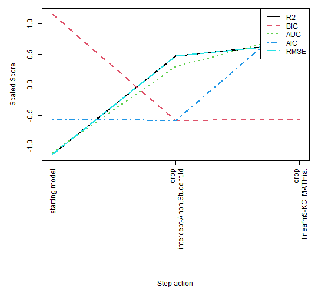
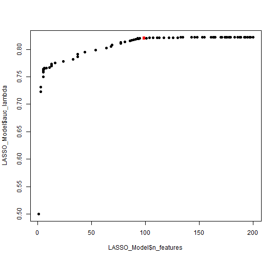

```r
knitr::opts_chunk$set(
  collapse = TRUE,
  comment = "#>",
  fig.width=7.5,
  fig.path = "vigfig-"
)
    library(LKT)
    library(ggplot2)
# precomputed as per https://ropensci.org/blog/2019/12/08/precompute-vignettes/
```


# Load data
Get the full data if needed:

<a href="https://pslcdatashop.web.cmu.edu/DatasetInfo?datasetId=5513" class="uri">https://pslcdatashop.web.cmu.edu/DatasetInfo?datasetId=5513</a>


```r
    val<-largerawsample

    #clean it up
    val$KC..Default.<-val$Problem.Name
    # make it a datatable
    val= setDT(val)

    #make unstratified folds for crossvaldiations
    val$fold<-sample(1:4,length(val$Anon.Student.Id),replace=T)

    # get the times of each trial in seconds from 1970
    val$CF..Time.<-as.numeric(as.POSIXct(as.character(val$Time),format="%Y-%m-%d %H:%M:%S"))

    #make sure it is ordered in the way the code expects
    val<-val[order(val$Anon.Student.Id, val$CF..Time.),]

    #create a binary response column to predict and extract only data with a valid value
    val$CF..ansbin.<-ifelse(tolower(val$Outcome)=="correct",1,ifelse(tolower(val$Outcome)=="incorrect",0,-1))
    val<-val[val$CF..ansbin==0 | val$CF..ansbin.==1,]

    # create durations
    val$Duration..sec.<-(val$CF..End.Latency.+val$CF..Review.Latency.+500)/1000

    # this function needs times and durations but you don't need it if you don't want to model time effects
    val <- computeSpacingPredictors(val, "KC..Default.") #allows recency, spacing, forgetting features to run
    val <- computeSpacingPredictors(val, "KC..Cluster.") #allows recency, spacing, forgetting features to run
    val <- computeSpacingPredictors(val, "Anon.Student.Id") #allows recency, spacing, forgetting features to run

    val <- computeSpacingPredictors(val, "CF..Correct.Answer.") #allows recency, spacing, forgetting features to run
```

# Additive Factors Model (AFM) fixed effect version

```r
    modelob <- LKT(
      data = val, interc=FALSE,
      components = c("Anon.Student.Id","KC..Default.","KC..Default."),
      features = c("intercept", "intercept", "lineafm"))
#> intercept Anon.Student.Id      
#> intercept KC..Default.      
#> lineafm KC..Default.      
#> lineafmKC..Default.+interceptKC..Default.+interceptAnon.Student.Id+0 
#> McFadden's R2 logistic: 0.280024 
#> LogLike logistic: -27347.20717315
```


# Performance Factors Analysis (PFA) fixed effect version

```r
   system.time( modelob <- LKT(
      data = val, interc=TRUE,
      components = c("Anon.Student.Id", "KC..Default.", "KC..Default.", "KC..Default."),
      features = c("intercept", "intercept", "linesuc$","linefail$")))
#> intercept Anon.Student.Id      
#> intercept KC..Default.      
#> linesuc$ KC..Default.      
#> linefail$ KC..Default.      
#> linefailKC..Default.:e$data$KC..Default.+linesucKC..Default.:e$data$KC..Default.+interceptKC..Default.+interceptAnon.Student.Id+1 
#> McFadden's R2 logistic: 0.295228 
#> LogLike logistic: -26769.69416527
#>    user  system elapsed 
#>    0.12    0.02    0.64
```

# PFA using difficulty sensitive predictors (composite model requiring pred from prior model)

```r
    modelob <- LKT(
      data = val, interc=TRUE,
      components = c("Anon.Student.Id", "KC..Default.", "KC..Default.", "KC..Default."),
      features = c("intercept", "intercept", "linesuc$","linefail$"))
#> intercept Anon.Student.Id      
#> intercept KC..Default.      
#> linesuc$ KC..Default.      
#> linefail$ KC..Default.      
#> linefailKC..Default.:e$data$KC..Default.+linesucKC..Default.:e$data$KC..Default.+interceptKC..Default.+interceptAnon.Student.Id+1 
#> McFadden's R2 logistic: 0.295228 
#> LogLike logistic: -26769.69416527
    # have to have prior predictions in data to do the next model in and adaptive system
    #   this needs to be added to the data wth a first moodel like this
    val$pred<-modelob$prediction

    modelob <- LKT(
      data = val, interc=TRUE,
      components = c("Anon.Student.Id", "KC..Default.", "KC..Default.", "KC..Default."),
      features = c("intercept", "intercept", "diffcorComp","linefail"))
#> intercept Anon.Student.Id      
#> intercept KC..Default.      
#> diffcorComp KC..Default.      
#> linefail KC..Default.      
#> linefailKC..Default.+diffcorCompKC..Default.+interceptKC..Default.+interceptAnon.Student.Id+1 
#> McFadden's R2 logistic: 0.283896 
#> LogLike logistic: -27200.1075776
```

# Recent Performance Factors Analysis (RPFA)

```r
    modelob <- LKT(
      data = val, interc=TRUE,
      components = c("Anon.Student.Id", "KC..Default.", "KC..Default.", "KC..Default."),
      features = c("intercept", "intercept", "propdec2","linefail"),
      fixedpars=c(.9))
#> intercept Anon.Student.Id      
#> intercept KC..Default.      
#> propdec2 KC..Default. 0.9     
#> linefail KC..Default.      
#> linefailKC..Default.+propdec2KC..Default.+interceptKC..Default.+interceptAnon.Student.Id+1 
#> McFadden's R2 logistic: 0.303338 
#> LogLike logistic: -26461.64298933
```

# Recency tracing with logitdec

```r
    modelob <- LKT(
      data = val, interc=TRUE,
      components = c("Anon.Student.Id", "KC..Default.", "KC..Default.", "KC..Default."),
      features = c("intercept", "intercept", "logitdec","recency"),
      fixedpars=c(.9,.5))
#> intercept Anon.Student.Id      
#> intercept KC..Default.      
#> logitdec KC..Default. 0.9     
#> recency KC..Default. 0.5     
#> recencyKC..Default.+logitdecKC..Default.+interceptKC..Default.+interceptAnon.Student.Id+1 
#> McFadden's R2 logistic: 0.329326 
#> LogLike logistic: -25474.531261
```

# Recency tracing with logitdec and transfer from cluster

```r

system.time( modelob <- LKT(
      data = val, interc=TRUE,
      components = c("Anon.Student.Id", "KC..Default.", "KC..Default.", "KC..Default.","KC..Cluster."),
      features = c("intercept", "intercept", "logitdec","recency","logitdec"),
      seedpars=c(.9,.5,.5)))
#> intercept Anon.Student.Id      
#> intercept KC..Default.      
#> logitdec KC..Default. 0.9     
#> recency KC..Default. 0.5     
#> logitdec KC..Cluster. 0.5     
#> logitdecKC..Cluster.+recencyKC..Default.+logitdecKC..Default.+interceptKC..Default.+interceptAnon.Student.Id+1 
#> McFadden's R2 logistic: 0.329987 
#> LogLike logistic: -25449.41954064 
#> step par values =0.9,0.5,0.5
#> 
#> intercept Anon.Student.Id      
#> intercept KC..Default.      
#> logitdec KC..Default. 0.901     
#> recency KC..Default. 0.5     
#> logitdec KC..Cluster. 0.5     
#> logitdecKC..Cluster.+recencyKC..Default.+logitdecKC..Default.+interceptKC..Default.+interceptAnon.Student.Id+1 
#> McFadden's R2 logistic: 0.329977 
#> LogLike logistic: -25449.81080839 
#> step par values =0.901,0.5,0.5
#> 
#> intercept Anon.Student.Id      
#> intercept KC..Default.      
#> logitdec KC..Default. 0.899     
#> recency KC..Default. 0.5     
#> logitdec KC..Cluster. 0.5     
#> logitdecKC..Cluster.+recencyKC..Default.+logitdecKC..Default.+interceptKC..Default.+interceptAnon.Student.Id+1 
#> McFadden's R2 logistic: 0.329997 
#> LogLike logistic: -25449.02834548 
#> step par values =0.899,0.5,0.5
#> 
#> intercept Anon.Student.Id      
#> intercept KC..Default.      
#> logitdec KC..Default. 0.9     
#> recency KC..Default. 0.501     
#> logitdec KC..Cluster. 0.5     
#> logitdecKC..Cluster.+recencyKC..Default.+logitdecKC..Default.+interceptKC..Default.+interceptAnon.Student.Id+1 
#> McFadden's R2 logistic: 0.329913 
#> LogLike logistic: -25452.23946619 
#> step par values =0.9,0.501,0.5
#> 
#> intercept Anon.Student.Id      
#> intercept KC..Default.      
#> logitdec KC..Default. 0.9     
#> recency KC..Default. 0.499     
#> logitdec KC..Cluster. 0.5     
#> logitdecKC..Cluster.+recencyKC..Default.+logitdecKC..Default.+interceptKC..Default.+interceptAnon.Student.Id+1 
#> McFadden's R2 logistic: 0.330061 
#> LogLike logistic: -25446.60538055 
#> step par values =0.9,0.499,0.5
#> 
#> intercept Anon.Student.Id      
#> intercept KC..Default.      
#> logitdec KC..Default. 0.9     
#> recency KC..Default. 0.5     
#> logitdec KC..Cluster. 0.501     
#> logitdecKC..Cluster.+recencyKC..Default.+logitdecKC..Default.+interceptKC..Default.+interceptAnon.Student.Id+1 
#> McFadden's R2 logistic: 0.329986 
#> LogLike logistic: -25449.46877345 
#> step par values =0.9,0.5,0.501
#> 
#> intercept Anon.Student.Id      
#> intercept KC..Default.      
#> logitdec KC..Default. 0.9     
#> recency KC..Default. 0.5     
#> logitdec KC..Cluster. 0.499     
#> logitdecKC..Cluster.+recencyKC..Default.+logitdecKC..Default.+interceptKC..Default.+interceptAnon.Student.Id+1 
#> McFadden's R2 logistic: 0.329988 
#> LogLike logistic: -25449.37047102 
#> step par values =0.9,0.5,0.499
#> 
#> intercept Anon.Student.Id      
#> intercept KC..Default.      
#> logitdec KC..Default. 1e-05     
#> recency KC..Default. 1e-05     
#> logitdec KC..Cluster. 1e-05     
#> logitdecKC..Cluster.+recencyKC..Default.+logitdecKC..Default.+interceptKC..Default.+interceptAnon.Student.Id+1 
#> McFadden's R2 logistic: 0.318382 
#> LogLike logistic: -25890.22816729 
#> step par values =1e-05,1e-05,1e-05
#> 
#> intercept Anon.Student.Id      
#> intercept KC..Default.      
#> logitdec KC..Default. 0.00101     
#> recency KC..Default. 1e-05     
#> logitdec KC..Cluster. 1e-05     
#> logitdecKC..Cluster.+recencyKC..Default.+logitdecKC..Default.+interceptKC..Default.+interceptAnon.Student.Id+1 
#> McFadden's R2 logistic: 0.318506 
#> LogLike logistic: -25885.50736546 
#> step par values =0.00101,1e-05,1e-05
#> 
#> intercept Anon.Student.Id      
#> intercept KC..Default.      
#> logitdec KC..Default. 1e-05     
#> recency KC..Default. 1e-05     
#> logitdec KC..Cluster. 1e-05     
#> logitdecKC..Cluster.+recencyKC..Default.+logitdecKC..Default.+interceptKC..Default.+interceptAnon.Student.Id+1 
#> McFadden's R2 logistic: 0.318382 
#> LogLike logistic: -25890.22816729 
#> step par values =1e-05,1e-05,1e-05
#> 
#> intercept Anon.Student.Id      
#> intercept KC..Default.      
#> logitdec KC..Default. 1e-05     
#> recency KC..Default. 0.00101     
#> logitdec KC..Cluster. 1e-05     
#> logitdecKC..Cluster.+recencyKC..Default.+logitdecKC..Default.+interceptKC..Default.+interceptAnon.Student.Id+1 
#> McFadden's R2 logistic: 0.318741 
#> LogLike logistic: -25876.56791314 
#> step par values =1e-05,0.00101,1e-05
#> 
#> intercept Anon.Student.Id      
#> intercept KC..Default.      
#> logitdec KC..Default. 1e-05     
#> recency KC..Default. 1e-05     
#> logitdec KC..Cluster. 1e-05     
#> logitdecKC..Cluster.+recencyKC..Default.+logitdecKC..Default.+interceptKC..Default.+interceptAnon.Student.Id+1 
#> McFadden's R2 logistic: 0.318382 
#> LogLike logistic: -25890.22816729 
#> step par values =1e-05,1e-05,1e-05
#> 
#> intercept Anon.Student.Id      
#> intercept KC..Default.      
#> logitdec KC..Default. 1e-05     
#> recency KC..Default. 1e-05     
#> logitdec KC..Cluster. 0.00101     
#> logitdecKC..Cluster.+recencyKC..Default.+logitdecKC..Default.+interceptKC..Default.+interceptAnon.Student.Id+1 
#> McFadden's R2 logistic: 0.318506 
#> LogLike logistic: -25885.52891325 
#> step par values =1e-05,1e-05,0.00101
#> 
#> intercept Anon.Student.Id      
#> intercept KC..Default.      
#> logitdec KC..Default. 1e-05     
#> recency KC..Default. 1e-05     
#> logitdec KC..Cluster. 1e-05     
#> logitdecKC..Cluster.+recencyKC..Default.+logitdecKC..Default.+interceptKC..Default.+interceptAnon.Student.Id+1 
#> McFadden's R2 logistic: 0.318382 
#> LogLike logistic: -25890.22816729 
#> step par values =1e-05,1e-05,1e-05
#> 
#> intercept Anon.Student.Id      
#> intercept KC..Default.      
#> logitdec KC..Default. 0.441366149890742     
#> recency KC..Default. 0.245205681489652     
#> logitdec KC..Cluster. 0.245205681489652     
#> logitdecKC..Cluster.+recencyKC..Default.+logitdecKC..Default.+interceptKC..Default.+interceptAnon.Student.Id+1 
#> McFadden's R2 logistic: 0.344687 
#> LogLike logistic: -24891.06093568 
#> step par values =0.4413661,0.2452057,0.2452057
#> 
#> intercept Anon.Student.Id      
#> intercept KC..Default.      
#> logitdec KC..Default. 0.442366149890742     
#> recency KC..Default. 0.245205681489652     
#> logitdec KC..Cluster. 0.245205681489652     
#> logitdecKC..Cluster.+recencyKC..Default.+logitdecKC..Default.+interceptKC..Default.+interceptAnon.Student.Id+1 
#> McFadden's R2 logistic: 0.344687 
#> LogLike logistic: -24891.06983296 
#> step par values =0.4423661,0.2452057,0.2452057
#> 
#> intercept Anon.Student.Id      
#> intercept KC..Default.      
#> logitdec KC..Default. 0.440366149890742     
#> recency KC..Default. 0.245205681489652     
#> logitdec KC..Cluster. 0.245205681489652     
#> logitdecKC..Cluster.+recencyKC..Default.+logitdecKC..Default.+interceptKC..Default.+interceptAnon.Student.Id+1 
#> McFadden's R2 logistic: 0.344688 
#> LogLike logistic: -24891.03996834 
#> step par values =0.4403661,0.2452057,0.2452057
#> 
#> intercept Anon.Student.Id      
#> intercept KC..Default.      
#> logitdec KC..Default. 0.441366149890742     
#> recency KC..Default. 0.246205681489652     
#> logitdec KC..Cluster. 0.245205681489652     
#> logitdecKC..Cluster.+recencyKC..Default.+logitdecKC..Default.+interceptKC..Default.+interceptAnon.Student.Id+1 
#> McFadden's R2 logistic: 0.344675 
#> LogLike logistic: -24891.53087155 
#> step par values =0.4413661,0.2462057,0.2452057
#> 
#> intercept Anon.Student.Id      
#> intercept KC..Default.      
#> logitdec KC..Default. 0.441366149890742     
#> recency KC..Default. 0.244205681489652     
#> logitdec KC..Cluster. 0.245205681489652     
#> logitdecKC..Cluster.+recencyKC..Default.+logitdecKC..Default.+interceptKC..Default.+interceptAnon.Student.Id+1 
#> McFadden's R2 logistic: 0.344699 
#> LogLike logistic: -24890.60058623 
#> step par values =0.4413661,0.2442057,0.2452057
#> 
#> intercept Anon.Student.Id      
#> intercept KC..Default.      
#> logitdec KC..Default. 0.441366149890742     
#> recency KC..Default. 0.245205681489652     
#> logitdec KC..Cluster. 0.246205681489652     
#> logitdecKC..Cluster.+recencyKC..Default.+logitdecKC..Default.+interceptKC..Default.+interceptAnon.Student.Id+1 
#> McFadden's R2 logistic: 0.344687 
#> LogLike logistic: -24891.06467701 
#> step par values =0.4413661,0.2452057,0.2462057
#> 
#> intercept Anon.Student.Id      
#> intercept KC..Default.      
#> logitdec KC..Default. 0.441366149890742     
#> recency KC..Default. 0.245205681489652     
#> logitdec KC..Cluster. 0.244205681489652     
#> logitdecKC..Cluster.+recencyKC..Default.+logitdecKC..Default.+interceptKC..Default.+interceptAnon.Student.Id+1 
#> McFadden's R2 logistic: 0.344687 
#> LogLike logistic: -24891.06400592 
#> step par values =0.4413661,0.2452057,0.2442057
#> 
#> intercept Anon.Student.Id      
#> intercept KC..Default.      
#> logitdec KC..Default. 0.389756914945108     
#> recency KC..Default. 0.200769131142826     
#> logitdec KC..Cluster. 0.214092229386193     
#> logitdecKC..Cluster.+recencyKC..Default.+logitdecKC..Default.+interceptKC..Default.+interceptAnon.Student.Id+1 
#> McFadden's R2 logistic: 0.344834 
#> LogLike logistic: -24885.49599701 
#> step par values =0.3897569,0.2007691,0.2140922
#> 
#> intercept Anon.Student.Id      
#> intercept KC..Default.      
#> logitdec KC..Default. 0.390756914945108     
#> recency KC..Default. 0.200769131142826     
#> logitdec KC..Cluster. 0.214092229386193     
#> logitdecKC..Cluster.+recencyKC..Default.+logitdecKC..Default.+interceptKC..Default.+interceptAnon.Student.Id+1 
#> McFadden's R2 logistic: 0.344834 
#> LogLike logistic: -24885.487454 
#> step par values =0.3907569,0.2007691,0.2140922
#> 
#> intercept Anon.Student.Id      
#> intercept KC..Default.      
#> logitdec KC..Default. 0.388756914945108     
#> recency KC..Default. 0.200769131142826     
#> logitdec KC..Cluster. 0.214092229386193     
#> logitdecKC..Cluster.+recencyKC..Default.+logitdecKC..Default.+interceptKC..Default.+interceptAnon.Student.Id+1 
#> McFadden's R2 logistic: 0.344833 
#> LogLike logistic: -24885.51321323 
#> step par values =0.3887569,0.2007691,0.2140922
#> 
#> intercept Anon.Student.Id      
#> intercept KC..Default.      
#> logitdec KC..Default. 0.389756914945108     
#> recency KC..Default. 0.201769131142826     
#> logitdec KC..Cluster. 0.214092229386193     
#> logitdecKC..Cluster.+recencyKC..Default.+logitdecKC..Default.+interceptKC..Default.+interceptAnon.Student.Id+1 
#> McFadden's R2 logistic: 0.344841 
#> LogLike logistic: -24885.21274669 
#> step par values =0.3897569,0.2017691,0.2140922
#> 
#> intercept Anon.Student.Id      
#> intercept KC..Default.      
#> logitdec KC..Default. 0.389756914945108     
#> recency KC..Default. 0.199769131142826     
#> logitdec KC..Cluster. 0.214092229386193     
#> logitdecKC..Cluster.+recencyKC..Default.+logitdecKC..Default.+interceptKC..Default.+interceptAnon.Student.Id+1 
#> McFadden's R2 logistic: 0.344826 
#> LogLike logistic: -24885.76919365 
#> step par values =0.3897569,0.1997691,0.2140922
#> 
#> intercept Anon.Student.Id      
#> intercept KC..Default.      
#> logitdec KC..Default. 0.389756914945108     
#> recency KC..Default. 0.200769131142826     
#> logitdec KC..Cluster. 0.215092229386193     
#> logitdecKC..Cluster.+recencyKC..Default.+logitdecKC..Default.+interceptKC..Default.+interceptAnon.Student.Id+1 
#> McFadden's R2 logistic: 0.344834 
#> LogLike logistic: -24885.5007142 
#> step par values =0.3897569,0.2007691,0.2150922
#> 
#> intercept Anon.Student.Id      
#> intercept KC..Default.      
#> logitdec KC..Default. 0.389756914945108     
#> recency KC..Default. 0.200769131142826     
#> logitdec KC..Cluster. 0.213092229386193     
#> logitdecKC..Cluster.+recencyKC..Default.+logitdecKC..Default.+interceptKC..Default.+interceptAnon.Student.Id+1 
#> McFadden's R2 logistic: 0.344834 
#> LogLike logistic: -24885.49426811 
#> step par values =0.3897569,0.2007691,0.2130922
#> 
#> intercept Anon.Student.Id      
#> intercept KC..Default.      
#> logitdec KC..Default. 0.409535338102708     
#> recency KC..Default. 0.217465343197608     
#> logitdec KC..Cluster. 0.225782587786208     
#> logitdecKC..Cluster.+recencyKC..Default.+logitdecKC..Default.+interceptKC..Default.+interceptAnon.Student.Id+1 
#> McFadden's R2 logistic: 0.344884 
#> LogLike logistic: -24883.57554021 
#> step par values =0.4095353,0.2174653,0.2257826
#> 
#> intercept Anon.Student.Id      
#> intercept KC..Default.      
#> logitdec KC..Default. 0.410535338102708     
#> recency KC..Default. 0.217465343197608     
#> logitdec KC..Cluster. 0.225782587786208     
#> logitdecKC..Cluster.+recencyKC..Default.+logitdecKC..Default.+interceptKC..Default.+interceptAnon.Student.Id+1 
#> McFadden's R2 logistic: 0.344884 
#> LogLike logistic: -24883.5679621 
#> step par values =0.4105353,0.2174653,0.2257826
#> 
#> intercept Anon.Student.Id      
#> intercept KC..Default.      
#> logitdec KC..Default. 0.408535338102708     
#> recency KC..Default. 0.217465343197608     
#> logitdec KC..Cluster. 0.225782587786208     
#> logitdecKC..Cluster.+recencyKC..Default.+logitdecKC..Default.+interceptKC..Default.+interceptAnon.Student.Id+1 
#> McFadden's R2 logistic: 0.344885 
#> LogLike logistic: -24883.55264071 
#> step par values =0.4085353,0.2174653,0.2257826
#> 
#> intercept Anon.Student.Id      
#> intercept KC..Default.      
#> logitdec KC..Default. 0.409535338102708     
#> recency KC..Default. 0.218465343197608     
#> logitdec KC..Cluster. 0.225782587786208     
#> logitdecKC..Cluster.+recencyKC..Default.+logitdecKC..Default.+interceptKC..Default.+interceptAnon.Student.Id+1 
#> McFadden's R2 logistic: 0.344883 
#> LogLike logistic: -24883.62700272 
#> step par values =0.4095353,0.2184653,0.2257826
#> 
#> intercept Anon.Student.Id      
#> intercept KC..Default.      
#> logitdec KC..Default. 0.409535338102708     
#> recency KC..Default. 0.216465343197608     
#> logitdec KC..Cluster. 0.225782587786208     
#> logitdecKC..Cluster.+recencyKC..Default.+logitdecKC..Default.+interceptKC..Default.+interceptAnon.Student.Id+1 
#> McFadden's R2 logistic: 0.344885 
#> LogLike logistic: -24883.53643197 
#> step par values =0.4095353,0.2164653,0.2257826
#> 
#> intercept Anon.Student.Id      
#> intercept KC..Default.      
#> logitdec KC..Default. 0.409535338102708     
#> recency KC..Default. 0.217465343197608     
#> logitdec KC..Cluster. 0.226782587786208     
#> logitdecKC..Cluster.+recencyKC..Default.+logitdecKC..Default.+interceptKC..Default.+interceptAnon.Student.Id+1 
#> McFadden's R2 logistic: 0.344884 
#> LogLike logistic: -24883.57543528 
#> step par values =0.4095353,0.2174653,0.2267826
#> 
#> intercept Anon.Student.Id      
#> intercept KC..Default.      
#> logitdec KC..Default. 0.409535338102708     
#> recency KC..Default. 0.217465343197608     
#> logitdec KC..Cluster. 0.224782587786208     
#> logitdecKC..Cluster.+recencyKC..Default.+logitdecKC..Default.+interceptKC..Default.+interceptAnon.Student.Id+1 
#> McFadden's R2 logistic: 0.344884 
#> LogLike logistic: -24883.5736715 
#> step par values =0.4095353,0.2174653,0.2247826
#>    user  system elapsed 
#>   17.10    0.39   59.62
```

# Performance Prediction Equation (PPE)

```r
    modelob <- LKT(
      data = val, interc=TRUE,
      components = c("Anon.Student.Id", "KC..Default.", "KC..Default.", "KC..Default."),
      features = c("intercept", "intercept", "ppe","logitdec"),
      seedpars=c(0.3491901,0.2045801,1e-05,0.9734477,0.4443027))
#> intercept Anon.Student.Id      
#> intercept KC..Default.      
#> ppe KC..Default. 0.3491901 0.2045801 1e-05 0.9734477  
#> logitdec KC..Default. 0.4443027     
#> logitdecKC..Default.+ppeKC..Default.+interceptKC..Default.+interceptAnon.Student.Id+1 
#> McFadden's R2 logistic: 0.349833 
#> LogLike logistic: -24695.58586047 
#> step par values =0.3491901,0.2045801,1e-05,0.9734477,0.4443027
#> 
#> intercept Anon.Student.Id      
#> intercept KC..Default.      
#> ppe KC..Default. 0.3501901 0.2045801 1e-05 0.9734477  
#> logitdec KC..Default. 0.4443027     
#> logitdecKC..Default.+ppeKC..Default.+interceptKC..Default.+interceptAnon.Student.Id+1 
#> McFadden's R2 logistic: 0.349833 
#> LogLike logistic: -24695.58950258 
#> step par values =0.3501901,0.2045801,1e-05,0.9734477,0.4443027
#> 
#> intercept Anon.Student.Id      
#> intercept KC..Default.      
#> ppe KC..Default. 0.3481901 0.2045801 1e-05 0.9734477  
#> logitdec KC..Default. 0.4443027     
#> logitdecKC..Default.+ppeKC..Default.+interceptKC..Default.+interceptAnon.Student.Id+1 
#> McFadden's R2 logistic: 0.349833 
#> LogLike logistic: -24695.59047605 
#> step par values =0.3481901,0.2045801,1e-05,0.9734477,0.4443027
#> 
#> intercept Anon.Student.Id      
#> intercept KC..Default.      
#> ppe KC..Default. 0.3491901 0.2055801 1e-05 0.9734477  
#> logitdec KC..Default. 0.4443027     
#> logitdecKC..Default.+ppeKC..Default.+interceptKC..Default.+interceptAnon.Student.Id+1 
#> McFadden's R2 logistic: 0.349835 
#> LogLike logistic: -24695.53272192 
#> step par values =0.3491901,0.2055801,1e-05,0.9734477,0.4443027
#> 
#> intercept Anon.Student.Id      
#> intercept KC..Default.      
#> ppe KC..Default. 0.3491901 0.2035801 1e-05 0.9734477  
#> logitdec KC..Default. 0.4443027     
#> logitdecKC..Default.+ppeKC..Default.+interceptKC..Default.+interceptAnon.Student.Id+1 
#> McFadden's R2 logistic: 0.349831 
#> LogLike logistic: -24695.66260801 
#> step par values =0.3491901,0.2035801,1e-05,0.9734477,0.4443027
#> 
#> intercept Anon.Student.Id      
#> intercept KC..Default.      
#> ppe KC..Default. 0.3491901 0.2045801 0.00101 0.9734477  
#> logitdec KC..Default. 0.4443027     
#> logitdecKC..Default.+ppeKC..Default.+interceptKC..Default.+interceptAnon.Student.Id+1 
#> McFadden's R2 logistic: 0.349831 
#> LogLike logistic: -24695.68181352 
#> step par values =0.3491901,0.2045801,0.00101,0.9734477,0.4443027
#> 
#> intercept Anon.Student.Id      
#> intercept KC..Default.      
#> ppe KC..Default. 0.3491901 0.2045801 1e-05 0.9734477  
#> logitdec KC..Default. 0.4443027     
#> logitdecKC..Default.+ppeKC..Default.+interceptKC..Default.+interceptAnon.Student.Id+1 
#> McFadden's R2 logistic: 0.349833 
#> LogLike logistic: -24695.58586047 
#> step par values =0.3491901,0.2045801,1e-05,0.9734477,0.4443027
#> 
#> intercept Anon.Student.Id      
#> intercept KC..Default.      
#> ppe KC..Default. 0.3491901 0.2045801 1e-05 0.9744477  
#> logitdec KC..Default. 0.4443027     
#> logitdecKC..Default.+ppeKC..Default.+interceptKC..Default.+interceptAnon.Student.Id+1 
#> McFadden's R2 logistic: 0.349834 
#> LogLike logistic: -24695.58382598 
#> step par values =0.3491901,0.2045801,1e-05,0.9744477,0.4443027
#> 
#> intercept Anon.Student.Id      
#> intercept KC..Default.      
#> ppe KC..Default. 0.3491901 0.2045801 1e-05 0.9724477  
#> logitdec KC..Default. 0.4443027     
#> logitdecKC..Default.+ppeKC..Default.+interceptKC..Default.+interceptAnon.Student.Id+1 
#> McFadden's R2 logistic: 0.349833 
#> LogLike logistic: -24695.58978017 
#> step par values =0.3491901,0.2045801,1e-05,0.9724477,0.4443027
#> 
#> intercept Anon.Student.Id      
#> intercept KC..Default.      
#> ppe KC..Default. 0.3491901 0.2045801 1e-05 0.9734477  
#> logitdec KC..Default. 0.4453027     
#> logitdecKC..Default.+ppeKC..Default.+interceptKC..Default.+interceptAnon.Student.Id+1 
#> McFadden's R2 logistic: 0.349834 
#> LogLike logistic: -24695.56869349 
#> step par values =0.3491901,0.2045801,1e-05,0.9734477,0.4453027
#> 
#> intercept Anon.Student.Id      
#> intercept KC..Default.      
#> ppe KC..Default. 0.3491901 0.2045801 1e-05 0.9734477  
#> logitdec KC..Default. 0.4433027     
#> logitdecKC..Default.+ppeKC..Default.+interceptKC..Default.+interceptAnon.Student.Id+1 
#> McFadden's R2 logistic: 0.349833 
#> LogLike logistic: -24695.60320786 
#> step par values =0.3491901,0.2045801,1e-05,0.9734477,0.4433027
#> 
#> intercept Anon.Student.Id      
#> intercept KC..Default.      
#> ppe KC..Default. 0.835926027552945 0.99999 1e-05 0.99999  
#> logitdec KC..Default. 0.99999     
#> logitdecKC..Default.+ppeKC..Default.+interceptKC..Default.+interceptAnon.Student.Id+1 
#> McFadden's R2 logistic: 0.291707 
#> LogLike logistic: -26903.41541006 
#> step par values =0.835926,0.99999,1e-05,0.99999,0.99999
#> 
#> intercept Anon.Student.Id      
#> intercept KC..Default.      
#> ppe KC..Default. 0.836926027552945 0.99999 1e-05 0.99999  
#> logitdec KC..Default. 0.99999     
#> logitdecKC..Default.+ppeKC..Default.+interceptKC..Default.+interceptAnon.Student.Id+1 
#> McFadden's R2 logistic: 0.291722 
#> LogLike logistic: -26902.84583026 
#> step par values =0.836926,0.99999,1e-05,0.99999,0.99999
#> 
#> intercept Anon.Student.Id      
#> intercept KC..Default.      
#> ppe KC..Default. 0.834926027552945 0.99999 1e-05 0.99999  
#> logitdec KC..Default. 0.99999     
#> logitdecKC..Default.+ppeKC..Default.+interceptKC..Default.+interceptAnon.Student.Id+1 
#> McFadden's R2 logistic: 0.291692 
#> LogLike logistic: -26903.98905839 
#> step par values =0.834926,0.99999,1e-05,0.99999,0.99999
#> 
#> intercept Anon.Student.Id      
#> intercept KC..Default.      
#> ppe KC..Default. 0.835926027552945 0.99999 1e-05 0.99999  
#> logitdec KC..Default. 0.99999     
#> logitdecKC..Default.+ppeKC..Default.+interceptKC..Default.+interceptAnon.Student.Id+1 
#> McFadden's R2 logistic: 0.291707 
#> LogLike logistic: -26903.41541006 
#> step par values =0.835926,0.99999,1e-05,0.99999,0.99999
#> 
#> intercept Anon.Student.Id      
#> intercept KC..Default.      
#> ppe KC..Default. 0.835926027552945 0.99899 1e-05 0.99999  
#> logitdec KC..Default. 0.99999     
#> logitdecKC..Default.+ppeKC..Default.+interceptKC..Default.+interceptAnon.Student.Id+1 
#> McFadden's R2 logistic: 0.2918 
#> LogLike logistic: -26899.91309644 
#> step par values =0.835926,0.99899,1e-05,0.99999,0.99999
#> 
#> intercept Anon.Student.Id      
#> intercept KC..Default.      
#> ppe KC..Default. 0.835926027552945 0.99999 0.00101 0.99999  
#> logitdec KC..Default. 0.99999     
#> logitdecKC..Default.+ppeKC..Default.+interceptKC..Default.+interceptAnon.Student.Id+1 
#> McFadden's R2 logistic: 0.291691 
#> LogLike logistic: -26904.0270239 
#> step par values =0.835926,0.99999,0.00101,0.99999,0.99999
#> 
#> intercept Anon.Student.Id      
#> intercept KC..Default.      
#> ppe KC..Default. 0.835926027552945 0.99999 1e-05 0.99999  
#> logitdec KC..Default. 0.99999     
#> logitdecKC..Default.+ppeKC..Default.+interceptKC..Default.+interceptAnon.Student.Id+1 
#> McFadden's R2 logistic: 0.291707 
#> LogLike logistic: -26903.41541006 
#> step par values =0.835926,0.99999,1e-05,0.99999,0.99999
#> 
#> intercept Anon.Student.Id      
#> intercept KC..Default.      
#> ppe KC..Default. 0.835926027552945 0.99999 1e-05 0.99999  
#> logitdec KC..Default. 0.99999     
#> logitdecKC..Default.+ppeKC..Default.+interceptKC..Default.+interceptAnon.Student.Id+1 
#> McFadden's R2 logistic: 0.291707 
#> LogLike logistic: -26903.41541006 
#> step par values =0.835926,0.99999,1e-05,0.99999,0.99999
#> 
#> intercept Anon.Student.Id      
#> intercept KC..Default.      
#> ppe KC..Default. 0.835926027552945 0.99999 1e-05 0.99899  
#> logitdec KC..Default. 0.99999     
#> logitdecKC..Default.+ppeKC..Default.+interceptKC..Default.+interceptAnon.Student.Id+1 
#> McFadden's R2 logistic: 0.291681 
#> LogLike logistic: -26904.43536891 
#> step par values =0.835926,0.99999,1e-05,0.99899,0.99999
#> 
#> intercept Anon.Student.Id      
#> intercept KC..Default.      
#> ppe KC..Default. 0.835926027552945 0.99999 1e-05 0.99999  
#> logitdec KC..Default. 0.99999     
#> logitdecKC..Default.+ppeKC..Default.+interceptKC..Default.+interceptAnon.Student.Id+1 
#> McFadden's R2 logistic: 0.291707 
#> LogLike logistic: -26903.41541006 
#> step par values =0.835926,0.99999,1e-05,0.99999,0.99999
#> 
#> intercept Anon.Student.Id      
#> intercept KC..Default.      
#> ppe KC..Default. 0.835926027552945 0.99999 1e-05 0.99999  
#> logitdec KC..Default. 0.99899     
#> logitdecKC..Default.+ppeKC..Default.+interceptKC..Default.+interceptAnon.Student.Id+1 
#> McFadden's R2 logistic: 0.291728 
#> LogLike logistic: -26902.65044164 
#> step par values =0.835926,0.99999,1e-05,0.99999,0.99899
#> 
#> intercept Anon.Student.Id      
#> intercept KC..Default.      
#> ppe KC..Default. 0.353110019134152 0.210985919480348 1e-05 0.973661457940897  
#> logitdec KC..Default. 0.4487779177856     
#> logitdecKC..Default.+ppeKC..Default.+interceptKC..Default.+interceptAnon.Student.Id+1 
#> McFadden's R2 logistic: 0.349837 
#> LogLike logistic: -24695.47060232 
#> step par values =0.35311,0.2109859,1e-05,0.9736615,0.4487779
#> 
#> intercept Anon.Student.Id      
#> intercept KC..Default.      
#> ppe KC..Default. 0.354110019134152 0.210985919480348 1e-05 0.973661457940897  
#> logitdec KC..Default. 0.4487779177856     
#> logitdecKC..Default.+ppeKC..Default.+interceptKC..Default.+interceptAnon.Student.Id+1 
#> McFadden's R2 logistic: 0.349836 
#> LogLike logistic: -24695.47294519 
#> step par values =0.35411,0.2109859,1e-05,0.9736615,0.4487779
#> 
#> intercept Anon.Student.Id      
#> intercept KC..Default.      
#> ppe KC..Default. 0.352110019134152 0.210985919480348 1e-05 0.973661457940897  
#> logitdec KC..Default. 0.4487779177856     
#> logitdecKC..Default.+ppeKC..Default.+interceptKC..Default.+interceptAnon.Student.Id+1 
#> McFadden's R2 logistic: 0.349836 
#> LogLike logistic: -24695.47634796 
#> step par values =0.35211,0.2109859,1e-05,0.9736615,0.4487779
#> 
#> intercept Anon.Student.Id      
#> intercept KC..Default.      
#> ppe KC..Default. 0.353110019134152 0.211985919480348 1e-05 0.973661457940897  
#> logitdec KC..Default. 0.4487779177856     
#> logitdecKC..Default.+ppeKC..Default.+interceptKC..Default.+interceptAnon.Student.Id+1 
#> McFadden's R2 logistic: 0.349835 
#> LogLike logistic: -24695.5389326 
#> step par values =0.35311,0.2119859,1e-05,0.9736615,0.4487779
#> 
#> intercept Anon.Student.Id      
#> intercept KC..Default.      
#> ppe KC..Default. 0.353110019134152 0.209985919480348 1e-05 0.973661457940897  
#> logitdec KC..Default. 0.4487779177856     
#> logitdecKC..Default.+ppeKC..Default.+interceptKC..Default.+interceptAnon.Student.Id+1 
#> McFadden's R2 logistic: 0.349837 
#> LogLike logistic: -24695.43482352 
#> step par values =0.35311,0.2099859,1e-05,0.9736615,0.4487779
#> 
#> intercept Anon.Student.Id      
#> intercept KC..Default.      
#> ppe KC..Default. 0.353110019134152 0.210985919480348 0.00101 0.973661457940897  
#> logitdec KC..Default. 0.4487779177856     
#> logitdecKC..Default.+ppeKC..Default.+interceptKC..Default.+interceptAnon.Student.Id+1 
#> McFadden's R2 logistic: 0.349834 
#> LogLike logistic: -24695.57471164 
#> step par values =0.35311,0.2109859,0.00101,0.9736615,0.4487779
#> 
#> intercept Anon.Student.Id      
#> intercept KC..Default.      
#> ppe KC..Default. 0.353110019134152 0.210985919480348 1e-05 0.973661457940897  
#> logitdec KC..Default. 0.4487779177856     
#> logitdecKC..Default.+ppeKC..Default.+interceptKC..Default.+interceptAnon.Student.Id+1 
#> McFadden's R2 logistic: 0.349837 
#> LogLike logistic: -24695.47060232 
#> step par values =0.35311,0.2109859,1e-05,0.9736615,0.4487779
#> 
#> intercept Anon.Student.Id      
#> intercept KC..Default.      
#> ppe KC..Default. 0.353110019134152 0.210985919480348 1e-05 0.974661457940897  
#> logitdec KC..Default. 0.4487779177856     
#> logitdecKC..Default.+ppeKC..Default.+interceptKC..Default.+interceptAnon.Student.Id+1 
#> McFadden's R2 logistic: 0.349837 
#> LogLike logistic: -24695.46040614 
#> step par values =0.35311,0.2109859,1e-05,0.9746615,0.4487779
#> 
#> intercept Anon.Student.Id      
#> intercept KC..Default.      
#> ppe KC..Default. 0.353110019134152 0.210985919480348 1e-05 0.972661457940897  
#> logitdec KC..Default. 0.4487779177856     
#> logitdecKC..Default.+ppeKC..Default.+interceptKC..Default.+interceptAnon.Student.Id+1 
#> McFadden's R2 logistic: 0.349836 
#> LogLike logistic: -24695.48275953 
#> step par values =0.35311,0.2109859,1e-05,0.9726615,0.4487779
#> 
#> intercept Anon.Student.Id      
#> intercept KC..Default.      
#> ppe KC..Default. 0.353110019134152 0.210985919480348 1e-05 0.973661457940897  
#> logitdec KC..Default. 0.4497779177856     
#> logitdecKC..Default.+ppeKC..Default.+interceptKC..Default.+interceptAnon.Student.Id+1 
#> McFadden's R2 logistic: 0.349837 
#> LogLike logistic: -24695.45574688 
#> step par values =0.35311,0.2109859,1e-05,0.9736615,0.4497779
#> 
#> intercept Anon.Student.Id      
#> intercept KC..Default.      
#> ppe KC..Default. 0.353110019134152 0.210985919480348 1e-05 0.973661457940897  
#> logitdec KC..Default. 0.4477779177856     
#> logitdecKC..Default.+ppeKC..Default.+interceptKC..Default.+interceptAnon.Student.Id+1 
#> McFadden's R2 logistic: 0.349836 
#> LogLike logistic: -24695.48562691 
#> step par values =0.35311,0.2109859,1e-05,0.9736615,0.4477779
```

# base4

```r
    modelob <- LKT(
      data = val, interc=TRUE,
      components = c("Anon.Student.Id", "KC..Default.", "KC..Default.", "KC..Default."),
      features = c("intercept", "intercept", "base4","logitdec"),
      fixedpars=c(0.1890747,0.6309054,0.05471752,.5,0.2160748))
#> intercept Anon.Student.Id      
#> intercept KC..Default.      
#> base4 KC..Default. 0.1890747 0.6309054 0.05471752 0.5  
#> logitdec KC..Default. 0.2160748     
#> logitdecKC..Default.+base4KC..Default.+interceptKC..Default.+interceptAnon.Student.Id+1 
#> McFadden's R2 logistic: 0.316408 
#> LogLike logistic: -25965.19745203
```

Using other features #See LKT paper #See computefeatures function in
the main R code for package
<a href="https://github.com/Optimal-Learning-Lab/LKT/blob/master/R/LKTfunctions.R" class="uri">https://github.com/Optimal-Learning-Lab/LKT/blob/master/R/LKTfunctions.R</a>


# Simple interactions

```r
    modelob <- LKT(
      data = val, interc=TRUE,
      components = c("Anon.Student.Id","KC..Default.","KC..Default."),
      features = c("logitdec", "logitdec", "lineafm"),fixedpars=c(.9,.8),
      interacts = c(NA,NA,"Level..Unitname."))
#> logitdec Anon.Student.Id 0.9     
#> logitdec KC..Default. 0.8     
#> lineafm KC..Default.      
#> lineafmKC..Default.:Level..Unitname.+logitdecKC..Default.+logitdecAnon.Student.Id+1 
#> McFadden's R2 logistic: 0.187931 
#> LogLike logistic: -30845.19646772
```

# Individualized Additive Factors Model (iAFM) fixed effect version

```r
    modelob <- LKT(
      data = val, interc=TRUE,
      components = c("Anon.Student.Id","KC..Default.","KC..Default.","KC..Default."),
      features = c("intercept", "intercept", "lineafm$","lineafm"),
      interacts = c(NA,NA,NA,"Anon.Student.Id"))
#> intercept Anon.Student.Id      
#> intercept KC..Default.      
#> lineafm$ KC..Default.      
#> lineafm KC..Default.      
#> lineafmKC..Default.:Anon.Student.Id+lineafmKC..Default.:e$data$KC..Default.+interceptKC..Default.+interceptAnon.Student.Id+1 
#> McFadden's R2 logistic: 0.309291 
#> LogLike logistic: -26235.52232195
```

# Crossvalidation

```r
# make student stratified folds (for crossvalidation for unseen population)
    # unq = sample(unique(val$Anon.Student.Id))
    # sfold = rep(1:5,length.out=length(unq))
    # val$fold = rep(0,length(val[,1]))
    # for(i in 1:5){val$fold[which(val$Anon.Student.Id %in% unq[which(sfold==i)])]=i}

    #simple AFM minus student intercept
    modelob <- LKT(
      data = val, interc=TRUE,
      components = c("KC..Default.","KC..Default."),
      features = c("intercept", "lineafm"),
      cv = TRUE)
#> intercept KC..Default.      
#> lineafm KC..Default.      
#> lineafmKC..Default.+interceptKC..Default.+1 
#> McFadden's R2 logistic: 0.18081 
#> LogLike logistic: -31115.68435931
    mean(modelob$cv_res$mcfad)
#> [1] 0.178927

    #complex AFM minus student intercept
    modelob <- LKT(
      data = val, interc=TRUE,
      components = c("KC..Default.","KC..Default."),
      features = c("intercept$", "lineafm$"),
      cv = TRUE)
#> intercept$ KC..Default.      
#> lineafm$ KC..Default.      
#> lineafmKC..Default.:e$data$KC..Default.+interceptKC..Default.:e$data$KC..Default.+1 
#> McFadden's R2 logistic: 0.189298 
#> LogLike logistic: -30793.28958174
    mean(modelob$cv_res$mcfad)
#> [1] 0.1842885
```

# Connectors (another way to do interactions)

```r
    modelob <- LKT(
      data = val, interc=TRUE,
      connectors = c("+","*"),
      components = c("Anon.Student.Id", "KC..Default.", "KC..Default."),
      features = c("logitdec", "logitdec$", "lineafm$"),
      fixedpars = c(.9, .85) )
#> logitdec Anon.Student.Id 0.9     
#> logitdec$ KC..Default. 0.85     
#> lineafm$ KC..Default.      
#> lineafmKC..Default.:e$data$KC..Default.*logitdecKC..Default.:e$data$KC..Default.+logitdecAnon.Student.Id+1 
#> McFadden's R2 logistic: 0.214132 
#> LogLike logistic: -29849.99089373
```

# AutoKC

```r

mnames<-c("IRT",
          "Faculty",
          "Log Full autoKC",
          "Log Simple PFA",
          "Log Full PFA",
          "Log Full PFA full autoKC additive",
          "Log Full PFA Faculty additive ",
          "Log Simple PFA Faculty interactive ",
          "Log Simple PFA full autoKC interactive",
          "Log Full PFA simple autoKC interactive",
          "Log Simple PFA simple autoKC interactive")
r2s<-data.frame(name=mnames,r2s=NA,cvr2s=NA)
compl<-list(c("Anon.Student.Id","KC..Default."),
            c("Anon.Student.Id","KC..Default.", "Anon.Student.Id", "Anon.Student.Id"),
            c("Anon.Student.Id","KC..Default.", "KC..Default.", "KC..Default."),
            c("Anon.Student.Id","KC..Default.", "KC..Default.", "KC..Default."),
            c("Anon.Student.Id","KC..Default.", "KC..Default.", "KC..Default."),
            c("Anon.Student.Id","KC..Default.", "KC..Default.", "KC..Default." ,"KC..Default." ,"KC..Default."),
            c("Anon.Student.Id","KC..Default.", "KC..Default.","Anon.Student.Id", "KC..Default."  ,"Anon.Student.Id"),
            c("Anon.Student.Id","KC..Default.", "KC..Default.","Anon.Student.Id", "KC..Default."  ,"Anon.Student.Id"),
            c("Anon.Student.Id","KC..Default.", "KC..Default.", "KC..Default." ,"KC..Default." ,"KC..Default."),
            c("Anon.Student.Id","KC..Default.", "KC..Default.", "KC..Default." ,"KC..Default." ,"KC..Default."),
            c("Anon.Student.Id","KC..Default.", "KC..Default.", "KC..Default." ,"KC..Default." ,"KC..Default."))
featl<-list(c("intercept","intercept"),
            c("intercept","intercept",  "logfail",  "logsuc"),
            c("intercept","intercept",  "logfail$",  "logsuc$"),
            c("intercept","intercept",  "logfail", "logsuc"),
            c("intercept","intercept",  "logfail$", "logsuc$"),
            c("intercept","intercept",  "logfail$", "logfail$", "logsuc$", "logsuc$"),
            c("intercept","intercept",  "logfail$", "logfail", "logsuc$", "logsuc"),
            c("intercept","intercept",  "logfail", "logfail", "logsuc", "logsuc"),
            c("intercept","intercept",  "logfail", "logfail$", "logsuc", "logsuc$"),
            c("intercept","intercept",  "logfail$", "logfail", "logsuc$", "logsuc"),
            c("intercept","intercept",  "logfail", "logfail", "logsuc", "logsuc"))
connl<-list(c("+"),
            c("+","+","+"),
            c("+","+","+"),
            c("+","+","+"),
            c("+","+","+"),
            c("+","+","+","+","+"),
            c("+","+","+","+","+"),
            c("+","+","*","+","*"),
            c("+","+","*","+","*"),
            c("+","+","*","+","*"),
            c("+","+","*","+","*"))
autol <- list(c(0,0),
              c(0,0,0,0),
              c(0,0,40,40),
              c(0,0,0,0),
              c(0,0,0,0),
              c(0,0,0,40,0,40),
              c(0,0,0,0,0,0),
              c(0,0,0,0,0,0),
              c(0,0,0,40,0,40),
              c(0,0,0,40,0,40),
              c(0,0,0,40,0,40))
for(i in 1:length(compl)){
  modelob <<- LKT(data = val,components = compl[[i]],features = featl[[i]],connectors = connl[[i]],autoKC = autol[[i]],
                  cv=TRUE,verbose = FALSE)
  cat(mnames[i]," R2cv =  ",mean(modelob$cv_res$mcfad))
  cat(" R2 =  ",modelob$r2,"\n")
  r2s$r2s[i]<-modelob$r2
  r2s$cvr2s[i]<-mean(modelob$cv_res$mcfad)
}
#> IRT  R2cv =   0.1585162 R2 =   0.17526 
#> Faculty  R2cv =   0.1764075 R2 =   0.193067 
#> Log Full autoKC  R2cv =   0.2567767 R2 =   0.276453 
#> Log Simple PFA  R2cv =   0.2883458 R2 =   0.305306 
#> Log Full PFA  R2cv =   0.2950098 R2 =   0.317028 
#> Log Full PFA full autoKC additive  R2cv =   0.3004108 R2 =   0.323463 
#> Log Full PFA Faculty additive   R2cv =   0.2959355 R2 =   0.318007 
#> Log Simple PFA Faculty interactive   R2cv =   0.3107595 R2 =   0.327941 
#> Log Simple PFA full autoKC interactive  R2cv =   0.309855 R2 =   0.333046 
#> Log Full PFA simple autoKC interactive  R2cv =   0.3087675 R2 =   0.336243 
#> Log Simple PFA simple autoKC interactive  R2cv =   0.299072 R2 =   0.316213

r2s$cvr2s<-r2s$cvr2s-min(r2s$cvr2s)
r2s$name <- factor(r2s$name,levels = rev(mnames))
plot<-ggplot(r2s,
             aes(name,cvr2s)) +
  geom_bar(stat = "identity") +xlab("Model Version") + ylab("McFadden's R-squared Gain")+
  coord_flip()+ theme(text = element_text(size = 12))
plot
```


```r


mnames<-seq(2,71,10)
for (i in c(3,6)){
  r2s<-data.frame(name=mnames,r2s=NA,cvr2s=NA,r2sr=NA,cvr2sr=NA)
  j<-1
  for(k in mnames){
    j<-j+1
    modelob <- LKT(data = val,components = compl[[i]],features = featl[[i]],connectors = connl[[i]],autoKC = k*(autol[[i]]>0),
                   cv=TRUE,verbose = FALSE)
    cat(k," R2cv =  ",mean(modelob$cv_res$mcfad))
    cat(" R2 =  ",modelob$r2,"\n")

    r2s$r2s[j-1]<-modelob$r2
    r2s$cvr2s[j-1]<-mean(modelob$cv_res$mcfad)

        modelob <- LKT(data = val,components = compl[[i]],features = featl[[i]],connectors = connl[[i]],autoKC = k*(autol[[i]]>0),
                   cv=TRUE,verbose = FALSE, autoKCcont = rep("rand",length(featl[[i]])))
    cat(k," R2cv =  ",mean(modelob$cv_res$mcfad))
    cat(" R2 =  ",modelob$r2,"\n")

    r2s$r2sr[j-1]<-modelob$r2
    r2s$cvr2sr[j-1]<-mean(modelob$cv_res$mcfad)

  }

  r2s$name <- factor(r2s$name,levels = (mnames))
  plot<-ggplot(r2s, aes(name, group=1))+
    geom_line(aes(y = cvr2s)) +
  geom_line(aes(y = cvr2sr), linetype="twodash")+
    scale_x_discrete(breaks=seq(from = 2, to = 71, by = 5)) +xlab("autoKC Clusters") + ylab("McFadden's R-squared Gain")+ theme(text = element_text(size = 16)) +
      geom_point(aes(y = cvr2s))+
      geom_point(aes(y = cvr2sr))
  print(plot)
}
#> 2  R2cv =   0.1783772 R2 =   0.195026 
#> 2  R2cv =   0.1787283 R2 =   0.195491 
#> 12  R2cv =   0.2105732 R2 =   0.228315 
#> 12  R2cv =   0.2033525 R2 =   0.220664 
#> 22  R2cv =   0.2305435 R2 =   0.249023 
#> 22  R2cv =   0.2221147 R2 =   0.240348 
#> 32  R2cv =   0.2432985 R2 =   0.262488 
#> 32  R2cv =   0.2411835 R2 =   0.260254 
#> 42  R2cv =   0.2592025 R2 =   0.278989 
#> 42  R2cv =   0.2610505 R2 =   0.280605 
#> 52  R2cv =   0.2674955 R2 =   0.287932 
#> 52  R2cv =   0.2672225 R2 =   0.287903 
#> 62  R2cv =   0.2809955 R2 =   0.302358 
#> 62  R2cv =   0.2865975 R2 =   0.307985
```


```
#> 2  R2cv =   0.296606 R2 =   0.318756 
#> 2  R2cv =   0.295895 R2 =   0.317997 
#> 12  R2cv =   0.2985745 R2 =   0.32162 
#> 12  R2cv =   0.2954737 R2 =   0.318231 
#> 22  R2cv =   0.2997215 R2 =   0.322841 
#> 22  R2cv =   0.294446 R2 =   0.317739 
#> 32  R2cv =   0.2996837 R2 =   0.322601 
#> 32  R2cv =   0.2950765 R2 =   0.317949 
#> 42  R2cv =   0.3006288 R2 =   0.323598 
#> 42  R2cv =   0.2949607 R2 =   0.317734 
#> 52  R2cv =   0.2978723 R2 =   0.320678 
#> 52  R2cv =   0.294801 R2 =   0.317509 
#> 62  R2cv =   0.2955313 R2 =   0.318027 
#> 62  R2cv =   0.2950435 R2 =   0.317389
```


# Synthetic discrimination parameter testing

```r

mnames<-c("IRT",
          "IRT ad inter",
          "AFM",
          "IRT ad inter with AFM",
          "IRT ad")
r2s<-data.frame(name=mnames,r2s=NA,cvr2s=NA)
compl<-list(c("Anon.Student.Id","KC..Default."),
            c("Anon.Student.Id","KC..Default."),
            c("Anon.Student.Id","KC..Default.","KC..Default."),
            c("Anon.Student.Id","KC..Default.","KC..Default."),
            c("Anon.Student.Id","KC..Default."))
featl<-list(c("intercept","intercept"),
            c("logitdec","intercept"),
            c("logitdec","intercept","lineafm"),
            c("logitdec","intercept","lineafm$"),
            c("logitdec","intercept"))
connl<-list(c("+"),
            c("*"),
            c("+","+"),
            c("*","+"),
            c("+"))
for(i in 1:5){
  modelob <<- LKT(data = val,components = compl[[i]],features = featl[[i]],connectors = connl[[i]],fixedpars=c(.925),interc=TRUE,
                  cv=FALSE,verbose = FALSE)
  #cat(mnames[i]," R2cv =  ",mean(modelob$cv_res$mcfad))
  cat(" R2 =  ",modelob$r2,"\n")
  r2s$r2s[i]<-modelob$r2
  #r2s$cvr2s[i]<-mean(modelob$cv_res$mcfad)
}
#>  R2 =   0.17526 
#>  R2 =   0.170469 
#>  R2 =   0.247155 
#>  R2 =   0.257971 
#>  R2 =   0.168067
```


#Credibility intervals

```r

components = c("Anon.Student.Id", "KC..Default.", "KC..Default.", "KC..Default.")
features = c("intercept", "intercept", "linesuc$","linefail$")

# or

components = c("Anon.Student.Id", "KC..Default.", "KC..Default.", "KC..Default.")
features = c("logit", "logit", "linesuc","linefail")
fixedpars = c(.03,.03)

mod1 = LKT(setDT(val),inter=TRUE,
           components,
           features,
           fixedpars = fixedpars,
           seedpars = c(NA),cv = TRUE)
#> Error in LKT(setDT(val), inter = TRUE, components, features, fixedpars = fixedpars, : argument 2 matches multiple formal arguments

n_students=400
n_boot = 100
system.time({
  boot_res = LKT_HDI(val,n_boot,n_students,components=components,features=features,fixedpars=fixedpars)
})
#> 0%...2%...3%...4%...5%...6%...7%...8%...9%...10%...11%...12%...13%...14%...15%...16%...17%...18%...19%...20%...21%...22%...23%...24%...25%...26%...27%...28%...29%...30%...31%...32%...33%...34%...35%...36%...37%...38%...39%...40%...41%...42%...43%...44%...45%...46%...47%...48%...49%...50%...51%...52%...53%...54%...55%...56%...57%...58%...59%...60%...61%...62%...63%...64%...65%...66%...67%...68%...69%...70%...71%...72%...73%...74%...75%...76%...77%...78%...79%...80%...81%...82%...83%...84%...85%...86%...87%...88%...89%...90%...91%...92%...93%...94%...95%...96%...97%...98%...99%...100%
#>    user  system elapsed 
#>   67.00    4.06  137.92


#Names of coefficients that are non-significant (interval includes zero)
zero_idx = which(boot_res$coef_hdi$includes_zero==TRUE)
boot_res$coef_hdi$coef_name[zero_idx]
#> character(0)

if(!is.na(unique(boot_res$par_reps[,zero_idx[1]]))){
  hist(boot_res$par_reps[,zero_idx[1]],breaks=50,main=boot_res$coef_hdi$coef_name[zero_idx][1])

abline(v=boot_res$coef_hdi$lower[zero_idx[1]],col="darkblue",lwd=3)
abline(v=boot_res$coef_hdi$upper[zero_idx[1]],col="darkblue",lwd=3)
abline(v=mean(boot_res$par_reps[,zero_idx[1]]),lty=2,col="darkblue",lwd=3)
#Estimate from full fit to data
  abline(v=boot_res$mod_full$coefs[which(rownames(boot_res$mod_full$coefs)==colnames(boot_res$par_reps)[zero_idx[1]])],col="firebrick3",lwd=3)} else {print(boot_res$coef_hdi)}
#>              coef_name      lower      upper includes_zero credMass
#> 1          (Intercept) -0.2705250 -0.2429556         FALSE     0.95
#> 2 linefailKC..Default.  0.1814412  0.2602209         FALSE     0.95
#> 3  linesucKC..Default.  0.5395004  0.6453391         FALSE     0.95
#> 4    logitKC..Default.  0.3430946  0.5239678         FALSE     0.95
#> 5 logitAnon.Student.Id  0.6142531  0.6535524         FALSE     0.95
```

# Recency tracing with RPFA propdec2 feature (the one in the original Galyardt and Goldin paper)

```r
    modelob <- LKT(
      data = val, interc=TRUE,
      components = c("Anon.Student.Id", "KC..Default.", "KC..Default.", "KC..Default.", "KC..Default."),
      features = c("intercept","intercept",  "intercept", "propdec2","recency"),
      fixedpars=c(NA,NA))
#> intercept Anon.Student.Id      
#> intercept KC..Default.      
#> intercept KC..Default.      
#> propdec2 KC..Default. 0.5     
#> recency KC..Default. 0.5     
#> recencyKC..Default.+propdec2KC..Default.+interceptKC..Default.+interceptKC..Default.+interceptAnon.Student.Id+1 
#> McFadden's R2 logistic: 0.348705 
#> LogLike logistic: -24738.45370723 
#> step par values =0.5,0.5
#> 
#> intercept Anon.Student.Id      
#> intercept KC..Default.      
#> intercept KC..Default.      
#> propdec2 KC..Default. 0.501     
#> recency KC..Default. 0.5     
#> recencyKC..Default.+propdec2KC..Default.+interceptKC..Default.+interceptKC..Default.+interceptAnon.Student.Id+1 
#> McFadden's R2 logistic: 0.348706 
#> LogLike logistic: -24738.40208171 
#> step par values =0.501,0.5
#> 
#> intercept Anon.Student.Id      
#> intercept KC..Default.      
#> intercept KC..Default.      
#> propdec2 KC..Default. 0.499     
#> recency KC..Default. 0.5     
#> recencyKC..Default.+propdec2KC..Default.+interceptKC..Default.+interceptKC..Default.+interceptAnon.Student.Id+1 
#> McFadden's R2 logistic: 0.348703 
#> LogLike logistic: -24738.5155014 
#> step par values =0.499,0.5
#> 
#> intercept Anon.Student.Id      
#> intercept KC..Default.      
#> intercept KC..Default.      
#> propdec2 KC..Default. 0.5     
#> recency KC..Default. 0.501     
#> recencyKC..Default.+propdec2KC..Default.+interceptKC..Default.+interceptKC..Default.+interceptAnon.Student.Id+1 
#> McFadden's R2 logistic: 0.348676 
#> LogLike logistic: -24739.53714413 
#> step par values =0.5,0.501
#> 
#> intercept Anon.Student.Id      
#> intercept KC..Default.      
#> intercept KC..Default.      
#> propdec2 KC..Default. 0.5     
#> recency KC..Default. 0.499     
#> recencyKC..Default.+propdec2KC..Default.+interceptKC..Default.+interceptKC..Default.+interceptAnon.Student.Id+1 
#> McFadden's R2 logistic: 0.348733 
#> LogLike logistic: -24737.3747709 
#> step par values =0.5,0.499
#> 
#> intercept Anon.Student.Id      
#> intercept KC..Default.      
#> intercept KC..Default.      
#> propdec2 KC..Default. 0.99999     
#> recency KC..Default. 1e-05     
#> recencyKC..Default.+propdec2KC..Default.+interceptKC..Default.+interceptKC..Default.+interceptAnon.Student.Id+1 
#> McFadden's R2 logistic: 0.322684 
#> LogLike logistic: -25726.81724268 
#> step par values =0.99999,1e-05
#> 
#> intercept Anon.Student.Id      
#> intercept KC..Default.      
#> intercept KC..Default.      
#> propdec2 KC..Default. 0.99999     
#> recency KC..Default. 1e-05     
#> recencyKC..Default.+propdec2KC..Default.+interceptKC..Default.+interceptKC..Default.+interceptAnon.Student.Id+1 
#> McFadden's R2 logistic: 0.322684 
#> LogLike logistic: -25726.81724268 
#> step par values =0.99999,1e-05
#> 
#> intercept Anon.Student.Id      
#> intercept KC..Default.      
#> intercept KC..Default.      
#> propdec2 KC..Default. 0.99899     
#> recency KC..Default. 1e-05     
#> recencyKC..Default.+propdec2KC..Default.+interceptKC..Default.+interceptKC..Default.+interceptAnon.Student.Id+1 
#> McFadden's R2 logistic: 0.322692 
#> LogLike logistic: -25726.50509275 
#> step par values =0.99899,1e-05
#> 
#> intercept Anon.Student.Id      
#> intercept KC..Default.      
#> intercept KC..Default.      
#> propdec2 KC..Default. 0.99999     
#> recency KC..Default. 0.00101     
#> recencyKC..Default.+propdec2KC..Default.+interceptKC..Default.+interceptKC..Default.+interceptAnon.Student.Id+1 
#> McFadden's R2 logistic: 0.322937 
#> LogLike logistic: -25717.20836167 
#> step par values =0.99999,0.00101
#> 
#> intercept Anon.Student.Id      
#> intercept KC..Default.      
#> intercept KC..Default.      
#> propdec2 KC..Default. 0.99999     
#> recency KC..Default. 1e-05     
#> recencyKC..Default.+propdec2KC..Default.+interceptKC..Default.+interceptKC..Default.+interceptAnon.Student.Id+1 
#> McFadden's R2 logistic: 0.322684 
#> LogLike logistic: -25726.81724268 
#> step par values =0.99999,1e-05
#> 
#> intercept Anon.Student.Id      
#> intercept KC..Default.      
#> intercept KC..Default.      
#> propdec2 KC..Default. 0.651308097725166     
#> recency KC..Default. 0.348691902274834     
#> recencyKC..Default.+propdec2KC..Default.+interceptKC..Default.+interceptKC..Default.+interceptAnon.Student.Id+1 
#> McFadden's R2 logistic: 0.351149 
#> LogLike logistic: -24645.61245544 
#> step par values =0.6513081,0.3486919
#> 
#> intercept Anon.Student.Id      
#> intercept KC..Default.      
#> intercept KC..Default.      
#> propdec2 KC..Default. 0.652308097725166     
#> recency KC..Default. 0.348691902274834     
#> recencyKC..Default.+propdec2KC..Default.+interceptKC..Default.+interceptKC..Default.+interceptAnon.Student.Id+1 
#> McFadden's R2 logistic: 0.351145 
#> LogLike logistic: -24645.75801983 
#> step par values =0.6523081,0.3486919
#> 
#> intercept Anon.Student.Id      
#> intercept KC..Default.      
#> intercept KC..Default.      
#> propdec2 KC..Default. 0.650308097725166     
#> recency KC..Default. 0.348691902274834     
#> recencyKC..Default.+propdec2KC..Default.+interceptKC..Default.+interceptKC..Default.+interceptAnon.Student.Id+1 
#> McFadden's R2 logistic: 0.351153 
#> LogLike logistic: -24645.46792712 
#> step par values =0.6503081,0.3486919
#> 
#> intercept Anon.Student.Id      
#> intercept KC..Default.      
#> intercept KC..Default.      
#> propdec2 KC..Default. 0.651308097725166     
#> recency KC..Default. 0.349691902274834     
#> recencyKC..Default.+propdec2KC..Default.+interceptKC..Default.+interceptKC..Default.+interceptAnon.Student.Id+1 
#> McFadden's R2 logistic: 0.351144 
#> LogLike logistic: -24645.79597804 
#> step par values =0.6513081,0.3496919
#> 
#> intercept Anon.Student.Id      
#> intercept KC..Default.      
#> intercept KC..Default.      
#> propdec2 KC..Default. 0.651308097725166     
#> recency KC..Default. 0.347691902274834     
#> recencyKC..Default.+propdec2KC..Default.+interceptKC..Default.+interceptKC..Default.+interceptAnon.Student.Id+1 
#> McFadden's R2 logistic: 0.351154 
#> LogLike logistic: -24645.43684743 
#> step par values =0.6513081,0.3476919
#> 
#> intercept Anon.Student.Id      
#> intercept KC..Default.      
#> intercept KC..Default.      
#> propdec2 KC..Default. 0.607663004030062     
#> recency KC..Default. 0.333132526328625     
#> recencyKC..Default.+propdec2KC..Default.+interceptKC..Default.+interceptKC..Default.+interceptAnon.Student.Id+1 
#> McFadden's R2 logistic: 0.351337 
#> LogLike logistic: -24638.49342818 
#> step par values =0.607663,0.3331325
#> 
#> intercept Anon.Student.Id      
#> intercept KC..Default.      
#> intercept KC..Default.      
#> propdec2 KC..Default. 0.608663004030062     
#> recency KC..Default. 0.333132526328625     
#> recencyKC..Default.+propdec2KC..Default.+interceptKC..Default.+interceptKC..Default.+interceptAnon.Student.Id+1 
#> McFadden's R2 logistic: 0.351334 
#> LogLike logistic: -24638.58973997 
#> step par values =0.608663,0.3331325
#> 
#> intercept Anon.Student.Id      
#> intercept KC..Default.      
#> intercept KC..Default.      
#> propdec2 KC..Default. 0.606663004030062     
#> recency KC..Default. 0.333132526328625     
#> recencyKC..Default.+propdec2KC..Default.+interceptKC..Default.+interceptKC..Default.+interceptAnon.Student.Id+1 
#> McFadden's R2 logistic: 0.351339 
#> LogLike logistic: -24638.39830286 
#> step par values =0.606663,0.3331325
#> 
#> intercept Anon.Student.Id      
#> intercept KC..Default.      
#> intercept KC..Default.      
#> propdec2 KC..Default. 0.607663004030062     
#> recency KC..Default. 0.334132526328625     
#> recencyKC..Default.+propdec2KC..Default.+interceptKC..Default.+interceptKC..Default.+interceptAnon.Student.Id+1 
#> McFadden's R2 logistic: 0.351335 
#> LogLike logistic: -24638.55382175 
#> step par values =0.607663,0.3341325
#> 
#> intercept Anon.Student.Id      
#> intercept KC..Default.      
#> intercept KC..Default.      
#> propdec2 KC..Default. 0.607663004030062     
#> recency KC..Default. 0.332132526328625     
#> recencyKC..Default.+propdec2KC..Default.+interceptKC..Default.+interceptKC..Default.+interceptAnon.Student.Id+1 
#> McFadden's R2 logistic: 0.351335 
#> LogLike logistic: -24638.56033433 
#> step par values =0.607663,0.3321325
#> 
#> intercept Anon.Student.Id      
#> intercept KC..Default.      
#> intercept KC..Default.      
#> propdec2 KC..Default. 0.508674761487539     
#> recency KC..Default. 0.337267116649495     
#> recencyKC..Default.+propdec2KC..Default.+interceptKC..Default.+interceptKC..Default.+interceptAnon.Student.Id+1 
#> McFadden's R2 logistic: 0.351415 
#> LogLike logistic: -24635.52052419 
#> step par values =0.5086748,0.3372671
#> 
#> intercept Anon.Student.Id      
#> intercept KC..Default.      
#> intercept KC..Default.      
#> propdec2 KC..Default. 0.509674761487539     
#> recency KC..Default. 0.337267116649495     
#> recencyKC..Default.+propdec2KC..Default.+interceptKC..Default.+interceptKC..Default.+interceptAnon.Student.Id+1 
#> McFadden's R2 logistic: 0.351416 
#> LogLike logistic: -24635.48873845 
#> step par values =0.5096748,0.3372671
#> 
#> intercept Anon.Student.Id      
#> intercept KC..Default.      
#> intercept KC..Default.      
#> propdec2 KC..Default. 0.507674761487539     
#> recency KC..Default. 0.337267116649495     
#> recencyKC..Default.+propdec2KC..Default.+interceptKC..Default.+interceptKC..Default.+interceptAnon.Student.Id+1 
#> McFadden's R2 logistic: 0.351414 
#> LogLike logistic: -24635.55366964 
#> step par values =0.5076748,0.3372671
#> 
#> intercept Anon.Student.Id      
#> intercept KC..Default.      
#> intercept KC..Default.      
#> propdec2 KC..Default. 0.508674761487539     
#> recency KC..Default. 0.338267116649495     
#> recencyKC..Default.+propdec2KC..Default.+interceptKC..Default.+interceptKC..Default.+interceptAnon.Student.Id+1 
#> McFadden's R2 logistic: 0.351412 
#> LogLike logistic: -24635.61367904 
#> step par values =0.5086748,0.3382671
#> 
#> intercept Anon.Student.Id      
#> intercept KC..Default.      
#> intercept KC..Default.      
#> propdec2 KC..Default. 0.508674761487539     
#> recency KC..Default. 0.336267116649495     
#> recencyKC..Default.+propdec2KC..Default.+interceptKC..Default.+interceptKC..Default.+interceptAnon.Student.Id+1 
#> McFadden's R2 logistic: 0.351417 
#> LogLike logistic: -24635.43523377 
#> step par values =0.5086748,0.3362671
```

#brpropdec experimental feature

```r
    modelob <- LKT(
      data = val, interc=TRUE,dualfit = TRUE,
      components = c("KC..Default.","Anon.Student.Id","KC..Default.","KC..Default."),
      features = c("baseratepropdec", "logitdec", "logitdec","recency"),fixedpars =c(0.988209,0.9690458,0.9004974,0.2603806))
#> baseratepropdec KC..Default. 0.988209     
#> logitdec Anon.Student.Id 0.9690458     
#> logitdec KC..Default. 0.9004974     
#> recency KC..Default. 0.2603806     
#> recencyKC..Default.+logitdecKC..Default.+logitdecAnon.Student.Id+baseratepropdecKC..Default.+1 
#> R2 (cor squared) latency: 0.0782915425247155
#> McFadden's R2 logistic: 0.240331 
#> LogLike logistic: -28854.86021562 
#> Failure latency:  26.490591139291 
#> Latency Scalar: 0.774555522136031
#> Latency Intercept: 6.42015387155178
print(modelob$coefs)
#>                             coefficient
#> (Intercept)                  -0.7356173
#> recencyKC..Default.           6.1099085
#> logitdecKC..Default.          0.9436032
#> logitdecAnon.Student.Id       0.6307401
#> baseratepropdecKC..Default.   5.4948921
cat("\n")
```

# Simple adaptive model for practice optimization

```r
    modelob <- LKT(
      data = val, interc=TRUE,dualfit = TRUE,
      components = c("Anon.Student.Id","KC..Default.","KC..Default."),
      features = c("logitdec", "logitdec","recency"),fixed =c(0.9677064,0.7955477,0.276081))
#> logitdec Anon.Student.Id 0.9677064     
#> logitdec KC..Default. 0.7955477     
#> recency KC..Default. 0.276081     
#> recencyKC..Default.+logitdecKC..Default.+logitdecAnon.Student.Id+1 
#> R2 (cor squared) latency: 0.0794415210190727
#> McFadden's R2 logistic: 0.238524 
#> LogLike logistic: -28923.52187158 
#> Failure latency:  26.490591139291 
#> Latency Scalar: 0.781303721589506
#> Latency Intercept: 6.41350605335085
print(modelob$coefs)
#>                         coefficient
#> (Intercept)              -0.7240129
#> recencyKC..Default.       7.5647070
#> logitdecKC..Default.      0.8524109
#> logitdecAnon.Student.Id   0.5921418
cat("\n")
```

#Build LKT with special feature

```r

q<-  buildLKTModel(data = val, interc=TRUE, specialcomponents = "CF..End.Latency.",specialfeatures = "numer",
      allcomponents = c("Anon.Student.Id", "KC..Default."),traceCV=TRUE,
      currentcomponents = c(),forv=100,bacv=80,
      allfeatures = c("lineafm","logafm","logsuc","logfail","linesuc","linefail","propdec","recencysuc","recencyfail"),
      currentfeatures = c( ),currentfixedpars = c(),forward=TRUE,backward=TRUE,
      maxitv=1,verbose=FALSE)
#> 
#> Step  1 start
#> 
#> trying to add
#> numer-CF..End.Latency. 2 63997.94 
#> lineafm-Anon.Student.Id 2 75499.33 
#> logafm-Anon.Student.Id 2 74904.98 
#> logsuc-Anon.Student.Id 2 73388.72 
#> logfail-Anon.Student.Id 2 75962.09 
#> linesuc-Anon.Student.Id 2 73580.92 
#> linefail-Anon.Student.Id 2 75732.58 
#> propdec-Anon.Student.Id 3 70662.72 
#> recencysuc-Anon.Student.Id 3 74361.45 
#> recencyfail-Anon.Student.Id 3 74762.79 
#> lineafm-KC..Default. 2 69816.85 
#> logafm-KC..Default. 2 68286.98 
#> logsuc-KC..Default. 2 64218.11 
#> logfail-KC..Default. 2 75599.86 
#> linesuc-KC..Default. 2 65835.7 
#> linefail-KC..Default. 2 75861.2 
#> propdec-KC..Default. 3 68249.93 
#> recencysuc-KC..Default. 3 62964.75 
#> recencyfail-KC..Default. 3 75868.35 
#> added 
#> recencysuc KC..Default. 
#> 
#> Step 1 results - pars  3  current BIC 62964.75 current AIC 62938 current AUC 0.7227457 current RMSE 0.4426974  CV McFadden's R2 0.1715695 
#> recencysuc 
#>  KC..Default. 
#> pars 0.1515394 
#> 
#> Step  2 start
#> 
#> trying to add
#> numer-CF..End.Latency. 4 59777.21 
#> lineafm-Anon.Student.Id 4 62904.38 
#> logafm-Anon.Student.Id 4 62728.45 
#> logsuc-Anon.Student.Id 4 62153.03 
#> logfail-Anon.Student.Id 4 62969.65 
#> linesuc-Anon.Student.Id 4 62094.87 
#> linefail-Anon.Student.Id 4 62674.16 
#> propdec-Anon.Student.Id 5 60780.2 
#> recencysuc-Anon.Student.Id 5 62314.63 
#> recencyfail-Anon.Student.Id 5 62474.8 
#> lineafm-KC..Default. 4 62604.34 
#> logafm-KC..Default. 4 62335.78 
#> logsuc-KC..Default. 4 62332.94 
#> logfail-KC..Default. 4 62793.03 
#> linesuc-KC..Default. 4 62414.09 
#> linefail-KC..Default. 4 62917.09 
#> propdec-KC..Default. 5 62355.03 
#> recencyfail-KC..Default. 5 61139.88 
#> added 
#> numer CF..End.Latency. 
#> 
#> trying to remove
#> recencysuc-KC..Default. 2 63997.94 
#> numer-CF..End.Latency. 3 62965.38 
#> 
#> Step 2 results - pars  4  current BIC 56803.36 current AIC 56767.69 current AUC 0.8218488 current RMSE 0.4138223  CV McFadden's R2 0.2480195 
#> recencysuc numer 
#>  KC..Default. CF..End.Latency. 
#> pars 0.0782031 
#> 
#> Step  3 start
#> 
#> trying to add
#> lineafm-Anon.Student.Id 5 56805 
#> logafm-Anon.Student.Id 5 56836.12 
#> logsuc-Anon.Student.Id 5 56482.75 
#> logfail-Anon.Student.Id 5 56732.73 
#> linesuc-Anon.Student.Id 5 56417.51 
#> linefail-Anon.Student.Id 5 56410.97 
#> propdec-Anon.Student.Id 6 56019.85 
#> recencysuc-Anon.Student.Id 6 56616.74 
#> recencyfail-Anon.Student.Id 6 56697.71 
#> lineafm-KC..Default. 5 56972.17 
#> logafm-KC..Default. 5 56591.11 
#> logsuc-KC..Default. 5 56501.45 
#> logfail-KC..Default. 5 56686.16 
#> linesuc-KC..Default. 5 56907.38 
#> linefail-KC..Default. 5 57029.14 
#> propdec-KC..Default. 6 57007.51 
#> recencyfail-KC..Default. 6 55935.7 
#> added 
#> recencyfail KC..Default. 
#> 
#> trying to remove
#> recencysuc-KC..Default. 4 64012.96 
#> numer-CF..End.Latency. 5 61156.15 
#> recencyfail-KC..Default. 4 56832.63 
#> 
#> Step 3 results - pars  6  current BIC 56429.86 current AIC 56376.36 current AUC 0.8276726 current RMSE 0.4107229  CV McFadden's R2 0.2539868 
#> recencysuc numer recencyfail 
#>  KC..Default. CF..End.Latency. KC..Default. 
#> pars 1e-05 0.2434768 
#> 
#> Step  4 start
#> 
#> trying to add
#> lineafm-Anon.Student.Id 7 56262.52 
#> logafm-Anon.Student.Id 7 56922.36 
#> logsuc-Anon.Student.Id 7 56443.58 
#> logfail-Anon.Student.Id 7 56819.08 
#> linesuc-Anon.Student.Id 7 56012.14 
#> linefail-Anon.Student.Id 7 56488.53 
#> propdec-Anon.Student.Id 8 55239.07 
#> recencysuc-Anon.Student.Id 8 56325.61 
#> recencyfail-Anon.Student.Id 8 56253.03 
#> lineafm-KC..Default. 7 56965.57 
#> logafm-KC..Default. 7 56584.5 
#> logsuc-KC..Default. 7 56151.57 
#> logfail-KC..Default. 7 56735.88 
#> linesuc-KC..Default. 7 56609.84 
#> linefail-KC..Default. 7 56330.53 
#> propdec-KC..Default. 8 56424.6 
#> added 
#> propdec Anon.Student.Id 
#> 
#> trying to remove
#> recencysuc-KC..Default. 6 62984.06 
#> numer-CF..End.Latency. 7 59658.56 
#> recencyfail-KC..Default. 6 55981.21 
#> propdec-Anon.Student.Id 6 56432.09 
#> 
#> Step 4 results - pars  8  current BIC 54549.18 current AIC 54477.84 current AUC 0.8392508 current RMSE 0.4032447  CV McFadden's R2 0.281133 
#> recencysuc numer recencyfail propdec 
#>  KC..Default. CF..End.Latency. KC..Default. Anon.Student.Id 
#> pars 0.02230836 0.190302 0.9776916 
#> 
#> Step  5 start
#> 
#> trying to add
#> lineafm-Anon.Student.Id 9 54220.49 
#> logafm-Anon.Student.Id 9 54655.67 
#> logsuc-Anon.Student.Id 9 55199.85 
#> logfail-Anon.Student.Id 9 55313.98 
#> linesuc-Anon.Student.Id 9 54396.19 
#> linefail-Anon.Student.Id 9 54515.8 
#> recencysuc-Anon.Student.Id 10 54929.64 
#> recencyfail-Anon.Student.Id 10 54575.68 
#> lineafm-KC..Default. 9 55867.09 
#> logafm-KC..Default. 9 55260.74 
#> logsuc-KC..Default. 9 54838.74 
#> logfail-KC..Default. 9 54845.33 
#> linesuc-KC..Default. 9 55470.99 
#> linefail-KC..Default. 9 54412.46 
#> propdec-KC..Default. 10 55665.95 
#> added 
#> lineafm Anon.Student.Id 
#> 
#> trying to remove
#> recencysuc-KC..Default. 7 61945.79 
#> numer-CF..End.Latency. 8 59147.21 
#> recencyfail-KC..Default. 7 55644.89 
#> propdec-Anon.Student.Id 7 56078.19 
#> lineafm-Anon.Student.Id 8 54553.36 
#> 
#> Step 5 results - pars  9  current BIC 54447.46 current AIC 54367.21 current AUC 0.8396868 current RMSE 0.4027136  CV McFadden's R2 0.279334 
#> recencysuc numer recencyfail propdec lineafm 
#>  KC..Default. CF..End.Latency. KC..Default. Anon.Student.Id Anon.Student.Id 
#> pars 1e-05 0.331292 0.99999 
#> 
#> Step  6 start
#> 
#> trying to add
#> logafm-Anon.Student.Id 10 55905.19 
#> logsuc-Anon.Student.Id 10 55490.06 
#> logfail-Anon.Student.Id 10 54973.83 
#> linesuc-Anon.Student.Id 10 55676.31 
#> linefail-Anon.Student.Id 10 54433.78 
#> recencysuc-Anon.Student.Id 11 54496.19 
#> recencyfail-Anon.Student.Id 11 54479.31 
#> lineafm-KC..Default. 10 55532.39 
#> logafm-KC..Default. 10 55538.04 
#> logsuc-KC..Default. 10 55739.67 
#> logfail-KC..Default. 10 55947.77 
#> linesuc-KC..Default. 10 54625.57 
#> linefail-KC..Default. 10 54881.83 
#> propdec-KC..Default. 11 54648.1 
#> 
#> trying to remove
#> recencysuc-KC..Default. 7 61724.74 
#> numer-CF..End.Latency. 8 59392.21 
#> recencyfail-KC..Default. 7 56278.53 
#> propdec-Anon.Student.Id 7 56471.43 
#> lineafm-Anon.Student.Id 8 55021.06 
#> 
#> Step 6 results - pars  9  current BIC 54447.46 current AIC 54367.21 current AUC 0.8396868 current RMSE 0.4027136  CV McFadden's R2 0.279334 
#> recencysuc numer recencyfail propdec lineafm 
#>  KC..Default. CF..End.Latency. KC..Default. Anon.Student.Id Anon.Student.Id 
#> pars 1e-05 0.331292 0.99999
```


#Load MATHia (example how to load a remote dataset)

```r

datafile<-"C:/Users/ppavl/Dropbox/Active projects/ds4845_tx_All_Data_6977_2021_0723_141809.txt" # CHANGE THIS VALUE TO THE DataShop export file IN YOUR R WORKING DIRECTORY
val2<-read.delim(colClasses = c("Anon.Student.Id"="character"),datafile,sep="\t", header=TRUE,quote="")
val2=as.data.table(val2)
val2$CF..Time.<-as.numeric(as.POSIXct(as.character(val2$Time),format="%Y-%m-%d %H:%M:%S"))

    #make sure it is ordered in the way the code expects
    val2<-val2[order(val2$Anon.Student.Id, val2$CF..Time.),]

    #create a binary response column to predict and extract only data with a valid value

    val2$Outcome<-ifelse(tolower(val2$Outcome)=="ok","CORRECT","INCORRECT")
    val2$CF..ansbin.<-ifelse(tolower(val2$Outcome)=="correct",1,0)
    val2<-val2[val2$CF..ansbin==0 | val2$CF..ansbin.==1,]

#subtot<-  aggregate(val2$CF..ansbin.,by=list(val2$Anon.Student.Id),FUN=length)
 # subtot<- subtot[subtot$x<20,]
   # val2<-val2[!(val2$Anon.Student.Id %in% subtot$Group.1),]
    val2<-val2[val2$Attempt.At.Step==1,]
        val2<-val2[val2$KC..MATHia.!="",]
     val2 <- suppressWarnings(computeSpacingPredictors(val2, "KC..MATHia.")) #allows recency, spacing, forgetting features to run
    val2 <- suppressWarnings(computeSpacingPredictors(val2, "Problem.Name")) #allows recency, spacing, forgetting features to run
    val2 <- suppressWarnings(computeSpacingPredictors(val2, "Anon.Student.Id")) #allows recency, spacing, forgetting features to run
```

#AFMstartMATHia

```r
AFMstartMATHia<-  buildLKTModel(data = val2, interc=TRUE,
      allcomponents = c("Anon.Student.Id", "KC..MATHia.","Problem.Name"),
      currentcomponents = c("Anon.Student.Id","KC..MATHia.","KC..MATHia."),
      forv=5000,bacv=5000,
      allfeatures = c("intercept","lineafm","logafm","logsuc","logfail",
                      "linesuc","linefail","logitdec","propdec","recency","logsuc$", "logfail$"),
      traceCV=FALSE,maxitv=8,
      currentfeatures = c("intercept", "intercept", "lineafm$"))
#> 
#> Step 0 results - pars  517  current BIC 51480.63 current AIC 46925.79 current AUC 0.8113471 current RMSE 0.3896833  McFadden's R2 0.225915 
#> intercept intercept lineafm$ 
#>  Anon.Student.Id KC..MATHia. KC..MATHia. 
#> 
#> Step  1 start
#> 
#> trying to add
#> lineafm-Anon.Student.Id 518 51418.09 
#> logafm-Anon.Student.Id 518 50921 
#> logsuc-Anon.Student.Id 518 50958.31 
#> logfail-Anon.Student.Id 518 50825.16 
#> linesuc-Anon.Student.Id 518 51481.29 
#> linefail-Anon.Student.Id 518 51362.48 
#> logitdec-Anon.Student.Id 519 51244.11 
#> propdec-Anon.Student.Id 519 51189.06 
#> recency-Anon.Student.Id 519 51428.41 
#> logsuc$-Anon.Student.Id 1017 55498.73 
#> logfail$-Anon.Student.Id 1017 54932.33 
#> lineafm-KC..MATHia. 517 51480.74 
#> logafm-KC..MATHia. 518 51027.52 
#> logsuc-KC..MATHia. 518 50818.73 
#> logfail-KC..MATHia. 518 51466.04 
#> linesuc-KC..MATHia. 518 51197.51 
#> linefail-KC..MATHia. 518 51197.26 
#> logitdec-KC..MATHia. 519 50879.45 
#> propdec-KC..MATHia. 519 50917.36 
#> recency-KC..MATHia. 519 50275.6 
#> logsuc$-KC..MATHia. 526 50792.86 
#> logfail$-KC..MATHia. 526 51520 
#> intercept-Problem.Name 615 51730.92 
#> lineafm-Problem.Name 518 50889.22 
#> logafm-Problem.Name 518 51133.45 
#> logsuc-Problem.Name 518 50811.81 
#> logfail-Problem.Name 518 51489.91 
#> linesuc-Problem.Name 518 50579.98 
#> linefail-Problem.Name 518 51488.01 
#> logitdec-Problem.Name 519 51191.16 
#> propdec-Problem.Name 519 51251.05 
#> recency-Problem.Name 519 51447.21 
#> logsuc$-Problem.Name 616 51258.85 
#> logfail$-Problem.Name 616 52148.92 
#> 
#> trying to remove
#> intercept-Anon.Student.Id 18 52005.48 
#> intercept-KC..MATHia. 509 53959.83 
#> lineafm$-KC..MATHia. 508 53401.77 
#> removed 
#> intercept Anon.Student.Id 
#> 
#> Step 1 results - pars  18  current BIC 52005.48 current AIC 51846.9 current AUC 0.7368482 current RMSE 0.4190021  McFadden's R2 0.126074 
#> intercept lineafm$ 
#>  KC..MATHia. KC..MATHia. 
#> 
#> Step  2 start
#> 
#> trying to add
#> intercept-Anon.Student.Id 517 51480.68 
#> lineafm-Anon.Student.Id 19 52015.69 
#> logafm-Anon.Student.Id 19 51394.85 
#> logsuc-Anon.Student.Id 19 49087.84 
#> logfail-Anon.Student.Id 19 51406.02 
#> linesuc-Anon.Student.Id 19 49864.63 
#> linefail-Anon.Student.Id 19 49312.77 
#> logitdec-Anon.Student.Id 20 47145.72 
#> propdec-Anon.Student.Id 20 47202.88 
#> recency-Anon.Student.Id 20 51739.81 
#> logsuc$-Anon.Student.Id 518 51324.43 
#> logfail$-Anon.Student.Id 518 51233.85 
#> lineafm-KC..MATHia. 18 52005.48 
#> logafm-KC..MATHia. 19 51352.88 
#> logsuc-KC..MATHia. 19 48274.31 
#> logfail-KC..MATHia. 19 50317.16 
#> linesuc-KC..MATHia. 19 49024.05 
#> linefail-KC..MATHia. 19 49024.03 
#> logitdec-KC..MATHia. 20 47987.01 
#> propdec-KC..MATHia. 20 48118.18 
#> recency-KC..MATHia. 20 49819.92 
#> logsuc$-KC..MATHia. 27 48229.82 
#> logfail$-KC..MATHia. 27 50353.32 
#> intercept-Problem.Name 116 52256.7 
#> lineafm-Problem.Name 19 51560.03 
#> logafm-Problem.Name 19 51743.97 
#> logsuc-Problem.Name 19 49892.44 
#> logfail-Problem.Name 19 51272.33 
#> linesuc-Problem.Name 19 49594.54 
#> linefail-Problem.Name 19 50993.82 
#> logitdec-Problem.Name 20 49704.03 
#> propdec-Problem.Name 20 49798.3 
#> recency-Problem.Name 20 51811.73 
#> logsuc$-Problem.Name 117 50313.06 
#> logfail$-Problem.Name 117 51997.93 
#> 
#> trying to remove
#> intercept-KC..MATHia. 10 54240.41 
#> lineafm$-KC..MATHia. 9 52425.08 
#> removed 
#> lineafm$ KC..MATHia. 
#> 
#> Step 2 results - pars  9  current BIC 52425.08 current AIC 52345.79 current AUC 0.7179116 current RMSE 0.42161  McFadden's R2 0.117355 
#> intercept 
#>  KC..MATHia. 
#> 
#> Step  3 start
#> 
#> trying to add
#> intercept-Anon.Student.Id 508 53401.77 
#> lineafm-Anon.Student.Id 10 52056.79 
#> logafm-Anon.Student.Id 10 51465.92 
#> logsuc-Anon.Student.Id 10 49879.81 
#> logfail-Anon.Student.Id 10 52434.28 
#> linesuc-Anon.Student.Id 10 50873.29 
#> linefail-Anon.Student.Id 10 52219.8 
#> logitdec-Anon.Student.Id 11 47138.49 
#> propdec-Anon.Student.Id 11 47182.53 
#> recency-Anon.Student.Id 11 52120.8 
#> logsuc$-Anon.Student.Id 509 51355.11 
#> logfail$-Anon.Student.Id 509 51548.28 
#> lineafm-KC..MATHia. 10 52067.73 
#> logafm-KC..MATHia. 10 51559.6 
#> logsuc-KC..MATHia. 10 49422.97 
#> logfail-KC..MATHia. 10 52272.02 
#> linesuc-KC..MATHia. 10 50186.78 
#> linefail-KC..MATHia. 10 52117.42 
#> logitdec-KC..MATHia. 11 48165.5 
#> propdec-KC..MATHia. 11 48283.89 
#> recency-KC..MATHia. 11 49925.95 
#> logsuc$-KC..MATHia. 18 49383.67 
#> logfail$-KC..MATHia. 18 52193.82 
#> intercept-Problem.Name 107 52566.51 
#> lineafm-Problem.Name 10 51966.54 
#> logafm-Problem.Name 10 52152.1 
#> logsuc-Problem.Name 10 50183.07 
#> logfail-Problem.Name 10 51596.57 
#> linesuc-Problem.Name 10 49873.04 
#> linefail-Problem.Name 10 51306.12 
#> logitdec-Problem.Name 11 49924.27 
#> propdec-Problem.Name 11 50006.9 
#> recency-Problem.Name 11 52209.46 
#> logsuc$-Problem.Name 108 50556.45 
#> logfail$-Problem.Name 108 52264.21 
#> added 
#> logitdec Anon.Student.Id 
#> 
#> trying to remove
#> intercept-KC..MATHia. 3 55215.12 
#> logitdec-Anon.Student.Id 9 52425.08 
#> 
#> Step 3 results - pars  11  current BIC 47138.67 current AIC 47041.76 current AUC 0.7979025 current RMSE 0.3957556  McFadden's R2 0.206889 
#> intercept logitdec 
#>  KC..MATHia. Anon.Student.Id 
#> pars 0.9576757 
#> 
#> Step  4 start
#> 
#> trying to add
#> intercept-Anon.Student.Id 510 51925.67 
#> lineafm-Anon.Student.Id 12 47146.01 
#> logafm-Anon.Student.Id 12 47081.79 
#> logsuc-Anon.Student.Id 12 47080.42 
#> logfail-Anon.Student.Id 12 47097.47 
#> linesuc-Anon.Student.Id 12 47138.79 
#> linefail-Anon.Student.Id 12 47149.28 
#> propdec-Anon.Student.Id 13 47132.85 
#> recency-Anon.Student.Id 13 47110.88 
#> logsuc$-Anon.Student.Id 511 51264.28 
#> logfail$-Anon.Student.Id 511 50965.75 
#> lineafm-KC..MATHia. 12 47136.34 
#> logafm-KC..MATHia. 12 47082.35 
#> logsuc-KC..MATHia. 12 46864.86 
#> logfail-KC..MATHia. 12 47122.49 
#> linesuc-KC..MATHia. 12 46918.45 
#> linefail-KC..MATHia. 12 47078.43 
#> logitdec-KC..MATHia. 13 46535.66 
#> propdec-KC..MATHia. 13 46597.25 
#> recency-KC..MATHia. 13 46106.03 
#> logsuc$-KC..MATHia. 20 46834.64 
#> logfail$-KC..MATHia. 20 47155.59 
#> intercept-Problem.Name 109 47597.65 
#> lineafm-Problem.Name 12 46528.62 
#> logafm-Problem.Name 12 46758.66 
#> logsuc-Problem.Name 12 46744.68 
#> logfail-Problem.Name 12 47016.35 
#> linesuc-Problem.Name 12 46557.2 
#> linefail-Problem.Name 12 47078.37 
#> logitdec-Problem.Name 13 47077.33 
#> propdec-Problem.Name 13 47132.42 
#> recency-Problem.Name 13 47120.89 
#> logsuc$-Problem.Name 110 47310.95 
#> logfail$-Problem.Name 110 47778.32 
#> 
#> trying to remove
#> intercept-KC..MATHia. 3 55229.41 
#> logitdec-Anon.Student.Id 9 52425.08 
#> 
#> Step 4 results - pars  11  current BIC 47138.67 current AIC 47041.76 current AUC 0.7979025 current RMSE 0.3957556  McFadden's R2 0.206889 
#> intercept logitdec 
#>  KC..MATHia. Anon.Student.Id 
#> pars 0.9576757
```


#BestLRstartMATHia

```r
BestLRstartMATHia<-  buildLKTModel(data = val2, interc=TRUE,
      allcomponents = c("Anon.Student.Id", "KC..MATHia.","Problem.Name"),
      currentcomponents = c("Anon.Student.Id","Problem.Name","Anon.Student.Id","Anon.Student.Id","KC..MATHia.","KC..MATHia.","KC..MATHia."),
      forv=5000,bacv=5000,
      allfeatures = c("intercept","lineafm","logafm","logsuc","logfail",
                      "linesuc","linefail","logitdec","propdec","recency","logsuc$", "logfail$"),
      traceCV=FALSE,maxitv=8,
      currentfeatures = c("intercept", "intercept", "logsuc", "logfail","intercept",
                          "logsuc$", "logfail$"))
#> 
#> Step 0 results - pars  626  current BIC 50728 current AIC 45212.85 current AUC 0.8306643 current RMSE 0.3805684  McFadden's R2 0.258485 
#> intercept intercept logsuc logfail intercept logsuc$ logfail$ 
#>  Anon.Student.Id Problem.Name Anon.Student.Id Anon.Student.Id KC..MATHia. KC..MATHia. KC..MATHia. 
#> 
#> Step  1 start
#> 
#> trying to add
#> lineafm-Anon.Student.Id 627 50741.04 
#> logafm-Anon.Student.Id 627 50671.29 
#> linesuc-Anon.Student.Id 627 50732.14 
#> linefail-Anon.Student.Id 627 50704.11 
#> logitdec-Anon.Student.Id 628 50709.19 
#> propdec-Anon.Student.Id 628 50692.93 
#> recency-Anon.Student.Id 628 50723.96 
#> logsuc$-Anon.Student.Id 1125 54457.99 
#> logfail$-Anon.Student.Id 1125 54391.58 
#> lineafm-KC..MATHia. 627 50710.12 
#> logafm-KC..MATHia. 627 50731.04 
#> logsuc-KC..MATHia. 626 50727.56 
#> logfail-KC..MATHia. 626 50728.09 
#> linesuc-KC..MATHia. 627 50701.64 
#> linefail-KC..MATHia. 627 50734.68 
#> logitdec-KC..MATHia. 628 50444.63 
#> propdec-KC..MATHia. 628 50543.94 
#> recency-KC..MATHia. 628 49911.25 
#> lineafm-Problem.Name 627 49807.54 
#> logafm-Problem.Name 627 50167.51 
#> logsuc-Problem.Name 627 50031.94 
#> logfail-Problem.Name 627 50649.94 
#> linesuc-Problem.Name 627 49762.34 
#> linefail-Problem.Name 627 50704.02 
#> logitdec-Problem.Name 628 50563.06 
#> propdec-Problem.Name 628 50634.46 
#> recency-Problem.Name 628 50725.54 
#> logsuc$-Problem.Name 725 50812.93 
#> logfail$-Problem.Name 725 51352.97 
#> 
#> trying to remove
#> intercept-Anon.Student.Id 127 47250.01 
#> intercept-Problem.Name 528 50489.72 
#> logsuc-Anon.Student.Id 625 50731.68 
#> logfail-Anon.Student.Id 625 50987.44 
#> intercept-KC..MATHia. 618 52040.19 
#> logsuc$-KC..MATHia. 617 50967.02 
#> logfail$-KC..MATHia. 617 50770.97 
#> removed 
#> intercept Anon.Student.Id 
#> 
#> Step 1 results - pars  127  current BIC 47250.01 current AIC 46131.12 current AUC 0.8121944 current RMSE 0.3903005  McFadden's R2 0.226162 
#> intercept logsuc logfail intercept logsuc$ logfail$ 
#>  Problem.Name Anon.Student.Id Anon.Student.Id KC..MATHia. KC..MATHia. KC..MATHia. 
#> 
#> Step  2 start
#> 
#> trying to add
#> intercept-Anon.Student.Id 626 50728 
#> lineafm-Anon.Student.Id 128 47206.17 
#> logafm-Anon.Student.Id 128 47261.03 
#> linesuc-Anon.Student.Id 128 47230 
#> linefail-Anon.Student.Id 128 47213.29 
#> logitdec-Anon.Student.Id 129 47014.52 
#> propdec-Anon.Student.Id 129 47032.02 
#> recency-Anon.Student.Id 129 46996.26 
#> logsuc$-Anon.Student.Id 626 51269.49 
#> logfail$-Anon.Student.Id 626 51041.05 
#> lineafm-KC..MATHia. 128 47257.97 
#> logafm-KC..MATHia. 128 47230.28 
#> logsuc-KC..MATHia. 127 47250.01 
#> logfail-KC..MATHia. 127 47250.28 
#> linesuc-KC..MATHia. 128 47251.82 
#> linefail-KC..MATHia. 128 47230.49 
#> logitdec-KC..MATHia. 129 47042.69 
#> propdec-KC..MATHia. 129 47115.26 
#> recency-KC..MATHia. 129 46307.52 
#> lineafm-Problem.Name 128 46358.01 
#> logafm-Problem.Name 128 46686.56 
#> logsuc-Problem.Name 128 46614.52 
#> logfail-Problem.Name 128 47178.67 
#> linesuc-Problem.Name 128 46362.18 
#> linefail-Problem.Name 128 47227.65 
#> logitdec-Problem.Name 129 47097.35 
#> propdec-Problem.Name 129 47175.95 
#> recency-Problem.Name 129 47188.04 
#> logsuc$-Problem.Name 226 47402.86 
#> logfail$-Problem.Name 226 47894.18 
#> 
#> trying to remove
#> intercept-Problem.Name 29 46882.87 
#> logsuc-Anon.Student.Id 126 48098 
#> logfail-Anon.Student.Id 126 47673.11 
#> intercept-KC..MATHia. 119 48602.31 
#> logsuc$-KC..MATHia. 118 47472.48 
#> logfail$-KC..MATHia. 118 47394.82 
#> removed 
#> intercept Problem.Name 
#> 
#> Step 2 results - pars  29  current BIC 46882.87 current AIC 46627.37 current AUC 0.8043741 current RMSE 0.3935294  McFadden's R2 0.214486 
#> logsuc logfail intercept logsuc$ logfail$ 
#>  Anon.Student.Id Anon.Student.Id KC..MATHia. KC..MATHia. KC..MATHia. 
#> 
#> Step  3 start
#> 
#> trying to add
#> intercept-Anon.Student.Id 528 50489.73 
#> lineafm-Anon.Student.Id 30 46833.22 
#> logafm-Anon.Student.Id 30 46893.27 
#> linesuc-Anon.Student.Id 30 46850.92 
#> linefail-Anon.Student.Id 30 46851.33 
#> logitdec-Anon.Student.Id 31 46589.33 
#> propdec-Anon.Student.Id 31 46583.11 
#> recency-Anon.Student.Id 31 46849.88 
#> logsuc$-Anon.Student.Id 528 50986.77 
#> logfail$-Anon.Student.Id 528 50791.64 
#> lineafm-KC..MATHia. 30 46889.83 
#> logafm-KC..MATHia. 30 46859.87 
#> logsuc-KC..MATHia. 29 46882.87 
#> logfail-KC..MATHia. 29 46882.88 
#> linesuc-KC..MATHia. 30 46887.62 
#> linefail-KC..MATHia. 30 46865.08 
#> logitdec-KC..MATHia. 31 46665.99 
#> propdec-KC..MATHia. 31 46737.31 
#> recency-KC..MATHia. 31 45901.4 
#> intercept-Problem.Name 127 47250.01 
#> lineafm-Problem.Name 30 46321.44 
#> logafm-Problem.Name 30 46532.95 
#> logsuc-Problem.Name 30 46277.1 
#> logfail-Problem.Name 30 46888.42 
#> linesuc-Problem.Name 30 46043.05 
#> linefail-Problem.Name 30 46892.91 
#> logitdec-Problem.Name 31 46608.4 
#> propdec-Problem.Name 31 46687.11 
#> recency-Problem.Name 31 46864.66 
#> logsuc$-Problem.Name 128 46785.08 
#> logfail$-Problem.Name 128 47646.3 
#> 
#> trying to remove
#> logsuc-Anon.Student.Id 28 47782.68 
#> logfail-Anon.Student.Id 28 47327.12 
#> intercept-KC..MATHia. 21 48209.2 
#> logsuc$-KC..MATHia. 20 47083.42 
#> logfail$-KC..MATHia. 20 47009.64 
#> removed 
#> logfail$ KC..MATHia. 
#> 
#> Step 3 results - pars  20  current BIC 47009.64 current AIC 46833.43 current AUC 0.8019323 current RMSE 0.3945958  McFadden's R2 0.210706 
#> logsuc logfail intercept logsuc$ 
#>  Anon.Student.Id Anon.Student.Id KC..MATHia. KC..MATHia. 
#> 
#> Step  4 start
#> 
#> trying to add
#> intercept-Anon.Student.Id 519 50520.84 
#> lineafm-Anon.Student.Id 21 46910.32 
#> logafm-Anon.Student.Id 21 47019.95 
#> linesuc-Anon.Student.Id 21 46956.89 
#> linefail-Anon.Student.Id 21 46915 
#> logitdec-Anon.Student.Id 22 46739.65 
#> propdec-Anon.Student.Id 22 46738.17 
#> recency-Anon.Student.Id 22 46979.45 
#> logsuc$-Anon.Student.Id 519 51006.77 
#> logfail$-Anon.Student.Id 519 50791.34 
#> lineafm-KC..MATHia. 21 46942.33 
#> logafm-KC..MATHia. 21 46977.88 
#> logsuc-KC..MATHia. 20 47009.63 
#> logfail-KC..MATHia. 21 46829.31 
#> linesuc-KC..MATHia. 21 47005.35 
#> linefail-KC..MATHia. 21 46845.51 
#> logitdec-KC..MATHia. 22 46598.37 
#> propdec-KC..MATHia. 22 46678.98 
#> recency-KC..MATHia. 22 46084.12 
#> logfail$-KC..MATHia. 29 46882.87 
#> intercept-Problem.Name 118 47395 
#> lineafm-Problem.Name 21 46396.93 
#> logafm-Problem.Name 21 46629.34 
#> logsuc-Problem.Name 21 46390.2 
#> logfail-Problem.Name 21 47007.31 
#> linesuc-Problem.Name 21 46150.42 
#> linefail-Problem.Name 21 47020.21 
#> logitdec-Problem.Name 22 46745.9 
#> propdec-Problem.Name 22 46837.05 
#> recency-Problem.Name 22 46989.65 
#> logsuc$-Problem.Name 119 46910.57 
#> logfail$-Problem.Name 119 47770.77 
#> 
#> trying to remove
#> logsuc-Anon.Student.Id 19 47903.29 
#> logfail-Anon.Student.Id 19 49355.71 
#> intercept-KC..MATHia. 12 48494.06 
#> logsuc$-KC..MATHia. 11 47332.36 
#> removed 
#> logsuc$ KC..MATHia. 
#> 
#> Step 4 results - pars  11  current BIC 47332.36 current AIC 47235.45 current AUC 0.7968248 current RMSE 0.3966521  McFadden's R2 0.203622 
#> logsuc logfail intercept 
#>  Anon.Student.Id Anon.Student.Id KC..MATHia. 
#> 
#> Step  5 start
#> 
#> trying to add
#> intercept-Anon.Student.Id 510 50810.53 
#> lineafm-Anon.Student.Id 12 47305.49 
#> logafm-Anon.Student.Id 12 47342.54 
#> linesuc-Anon.Student.Id 12 47334.87 
#> linefail-Anon.Student.Id 12 47269.24 
#> logitdec-Anon.Student.Id 13 47065.39 
#> propdec-Anon.Student.Id 13 47077.55 
#> recency-Anon.Student.Id 13 47298.14 
#> logsuc$-Anon.Student.Id 510 51336.33 
#> logfail$-Anon.Student.Id 510 51115.51 
#> lineafm-KC..MATHia. 12 47341.48 
#> logafm-KC..MATHia. 12 47334.87 
#> logsuc-KC..MATHia. 12 47039.03 
#> logfail-KC..MATHia. 12 47027.11 
#> linesuc-KC..MATHia. 12 47155.28 
#> linefail-KC..MATHia. 12 47111.33 
#> logitdec-KC..MATHia. 13 46619.24 
#> propdec-KC..MATHia. 13 46677.66 
#> recency-KC..MATHia. 13 46304.18 
#> logsuc$-KC..MATHia. 20 47009.64 
#> logfail$-KC..MATHia. 20 47083.42 
#> intercept-Problem.Name 109 47747.34 
#> lineafm-Problem.Name 12 46752.04 
#> logafm-Problem.Name 12 46972.05 
#> logsuc-Problem.Name 12 46801.58 
#> logfail-Problem.Name 12 47324.55 
#> linesuc-Problem.Name 12 46565.36 
#> linefail-Problem.Name 12 47340.78 
#> logitdec-Problem.Name 13 47101.81 
#> propdec-Problem.Name 13 47207.96 
#> recency-Problem.Name 13 47303.07 
#> logsuc$-Problem.Name 110 47343.38 
#> logfail$-Problem.Name 110 48094.3 
#> 
#> trying to remove
#> logsuc-Anon.Student.Id 10 52434.28 
#> logfail-Anon.Student.Id 10 49879.81 
#> intercept-KC..MATHia. 3 55288 
#> removed 
#> logfail Anon.Student.Id 
#> 
#> Step 5 results - pars  10  current BIC 49879.81 current AIC 49791.71 current AUC 0.7640153 current RMSE 0.409649  McFadden's R2 0.16047 
#> logsuc intercept 
#>  Anon.Student.Id KC..MATHia. 
#> 
#> Step  6 start
#> 
#> trying to add
#> intercept-Anon.Student.Id 509 50961.25 
#> lineafm-Anon.Student.Id 11 48753.95 
#> logafm-Anon.Student.Id 11 47744.42 
#> logfail-Anon.Student.Id 11 47332.36 
#> linesuc-Anon.Student.Id 11 49843.34 
#> linefail-Anon.Student.Id 11 47833.58 
#> logitdec-Anon.Student.Id 12 47080.05 
#> propdec-Anon.Student.Id 12 47140.1 
#> recency-Anon.Student.Id 12 49750.35 
#> logsuc$-Anon.Student.Id 509 51355.62 
#> logfail$-Anon.Student.Id 510 51115.79 
#> lineafm-KC..MATHia. 11 49343.51 
#> logafm-KC..MATHia. 11 48846.06 
#> logsuc-KC..MATHia. 11 49391.59 
#> logfail-KC..MATHia. 11 47480.1 
#> linesuc-KC..MATHia. 11 49640.02 
#> linefail-KC..MATHia. 11 48124.8 
#> logitdec-KC..MATHia. 12 47437.16 
#> propdec-KC..MATHia. 12 47502.32 
#> recency-KC..MATHia. 12 48592.08 
#> logsuc$-KC..MATHia. 19 49355.71 
#> logfail$-KC..MATHia. 19 47522.59 
#> intercept-Problem.Name 108 50241.53 
#> lineafm-Problem.Name 11 49436.32 
#> logafm-Problem.Name 11 49615.65 
#> logsuc-Problem.Name 11 48613.9 
#> logfail-Problem.Name 11 49653.92 
#> linesuc-Problem.Name 11 48321 
#> linefail-Problem.Name 11 49517.53 
#> logitdec-Problem.Name 12 48658.85 
#> propdec-Problem.Name 12 48787.05 
#> recency-Problem.Name 12 49762.02 
#> logsuc$-Problem.Name 109 49128.85 
#> logfail$-Problem.Name 109 50445.29 
#> 
#> trying to remove
#> logsuc-Anon.Student.Id 9 52425.08 
#> intercept-KC..MATHia. 2 57268.43 
#> removed 
#> logsuc Anon.Student.Id 
#> 
#> Step 6 results - pars  9  current BIC 52425.08 current AIC 52345.79 current AUC 0.7179116 current RMSE 0.42161  McFadden's R2 0.117355 
#> intercept 
#>  KC..MATHia. 
#> 
#> Step  7 start
#> 
#> trying to add
#> intercept-Anon.Student.Id 508 53401.77 
#> lineafm-Anon.Student.Id 10 52056.79 
#> logafm-Anon.Student.Id 10 51465.92 
#> logsuc-Anon.Student.Id 10 49879.81 
#> logfail-Anon.Student.Id 10 52434.28 
#> linesuc-Anon.Student.Id 10 50873.29 
#> linefail-Anon.Student.Id 10 52219.8 
#> logitdec-Anon.Student.Id 11 47138.49 
#> propdec-Anon.Student.Id 11 47182.53 
#> recency-Anon.Student.Id 11 52120.8 
#> logsuc$-Anon.Student.Id 509 51355.11 
#> logfail$-Anon.Student.Id 509 51548.28 
#> lineafm-KC..MATHia. 10 52067.73 
#> logafm-KC..MATHia. 10 51559.6 
#> logsuc-KC..MATHia. 10 49422.97 
#> logfail-KC..MATHia. 10 52272.02 
#> linesuc-KC..MATHia. 10 50186.78 
#> linefail-KC..MATHia. 10 52117.42 
#> logitdec-KC..MATHia. 11 48165.5 
#> propdec-KC..MATHia. 11 48283.89 
#> recency-KC..MATHia. 11 49925.95 
#> logsuc$-KC..MATHia. 18 49383.67 
#> logfail$-KC..MATHia. 18 52193.82 
#> intercept-Problem.Name 107 52566.51 
#> lineafm-Problem.Name 10 51966.54 
#> logafm-Problem.Name 10 52152.1 
#> logsuc-Problem.Name 10 50183.07 
#> logfail-Problem.Name 10 51596.57 
#> linesuc-Problem.Name 10 49873.04 
#> linefail-Problem.Name 10 51306.12 
#> logitdec-Problem.Name 11 49924.27 
#> propdec-Problem.Name 11 50006.9 
#> recency-Problem.Name 11 52209.46 
#> logsuc$-Problem.Name 108 50556.45 
#> logfail$-Problem.Name 108 52264.21 
#> added 
#> logitdec Anon.Student.Id 
#> 
#> trying to remove
#> intercept-KC..MATHia. 3 55215.12 
#> logitdec-Anon.Student.Id 9 52425.08 
#> 
#> Step 7 results - pars  11  current BIC 47138.67 current AIC 47041.76 current AUC 0.7979025 current RMSE 0.3957556  McFadden's R2 0.206889 
#> intercept logitdec 
#>  KC..MATHia. Anon.Student.Id 
#> pars 0.9576757 
#> 
#> Step  8 start
#> 
#> trying to add
#> intercept-Anon.Student.Id 510 51925.67 
#> lineafm-Anon.Student.Id 12 47146.01 
#> logafm-Anon.Student.Id 12 47081.79 
#> logsuc-Anon.Student.Id 12 47080.42 
#> logfail-Anon.Student.Id 12 47097.47 
#> linesuc-Anon.Student.Id 12 47138.79 
#> linefail-Anon.Student.Id 12 47149.28 
#> propdec-Anon.Student.Id 13 47132.85 
#> recency-Anon.Student.Id 13 47110.88 
#> logsuc$-Anon.Student.Id 511 51264.28 
#> logfail$-Anon.Student.Id 511 50965.75 
#> lineafm-KC..MATHia. 12 47136.34 
#> logafm-KC..MATHia. 12 47082.35 
#> logsuc-KC..MATHia. 12 46864.86 
#> logfail-KC..MATHia. 12 47122.49 
#> linesuc-KC..MATHia. 12 46918.45 
#> linefail-KC..MATHia. 12 47078.43 
#> logitdec-KC..MATHia. 13 46535.66 
#> propdec-KC..MATHia. 13 46597.25 
#> recency-KC..MATHia. 13 46106.03 
#> logsuc$-KC..MATHia. 20 46834.64 
#> logfail$-KC..MATHia. 20 47155.59 
#> intercept-Problem.Name 109 47597.65 
#> lineafm-Problem.Name 12 46528.62 
#> logafm-Problem.Name 12 46758.66 
#> logsuc-Problem.Name 12 46744.68 
#> logfail-Problem.Name 12 47016.35 
#> linesuc-Problem.Name 12 46557.2 
#> linefail-Problem.Name 12 47078.37 
#> logitdec-Problem.Name 13 47077.33 
#> propdec-Problem.Name 13 47132.42 
#> recency-Problem.Name 13 47120.89 
#> logsuc$-Problem.Name 110 47310.95 
#> logfail$-Problem.Name 110 47778.32 
#> 
#> trying to remove
#> intercept-KC..MATHia. 3 55229.41 
#> logitdec-Anon.Student.Id 9 52425.08 
#> 
#> Step 8 results - pars  11  current BIC 47138.67 current AIC 47041.76 current AUC 0.7979025 current RMSE 0.3957556  McFadden's R2 0.206889 
#> intercept logitdec 
#>  KC..MATHia. Anon.Student.Id 
#> pars 0.9576757
```


#EmptystartMATHia

```r
EmptystartMATHia<-  buildLKTModel(data = val2, interc=TRUE,
      allcomponents = c("Anon.Student.Id", "KC..MATHia.","Problem.Name"),
      forv=5000,bacv=5000,
      allfeatures = c("intercept","lineafm","logafm","logsuc","logfail",
                      "linesuc","linefail","logitdec","propdec","recency","logsuc$", "logfail$"),
      traceCV=FALSE,maxitv=8)
#> 
#> Step  1 start
#> 
#> trying to add
#> intercept-Anon.Student.Id 500 60914.3 
#> lineafm-Anon.Student.Id 2 59002.6 
#> logafm-Anon.Student.Id 2 58527.5 
#> logsuc-Anon.Student.Id 2 57268.43 
#> logfail-Anon.Student.Id 2 59305.85 
#> linesuc-Anon.Student.Id 2 58015.63 
#> linefail-Anon.Student.Id 2 59115.73 
#> logitdec-Anon.Student.Id 3 55215.12 
#> propdec-Anon.Student.Id 3 55303.73 
#> recency-Anon.Student.Id 3 58023.34 
#> logsuc$-Anon.Student.Id 501 59352.9 
#> logfail$-Anon.Student.Id 501 59357.69 
#> intercept-KC..MATHia. 9 52425.08 
#> lineafm-KC..MATHia. 2 59256.97 
#> logafm-KC..MATHia. 2 58704.88 
#> logsuc-KC..MATHia. 2 55230.16 
#> logfail-KC..MATHia. 2 57405.53 
#> linesuc-KC..MATHia. 2 56356.06 
#> linefail-KC..MATHia. 2 57501.48 
#> logitdec-KC..MATHia. 3 49773.24 
#> propdec-KC..MATHia. 3 49839.72 
#> recency-KC..MATHia. 3 57304.42 
#> logsuc$-KC..MATHia. 10 50761.92 
#> logfail$-KC..MATHia. 10 55455.13 
#> intercept-Problem.Name 99 59500.84 
#> lineafm-Problem.Name 2 59286.02 
#> logafm-Problem.Name 2 59292.28 
#> logsuc-Problem.Name 2 59082.36 
#> logfail-Problem.Name 2 58442.17 
#> linesuc-Problem.Name 2 59049.85 
#> linefail-Problem.Name 2 58153.58 
#> logitdec-Problem.Name 3 58214.61 
#> propdec-Problem.Name 3 58235.13 
#> recency-Problem.Name 3 58253.94 
#> logsuc$-Problem.Name 100 59679.84 
#> logfail$-Problem.Name 100 59169.07 
#> added 
#> logitdec KC..MATHia. 
#> 
#> Step 1 results - pars  3  current BIC 49773.24 current AIC 49746.81 current AUC 0.7684044 current RMSE 0.4090059  McFadden's R2 0.160991 
#> logitdec 
#>  KC..MATHia. 
#> pars 0.9151705 
#> 
#> Step  2 start
#> 
#> trying to add
#> intercept-Anon.Student.Id 502 54246.36 
#> lineafm-Anon.Student.Id 4 49775.57 
#> logafm-Anon.Student.Id 4 49676.87 
#> logsuc-Anon.Student.Id 4 49602.07 
#> logfail-Anon.Student.Id 4 49762.73 
#> linesuc-Anon.Student.Id 4 49761.55 
#> linefail-Anon.Student.Id 4 49783.96 
#> logitdec-Anon.Student.Id 5 49401.69 
#> propdec-Anon.Student.Id 5 49390.97 
#> recency-Anon.Student.Id 5 49523.64 
#> logsuc$-Anon.Student.Id 503 53881.14 
#> logfail$-Anon.Student.Id 503 53663.19 
#> intercept-KC..MATHia. 11 48207.01 
#> lineafm-KC..MATHia. 4 49778.86 
#> logafm-KC..MATHia. 4 49737.11 
#> logsuc-KC..MATHia. 4 49771.77 
#> logfail-KC..MATHia. 4 49774.8 
#> linesuc-KC..MATHia. 4 49776.17 
#> linefail-KC..MATHia. 4 49781.47 
#> propdec-KC..MATHia. 5 49752.24 
#> recency-KC..MATHia. 5 48960.63 
#> logsuc$-KC..MATHia. 12 48742.83 
#> logfail$-KC..MATHia. 12 49114.56 
#> intercept-Problem.Name 101 50084.32 
#> lineafm-Problem.Name 4 49745.96 
#> logafm-Problem.Name 4 49764.84 
#> logsuc-Problem.Name 4 49630.94 
#> logfail-Problem.Name 4 49703.49 
#> linesuc-Problem.Name 4 49530.1 
#> linefail-Problem.Name 4 49604.8 
#> logitdec-Problem.Name 5 49512.66 
#> propdec-Problem.Name 5 49532.62 
#> recency-Problem.Name 5 49609.07 
#> logsuc$-Problem.Name 102 50177.58 
#> logfail$-Problem.Name 102 50446.9 
#> 
#> Step 2 results - pars  3  current BIC 49773.24 current AIC 49746.81 current AUC 0.7684044 current RMSE 0.4090059  McFadden's R2 0.160991 
#> logitdec 
#>  KC..MATHia. 
#> pars 0.9151705
```



#AFMstartCloze

```r

AFMstartCloze<-  buildLKTModel(data = val, interc=TRUE,
      allcomponents = c("Anon.Student.Id", "KC..Default.","KC..Cluster.","CF..Correct.Answer."),
      currentcomponents = c("Anon.Student.Id","KC..Cluster.","KC..Cluster.","CF..Correct.Answer.","CF..Correct.Answer."),forv=5000,bacv=5000,

      allfeatures = c("intercept","lineafm","logafm","logsuc","logfail",
                      "linesuc","linefail","logitdec","propdec","recency","logsuc$", "logfail$"),traceCV=TRUE,maxitv=8,
      currentfeatures = c("intercept", "intercept",         "lineafm$", "intercept",         "lineafm$"),metric="BIC")
#> 
#> Step 0 results - pars  676  current BIC 61563.15 current AIC 55535.05 current AUC 0.8420717 current RMSE 0.4013434  CV McFadden's R2 0.263969 
#> intercept intercept lineafm$ intercept lineafm$ 
#>  Anon.Student.Id KC..Cluster. KC..Cluster. CF..Correct.Answer. CF..Correct.Answer. 
#> 
#> Step  1 start
#> 
#> trying to add
#> lineafm-Anon.Student.Id 677 61399.1 
#> logafm-Anon.Student.Id 677 61567.3 
#> logsuc-Anon.Student.Id 677 61574.24 
#> logfail-Anon.Student.Id 677 61571.37 
#> linesuc-Anon.Student.Id 677 61463.3 
#> linefail-Anon.Student.Id 677 61343.23 
#> logitdec-Anon.Student.Id 678 61307.42 
#> propdec-Anon.Student.Id 678 61327.83 
#> recency-Anon.Student.Id 678 61276.69 
#> logsuc$-Anon.Student.Id 1154 65794.42 
#> logfail$-Anon.Student.Id 1154 65616.79 
#> intercept-KC..Default. 747 62332.86 
#> lineafm-KC..Default. 677 61012.9 
#> logafm-KC..Default. 677 59231.24 
#> logsuc-KC..Default. 677 60426.47 
#> logfail-KC..Default. 677 61360.39 
#> linesuc-KC..Default. 677 61071.31 
#> linefail-KC..Default. 677 61569.96 
#> logitdec-KC..Default. 678 61239.36 
#> propdec-KC..Default. 678 61092.55 
#> recency-KC..Default. 678 56461.97 
#> logsuc$-KC..Default. 748 60972.04 
#> logfail$-KC..Default. 748 61628.86 
#> lineafm-KC..Cluster. 676 61562.86 
#> logafm-KC..Cluster. 677 60145.58 
#> logsuc-KC..Cluster. 677 61322.49 
#> logfail-KC..Cluster. 677 61499.15 
#> linesuc-KC..Cluster. 677 61547.64 
#> linefail-KC..Cluster. 677 61547.84 
#> logitdec-KC..Cluster. 678 61467.12 
#> propdec-KC..Cluster. 678 61426.69 
#> recency-KC..Cluster. 678 57987.28 
#> logsuc$-KC..Cluster. 712 61653.73 
#> logfail$-KC..Cluster. 712 61810.49 
#> lineafm-CF..Correct.Answer. 676 61563.78 
#> logafm-CF..Correct.Answer. 677 58877.47 
#> logsuc-CF..Correct.Answer. 677 60762.32 
#> logfail-CF..Correct.Answer. 677 61490.85 
#> linesuc-CF..Correct.Answer. 677 61472.64 
#> linefail-CF..Correct.Answer. 677 61472.84 
#> logitdec-CF..Correct.Answer. 678 61347.77 
#> propdec-CF..Correct.Answer. 678 61140.87 
#> recency-CF..Correct.Answer. 678 57010.05 
#> logsuc$-CF..Correct.Answer. 740 61271.61 
#> logfail$-CF..Correct.Answer. 740 61827.17 
#> added 
#> recency KC..Default. 
#> 
#> trying to remove
#> intercept-Anon.Student.Id 201 58659.57 
#> intercept-KC..Cluster. 643 56251.39 
#> lineafm$-KC..Cluster. 642 56370.86 
#> intercept-CF..Correct.Answer. 615 59927.37 
#> lineafm$-CF..Correct.Answer. 614 56998.47 
#> recency-KC..Default. 676 61563.15 
#> removed 
#> intercept KC..Cluster. 
#> 
#> Step 1 results - pars  643  current BIC 56251.39 current AIC 50517.57 current AUC 0.8713136 current RMSE 0.3807316  CV McFadden's R2 0.3298215 
#> intercept lineafm$ intercept lineafm$ recency 
#>  Anon.Student.Id KC..Cluster. CF..Correct.Answer. CF..Correct.Answer. KC..Default. 
#> pars 0.3872019 
#> 
#> Step  2 start
#> 
#> trying to add
#> lineafm-Anon.Student.Id 644 56263.49 
#> logafm-Anon.Student.Id 644 56151.23 
#> logsuc-Anon.Student.Id 644 56183.34 
#> logfail-Anon.Student.Id 644 56154.44 
#> linesuc-Anon.Student.Id 644 56266.51 
#> linefail-Anon.Student.Id 644 56262.69 
#> logitdec-Anon.Student.Id 645 56204.36 
#> propdec-Anon.Student.Id 645 56233.11 
#> recency-Anon.Student.Id 645 56237.86 
#> logsuc$-Anon.Student.Id 1121 60613.09 
#> logfail$-Anon.Student.Id 1121 60407.82 
#> intercept-KC..Default. 714 56866.45 
#> lineafm-KC..Default. 644 56262.44 
#> logafm-KC..Default. 644 56238.67 
#> logsuc-KC..Default. 644 55800.58 
#> logfail-KC..Default. 644 56010.77 
#> linesuc-KC..Default. 644 56002.9 
#> linefail-KC..Default. 644 55945.33 
#> logitdec-KC..Default. 645 55714.05 
#> propdec-KC..Default. 645 55594.51 
#> logsuc$-KC..Default. 715 56306.1 
#> logfail$-KC..Default. 715 56428.1 
#> intercept-KC..Cluster. 678 56462.12 
#> lineafm-KC..Cluster. 643 56252.33 
#> logafm-KC..Cluster. 644 55921.67 
#> logsuc-KC..Cluster. 644 56021.7 
#> logfail-KC..Cluster. 644 56258.2 
#> linesuc-KC..Cluster. 644 56184.29 
#> linefail-KC..Cluster. 644 56184.29 
#> logitdec-KC..Cluster. 645 56099.46 
#> propdec-KC..Cluster. 645 56035.42 
#> recency-KC..Cluster. 645 55883.19 
#> logsuc$-KC..Cluster. 679 56353.81 
#> logfail$-KC..Cluster. 679 56560.26 
#> lineafm-CF..Correct.Answer. 643 56251.45 
#> logafm-CF..Correct.Answer. 644 55857.28 
#> logsuc-CF..Correct.Answer. 644 55532.05 
#> logfail-CF..Correct.Answer. 644 56164.95 
#> linesuc-CF..Correct.Answer. 644 55966.39 
#> linefail-CF..Correct.Answer. 644 55966.67 
#> logitdec-CF..Correct.Answer. 645 55772.34 
#> propdec-CF..Correct.Answer. 645 55640.59 
#> recency-CF..Correct.Answer. 645 55964.2 
#> logsuc$-CF..Correct.Answer. 707 56091.38 
#> logfail$-CF..Correct.Answer. 707 56592.63 
#> 
#> trying to remove
#> intercept-Anon.Student.Id 166 58439.15 
#> lineafm$-KC..Cluster. 607 56282.46 
#> intercept-CF..Correct.Answer. 580 60562.28 
#> lineafm$-CF..Correct.Answer. 579 56861.29 
#> recency-KC..Default. 641 61324.05 
#> removed 
#> lineafm$ KC..Cluster. 
#> 
#> Step 2 results - pars  607  current BIC 56275.02 current AIC 50862.22 current AUC 0.8687089 current RMSE 0.3827887  CV McFadden's R2 0.3252547 
#> intercept intercept lineafm$ recency 
#>  Anon.Student.Id CF..Correct.Answer. CF..Correct.Answer. KC..Default. 
#> pars 0.359206 
#> 
#> Step  3 start
#> 
#> trying to add
#> lineafm-Anon.Student.Id 608 56224.93 
#> logafm-Anon.Student.Id 608 56029 
#> logsuc-Anon.Student.Id 608 56076.12 
#> logfail-Anon.Student.Id 608 56032.2 
#> linesuc-Anon.Student.Id 608 56222.21 
#> linefail-Anon.Student.Id 608 56241 
#> logitdec-Anon.Student.Id 609 56164.45 
#> propdec-Anon.Student.Id 609 56242.29 
#> recency-Anon.Student.Id 609 56211.84 
#> logsuc$-Anon.Student.Id 1085 60526.85 
#> logfail$-Anon.Student.Id 1085 60272.96 
#> intercept-KC..Default. 678 56787.09 
#> lineafm-KC..Default. 608 56276.36 
#> logafm-KC..Default. 608 56222.82 
#> logsuc-KC..Default. 608 55713.2 
#> logfail-KC..Default. 608 56049.43 
#> linesuc-KC..Default. 608 55941.25 
#> linefail-KC..Default. 608 55990.67 
#> logitdec-KC..Default. 609 55670.47 
#> propdec-KC..Default. 609 55540.33 
#> logsuc$-KC..Default. 679 56167.63 
#> logfail$-KC..Default. 679 56403.1 
#> intercept-KC..Cluster. 642 56371.64 
#> lineafm-KC..Cluster. 608 56061.86 
#> logafm-KC..Cluster. 608 55857.11 
#> logsuc-KC..Cluster. 608 55803.61 
#> logfail-KC..Cluster. 608 56224.95 
#> linesuc-KC..Cluster. 608 55961.12 
#> linefail-KC..Cluster. 608 56277.13 
#> logitdec-KC..Cluster. 609 56001.85 
#> propdec-KC..Cluster. 609 55963.78 
#> recency-KC..Cluster. 609 55705.61 
#> logsuc$-KC..Cluster. 643 56024.01 
#> logfail$-KC..Cluster. 643 56430.23 
#> lineafm-CF..Correct.Answer. 607 56274.86 
#> logafm-CF..Correct.Answer. 608 55827.99 
#> logsuc-CF..Correct.Answer. 608 55502.43 
#> logfail-CF..Correct.Answer. 608 56183.71 
#> linesuc-CF..Correct.Answer. 608 55979.15 
#> linefail-CF..Correct.Answer. 608 55979.14 
#> logitdec-CF..Correct.Answer. 609 55779.99 
#> propdec-CF..Correct.Answer. 609 55628.08 
#> recency-CF..Correct.Answer. 609 55984.23 
#> logsuc$-CF..Correct.Answer. 671 56065.31 
#> logfail$-CF..Correct.Answer. 671 56603.4 
#> 
#> trying to remove
#> intercept-Anon.Student.Id 130 58429.46 
#> intercept-CF..Correct.Answer. 544 61001.63 
#> lineafm$-CF..Correct.Answer. 543 57629.99 
#> recency-KC..Default. 605 61275.15 
#> removed 
#> lineafm$ CF..Correct.Answer. 
#> 
#> Step 3 results - pars  543  current BIC 57389.82 current AIC 52547.72 current AUC 0.8573369 current RMSE 0.3910469  CV McFadden's R2 0.304726 
#> intercept intercept recency 
#>  Anon.Student.Id CF..Correct.Answer. KC..Default. 
#> pars 0.2185459 
#> 
#> Step  4 start
#> 
#> trying to add
#> lineafm-Anon.Student.Id 544 57148.96 
#> logafm-Anon.Student.Id 544 56879.93 
#> logsuc-Anon.Student.Id 544 56928.89 
#> logfail-Anon.Student.Id 544 56888.92 
#> linesuc-Anon.Student.Id 544 57169.92 
#> linefail-Anon.Student.Id 544 57184.27 
#> logitdec-Anon.Student.Id 545 57155.45 
#> propdec-Anon.Student.Id 545 57168.12 
#> recency-Anon.Student.Id 545 57276.59 
#> logsuc$-Anon.Student.Id 1021 61423.6 
#> logfail$-Anon.Student.Id 1021 61125.5 
#> intercept-KC..Default. 614 57918.86 
#> lineafm-KC..Default. 544 56477.64 
#> logafm-KC..Default. 544 56501.6 
#> logsuc-KC..Default. 544 55668.28 
#> logfail-KC..Default. 544 57398.37 
#> linesuc-KC..Default. 544 55934.04 
#> linefail-KC..Default. 544 57399.38 
#> logitdec-KC..Default. 545 55895.17 
#> propdec-KC..Default. 545 55820.05 
#> logsuc$-KC..Default. 615 56057.56 
#> logfail$-KC..Default. 615 57461.08 
#> intercept-KC..Cluster. 578 57503.35 
#> lineafm-KC..Cluster. 544 56695.54 
#> logafm-KC..Cluster. 544 56483.96 
#> logsuc-KC..Cluster. 544 56250.94 
#> logfail-KC..Cluster. 544 57278.55 
#> linesuc-KC..Cluster. 544 56469.58 
#> linefail-KC..Cluster. 544 57350.22 
#> logitdec-KC..Cluster. 545 56587.99 
#> propdec-KC..Cluster. 545 56567.12 
#> recency-KC..Cluster. 545 56816.26 
#> logsuc$-KC..Cluster. 579 56516.3 
#> logfail$-KC..Cluster. 579 57482.79 
#> lineafm-CF..Correct.Answer. 544 56241.35 
#> logafm-CF..Correct.Answer. 544 55865.49 
#> logsuc-CF..Correct.Answer. 544 55358.54 
#> logfail-CF..Correct.Answer. 544 57270.83 
#> linesuc-CF..Correct.Answer. 544 55878.94 
#> linefail-CF..Correct.Answer. 544 57318.7 
#> logitdec-CF..Correct.Answer. 545 55951.89 
#> propdec-CF..Correct.Answer. 545 55854.42 
#> recency-CF..Correct.Answer. 545 56733.56 
#> logsuc$-CF..Correct.Answer. 607 55729.5 
#> logfail$-CF..Correct.Answer. 607 57383.62 
#> 
#> trying to remove
#> intercept-Anon.Student.Id 66 59380.69 
#> intercept-CF..Correct.Answer. 480 65579.8 
#> recency-KC..Default. 541 68730.82 
#> removed 
#> intercept Anon.Student.Id 
#> 
#> Step 4 results - pars  66  current BIC 59248.68 current AIC 58660.14 current AUC 0.8090632 current RMSE 0.4210114  CV McFadden's R2 0.227179 
#> intercept recency 
#>  CF..Correct.Answer. KC..Default. 
#> pars 0.3158826 
#> 
#> Step  5 start
#> 
#> trying to add
#> intercept-Anon.Student.Id 543 57510.96 
#> lineafm-Anon.Student.Id 67 58909.94 
#> logafm-Anon.Student.Id 67 58663.62 
#> logsuc-Anon.Student.Id 67 57181.36 
#> logfail-Anon.Student.Id 67 59241.35 
#> linesuc-Anon.Student.Id 67 56870.08 
#> linefail-Anon.Student.Id 67 58797.26 
#> logitdec-Anon.Student.Id 68 54045.21 
#> propdec-Anon.Student.Id 68 54020.96 
#> recency-Anon.Student.Id 68 58404.8 
#> logsuc$-Anon.Student.Id 544 57090.4 
#> logfail$-Anon.Student.Id 544 56724.96 
#> intercept-KC..Default. 137 59841.7 
#> lineafm-KC..Default. 67 58462.54 
#> logafm-KC..Default. 67 58505.72 
#> logsuc-KC..Default. 67 56298.02 
#> logfail-KC..Default. 67 58860.71 
#> linesuc-KC..Default. 67 56766.21 
#> linefail-KC..Default. 67 58922.8 
#> logitdec-KC..Default. 68 55918.12 
#> propdec-KC..Default. 68 55811.54 
#> logsuc$-KC..Default. 138 56732.16 
#> logfail$-KC..Default. 138 58920.98 
#> intercept-KC..Cluster. 101 59423.86 
#> lineafm-KC..Cluster. 67 58565.8 
#> logafm-KC..Cluster. 67 58389.13 
#> logsuc-KC..Cluster. 67 56532.45 
#> logfail-KC..Cluster. 67 59144.21 
#> linesuc-KC..Cluster. 67 56936.08 
#> linefail-KC..Cluster. 67 58995.19 
#> logitdec-KC..Cluster. 68 56234.24 
#> propdec-KC..Cluster. 68 56166.42 
#> recency-KC..Cluster. 68 58727.07 
#> logsuc$-KC..Cluster. 102 56792.43 
#> logfail$-KC..Cluster. 102 59384.89 
#> lineafm-CF..Correct.Answer. 67 58263.6 
#> logafm-CF..Correct.Answer. 67 57960.92 
#> logsuc-CF..Correct.Answer. 67 55814.02 
#> logfail-CF..Correct.Answer. 67 59139.93 
#> linesuc-CF..Correct.Answer. 67 56658.7 
#> linefail-CF..Correct.Answer. 67 59073.28 
#> logitdec-CF..Correct.Answer. 68 55645.01 
#> propdec-CF..Correct.Answer. 68 55482.19 
#> recency-CF..Correct.Answer. 68 58632.84 
#> logsuc$-CF..Correct.Answer. 130 56185.71 
#> logfail$-CF..Correct.Answer. 130 59229.14 
#> added 
#> propdec Anon.Student.Id 
#> 
#> trying to remove
#> intercept-CF..Correct.Answer. 5 61898 
#> recency-KC..Default. 66 64114.86 
#> propdec-Anon.Student.Id 66 59248.61 
#> 
#> Step 5 results - pars  68  current BIC 54020.86 current AIC 53414.49 current AUC 0.8461549 current RMSE 0.3988299  CV McFadden's R2 0.296272 
#> intercept recency propdec 
#>  CF..Correct.Answer. KC..Default. Anon.Student.Id 
#> pars 0.3221993 0.9793741 
#> 
#> Step  6 start
#> 
#> trying to add
#> intercept-Anon.Student.Id 545 57248.36 
#> lineafm-Anon.Student.Id 69 54015.62 
#> logafm-Anon.Student.Id 69 54030.25 
#> logsuc-Anon.Student.Id 69 54025.93 
#> logfail-Anon.Student.Id 69 54024.43 
#> linesuc-Anon.Student.Id 69 54046.33 
#> linefail-Anon.Student.Id 69 53954.79 
#> logitdec-Anon.Student.Id 70 54004.98 
#> recency-Anon.Student.Id 70 53934.81 
#> logsuc$-Anon.Student.Id 546 57111.51 
#> logfail$-Anon.Student.Id 546 56737 
#> intercept-KC..Default. 139 54561.07 
#> lineafm-KC..Default. 69 53449.27 
#> logafm-KC..Default. 69 53488.32 
#> logsuc-KC..Default. 69 52553.3 
#> logfail-KC..Default. 69 54001.06 
#> linesuc-KC..Default. 69 52787.67 
#> linefail-KC..Default. 69 54014 
#> logitdec-KC..Default. 70 52554.64 
#> propdec-KC..Default. 70 52497.91 
#> logsuc$-KC..Default. 140 52949.19 
#> logfail$-KC..Default. 140 54053 
#> intercept-KC..Cluster. 103 54147.38 
#> lineafm-KC..Cluster. 69 53798.16 
#> logafm-KC..Cluster. 69 53738.25 
#> logsuc-KC..Cluster. 69 53286.81 
#> logfail-KC..Cluster. 69 54030.37 
#> linesuc-KC..Cluster. 69 53405.26 
#> linefail-KC..Cluster. 69 54012.44 
#> logitdec-KC..Cluster. 70 53188.97 
#> propdec-KC..Cluster. 70 53189.47 
#> recency-KC..Cluster. 70 53800.47 
#> logsuc$-KC..Cluster. 104 53553.63 
#> logfail$-KC..Cluster. 104 54262.85 
#> lineafm-CF..Correct.Answer. 69 53363.94 
#> logafm-CF..Correct.Answer. 69 53148.86 
#> logsuc-CF..Correct.Answer. 69 52378.04 
#> logfail-CF..Correct.Answer. 69 54021.99 
#> linesuc-CF..Correct.Answer. 69 52819.86 
#> linefail-CF..Correct.Answer. 69 54031.22 
#> logitdec-CF..Correct.Answer. 70 52587.06 
#> propdec-CF..Correct.Answer. 70 52496.15 
#> recency-CF..Correct.Answer. 70 53538.48 
#> logsuc$-CF..Correct.Answer. 132 52739.09 
#> logfail$-CF..Correct.Answer. 132 54131.66 
#> 
#> trying to remove
#> intercept-CF..Correct.Answer. 5 61895.72 
#> recency-KC..Default. 66 64390.76 
#> propdec-Anon.Student.Id 66 59248.57 
#> 
#> Step 6 results - pars  68  current BIC 54020.86 current AIC 53414.49 current AUC 0.8461549 current RMSE 0.3988299  CV McFadden's R2 0.296272 
#> intercept recency propdec 
#>  CF..Correct.Answer. KC..Default. Anon.Student.Id 
#> pars 0.3221993 0.9793741
```


#BestLRstartCloze

```r
BestLRstartCloze<-  buildLKTModel(data = val, interc=TRUE,
      allcomponents = c("Anon.Student.Id", "KC..Default.","KC..Cluster.","CF..Correct.Answer."),
      currentcomponents = c("Anon.Student.Id","KC..Default.","Anon.Student.Id","Anon.Student.Id","KC..Cluster.","KC..Cluster.",
                            "KC..Cluster.","CF..Correct.Answer.","CF..Correct.Answer.","CF..Correct.Answer."),
      forv=5000,bacv=5000,
      allfeatures = c("intercept","lineafm","logafm","logsuc","logfail",
                      "linesuc","linefail","logitdec","propdec","recency","logsuc$", "logfail$"),
      traceCV=TRUE,maxitv=8,
     currentfeatures = c("intercept", "intercept", "logsuc", "logfail","intercept", "logsuc$",
                          "logfail$","intercept", "logsuc$", "logfail$"))
#> 
#> Step 0 results - pars  849  current BIC 61001.05 current AIC 53430.26 current AUC 0.8564099 current RMSE 0.3915139  CV McFadden's R2 0.2936588 
#> intercept intercept logsuc logfail intercept logsuc$ logfail$ intercept logsuc$ logfail$ 
#>  Anon.Student.Id KC..Default. Anon.Student.Id Anon.Student.Id KC..Cluster. KC..Cluster. KC..Cluster. CF..Correct.Answer. CF..Correct.Answer. CF..Correct.Answer. 
#> 
#> Step  1 start
#> 
#> trying to add
#> lineafm-Anon.Student.Id 850 60255.83 
#> logafm-Anon.Student.Id 850 60811.42 
#> linesuc-Anon.Student.Id 850 60640.94 
#> linefail-Anon.Student.Id 850 60294.06 
#> logitdec-Anon.Student.Id 851 60376.98 
#> propdec-Anon.Student.Id 851 60451.08 
#> recency-Anon.Student.Id 851 60731.15 
#> logsuc$-Anon.Student.Id 1326 64957.78 
#> logfail$-Anon.Student.Id 1326 64745.35 
#> lineafm-KC..Default. 850 60991.89 
#> logafm-KC..Default. 850 60195.97 
#> logsuc-KC..Default. 850 60564.35 
#> logfail-KC..Default. 850 60858.14 
#> linesuc-KC..Default. 850 60938.11 
#> linefail-KC..Default. 850 61007.23 
#> logitdec-KC..Default. 851 60872.73 
#> propdec-KC..Default. 851 60640.86 
#> recency-KC..Default. 851 57098.22 
#> logsuc$-KC..Default. 921 61239.8 
#> logfail$-KC..Default. 921 61459.96 
#> lineafm-KC..Cluster. 850 60602 
#> logafm-KC..Cluster. 850 60552.29 
#> logsuc-KC..Cluster. 849 61000.88 
#> logfail-KC..Cluster. 849 61001.87 
#> linesuc-KC..Cluster. 850 60933.91 
#> linefail-KC..Cluster. 850 60581.23 
#> logitdec-KC..Cluster. 851 60961.2 
#> propdec-KC..Cluster. 851 60922.38 
#> recency-KC..Cluster. 851 58144.79 
#> lineafm-CF..Correct.Answer. 850 60357.7 
#> logafm-CF..Correct.Answer. 850 60217.51 
#> logsuc-CF..Correct.Answer. 849 61001.74 
#> logfail-CF..Correct.Answer. 849 61001.04 
#> linesuc-CF..Correct.Answer. 850 60816.37 
#> linefail-CF..Correct.Answer. 850 60333.74 
#> logitdec-CF..Correct.Answer. 851 60926.1 
#> propdec-CF..Correct.Answer. 851 60698.45 
#> recency-CF..Correct.Answer. 851 57693.62 
#> 
#> trying to remove
#> intercept-Anon.Student.Id 372 58531.57 
#> intercept-KC..Default. 778 60231.98 
#> logsuc-Anon.Student.Id 848 61021.1 
#> logfail-Anon.Student.Id 848 60996.5 
#> intercept-KC..Cluster. 814 60633.88 
#> logsuc$-KC..Cluster. 813 60739.68 
#> logfail$-KC..Cluster. 813 60780.85 
#> intercept-CF..Correct.Answer. 786 60324.87 
#> logsuc$-CF..Correct.Answer. 785 63045.12 
#> logfail$-CF..Correct.Answer. 785 61675.7 
#> removed 
#> intercept Anon.Student.Id 
#> 
#> Step 1 results - pars  372  current BIC 58531.57 current AIC 55214.33 current AUC 0.8387081 current RMSE 0.4035952  CV McFadden's R2 0.2728627 
#> intercept logsuc logfail intercept logsuc$ logfail$ intercept logsuc$ logfail$ 
#>  KC..Default. Anon.Student.Id Anon.Student.Id KC..Cluster. KC..Cluster. KC..Cluster. CF..Correct.Answer. CF..Correct.Answer. CF..Correct.Answer. 
#> 
#> Step  2 start
#> 
#> trying to add
#> intercept-Anon.Student.Id 849 61000.8 
#> lineafm-Anon.Student.Id 373 57901.99 
#> logafm-Anon.Student.Id 373 57911.86 
#> linesuc-Anon.Student.Id 373 58490.34 
#> linefail-Anon.Student.Id 373 57240.36 
#> logitdec-Anon.Student.Id 374 57989.51 
#> propdec-Anon.Student.Id 374 58002.18 
#> recency-Anon.Student.Id 374 57836.57 
#> logsuc$-Anon.Student.Id 849 61051.42 
#> logfail$-Anon.Student.Id 849 60695.81 
#> lineafm-KC..Default. 373 58534.42 
#> logafm-KC..Default. 373 57728.64 
#> logsuc-KC..Default. 373 58163.61 
#> logfail-KC..Default. 373 58384.32 
#> linesuc-KC..Default. 373 58492.97 
#> linefail-KC..Default. 373 58533.36 
#> logitdec-KC..Default. 374 58398.13 
#> propdec-KC..Default. 374 58228.34 
#> recency-KC..Default. 374 54422.63 
#> logsuc$-KC..Default. 444 58841.76 
#> logfail$-KC..Default. 444 59004.75 
#> lineafm-KC..Cluster. 373 58078.48 
#> logafm-KC..Cluster. 373 58039.33 
#> logsuc-KC..Cluster. 372 58531.69 
#> logfail-KC..Cluster. 372 58531.44 
#> linesuc-KC..Cluster. 373 58481.18 
#> linefail-KC..Cluster. 373 57969.3 
#> logitdec-KC..Cluster. 374 58487.71 
#> propdec-KC..Cluster. 374 58462.85 
#> recency-KC..Cluster. 374 55361.8 
#> lineafm-CF..Correct.Answer. 373 57840.12 
#> logafm-CF..Correct.Answer. 373 57614.43 
#> logsuc-CF..Correct.Answer. 372 58531.18 
#> logfail-CF..Correct.Answer. 372 58531.53 
#> linesuc-CF..Correct.Answer. 373 58351.51 
#> linefail-CF..Correct.Answer. 373 57766.61 
#> logitdec-CF..Correct.Answer. 374 58481.9 
#> propdec-CF..Correct.Answer. 374 58259.74 
#> recency-CF..Correct.Answer. 374 54873.16 
#> 
#> trying to remove
#> intercept-KC..Default. 301 57762.29 
#> logsuc-Anon.Student.Id 371 60816.66 
#> logfail-Anon.Student.Id 371 61387.82 
#> intercept-KC..Cluster. 337 58167.86 
#> logsuc$-KC..Cluster. 336 58336.06 
#> logfail$-KC..Cluster. 336 58266.4 
#> intercept-CF..Correct.Answer. 309 57853.97 
#> logsuc$-CF..Correct.Answer. 308 60534.74 
#> logfail$-CF..Correct.Answer. 308 59132.57 
#> removed 
#> intercept KC..Default. 
#> 
#> Step 2 results - pars  301  current BIC 57762.29 current AIC 55078.18 current AUC 0.8386732 current RMSE 0.4036166  CV McFadden's R2 0.2730123 
#> logsuc logfail intercept logsuc$ logfail$ intercept logsuc$ logfail$ 
#>  Anon.Student.Id Anon.Student.Id KC..Cluster. KC..Cluster. KC..Cluster. CF..Correct.Answer. CF..Correct.Answer. CF..Correct.Answer. 
#> 
#> Step  3 start
#> 
#> trying to add
#> intercept-Anon.Student.Id 778 60231.98 
#> lineafm-Anon.Student.Id 302 57141.28 
#> logafm-Anon.Student.Id 302 57141.8 
#> linesuc-Anon.Student.Id 302 57722.97 
#> linefail-Anon.Student.Id 302 56470.9 
#> logitdec-Anon.Student.Id 303 57219.08 
#> propdec-Anon.Student.Id 303 57231.06 
#> recency-Anon.Student.Id 303 57066.34 
#> logsuc$-Anon.Student.Id 778 60282.26 
#> logfail$-Anon.Student.Id 778 59926.76 
#> intercept-KC..Default. 372 58531.58 
#> lineafm-KC..Default. 302 57764.36 
#> logafm-KC..Default. 302 56957.94 
#> logsuc-KC..Default. 302 57393.27 
#> logfail-KC..Default. 302 57614.85 
#> linesuc-KC..Default. 302 57722.68 
#> linefail-KC..Default. 302 57763.41 
#> logitdec-KC..Default. 303 57630.38 
#> propdec-KC..Default. 303 57457.45 
#> recency-KC..Default. 303 53650.51 
#> logsuc$-KC..Default. 373 58069.79 
#> logfail$-KC..Default. 373 58236.14 
#> lineafm-KC..Cluster. 302 57310.2 
#> logafm-KC..Cluster. 302 57269.44 
#> logsuc-KC..Cluster. 301 57761.72 
#> logfail-KC..Cluster. 301 57761.8 
#> linesuc-KC..Cluster. 302 57712.34 
#> linefail-KC..Cluster. 302 57199.93 
#> logitdec-KC..Cluster. 303 57733.96 
#> propdec-KC..Cluster. 303 57698.53 
#> recency-KC..Cluster. 303 54609.77 
#> lineafm-CF..Correct.Answer. 302 57070.47 
#> logafm-CF..Correct.Answer. 302 56844.93 
#> logsuc-CF..Correct.Answer. 301 57761.69 
#> logfail-CF..Correct.Answer. 301 57762.08 
#> linesuc-CF..Correct.Answer. 302 57581.57 
#> linefail-CF..Correct.Answer. 302 56998.55 
#> logitdec-CF..Correct.Answer. 303 57684.38 
#> propdec-CF..Correct.Answer. 303 57478.31 
#> recency-CF..Correct.Answer. 303 54101.56 
#> 
#> trying to remove
#> logsuc-Anon.Student.Id 300 60046.14 
#> logfail-Anon.Student.Id 300 60616.13 
#> intercept-KC..Cluster. 266 57515.04 
#> logsuc$-KC..Cluster. 265 57567.53 
#> logfail$-KC..Cluster. 265 57496.97 
#> intercept-CF..Correct.Answer. 238 60121.52 
#> logsuc$-CF..Correct.Answer. 237 59762.39 
#> logfail$-CF..Correct.Answer. 237 58363 
#> removed 
#> logfail$ KC..Cluster. 
#> 
#> Step 3 results - pars  265  current BIC 57496.97 current AIC 55133.88 current AUC 0.8377984 current RMSE 0.4041899  CV McFadden's R2 0.2724483 
#> logsuc logfail intercept logsuc$ intercept logsuc$ logfail$ 
#>  Anon.Student.Id Anon.Student.Id KC..Cluster. KC..Cluster. CF..Correct.Answer. CF..Correct.Answer. CF..Correct.Answer. 
#> 
#> Step  4 start
#> 
#> trying to add
#> intercept-Anon.Student.Id 742 60012.11 
#> lineafm-Anon.Student.Id 266 56914.95 
#> logafm-Anon.Student.Id 266 56904.17 
#> linesuc-Anon.Student.Id 266 57463.26 
#> linefail-Anon.Student.Id 266 56287.03 
#> logitdec-Anon.Student.Id 267 56956.67 
#> propdec-Anon.Student.Id 267 56969.97 
#> recency-Anon.Student.Id 267 56827.29 
#> logsuc$-Anon.Student.Id 742 60084.14 
#> logfail$-Anon.Student.Id 742 59733.68 
#> intercept-KC..Default. 336 58266.43 
#> lineafm-KC..Default. 266 57492.9 
#> logafm-KC..Default. 266 56625.86 
#> logsuc-KC..Default. 266 57145.95 
#> logfail-KC..Default. 266 57291.4 
#> linesuc-KC..Default. 266 57467.57 
#> linefail-KC..Default. 266 57507.64 
#> logitdec-KC..Default. 267 57406.63 
#> propdec-KC..Default. 267 57261.08 
#> recency-KC..Default. 267 53326.16 
#> logsuc$-KC..Default. 337 57819.13 
#> logfail$-KC..Default. 337 57937.84 
#> lineafm-KC..Cluster. 266 57469.4 
#> logafm-KC..Cluster. 266 57218.05 
#> logsuc-KC..Cluster. 265 57496.83 
#> logfail-KC..Cluster. 266 57432.59 
#> linesuc-KC..Cluster. 266 57432.41 
#> linefail-KC..Cluster. 266 57502.13 
#> logitdec-KC..Cluster. 267 57443.69 
#> propdec-KC..Cluster. 267 57513.37 
#> recency-KC..Cluster. 267 54327.88 
#> logfail$-KC..Cluster. 301 57761.59 
#> lineafm-CF..Correct.Answer. 266 56790.96 
#> logafm-CF..Correct.Answer. 266 56576.7 
#> logsuc-CF..Correct.Answer. 265 57496.5 
#> logfail-CF..Correct.Answer. 265 57497.2 
#> linesuc-CF..Correct.Answer. 266 57302.61 
#> linefail-CF..Correct.Answer. 266 56749.85 
#> logitdec-CF..Correct.Answer. 267 57429.36 
#> propdec-CF..Correct.Answer. 267 57217.16 
#> recency-CF..Correct.Answer. 267 53846.09 
#> 
#> trying to remove
#> logsuc-Anon.Student.Id 264 59726.81 
#> logfail-Anon.Student.Id 264 60399.98 
#> intercept-KC..Cluster. 230 57266.58 
#> logsuc$-KC..Cluster. 229 57369.61 
#> intercept-CF..Correct.Answer. 202 59923.68 
#> logsuc$-CF..Correct.Answer. 201 59433.78 
#> logfail$-CF..Correct.Answer. 201 58705.15 
#> removed 
#> intercept KC..Cluster. 
#> 
#> Step 4 results - pars  230  current BIC 57266.58 current AIC 55215.6 current AUC 0.8367237 current RMSE 0.4049037  CV McFadden's R2 0.2712083 
#> logsuc logfail logsuc$ intercept logsuc$ logfail$ 
#>  Anon.Student.Id Anon.Student.Id KC..Cluster. CF..Correct.Answer. CF..Correct.Answer. CF..Correct.Answer. 
#> 
#> Step  5 start
#> 
#> trying to add
#> intercept-Anon.Student.Id 707 59785.49 
#> lineafm-Anon.Student.Id 231 56691.37 
#> logafm-Anon.Student.Id 231 56677.52 
#> linesuc-Anon.Student.Id 231 57240.85 
#> linefail-Anon.Student.Id 231 56058.3 
#> logitdec-Anon.Student.Id 232 56725.5 
#> propdec-Anon.Student.Id 232 56740.37 
#> recency-Anon.Student.Id 232 56595.2 
#> logsuc$-Anon.Student.Id 707 59858.71 
#> logfail$-Anon.Student.Id 707 59509.57 
#> intercept-KC..Default. 301 57903.04 
#> lineafm-KC..Default. 231 57263 
#> logafm-KC..Default. 231 56408.7 
#> logsuc-KC..Default. 231 56902.1 
#> logfail-KC..Default. 231 57077.02 
#> linesuc-KC..Default. 231 57232.33 
#> linefail-KC..Default. 231 57276.5 
#> logitdec-KC..Default. 232 57165.06 
#> propdec-KC..Default. 232 57012.04 
#> recency-KC..Default. 232 53112.34 
#> logsuc$-KC..Default. 302 57533.54 
#> logfail$-KC..Default. 302 57676.77 
#> intercept-KC..Cluster. 265 57497.01 
#> lineafm-KC..Cluster. 231 57234.89 
#> logafm-KC..Cluster. 231 57007.44 
#> logsuc-KC..Cluster. 230 57266.71 
#> logfail-KC..Cluster. 231 57209.86 
#> linesuc-KC..Cluster. 231 57200.66 
#> linefail-KC..Cluster. 231 57269.9 
#> logitdec-KC..Cluster. 232 57220.76 
#> propdec-KC..Cluster. 232 57283.26 
#> recency-KC..Cluster. 232 54118.19 
#> logfail$-KC..Cluster. 266 57515.03 
#> lineafm-CF..Correct.Answer. 231 56565.84 
#> logafm-CF..Correct.Answer. 231 56355.36 
#> logsuc-CF..Correct.Answer. 230 57267.71 
#> logfail-CF..Correct.Answer. 230 57266.73 
#> linesuc-CF..Correct.Answer. 231 57074.7 
#> linefail-CF..Correct.Answer. 231 56523.36 
#> logitdec-CF..Correct.Answer. 232 57220.45 
#> propdec-CF..Correct.Answer. 232 56992.53 
#> recency-CF..Correct.Answer. 232 53633.43 
#> 
#> trying to remove
#> logsuc-Anon.Student.Id 229 59468.06 
#> logfail-Anon.Student.Id 229 60142.89 
#> logsuc$-KC..Cluster. 194 57235.32 
#> intercept-CF..Correct.Answer. 167 60242.32 
#> logsuc$-CF..Correct.Answer. 166 59219.66 
#> logfail$-CF..Correct.Answer. 166 58452.8 
#> removed 
#> logsuc$ KC..Cluster. 
#> 
#> Step 5 results - pars  194  current BIC 57235.32 current AIC 55505.36 current AUC 0.8344048 current RMSE 0.4064067  CV McFadden's R2 0.2674965 
#> logsuc logfail intercept logsuc$ logfail$ 
#>  Anon.Student.Id Anon.Student.Id CF..Correct.Answer. CF..Correct.Answer. CF..Correct.Answer. 
#> 
#> Step  6 start
#> 
#> trying to add
#> intercept-Anon.Student.Id 671 59700.45 
#> lineafm-Anon.Student.Id 195 56769.37 
#> logafm-Anon.Student.Id 195 56647.99 
#> linesuc-Anon.Student.Id 195 57226.46 
#> linefail-Anon.Student.Id 195 56102.99 
#> logitdec-Anon.Student.Id 196 56725.7 
#> propdec-Anon.Student.Id 196 56739.37 
#> recency-Anon.Student.Id 196 56592.14 
#> logsuc$-Anon.Student.Id 671 59761.51 
#> logfail$-Anon.Student.Id 671 59411.07 
#> intercept-KC..Default. 265 57782.57 
#> lineafm-KC..Default. 195 57200.08 
#> logafm-KC..Default. 195 56233.14 
#> logsuc-KC..Default. 195 56700.91 
#> logfail-KC..Default. 195 57038.7 
#> linesuc-KC..Default. 195 57128.75 
#> linefail-KC..Default. 195 57245.6 
#> logitdec-KC..Default. 196 57050.27 
#> propdec-KC..Default. 196 56860.05 
#> recency-KC..Default. 196 52997.53 
#> logsuc$-KC..Default. 266 57279.61 
#> logfail$-KC..Default. 266 57584.49 
#> intercept-KC..Cluster. 229 57369.57 
#> lineafm-KC..Cluster. 195 57194.33 
#> logafm-KC..Cluster. 195 56775.41 
#> logsuc-KC..Cluster. 195 57035.55 
#> logfail-KC..Cluster. 195 57128.05 
#> linesuc-KC..Cluster. 195 57146.45 
#> linefail-KC..Cluster. 195 57246.01 
#> logitdec-KC..Cluster. 196 57138.36 
#> propdec-KC..Cluster. 196 57144.42 
#> recency-KC..Cluster. 196 53886.1 
#> logsuc$-KC..Cluster. 230 57267.3 
#> logfail$-KC..Cluster. 230 57346.43 
#> lineafm-CF..Correct.Answer. 195 56523.19 
#> logafm-CF..Correct.Answer. 195 56310.38 
#> logsuc-CF..Correct.Answer. 194 57235.04 
#> logfail-CF..Correct.Answer. 194 57235.24 
#> linesuc-CF..Correct.Answer. 195 57042.79 
#> linefail-CF..Correct.Answer. 195 56469.67 
#> logitdec-CF..Correct.Answer. 196 57186.55 
#> propdec-CF..Correct.Answer. 196 56952.53 
#> recency-CF..Correct.Answer. 196 53611.21 
#> 
#> trying to remove
#> logsuc-Anon.Student.Id 193 60087.96 
#> logfail-Anon.Student.Id 193 60078.39 
#> intercept-CF..Correct.Answer. 131 60315.44 
#> logsuc$-CF..Correct.Answer. 130 61454 
#> logfail$-CF..Correct.Answer. 130 58281.94 
#> removed 
#> logfail$ CF..Correct.Answer. 
#> 
#> Step 6 results - pars  130  current BIC 58281.94 current AIC 57122.69 current AUC 0.8211743 current RMSE 0.4142556  CV McFadden's R2 0.2468402 
#> logsuc logfail intercept logsuc$ 
#>  Anon.Student.Id Anon.Student.Id CF..Correct.Answer. CF..Correct.Answer. 
#> 
#> Step  7 start
#> 
#> trying to add
#> intercept-Anon.Student.Id 607 60978.68 
#> lineafm-Anon.Student.Id 131 57904.3 
#> logafm-Anon.Student.Id 131 57831.03 
#> linesuc-Anon.Student.Id 131 58279.58 
#> linefail-Anon.Student.Id 131 57409.82 
#> logitdec-Anon.Student.Id 132 57725.25 
#> propdec-Anon.Student.Id 132 57737.81 
#> recency-Anon.Student.Id 132 57692.49 
#> logsuc$-Anon.Student.Id 607 61141.82 
#> logfail$-Anon.Student.Id 607 60795.25 
#> intercept-KC..Default. 201 58859.04 
#> lineafm-KC..Default. 131 57511.54 
#> logafm-KC..Default. 131 56044.42 
#> logsuc-KC..Default. 131 57767.09 
#> logfail-KC..Default. 131 56916.29 
#> linesuc-KC..Default. 131 58200.2 
#> linefail-KC..Default. 131 57520.22 
#> logitdec-KC..Default. 132 57702.82 
#> propdec-KC..Default. 132 57684.05 
#> recency-KC..Default. 132 52731.12 
#> logsuc$-KC..Default. 202 58369.03 
#> logfail$-KC..Default. 202 56941.16 
#> intercept-KC..Cluster. 165 58453.36 
#> lineafm-KC..Cluster. 131 58122.31 
#> logafm-KC..Cluster. 131 57450.33 
#> logsuc-KC..Cluster. 131 58201.54 
#> logfail-KC..Cluster. 131 57640.11 
#> linesuc-KC..Cluster. 131 58271.15 
#> linefail-KC..Cluster. 131 58075.15 
#> logitdec-KC..Cluster. 132 58178.11 
#> propdec-KC..Cluster. 132 58166.04 
#> recency-KC..Cluster. 132 54264.55 
#> logsuc$-KC..Cluster. 166 58453.45 
#> logfail$-KC..Cluster. 166 57850.33 
#> lineafm-CF..Correct.Answer. 131 58210.03 
#> logafm-CF..Correct.Answer. 131 56614.74 
#> logsuc-CF..Correct.Answer. 130 58281.55 
#> logfail-CF..Correct.Answer. 131 57245.65 
#> linesuc-CF..Correct.Answer. 131 58041.24 
#> linefail-CF..Correct.Answer. 131 57977.89 
#> logitdec-CF..Correct.Answer. 132 57255.97 
#> propdec-CF..Correct.Answer. 132 57213.08 
#> recency-CF..Correct.Answer. 132 53417.62 
#> logfail$-CF..Correct.Answer. 194 57235.32 
#> added 
#> recency KC..Default. 
#> 
#> trying to remove
#> logsuc-Anon.Student.Id 131 55914.45 
#> logfail-Anon.Student.Id 131 55183.48 
#> intercept-CF..Correct.Answer. 69 57363.62 
#> logsuc$-CF..Correct.Answer. 68 54184.08 
#> recency-KC..Default. 130 58281.94 
#> removed 
#> logsuc$ CF..Correct.Answer. 
#> 
#> Step 7 results - pars  68  current BIC 54184.08 current AIC 53577.7 current AUC 0.8451487 current RMSE 0.3994975  CV McFadden's R2 0.2941267 
#> logsuc logfail intercept recency 
#>  Anon.Student.Id Anon.Student.Id CF..Correct.Answer. KC..Default. 
#> pars 0.3192321 
#> 
#> Step  8 start
#> 
#> trying to add
#> intercept-Anon.Student.Id 545 56771 
#> lineafm-Anon.Student.Id 69 54164.33 
#> logafm-Anon.Student.Id 69 53947.57 
#> linesuc-Anon.Student.Id 69 54161.91 
#> linefail-Anon.Student.Id 69 53884.41 
#> logitdec-Anon.Student.Id 70 54040.68 
#> propdec-Anon.Student.Id 70 54034.52 
#> recency-Anon.Student.Id 70 54033.15 
#> logsuc$-Anon.Student.Id 545 57097.59 
#> logfail$-Anon.Student.Id 545 56727.78 
#> intercept-KC..Default. 139 54727.93 
#> lineafm-KC..Default. 69 53542 
#> logafm-KC..Default. 69 53553.66 
#> logsuc-KC..Default. 69 52633.54 
#> logfail-KC..Default. 69 54160.91 
#> linesuc-KC..Default. 69 52892.06 
#> linefail-KC..Default. 69 54176.95 
#> logitdec-KC..Default. 70 52675.1 
#> propdec-KC..Default. 70 52609.34 
#> logsuc$-KC..Default. 140 53034.15 
#> logfail$-KC..Default. 140 54220.25 
#> intercept-KC..Cluster. 103 54314.73 
#> lineafm-KC..Cluster. 69 53833.23 
#> logafm-KC..Cluster. 69 53665.8 
#> logsuc-KC..Cluster. 69 53275.78 
#> logfail-KC..Cluster. 69 54194.87 
#> linesuc-KC..Cluster. 69 53457.95 
#> linefail-KC..Cluster. 69 54177.76 
#> logitdec-KC..Cluster. 70 53295.63 
#> propdec-KC..Cluster. 70 53299.23 
#> recency-KC..Cluster. 70 53863.09 
#> logsuc$-KC..Cluster. 104 53545.76 
#> logfail$-KC..Cluster. 104 54429.64 
#> lineafm-CF..Correct.Answer. 69 53411.4 
#> logafm-CF..Correct.Answer. 69 53070.38 
#> logsuc-CF..Correct.Answer. 69 52393.4 
#> logfail-CF..Correct.Answer. 69 54181.83 
#> linesuc-CF..Correct.Answer. 69 52894.43 
#> linefail-CF..Correct.Answer. 69 54194.39 
#> logitdec-CF..Correct.Answer. 70 52692.07 
#> propdec-CF..Correct.Answer. 70 52592.54 
#> recency-CF..Correct.Answer. 70 53642.21 
#> logsuc$-CF..Correct.Answer. 132 52762.37 
#> logfail$-CF..Correct.Answer. 132 54288.38 
#> 
#> trying to remove
#> logsuc-Anon.Student.Id 67 59242.53 
#> logfail-Anon.Student.Id 67 57171.18 
#> intercept-CF..Correct.Answer. 5 62020.42 
#> recency-KC..Default. 66 64732.18 
#> removed 
#> logfail Anon.Student.Id 
#> 
#> Step 8 results - pars  67  current BIC 56996.33 current AIC 56398.87 current AUC 0.8259058 current RMSE 0.4114482  CV McFadden's R2 0.2570568 
#> logsuc intercept recency 
#>  Anon.Student.Id CF..Correct.Answer. KC..Default. 
#> pars 0.4418862 
#> 
#> Step  9 start
#> 
#> trying to add
#> intercept-Anon.Student.Id 544 57008.49 
#> lineafm-Anon.Student.Id 68 55828.48 
#> logafm-Anon.Student.Id 68 55032.15 
#> logfail-Anon.Student.Id 68 54326.66 
#> linesuc-Anon.Student.Id 68 56613.81 
#> linefail-Anon.Student.Id 68 54253.79 
#> logitdec-Anon.Student.Id 69 54206.49 
#> propdec-Anon.Student.Id 69 54186.22 
#> recency-Anon.Student.Id 69 56758.6 
#> logsuc$-Anon.Student.Id 544 57257.71 
#> logfail$-Anon.Student.Id 545 56892.12 
#> intercept-KC..Default. 138 57571.86 
#> lineafm-KC..Default. 68 56625.88 
#> logafm-KC..Default. 68 56686.56 
#> logsuc-KC..Default. 68 55073.22 
#> logfail-KC..Default. 68 56639.94 
#> linesuc-KC..Default. 68 55400.82 
#> linefail-KC..Default. 68 56670.11 
#> logitdec-KC..Default. 69 54585.13 
#> propdec-KC..Default. 69 54504.67 
#> logsuc$-KC..Default. 139 55498.09 
#> logfail$-KC..Default. 139 56713.68 
#> intercept-KC..Cluster. 102 57157.25 
#> lineafm-KC..Cluster. 68 56965.48 
#> logafm-KC..Cluster. 68 56957.97 
#> logsuc-KC..Cluster. 68 55852.41 
#> logfail-KC..Cluster. 68 56478.48 
#> linesuc-KC..Cluster. 68 56042.58 
#> linefail-KC..Cluster. 68 56329.25 
#> logitdec-KC..Cluster. 69 55029.41 
#> propdec-KC..Cluster. 69 55001.96 
#> recency-KC..Cluster. 69 56803.45 
#> logsuc$-KC..Cluster. 103 56105.17 
#> logfail$-KC..Cluster. 103 56732.25 
#> lineafm-CF..Correct.Answer. 68 56589.25 
#> logafm-CF..Correct.Answer. 68 56453.41 
#> logsuc-CF..Correct.Answer. 68 54843.76 
#> logfail-CF..Correct.Answer. 68 56800.82 
#> linesuc-CF..Correct.Answer. 68 55439.67 
#> linefail-CF..Correct.Answer. 68 56720.48 
#> logitdec-CF..Correct.Answer. 69 54427.63 
#> propdec-CF..Correct.Answer. 69 54306.63 
#> recency-CF..Correct.Answer. 69 56626.14 
#> logsuc$-CF..Correct.Answer. 131 55206.27 
#> logfail$-CF..Correct.Answer. 131 56916.4 
#> 
#> trying to remove
#> logsuc-Anon.Student.Id 66 59411.01 
#> intercept-CF..Correct.Answer. 4 64410.58 
#> recency-KC..Default. 65 67196.62 
#> removed 
#> logsuc Anon.Student.Id 
#> 
#> Step 9 results - pars  66  current BIC 59248.68 current AIC 58660.14 current AUC 0.8090632 current RMSE 0.4210114  CV McFadden's R2 0.227179 
#> intercept recency 
#>  CF..Correct.Answer. KC..Default. 
#> pars 0.3158826 
#> 
#> Step  10 start
#> 
#> trying to add
#> intercept-Anon.Student.Id 543 57510.96 
#> lineafm-Anon.Student.Id 67 58909.94 
#> logafm-Anon.Student.Id 67 58663.62 
#> logsuc-Anon.Student.Id 67 57181.36 
#> logfail-Anon.Student.Id 67 59241.35 
#> linesuc-Anon.Student.Id 67 56870.08 
#> linefail-Anon.Student.Id 67 58797.26 
#> logitdec-Anon.Student.Id 68 54045.21 
#> propdec-Anon.Student.Id 68 54020.96 
#> recency-Anon.Student.Id 68 58404.8 
#> logsuc$-Anon.Student.Id 544 57090.4 
#> logfail$-Anon.Student.Id 544 56724.96 
#> intercept-KC..Default. 137 59841.7 
#> lineafm-KC..Default. 67 58462.54 
#> logafm-KC..Default. 67 58505.72 
#> logsuc-KC..Default. 67 56298.02 
#> logfail-KC..Default. 67 58860.71 
#> linesuc-KC..Default. 67 56766.21 
#> linefail-KC..Default. 67 58922.8 
#> logitdec-KC..Default. 68 55918.12 
#> propdec-KC..Default. 68 55811.54 
#> logsuc$-KC..Default. 138 56732.16 
#> logfail$-KC..Default. 138 58920.98 
#> intercept-KC..Cluster. 101 59423.86 
#> lineafm-KC..Cluster. 67 58565.8 
#> logafm-KC..Cluster. 67 58389.13 
#> logsuc-KC..Cluster. 67 56532.45 
#> logfail-KC..Cluster. 67 59144.21 
#> linesuc-KC..Cluster. 67 56936.08 
#> linefail-KC..Cluster. 67 58995.19 
#> logitdec-KC..Cluster. 68 56234.24 
#> propdec-KC..Cluster. 68 56166.42 
#> recency-KC..Cluster. 68 58727.07 
#> logsuc$-KC..Cluster. 102 56792.43 
#> logfail$-KC..Cluster. 102 59384.89 
#> lineafm-CF..Correct.Answer. 67 58263.6 
#> logafm-CF..Correct.Answer. 67 57960.92 
#> logsuc-CF..Correct.Answer. 67 55814.02 
#> logfail-CF..Correct.Answer. 67 59139.93 
#> linesuc-CF..Correct.Answer. 67 56658.7 
#> linefail-CF..Correct.Answer. 67 59073.28 
#> logitdec-CF..Correct.Answer. 68 55645.01 
#> propdec-CF..Correct.Answer. 68 55482.19 
#> recency-CF..Correct.Answer. 68 58632.84 
#> logsuc$-CF..Correct.Answer. 130 56185.71 
#> logfail$-CF..Correct.Answer. 130 59229.14 
#> added 
#> propdec Anon.Student.Id 
#> 
#> trying to remove
#> intercept-CF..Correct.Answer. 5 61898 
#> recency-KC..Default. 66 64114.86 
#> propdec-Anon.Student.Id 66 59248.61 
#> 
#> Step 10 results - pars  68  current BIC 54020.86 current AIC 53414.49 current AUC 0.8461549 current RMSE 0.3988299  CV McFadden's R2 0.296272 
#> intercept recency propdec 
#>  CF..Correct.Answer. KC..Default. Anon.Student.Id 
#> pars 0.3221993 0.9793741 
#> 
#> Step  11 start
#> 
#> trying to add
#> intercept-Anon.Student.Id 545 57248.36 
#> lineafm-Anon.Student.Id 69 54015.62 
#> logafm-Anon.Student.Id 69 54030.25 
#> logsuc-Anon.Student.Id 69 54025.93 
#> logfail-Anon.Student.Id 69 54024.43 
#> linesuc-Anon.Student.Id 69 54046.33 
#> linefail-Anon.Student.Id 69 53954.79 
#> logitdec-Anon.Student.Id 70 54004.98 
#> recency-Anon.Student.Id 70 53934.81 
#> logsuc$-Anon.Student.Id 546 57111.51 
#> logfail$-Anon.Student.Id 546 56737 
#> intercept-KC..Default. 139 54561.07 
#> lineafm-KC..Default. 69 53449.27 
#> logafm-KC..Default. 69 53488.32 
#> logsuc-KC..Default. 69 52553.3 
#> logfail-KC..Default. 69 54001.06 
#> linesuc-KC..Default. 69 52787.67 
#> linefail-KC..Default. 69 54014 
#> logitdec-KC..Default. 70 52554.64 
#> propdec-KC..Default. 70 52497.91 
#> logsuc$-KC..Default. 140 52949.19 
#> logfail$-KC..Default. 140 54053 
#> intercept-KC..Cluster. 103 54147.38 
#> lineafm-KC..Cluster. 69 53798.16 
#> logafm-KC..Cluster. 69 53738.25 
#> logsuc-KC..Cluster. 69 53286.81 
#> logfail-KC..Cluster. 69 54030.37 
#> linesuc-KC..Cluster. 69 53405.26 
#> linefail-KC..Cluster. 69 54012.44 
#> logitdec-KC..Cluster. 70 53188.97 
#> propdec-KC..Cluster. 70 53189.47 
#> recency-KC..Cluster. 70 53800.47 
#> logsuc$-KC..Cluster. 104 53553.63 
#> logfail$-KC..Cluster. 104 54262.85 
#> lineafm-CF..Correct.Answer. 69 53363.94 
#> logafm-CF..Correct.Answer. 69 53148.86 
#> logsuc-CF..Correct.Answer. 69 52378.04 
#> logfail-CF..Correct.Answer. 69 54021.99 
#> linesuc-CF..Correct.Answer. 69 52819.86 
#> linefail-CF..Correct.Answer. 69 54031.22 
#> logitdec-CF..Correct.Answer. 70 52587.06 
#> propdec-CF..Correct.Answer. 70 52496.15 
#> recency-CF..Correct.Answer. 70 53538.48 
#> logsuc$-CF..Correct.Answer. 132 52739.09 
#> logfail$-CF..Correct.Answer. 132 54131.66 
#> 
#> trying to remove
#> intercept-CF..Correct.Answer. 5 61895.72 
#> recency-KC..Default. 66 64390.76 
#> propdec-Anon.Student.Id 66 59248.57 
#> 
#> Step 11 results - pars  68  current BIC 54020.86 current AIC 53414.49 current AUC 0.8461549 current RMSE 0.3988299  CV McFadden's R2 0.296272 
#> intercept recency propdec 
#>  CF..Correct.Answer. KC..Default. Anon.Student.Id 
#> pars 0.3221993 0.9793741
```



#EmptystartCloze

```r
EmptystartCloze<-  buildLKTModel(data = val, interc=TRUE,
      allcomponents = c("Anon.Student.Id", "KC..Default.","KC..Cluster.","CF..Correct.Answer."),
      forv=5000,bacv=5000,
      allfeatures = c("intercept","lineafm","logafm","logsuc","logfail",
                      "linesuc","linefail","logitdec","propdec","recency","logsuc$", "logfail$"),
      traceCV=TRUE,maxitv=8)
#> 
#> Step  1 start
#> 
#> trying to add
#> intercept-Anon.Student.Id 478 75315.76 
#> lineafm-Anon.Student.Id 2 75499.33 
#> logafm-Anon.Student.Id 2 74904.98 
#> logsuc-Anon.Student.Id 2 73388.72 
#> logfail-Anon.Student.Id 2 75962.09 
#> linesuc-Anon.Student.Id 2 73580.92 
#> linefail-Anon.Student.Id 2 75732.58 
#> logitdec-Anon.Student.Id 3 70637.19 
#> propdec-Anon.Student.Id 3 70662.72 
#> recency-Anon.Student.Id 3 74263.75 
#> logsuc$-Anon.Student.Id 479 74236.39 
#> logfail$-Anon.Student.Id 479 73965.81 
#> intercept-KC..Default. 72 70042.49 
#> lineafm-KC..Default. 2 69816.85 
#> logafm-KC..Default. 2 68286.98 
#> logsuc-KC..Default. 2 64218.11 
#> logfail-KC..Default. 2 75599.86 
#> linesuc-KC..Default. 2 65835.7 
#> linefail-KC..Default. 2 75861.2 
#> logitdec-KC..Default. 3 68745.78 
#> propdec-KC..Default. 3 68249.93 
#> recency-KC..Default. 3 66438.11 
#> logsuc$-KC..Default. 73 63794.18 
#> logfail$-KC..Default. 73 73691.01 
#> intercept-KC..Cluster. 36 73943.92 
#> lineafm-KC..Cluster. 2 73662.83 
#> logafm-KC..Cluster. 2 72465.54 
#> logsuc-KC..Cluster. 2 69089.38 
#> logfail-KC..Cluster. 2 75982.95 
#> linesuc-KC..Cluster. 2 70336.5 
#> linefail-KC..Cluster. 2 75819.95 
#> logitdec-KC..Cluster. 3 70114.94 
#> propdec-KC..Cluster. 3 69892.73 
#> recency-KC..Cluster. 3 69835.65 
#> logsuc$-KC..Cluster. 37 68752.78 
#> logfail$-KC..Cluster. 37 74671.75 
#> intercept-CF..Correct.Answer. 64 70076.73 
#> lineafm-CF..Correct.Answer. 2 70888.14 
#> logafm-CF..Correct.Answer. 2 68765.9 
#> logsuc-CF..Correct.Answer. 2 64710.76 
#> logfail-CF..Correct.Answer. 2 75608.25 
#> linesuc-CF..Correct.Answer. 2 67100.7 
#> linefail-CF..Correct.Answer. 2 75925.48 
#> logitdec-CF..Correct.Answer. 3 68297.65 
#> propdec-CF..Correct.Answer. 3 67723.6 
#> recency-CF..Correct.Answer. 3 66813.73 
#> logsuc$-CF..Correct.Answer. 65 63428.69 
#> logfail$-CF..Correct.Answer. 65 73151.61 
#> added 
#> logsuc$ CF..Correct.Answer. 
#> 
#> Step 1 results - pars  65  current BIC 63428.69 current AIC 62849.07 current AUC 0.7463069 current RMSE 0.439556  CV McFadden's R2 0.1721247 
#> logsuc$ 
#>  CF..Correct.Answer. 
#> 
#> Step  2 start
#> 
#> trying to add
#> intercept-Anon.Student.Id 542 64219.85 
#> lineafm-Anon.Student.Id 66 63398.31 
#> logafm-Anon.Student.Id 66 63426.59 
#> logsuc-Anon.Student.Id 66 63108.09 
#> logfail-Anon.Student.Id 66 63197.12 
#> linesuc-Anon.Student.Id 66 63113.09 
#> linefail-Anon.Student.Id 66 62408.07 
#> logitdec-Anon.Student.Id 67 60945.37 
#> propdec-Anon.Student.Id 67 60976 
#> recency-Anon.Student.Id 67 62594.29 
#> logsuc$-Anon.Student.Id 543 64198.64 
#> logfail$-Anon.Student.Id 543 63943.71 
#> intercept-KC..Default. 136 60663.61 
#> lineafm-KC..Default. 66 63403.67 
#> logafm-KC..Default. 66 63012.58 
#> logsuc-KC..Default. 66 62927.51 
#> logfail-KC..Default. 66 63349.18 
#> linesuc-KC..Default. 66 63345.75 
#> linefail-KC..Default. 66 63436.44 
#> logitdec-KC..Default. 67 63421.06 
#> propdec-KC..Default. 67 63340.31 
#> recency-KC..Default. 67 60095.28 
#> logsuc$-KC..Default. 137 63543.83 
#> logfail$-KC..Default. 137 63008.59 
#> intercept-KC..Cluster. 100 62696.76 
#> lineafm-KC..Cluster. 66 63416.97 
#> logafm-KC..Cluster. 66 63211.48 
#> logsuc-KC..Cluster. 66 63031.79 
#> logfail-KC..Cluster. 66 63439.15 
#> linesuc-KC..Cluster. 66 63202.65 
#> linefail-KC..Cluster. 66 63374.58 
#> logitdec-KC..Cluster. 67 63091.19 
#> propdec-KC..Cluster. 67 63090.89 
#> recency-KC..Cluster. 67 60377.11 
#> logsuc$-KC..Cluster. 101 63096.26 
#> logfail$-KC..Cluster. 101 63075.43 
#> intercept-CF..Correct.Answer. 128 60733.71 
#> lineafm-CF..Correct.Answer. 66 63200.4 
#> logafm-CF..Correct.Answer. 66 63384.05 
#> logsuc-CF..Correct.Answer. 65 63428.69 
#> logfail-CF..Correct.Answer. 66 63438.52 
#> linesuc-CF..Correct.Answer. 66 63211.36 
#> linefail-CF..Correct.Answer. 66 63346.49 
#> logitdec-CF..Correct.Answer. 67 63397.54 
#> propdec-CF..Correct.Answer. 67 63381.41 
#> recency-CF..Correct.Answer. 67 61007.09 
#> logfail$-CF..Correct.Answer. 129 62988.46 
#> 
#> Step 2 results - pars  65  current BIC 63428.69 current AIC 62849.07 current AUC 0.7463069 current RMSE 0.439556  CV McFadden's R2 0.1721247 
#> logsuc$ 
#>  CF..Correct.Answer.
```


# example of LASSOLKT

```r
    modelob <- LASSOLKTModel(
      data = val, gridpars=(1:9)/10,
      allcomponents = c("Anon.Student.Id","KC..Default."),
      allfeatures = c( "lineafm","linesuc","linefail","recency"),target_n = 5)
#> 
#> Start making data
#> lineafm Anon.Student.Id      
#> linesuc Anon.Student.Id      
#> linefail Anon.Student.Id      
#> recency Anon.Student.Id 0.1     
#> recency Anon.Student.Id 0.2     
#> recency Anon.Student.Id 0.3     
#> recency Anon.Student.Id 0.4     
#> recency Anon.Student.Id 0.5     
#> recency Anon.Student.Id 0.6     
#> recency Anon.Student.Id 0.7     
#> recency Anon.Student.Id 0.8     
#> recency Anon.Student.Id 0.9     
#> lineafm KC..Default.      
#> linesuc KC..Default.      
#> linefail KC..Default.      
#> recency KC..Default. 0.1     
#> recency KC..Default. 0.2     
#> recency KC..Default. 0.3     
#> recency KC..Default. 0.4     
#> recency KC..Default. 0.5     
#> recency KC..Default. 0.6     
#> recency KC..Default. 0.7     
#> recency KC..Default. 0.8     
#> recency KC..Default. 0.9     
#> recency0.9KC..Default.+recency0.8KC..Default.+recency0.7KC..Default.+recency0.6KC..Default.+recency0.5KC..Default.+recency0.4KC..Default.+recency0.3KC..Default.+recency0.2KC..Default.+recency0.1KC..Default.+linefailKC..Default.+linesucKC..Default.+lineafmKC..Default.+recency0.9Anon.Student.Id+recency0.8Anon.Student.Id+recency0.7Anon.Student.Id+recency0.6Anon.Student.Id+recency0.5Anon.Student.Id+recency0.4Anon.Student.Id+recency0.3Anon.Student.Id+recency0.2Anon.Student.Id+recency0.1Anon.Student.Id+linefailAnon.Student.Id+linesucAnon.Student.Id+lineafmAnon.Student.Id+0 
#> Time difference of 2.082139 secs
#> Time difference of 20.71838 secs
#> Setting levels: control = 0, case = 1
#> Setting direction: controls < cases


str(modelob)
#> List of 9
#>  $ dropped 1se     : chr [1:15] "(Intercept)" "recency0.9KC..Default." "recency0.8KC..Default." "recency0.7KC..Default." ...
#>  $ retained 1se    : chr [1:10] "recency0.4KC..Default." "recency0.3KC..Default." "recency0.2KC..Default." "linefailKC..Default." ...
#>  $ target features : chr [1:5] "recency0.3KC..Default." "linesucKC..Default." "recency0.1Anon.Student.Id" "linefailAnon.Student.Id" ...
#>  $ target dropped  : chr [1:20] "(Intercept)" "recency0.9KC..Default." "recency0.8KC..Default." "recency0.7KC..Default." ...
#>  $ target pseudo R2: num 0.154
#>  $ best pseudo R2  : num 0.23
#>  $ target mod rmse : num 0.447
#>  $ target mod auc  : 'auc' num 0.768
#>   ..- attr(*, "partial.auc")= logi FALSE
#>   ..- attr(*, "percent")= logi FALSE
#>   ..- attr(*, "roc")=List of 15
#>   .. ..$ percent           : logi FALSE
#>   .. ..$ sensitivities     : num [1:49338] 1 1 1 1 1 ...
#>   .. ..$ specificities     : num [1:49338] 0.00 3.99e-05 7.98e-05 1.20e-04 1.60e-04 ...
#>   .. ..$ thresholds        : num [1:49338] -Inf 0.347 0.35 0.353 0.354 ...
#>   .. ..$ direction         : chr "<"
#>   .. ..$ cases             : num [1:30045] 0.43 0.426 0.421 0.759 0.423 ...
#>   .. ..$ controls          : num [1:25077] 0.5 0.421 0.422 0.43 0.431 ...
#>   .. ..$ fun.sesp          :function (thresholds, controls, cases, direction)  
#>   .. ..$ auc               : 'auc' num 0.768
#>   .. .. ..- attr(*, "partial.auc")= logi FALSE
#>   .. .. ..- attr(*, "percent")= logi FALSE
#>   .. .. ..- attr(*, "roc")=List of 8
#>   .. .. .. ..$ percent      : logi FALSE
#>   .. .. .. ..$ sensitivities: num [1:49338] 1 1 1 1 1 ...
#>   .. .. .. ..$ specificities: num [1:49338] 0.00 3.99e-05 7.98e-05 1.20e-04 1.60e-04 ...
#>   .. .. .. ..$ thresholds   : num [1:49338] -Inf 0.347 0.35 0.353 0.354 ...
#>   .. .. .. ..$ direction    : chr "<"
#>   .. .. .. ..$ cases        : num [1:30045] 0.43 0.426 0.421 0.759 0.423 ...
#>   .. .. .. ..$ controls     : num [1:25077] 0.5 0.421 0.422 0.43 0.431 ...
#>   .. .. .. ..$ fun.sesp     :function (thresholds, controls, cases, direction)  
#>   .. .. .. ..- attr(*, "class")= chr "roc"
#>   .. ..$ call              : language roc.default(response = response, predictor = predictor, auc = TRUE)
#>   .. ..$ original.predictor: num [1:55122] 0.5 0.43 0.426 0.421 0.421 ...
#>   .. ..$ original.response : num [1:55122] 0 1 1 1 0 1 0 0 0 0 ...
#>   .. ..$ predictor         : num [1:55122] 0.5 0.43 0.426 0.421 0.421 ...
#>   .. ..$ response          : num [1:55122] 0 1 1 1 0 1 0 0 0 0 ...
#>   .. ..$ levels            : chr [1:2] "0" "1"
#>   .. ..- attr(*, "class")= chr "roc"
#>  $ target_mod_bic  : num 63928
```

# example of LASSOLKT with preset

```r
    modelob <- LASSOLKTModel(
      data = val, gridpars=(1:9)/10,
      allcomponents = c("Anon.Student.Id","KC..Default."),
      preset = "PFA",target_n = 5)
#> 
#> Start making data
#> intercept Anon.Student.Id      
#> lineafm Anon.Student.Id      
#> logafm Anon.Student.Id      
#> lineafm Anon.Student.Id      
#> logsuc Anon.Student.Id      
#> logfail Anon.Student.Id      
#> linesuc Anon.Student.Id      
#> linefail Anon.Student.Id      
#> intercept KC..Default.      
#> lineafm KC..Default.      
#> logafm KC..Default.      
#> lineafm KC..Default.      
#> logsuc KC..Default.      
#> logfail KC..Default.      
#> linesuc KC..Default.      
#> linefail KC..Default.      
#> linefailKC..Default.+linesucKC..Default.+logfailKC..Default.+logsucKC..Default.+lineafmKC..Default.+logafmKC..Default.+lineafmKC..Default.+interceptKC..Default.+linefailAnon.Student.Id+linesucAnon.Student.Id+logfailAnon.Student.Id+logsucAnon.Student.Id+lineafmAnon.Student.Id+logafmAnon.Student.Id+lineafmAnon.Student.Id+interceptAnon.Student.Id+0 
#> Time difference of 1.888227 mins
#> Time difference of 16.53848 mins
#> Setting levels: control = 0, case = 1
#> Setting direction: controls < cases


str(modelob)
#> List of 9
#>  $ dropped 1se     : chr [1:31] "(Intercept)" "linesucKC..Default." "logfailKC..Default." "interceptAnon.Student.IdStu_0b5df9ca7199154ee2f1d10fb15b3c50" ...
#>  $ retained 1se    : chr [1:531] "linefailKC..Default." "logsucKC..Default." "lineafmKC..Default." "logafmKC..Default." ...
#>  $ target features : chr [1:5] "logsucKC..Default." "logafmKC..Default." "linefailAnon.Student.Id" "linesucAnon.Student.Id" ...
#>  $ target dropped  : chr [1:557] "(Intercept)" "linefailKC..Default." "linesucKC..Default." "logfailKC..Default." ...
#>  $ target pseudo R2: num 0.161
#>  $ best pseudo R2  : num 0.334
#>  $ target mod rmse : num 0.445
#>  $ target mod auc  : 'auc' num 0.758
#>   ..- attr(*, "partial.auc")= logi FALSE
#>   ..- attr(*, "percent")= logi FALSE
#>   ..- attr(*, "roc")=List of 15
#>   .. ..$ percent           : logi FALSE
#>   .. ..$ sensitivities     : num [1:25721] 1 1 1 1 1 1 1 1 1 1 ...
#>   .. ..$ specificities     : num [1:25721] 0.00 3.99e-05 7.98e-05 1.20e-04 1.60e-04 ...
#>   .. ..$ thresholds        : num [1:25721] -Inf 0.26 0.262 0.265 0.267 ...
#>   .. ..$ direction         : chr "<"
#>   .. ..$ cases             : num [1:30045] 0.49 0.491 0.492 0.71 0.457 ...
#>   .. ..$ controls          : num [1:25077] 0.5 0.493 0.487 0.482 0.477 ...
#>   .. ..$ fun.sesp          :function (thresholds, controls, cases, direction)  
#>   .. ..$ auc               : 'auc' num 0.758
#>   .. .. ..- attr(*, "partial.auc")= logi FALSE
#>   .. .. ..- attr(*, "percent")= logi FALSE
#>   .. .. ..- attr(*, "roc")=List of 8
#>   .. .. .. ..$ percent      : logi FALSE
#>   .. .. .. ..$ sensitivities: num [1:25721] 1 1 1 1 1 1 1 1 1 1 ...
#>   .. .. .. ..$ specificities: num [1:25721] 0.00 3.99e-05 7.98e-05 1.20e-04 1.60e-04 ...
#>   .. .. .. ..$ thresholds   : num [1:25721] -Inf 0.26 0.262 0.265 0.267 ...
#>   .. .. .. ..$ direction    : chr "<"
#>   .. .. .. ..$ cases        : num [1:30045] 0.49 0.491 0.492 0.71 0.457 ...
#>   .. .. .. ..$ controls     : num [1:25077] 0.5 0.493 0.487 0.482 0.477 ...
#>   .. .. .. ..$ fun.sesp     :function (thresholds, controls, cases, direction)  
#>   .. .. .. ..- attr(*, "class")= chr "roc"
#>   .. ..$ call              : language roc.default(response = response, predictor = predictor, auc = TRUE)
#>   .. ..$ original.predictor: num [1:55122] 0.5 0.49 0.491 0.492 0.493 ...
#>   .. ..$ original.response : num [1:55122] 0 1 1 1 0 1 0 0 0 0 ...
#>   .. ..$ predictor         : num [1:55122] 0.5 0.49 0.491 0.492 0.493 ...
#>   .. ..$ response          : num [1:55122] 0 1 1 1 0 1 0 0 0 0 ...
#>   .. ..$ levels            : chr [1:2] "0" "1"
#>   .. ..- attr(*, "class")= chr "roc"
#>  $ target_mod_bic  : num 63501
```

# example for the nosolve parameter to make it return the model matrix

```r
    modelob <- LKT(
      data = val, interc=FALSE,
      components = c("Anon.Student.Id","KC..Default.","KC..Default."),
      features = c("intercept", "intercept", "lineafm"),nosolve=TRUE)
#> intercept Anon.Student.Id      
#> intercept KC..Default.      
#> lineafm KC..Default.      
#> lineafmKC..Default.+interceptKC..Default.+interceptAnon.Student.Id+0
```
